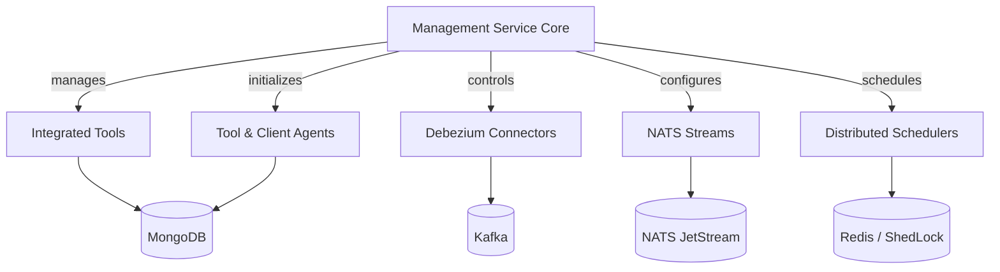
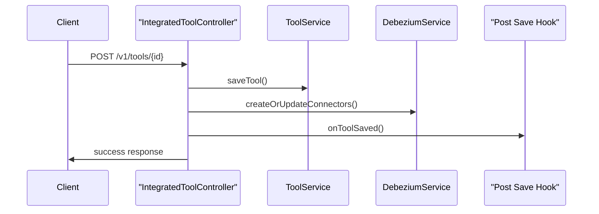
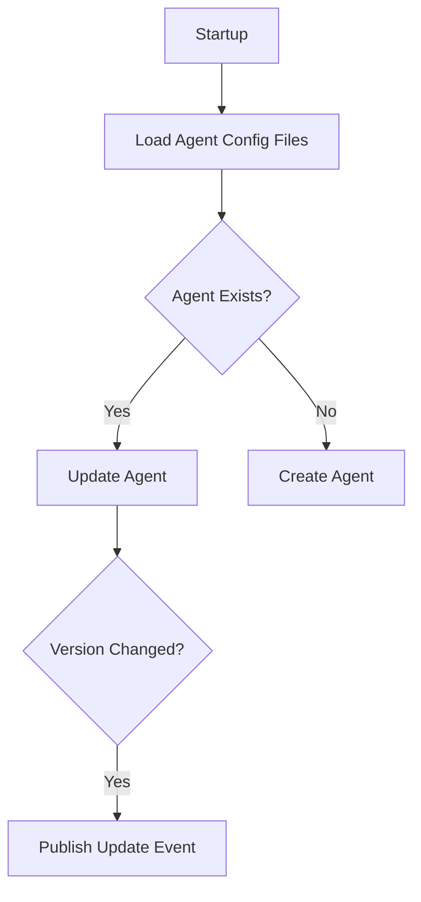

# Management Service Core

## Overview

The **Management Service Core** module is responsible for cluster-level and tenant-wide management operations within the OpenFrame / Flamingo platform. It acts as the operational backbone for:

- Managing integrated tools and their lifecycle
- Initializing platform-critical configurations at startup
- Coordinating Debezium connectors and streaming infrastructure
- Running distributed, tenant-safe background jobs
- Handling client and agent configuration bootstrapping

This module is not a user-facing API in the traditional sense. Instead, it provides **operational control planes**, **initializers**, and **schedulers** that ensure the rest of the platform operates reliably and consistently.

---

## Responsibilities at a Glance

- ✅ Integrated tool management and persistence
- ✅ Debezium connector orchestration and health checks
- ✅ Agent and client configuration initialization
- ✅ Distributed scheduled jobs with tenant-safe locking
- ✅ NATS stream bootstrapping
- ✅ Secure configuration and password encoding

---

## High-Level Architecture

The Management Service Core sits between persistent storage, streaming infrastructure, and other service cores. It orchestrates configuration, lifecycle events, and background operations.

---

## Configuration Layer

### ManagementConfiguration

The **ManagementConfiguration** class defines the foundational Spring configuration for the service:

- Performs a broad component scan across the platform
- Explicitly excludes the Cassandra health indicator (not required for management workloads)
- Exposes a `PasswordEncoder` bean using BCrypt for secure hashing

This ensures consistent security primitives across management-related components.

---

### ShedLockConfig

The **ShedLockConfig** enables safe, distributed scheduling across multiple service instances:

- Uses Redis as the lock backend
- Scopes locks by tenant and environment
- Prevents duplicate job execution in clustered deployments

**Key characteristics:**

- Tenant-aware lock keys
- Configurable lock duration
- Required for all scheduled jobs in this module

---

## Controllers

### IntegratedToolController

The **IntegratedToolController** provides REST endpoints for managing integrated tools.

**Primary responsibilities:**

- List all registered integrated tools
- Retrieve a single tool by identifier
- Create or update tool configurations

**Save workflow highlights:**

1. Persist tool configuration
2. Create or update Debezium connectors
3. Execute post-save hooks for side effects
4. Return updated tool state

---

### ReleaseVersionController

The **ReleaseVersionController** handles cluster registration and release version updates.

- Accepts release version payloads
- Delegates processing to the release version service
- Used for coordinating platform-wide version awareness

This controller is typically invoked by deployment or CI/CD workflows.

---

## Extension Points

### IntegratedToolPostSaveHook

The **IntegratedToolPostSaveHook** interface is a lightweight extension mechanism invoked after an integrated tool is saved.

**Design goals:**

- Avoid heavy Spring event wiring
- Enable service-specific side effects
- Keep tool persistence logic clean

Typical use cases include:

- Emitting events
- Triggering downstream synchronization
- Updating external systems

---

## Startup Initializers

The Management Service Core relies heavily on startup initializers to ensure the platform is in a valid operational state.

### AgentRegistrationSecretInitializer

- Runs on application startup
- Ensures an initial agent registration secret exists
- Critical for secure agent onboarding

---

### IntegratedToolAgentInitializer

This initializer bootstraps **Integrated Tool Agent** definitions from classpath resources.

**Key behaviors:**

- Loads agent definitions from JSON files
- Preserves versions for release agents
- Detects version changes and publishes updates

---

### OpenFrameClientConfigurationInitializer

- Loads the default client configuration from a bundled JSON file
- Ensures a single default configuration exists
- Preserves existing versions to prevent unintended overrides

This initializer guarantees consistent client behavior across environments.

---

### NatsStreamConfigurationInitializer

This initializer ensures required **NATS JetStream** streams exist:

- Tool installation events
- Client update events
- Tool agent updates
- Tool connections
- Installed agent tracking

All streams are created with file-backed storage and bounded retention.

---

### DebeziumConnectorInitializer

- Runs when the application is fully ready
- Checks whether Debezium connectors already exist
- Initializes connectors from persisted tool configurations if missing

This prevents data capture gaps after fresh deployments.

---

## Scheduled Jobs

All scheduled jobs in the Management Service Core use **ShedLock** to ensure single execution across a cluster.

### ApiKeyStatsSyncScheduler

- Periodically syncs API key usage statistics
- Moves data from Redis into MongoDB
- Enabled by default and fully configurable

---

### DebeziumHealthCheckScheduler

- Periodically checks Debezium connector health
- Automatically restarts failed tasks
- Enabled only when Debezium health checks are configured

---

## Services

### OpenFrameClientVersionUpdateService

This service acts as a publisher for client version updates:

- Receives new release version identifiers
- Intended to broadcast updates to connected clients

The current implementation is a placeholder, designed for future extension.

---

## How This Module Fits Into the Platform

The **Management Service Core** is a coordination layer rather than a business API.

It works closely with:

- Data persistence layers for durable configuration
- Streaming systems for real-time updates
- Other service cores that depend on initialized state

Without this module, the platform would lack:

- Reliable startup state
- Safe background processing
- Automated connector and stream management

---

## Summary

The Management Service Core provides the **operational intelligence** of the OpenFrame platform. It ensures that tools, agents, streams, and background processes are correctly initialized, monitored, and maintained across tenants and deployments.

This module is essential for running OpenFrame at scale, safely, and with minimal manual intervention.
