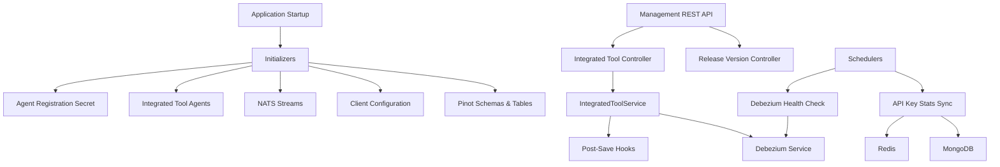

# Management Service Core

## Overview
The **management_service_core** module provides cluster- and platform-level management capabilities for OpenFrame. It is responsible for:

- Initializing critical platform configuration at startup
- Managing integrated tools and their lifecycle hooks
- Bootstrapping streaming, Debezium, and analytics (Pinot) infrastructure
- Coordinating scheduled background jobs with distributed locking
- Handling cluster-wide release and client update signals

This module acts as the **control plane** for operational automation across the OpenFrame stack.

---

## Position in the System

The Management Service sits alongside other core backend services (API, Gateway, Authorization, Stream) and interacts heavily with:

- **Data persistence layers** (MongoDB, Redis)
- **Streaming and CDC infrastructure** (NATS, Kafka, Debezium)
- **Analytics systems** (Apache Pinot)
- **Integrated third-party tools** (FleetDM, TacticalRMM, MeshCentral)

It is typically deployed as the `openframe-management` service.

---

## High-Level Architecture

---

## Core Configuration

### ManagementConfiguration

- Enables component scanning across `com.openframe`
- Excludes the Cassandra health indicator (managed elsewhere)
- Provides a shared `PasswordEncoder` using BCrypt

This configuration establishes the baseline Spring context for the management service.

---

### Distributed Scheduling (ShedLock)

The module uses **ShedLock with Redis** to ensure scheduled jobs execute safely in clustered deployments.

Key characteristics:
- Tenant-aware Redis lock keys
- Environment-scoped lock namespaces
- Protection against duplicate execution across replicas

Used by:
- API key statistics synchronization
- Debezium connector health checks

---

## Startup Initializers

Startup initializers are executed automatically when the application starts.

### AgentRegistrationSecretInitializer

- Ensures an initial agent registration secret exists
- Runs once at startup
- Safe to re-run (idempotent)

---

### IntegratedToolAgentInitializer

- Loads tool agent definitions from classpath JSON files
- Creates or updates `IntegratedToolAgent` records
- Preserves versions for release agents
- Publishes update events when agent versions change

This initializer keeps agent metadata aligned with shipped configurations.

---

### NatsStreamConfigurationInitializer

- Creates required NATS streams if missing
- Covers:
  - Tool installation
  - Client updates
  - Tool updates
  - Tool connections
  - Installed agents

Streams are defined programmatically and persisted via the NATS management API.

---

### OpenFrameClientConfigurationInitializer

- Loads the default OpenFrame client configuration
- Ensures a stable default configuration ID
- Preserves existing version fields

Used by client agents to determine runtime behavior.

---

### TacticalRmmScriptsInitializer

- Synchronizes predefined scripts into Tactical RMM
- Creates or updates scripts based on name
- Loads script content from bundled resources

This enables automated client updates and operational workflows inside Tactical RMM.

---

### PinotConfigInitializer

- Deploys Pinot schemas and table configurations
- Runs after application startup
- Supports retry with backoff

Managed datasets include:
- Devices
- Logs

This component ensures analytics infrastructure is always provisioned correctly.

---

## REST Controllers

### IntegratedToolController

Base path: `/v1/tools`

Responsibilities:
- List all integrated tools
- Retrieve a single tool
- Create or update tool configurations

When a tool is saved:
- Debezium connectors are created or updated
- All registered post-save hooks are executed

This controller is the main entry point for managing tool integrations.

---

### ReleaseVersionController

Base path: `/v1/cluster-registrations`

Responsibilities:
- Accept cluster release version updates
- Trigger downstream processing for new image versions

Typically used by deployment automation to notify the platform of new releases.

---

## Extension Points

### IntegratedToolPostSaveHook

A lightweight extension interface invoked after a tool is saved.

Use cases:
- Tool-specific provisioning
- Side-effect orchestration
- Cross-service coordination

Hooks are executed sequentially and failures are isolated.

---

## Background Schedulers

### ApiKeyStatsSyncScheduler

- Periodically syncs API key usage statistics
- Moves data from Redis into MongoDB
- Protected by distributed locks

Enabled by default and configurable via properties.

---

### DebeziumHealthCheckScheduler

- Periodically checks Debezium connector and task health
- Automatically restarts failed tasks
- Uses distributed locking to avoid conflicts

Enabled only when Debezium health checks are configured.

---

## Debezium Integration

The management service owns the lifecycle of Debezium connectors:

- Initial creation from stored tool definitions
- Ongoing health monitoring
- Automatic recovery of failed tasks

Connector state is represented using `ConnectorStatus` DTOs.

---

## Client Update Coordination

### OpenFrameClientVersionUpdateService

- Entry point for processing new client release versions
- Publishes update events to downstream systems

This service is triggered indirectly via release notifications.

---

## Summary

The **management_service_core** module is the operational backbone of OpenFrame. It centralizes:

- Platform bootstrapping
- Tool and agent lifecycle management
- Distributed scheduling
- Streaming and analytics provisioning

By keeping these responsibilities isolated, the rest of the platform can remain focused on request handling, data processing, and user-facing features.
