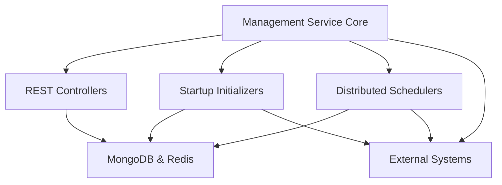

# Management Service Core

## Overview
The **management_service_core** module provides cluster- and tenant-level management capabilities for OpenFrame. It is responsible for:

- Bootstrapping and maintaining critical platform configurations
- Managing integrated tools and their lifecycle
- Initializing external systems (Debezium, NATS, Pinot, Tactical RMM)
- Running distributed, tenant-safe background schedulers

This module is used by the `service_management` application and interacts heavily with the data layer, stream infrastructure, and external integrations.

## High-Level Architecture

## Core Responsibilities

### Configuration
- Spring component scanning and security primitives
- Distributed scheduler locking via Redis (ShedLock)

### Tool & Integration Management
- CRUD and lifecycle hooks for Integrated Tools
- Debezium connector provisioning and health checks
- Tactical RMM script synchronization

### Platform Bootstrapping
- Pinot schema and table deployment
- NATS stream creation
- Default client and agent configuration seeding

### Background Processing
- API key usage statistics synchronization
- Debezium connector health monitoring

## Sub-Modules

- [Controllers](management_service_controllers.md)
- [Initializers](management_service_initializers.md)
- [Schedulers](management_service_schedulers.md)

## Runtime Characteristics

- **Multi-tenant aware**: Uses tenant-scoped Redis keys and data isolation
- **Idempotent startup**: Initializers are safe to re-run
- **Distributed-safe**: All scheduled jobs use ShedLock

## Related Modules

This module collaborates with:

- API Service Core (GraphQL & REST)
- Stream Service Core (Kafka, Debezium consumers)
- Data Layer (MongoDB, Redis, Pinot)

Refer to platform documentation for details on those modules.
