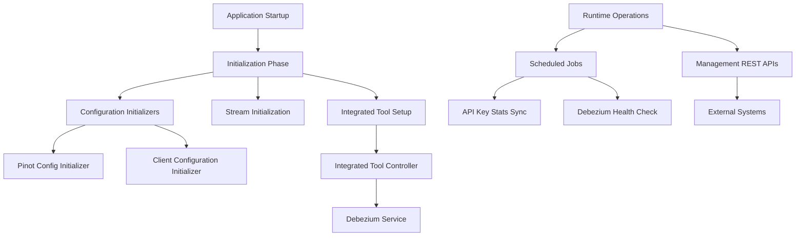
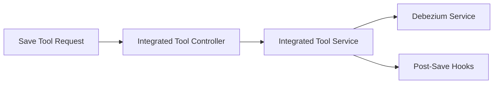

# Management Service Core

## Overview

The **Management Service Core** module is responsible for platform-wide management, initialization, and operational coordination tasks within the OpenFrame ecosystem. It acts as the **control plane** for:

- Integrated tool lifecycle management
- Agent and client configuration bootstrapping
- Stream and connector initialization (NATS, Debezium, Pinot)
- Scheduled background jobs with distributed locking
- Cluster-wide release and version signaling

This module is typically deployed as a Spring Boot service and runs continuously to ensure that critical infrastructure components and integrations remain correctly configured and healthy.

---

## Position in the Overall System

Management Service Core sits above the data layer and below the gateway and API layers. It orchestrates configuration, initialization, and health management rather than serving high-volume user traffic.

High-level responsibilities include:

- Initializing system state at startup
- Managing long-lived integrations (tools, agents, connectors)
- Executing scheduled reconciliation and health checks
- Publishing version and update events to the rest of the platform

---

## High-Level Architecture

---

## Core Functional Areas

### 1. Application Configuration

**Primary components:**
- `ManagementConfiguration`
- `ShedLockConfig`
- `ManagementApplication`

**Responsibilities:**
- Defines Spring component scanning boundaries
- Provides shared infrastructure beans such as password encoding
- Enables distributed scheduling using Redis-backed ShedLock

**Key characteristics:**
- Excludes Cassandra health checks (handled elsewhere)
- Uses tenant-scoped Redis keys for scheduler locks

---

### 2. Initialization and Bootstrapping

Initialization logic runs automatically at application startup to ensure the system reaches a consistent baseline state.

**Key initializers:**

- **Agent Registration Secret Initializer**  
  Ensures that a default agent registration secret exists for secure agent onboarding.

- **Integrated Tool Agent Initializer**  
  Loads predefined agent configurations from classpath resources, updates existing agents safely, and publishes version changes when needed.

- **OpenFrame Client Configuration Initializer**  
  Bootstraps the default client configuration while preserving existing versions.

- **NATS Stream Configuration Initializer**  
  Creates required NATS JetStream streams for tool installation, client updates, and agent events.

- **Tactical RMM Scripts Initializer**  
  Synchronizes predefined automation scripts into Tactical RMM, creating or updating them as needed.

---

### 3. Pinot Configuration Management

**Primary component:**
- `PinotConfigInitializer`

This component automatically deploys Pinot schemas and table configurations once the application is ready.

**Behavior:**
- Loads schema and table definitions from classpath resources
- Resolves environment placeholders dynamically
- Deploys configurations via Pinot Controller REST APIs
- Retries transient failures with configurable backoff

This ensures analytics tables for devices and logs are always present and up to date.

---

### 4. Integrated Tool Management APIs

**Primary component:**
- `IntegratedToolController`

Provides REST endpoints for managing integrated tools.

**Capabilities:**
- Retrieve all registered tools
- Retrieve a single tool by identifier
- Create or update tool configurations

**Post-save processing:**
- Automatically creates or updates Debezium connectors
- Executes pluggable post-save hooks for tool-specific side effects

---

### 5. Release and Version Management

**Primary components:**
- `ReleaseVersionController`
- `ReleaseVersionRequest`
- `OpenFrameClientVersionUpdateService`

This flow allows cluster components to report new release versions and trigger downstream update propagation.

**Typical use case:**
- A new client or agent image version is deployed
- The management service receives the version tag
- The version is processed and published to interested consumers

---

### 6. Debezium Connector Lifecycle Management

**Primary components:**
- `DebeziumConnectorInitializer`
- `DebeziumHealthCheckScheduler`
- `ConnectorStatus` DTOs

**Responsibilities:**
- Initialize connectors from persisted tool definitions if none exist
- Periodically check connector and task health
- Restart failed tasks automatically

This ensures reliable CDC pipelines without manual intervention.

---

### 7. Scheduled Background Jobs

The Management Service Core runs several scheduled jobs protected by distributed locks.

**Schedulers:**

- **API Key Stats Sync Scheduler**  
  Periodically synchronizes API key usage statistics from Redis into MongoDB.

- **Debezium Health Check Scheduler**  
  Monitors Debezium connectors and restarts unhealthy tasks.

**Key guarantees:**
- Only one instance executes a job at a time
- Safe operation in multi-instance deployments

---

## Key Design Principles

- **Idempotent initialization**: Safe to restart at any time
- **Distributed safety**: Uses Redis-backed locks for schedulers
- **Extensibility**: Hook-based extensions for tool lifecycle events
- **Operational resilience**: Automatic retries and health checks

---

## Summary

The **Management Service Core** module provides the operational backbone of OpenFrame. By centralizing initialization, configuration management, scheduling, and integration lifecycle control, it ensures that the broader platform remains consistent, observable, and resilient as it scales.

This module is not user-facing, but its reliability is critical to every other service in the system.