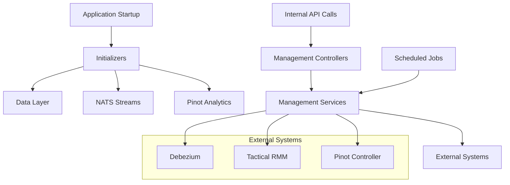
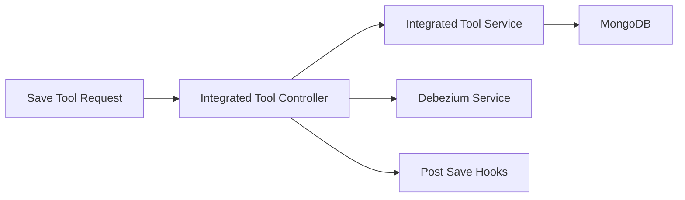
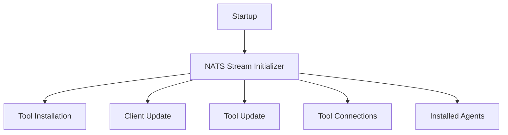

# Management Service Core

## Overview

The **Management Service Core** module is responsible for platform-level orchestration, initialization, and background management tasks within OpenFrame. It acts as the control plane for operational configuration, tool lifecycle management, stream and connector initialization, scheduled maintenance jobs, and version propagation.

Unlike request-heavy API services, Management Service Core focuses on:
- **Bootstrapping critical platform state** at startup
- **Managing integrated tools and agents**
- **Coordinating Debezium, NATS, Pinot, and client configuration**
- **Running distributed, tenant-safe scheduled jobs**

This service is typically deployed once per tenant cluster and works closely with the Data Layer, Stream Service Core, and external integrations such as Tactical RMM and Debezium.

---

## Architectural Role

Management Service Core sits behind the Gateway and APIs and is mostly event-driven or scheduler-driven rather than user-facing.

---

## Core Responsibilities

### Configuration and Bootstrapping

Management Service Core initializes and maintains critical shared configuration:

- Global Spring configuration and security primitives
- Distributed scheduler locking
- Analytics schema and table provisioning
- Default client and agent configurations

Key components:
- **ManagementConfiguration** – Base component scanning and password encoding
- **ShedLockConfig** – Tenant-aware distributed scheduler locking using Redis
- **PinotConfigInitializer** – Automatic Pinot schema and table deployment

---

### Integrated Tool Management

The service owns the lifecycle of **Integrated Tools**, including persistence, connector setup, and post-save side effects.

Key components:
- **IntegratedToolController** – CRUD-style endpoints for tool configuration
- **IntegratedToolPostSaveHook** – Extension point for side effects
- **DebeziumConnectorInitializer** – Ensures connectors exist on startup

---

### Agent and Client Initialization

On startup, the service provisions default agent and client configurations from bundled resources.

Responsibilities include:
- Creating initial agent registration secrets
- Loading Integrated Tool Agent definitions
- Preserving release agent versions
- Publishing update events when versions change

Key components:
- **AgentRegistrationSecretInitializer**
- **IntegratedToolAgentInitializer**
- **OpenFrameClientConfigurationInitializer**

---

### Stream and Messaging Setup

Management Service Core defines and enforces required NATS stream topology for the platform.

Key component:
- **NatsStreamConfigurationInitializer** – Creates and updates required streams

---

### Release and Version Propagation

The module receives cluster-level release updates and propagates version changes internally.

Key components:
- **ReleaseVersionController** – Receives cluster release notifications
- **ReleaseVersionRequest** – Payload for release updates
- **OpenFrameClientVersionUpdateService** – Publishes client update events

---

### Scheduled and Background Jobs

Management Service Core runs several distributed schedulers guarded by ShedLock to ensure single execution per tenant.

Schedulers:
- **ApiKeyStatsSyncScheduler** – Syncs API key usage stats from Redis to MongoDB
- **DebeziumHealthCheckScheduler** – Monitors and restarts failed Debezium tasks

---

## Data Transfer and Models

The module defines lightweight DTOs used for orchestration and health monitoring:

- **ConnectorStatus** – Debezium connector and task health
- **ScriptConfig** – Tactical RMM script metadata
- **ReleaseVersionRequest** – Cluster release update payload

These models are intentionally minimal and focused on control-plane concerns.

---

## Interaction With Other Modules

Management Service Core collaborates closely with other platform modules:

- **Data Layer** – Persists tools, agents, configurations, and stats
- **Stream Service Core** – Consumes streams initialized by this module
- **Gateway and API Service Core** – Expose management-triggered behavior
- **External API Service Core** – Reflects managed state to external consumers

For detailed behavior of those modules, refer to their respective documentation.

---

## Operational Characteristics

- Designed to be **idempotent** on startup
- Safe for **multi-instance deployments** via distributed locking
- Heavily **event and scheduler driven**
- Optimized for **platform stability and automation**, not high request throughput

---

## Summary

The **Management Service Core** is the operational backbone of OpenFrame. It ensures that:

- The platform boots into a consistent, ready state
- Integrated tools and agents are correctly configured
- Streams, connectors, and analytics infrastructure remain healthy
- Background maintenance tasks run safely in distributed environments

Without this module, higher-level APIs and services would lack the coordinated configuration and lifecycle guarantees required for reliable MSP operations.
