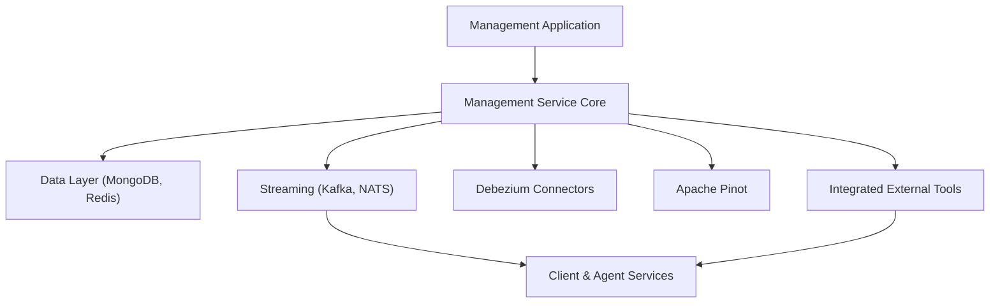
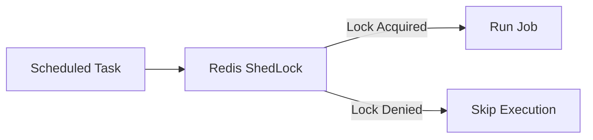
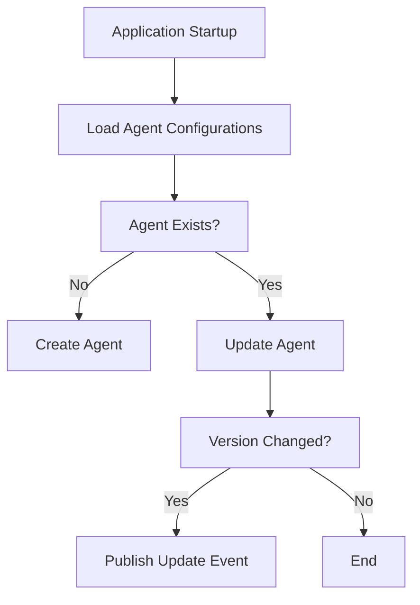
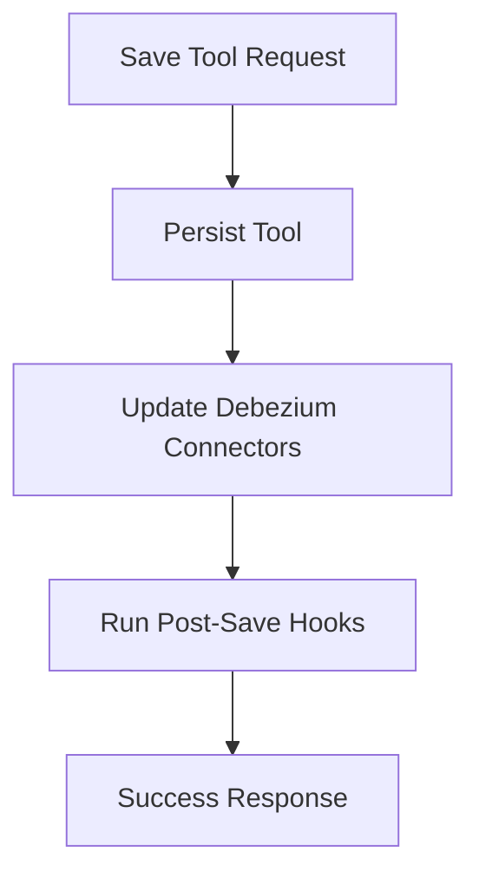
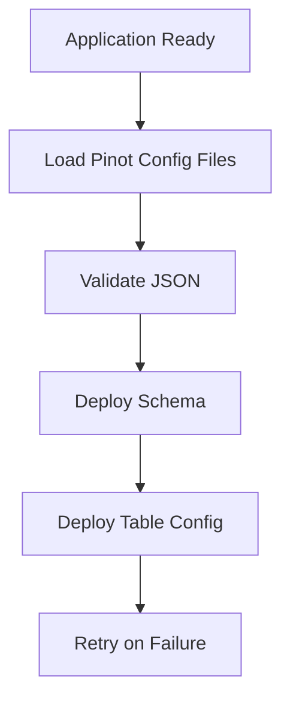

# Management Service Core

## Overview

The **Management Service Core** module is responsible for cluster-level and platform-wide management concerns within the OpenFrame ecosystem. It orchestrates configuration bootstrapping, background schedulers, integration lifecycle management, and operational automation that span multiple other services such as data ingestion, streaming, external tools, and client agents.

This module is not a request-heavy business API. Instead, it focuses on **initialization, coordination, and long-running operational workflows**, ensuring that the OpenFrame platform remains consistent, observable, and self-healing over time.

Key responsibilities include:
- Bootstrapping platform configuration at startup
- Managing integrated tools and their side effects
- Initializing and supervising Debezium connectors
- Deploying and updating Apache Pinot analytics schemas
- Coordinating NATS streams for agent and tool events
- Running distributed schedulers with tenant-safe locking
- Managing client and agent version lifecycle signals

---

## Position in the Platform Architecture

The Management Service Core sits alongside other backend services and interacts heavily with the data layer, stream processing, and external integrations. It acts as the **control plane** for operational state.

---

## Core Configuration

### Management Configuration

The Management Configuration class defines the foundational Spring configuration for the service:

- Enables component scanning across the OpenFrame namespace
- Explicitly excludes certain health indicators not relevant for this service
- Provides shared security infrastructure such as password encoding

**Key behavior:**
- Uses BCrypt for secure password hashing
- Ensures a consistent security baseline across management workflows

---

### Distributed Scheduling with ShedLock

The Management Service Core uses ShedLock with Redis to ensure **single-execution semantics** for scheduled jobs in clustered deployments.

Key characteristics:
- Locks are tenant-scoped using Redis key prefixes
- Prevents duplicate execution across multiple instances
- Enables safe horizontal scaling

---

## Initialization Responsibilities

A defining feature of the Management Service Core is its extensive use of startup initializers. These components ensure that the platform is in a valid operational state immediately after boot.

### Agent Registration Secret Initialization

At startup, the service guarantees that an agent registration secret exists. This secret is required for secure onboarding of new agents into the platform.

- Executed once at application startup
- Safe to re-run without duplication
- Failures are logged but do not crash the application

---

### Integrated Tool Agent Initialization

Integrated tool agents are defined declaratively using configuration files bundled with the service.

Startup behavior:
- Loads agent definitions from classpath resources
- Creates new agents if missing
- Updates existing agents while preserving protected release versions
- Publishes version update events when changes are detected

---

### OpenFrame Client Configuration Initialization

The service ensures that a default OpenFrame client configuration is always present.

Key rules:
- Uses a fixed default identifier
- Preserves existing version values
- Allows configuration evolution without breaking running clients

---

### NATS Stream Configuration Initialization

The Management Service Core provisions NATS streams required for real-time operational events.

Streams managed include:
- Tool installation events
- Client update notifications
- Tool agent updates
- Tool connection events
- Installed agent lifecycle events

This ensures downstream consumers can reliably subscribe to these event categories without manual setup.

---

### Tactical RMM Script Initialization

For Tactical RMM integrations, the service automatically manages operational scripts:

- Loads scripts from bundled resources
- Creates missing scripts in Tactical RMM
- Updates existing scripts to match desired definitions

This guarantees that required automation scripts are always present and up to date.

---

## Integrated Tool Management

### Integrated Tool Controller

The Management Service Core exposes REST endpoints for managing integrated tools.

Capabilities:
- List all registered tools
- Retrieve individual tool definitions
- Create or update tool configurations

When a tool is saved:
1. The tool definition is persisted
2. Debezium connectors are created or updated
3. Post-save hooks are executed for additional side effects

---

### Post-Save Hook Extension Point

The Integrated Tool Post Save Hook provides a lightweight extension mechanism:

- Invoked synchronously after a tool is saved
- Allows service-specific side effects
- Avoids complex event infrastructure

This pattern enables modular growth of management logic without tight coupling.

---

## Analytics and Observability

### Apache Pinot Configuration Deployment

The Management Service Core is responsible for deploying and updating Apache Pinot schemas and table configurations.

Key features:
- Triggered automatically when the application is ready
- Supports schema, realtime table, and optional offline table deployment
- Includes retry logic with configurable backoff
- Resolves environment placeholders dynamically

---

## Debezium Lifecycle Management

### Connector Initialization

On startup, the service verifies whether Debezium connectors already exist:

- If connectors exist, no action is taken
- If missing, connectors are recreated from persisted tool definitions

This enables automatic recovery after infrastructure resets.

---

### Debezium Health Check Scheduler

A scheduled task periodically monitors Debezium connector health:

- Detects failed tasks
- Attempts automated restarts
- Uses distributed locking to avoid duplicate checks

---

## Scheduled Background Jobs

### API Key Statistics Synchronization

This scheduled job synchronizes API key usage statistics:

- Reads usage metrics from Redis
- Persists aggregated results to MongoDB
- Runs under ShedLock protection

This ensures accurate and durable reporting without overloading primary data stores.

---

## Release and Version Coordination

### Release Version Controller

The Management Service Core accepts release version notifications from cluster components.

- Receives image tag version updates
- Delegates processing to version management services
- Acts as an integration point for release orchestration

---

### OpenFrame Client Version Update Service

This service acts as a bridge between release events and client update propagation:

- Receives new release versions
- Publishes update events to downstream consumers
- Enables coordinated rollout of client updates

---

## Summary

The **Management Service Core** is the operational backbone of the OpenFrame platform. Rather than serving end-user requests, it focuses on:

- Platform bootstrapping
- Safe automation at scale
- Integration lifecycle management
- Distributed scheduling and health supervision

By centralizing these concerns, the module ensures that the rest of the system can remain focused on business logic while relying on a robust, self-managing control plane.