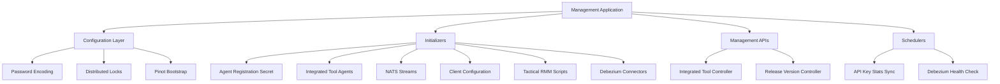
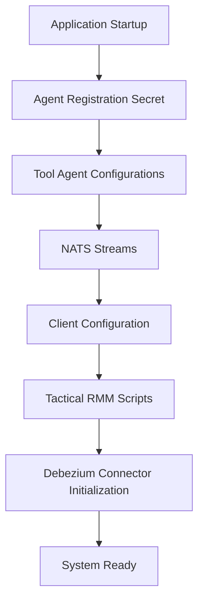

# Management Service Core

## Overview

The **Management Service Core** module is responsible for bootstrapping, configuring, and continuously maintaining critical platform-wide management capabilities in OpenFrame. It acts as the operational backbone for:

- Integrated tool lifecycle management
- Debezium connector orchestration and health monitoring
- Platform configuration initialization (agents, clients, streams)
- Release and version coordination
- Distributed scheduled maintenance tasks

This service runs as part of the OpenFrame backend stack and is typically deployed alongside other core services such as the API Service Core, Stream Processing Service Core, and Data Platform services.

---

## Responsibilities at a Glance

- **Startup initialization** of platform prerequisites (secrets, agents, streams, Pinot schemas)
- **Operational APIs** for managing integrated tools and cluster release versions
- **Distributed scheduling** using Redis-backed locks
- **Event and stream orchestration** for agents, tools, and Debezium connectors
- **Safety mechanisms** to ensure idempotent and tenant-safe operations

---

## High-Level Architecture

---

## Configuration Layer

### Management Configuration

The Management Configuration class defines core Spring behavior for the service:

- Scans all OpenFrame packages for components
- Explicitly excludes Cassandra health indicators to avoid duplicate or conflicting health checks
- Exposes a **BCrypt-based password encoder** for secure credential handling

This configuration ensures consistency with other services while tailoring health and security behavior for management workloads.

---

### Distributed Scheduling with ShedLock

The ShedLock configuration enables **cluster-safe scheduled execution** by:

- Using Redis as a shared lock provider
- Scoping locks by tenant and environment
- Preventing duplicate job execution across replicas

This is critical in horizontally scaled deployments where multiple instances of the Management Service Core may be running simultaneously.

---

### Pinot Configuration Initialization

The Pinot Configuration Initializer automatically deploys analytics schemas and table configurations to Apache Pinot when the application starts.

Key characteristics:

- Runs on application readiness
- Supports retry with configurable backoff
- Resolves environment placeholders dynamically
- Safely creates or updates schemas and tables

This ensures analytics queries can run without requiring manual Pinot bootstrapping.

---

## API Layer

### Integrated Tool Controller

The Integrated Tool Controller exposes REST endpoints for managing integrated tools.

Capabilities include:

- Listing all registered tools
- Fetching a specific tool by identifier
- Creating or updating tool configurations

When a tool is saved:

1. The tool configuration is persisted
2. Associated Debezium connectors are created or updated
3. Post-save hooks are executed for extensibility

This design allows the platform to react immediately to configuration changes.

---

### Release Version Controller

The Release Version Controller accepts cluster-level release notifications.

It forwards the reported image tag version to the internal release processing service, enabling:

- Agent update workflows
- Version-aware feature handling
- Coordinated rollout logic

---

## Initialization Workflow

The Management Service Core performs extensive initialization during startup to guarantee platform readiness.

### Key Initializers

- **Agent Registration Secret Initializer**: Ensures a secure initial secret exists for agent onboarding
- **Integrated Tool Agent Initializer**: Loads agent definitions from bundled resources and handles version changes
- **NATS Stream Configuration Initializer**: Creates required streams for agent, tool, and client events
- **OpenFrame Client Configuration Initializer**: Ensures a default client configuration exists
- **Tactical RMM Scripts Initializer**: Synchronizes operational scripts with Tactical RMM
- **Debezium Connector Initializer**: Restores connectors from persisted tool definitions if none exist

All initializers are designed to be **idempotent** and safe to run on every startup.

---

## Extension Points

### Integrated Tool Post-Save Hook

The Integrated Tool Post-Save Hook provides a lightweight extension mechanism:

- Triggered immediately after a tool is saved
- Allows additional side effects without Spring event overhead
- Supports multiple independent implementations

This pattern is useful for service-specific integrations that should react to tool changes.

---

## Scheduling and Maintenance

### API Key Statistics Sync

A scheduled job periodically synchronizes API key usage statistics from Redis into MongoDB.

Features:

- Runs at a configurable interval
- Protected by distributed locks
- Safe for multi-instance deployments

---

### Debezium Health Check

The Debezium Health Check Scheduler continuously monitors connector task status.

Behavior:

- Detects failed connector tasks
- Attempts automatic restarts
- Prevents duplicate execution using ShedLock

This ensures long-running data pipelines remain healthy without manual intervention.

---

## Data Models

### Connector Status

The Connector Status model represents runtime state retrieved from Debezium:

- Connector-level state and worker assignment
- Individual task states, including failure traces

It is intentionally resilient to unknown fields to support Debezium version changes.

---

### Script Configuration

The Script Configuration model defines executable scripts managed by the platform:

- Script metadata (name, description, category)
- Execution environment (shell, timeout)
- Resource-backed script content

This abstraction enables safe synchronization with external automation tools.

---

## Release and Version Coordination

The OpenFrame Client Version Update Service acts as a coordination point for propagating new client versions across the platform.

Although minimal by design, it provides a clear boundary for:

- Publishing version update events
- Triggering downstream update mechanisms
- Decoupling release notifications from execution logic

---

## Design Principles

The Management Service Core is built around the following principles:

- **Idempotency**: All startup logic can run multiple times safely
- **Observability**: Extensive structured logging for operations and failures
- **Extensibility**: Hooks and services allow new behaviors without core changes
- **Safety in Scale**: Distributed locks and conditional execution prevent race conditions

---

## Summary

The **Management Service Core** is the operational control plane of OpenFrame. It ensures that configuration, tooling, streaming infrastructure, and background maintenance tasks are always correctly initialized and continuously enforced.

By centralizing these responsibilities, the module enables the rest of the platform to focus on business logic while relying on a stable, self-healing management foundation.
