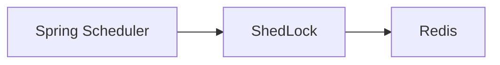
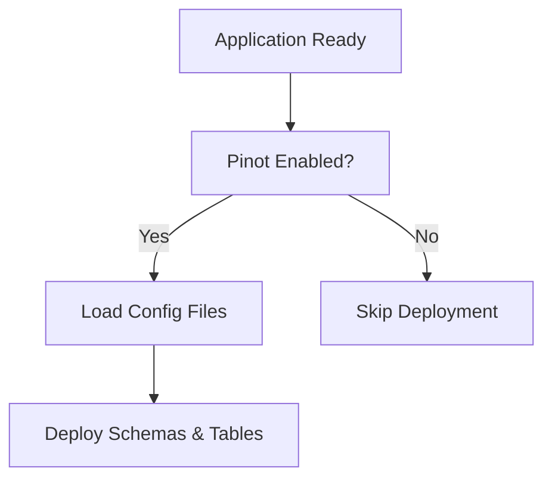

# Management Service Core – Configuration

## Overview

This sub-module contains foundational configuration required to run the management service safely and consistently across tenants and deployments.

It covers:
- Spring context setup
- Security primitives
- Distributed scheduler locking
- Analytics platform (Pinot) bootstrap

---

## ManagementConfiguration

```java
@Configuration
@ComponentScan(basePackages = "com.openframe", excludeFilters = ...)
public class ManagementConfiguration { ... }
```

### Responsibilities

- Enables component scanning for all OpenFrame packages
- Explicitly excludes the Cassandra health indicator to avoid duplicate or unwanted health checks
- Registers a **BCrypt PasswordEncoder** used by downstream services

### Key Bean

- **PasswordEncoder** – Provides secure hashing using BCrypt

---

## ShedLockConfig

Provides tenant-aware distributed locking for scheduled jobs.



### Responsibilities

- Enables Spring scheduling
- Configures Redis-backed ShedLock provider
- Ensures scheduled tasks run once per tenant across replicas

### Lock Key Structure

```text
of:{tenantId}:job-lock:{environment}:{lockName}
```

This guarantees tenant isolation and environment separation.

---

## PinotConfigInitializer

Automatically deploys Pinot schemas and table configurations when the application is ready.

### What It Does

- Loads schema and table JSON files from classpath
- Resolves Spring placeholders inside configuration files
- Deploys schemas and tables via Pinot Controller REST API
- Retries on transient failures with backoff

### Managed Datasets

- Devices
- Logs (realtime)

### Startup Flow



---

## External Dependencies

- Redis (for ShedLock)
- Pinot Controller API
- Spring Environment & ResourceLoader

This configuration layer is intentionally isolated to keep higher-level services clean and focused.
