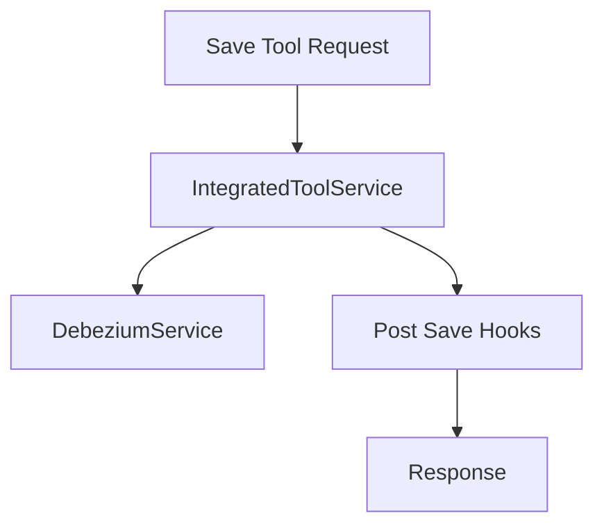

# Management Service Core – Controllers

## Overview

This sub-module exposes REST APIs used to manage integrated tools and propagate cluster-level release information.

These controllers are internal-facing and primarily consumed by automation, operators, or other OpenFrame services.

---

## IntegratedToolController

**Base Path:** `/v1/tools`

### Responsibilities

- Retrieve all integrated tools
- Fetch a single tool by ID
- Create or update tool configuration
- Trigger downstream side-effects after tool persistence

### Endpoints

#### Get all tools

```http
GET /v1/tools
```

Returns all configured integrated tools.

#### Get tool by ID

```http
GET /v1/tools/{id}
```

Returns a single tool or an error message if not found.

#### Save tool

```http
POST /v1/tools/{id}
```

### Processing Flow



### Key Collaborators

- **IntegratedToolService** – Persistence layer
- **DebeziumService** – Connector creation and updates
- **IntegratedToolPostSaveHook** – Extension point for side-effects

---

## ReleaseVersionController

**Base Path:** `/v1/cluster-registrations`

### Responsibilities

- Accepts cluster image or release version updates
- Delegates processing to release management services

### Endpoint

```http
POST /v1/cluster-registrations
```

Payload:

```json
{
  "imageTagVersion": "string"
}
```

### Notes

This endpoint is typically invoked by CI/CD pipelines or cluster automation tooling to notify the platform of new releases.

---

## Error Handling Strategy

- Controllers rely on service-level exceptions
- Errors are logged with contextual information
- HTTP 500 is returned for unexpected failures

Controllers remain intentionally thin to keep business logic in services and initializers.
