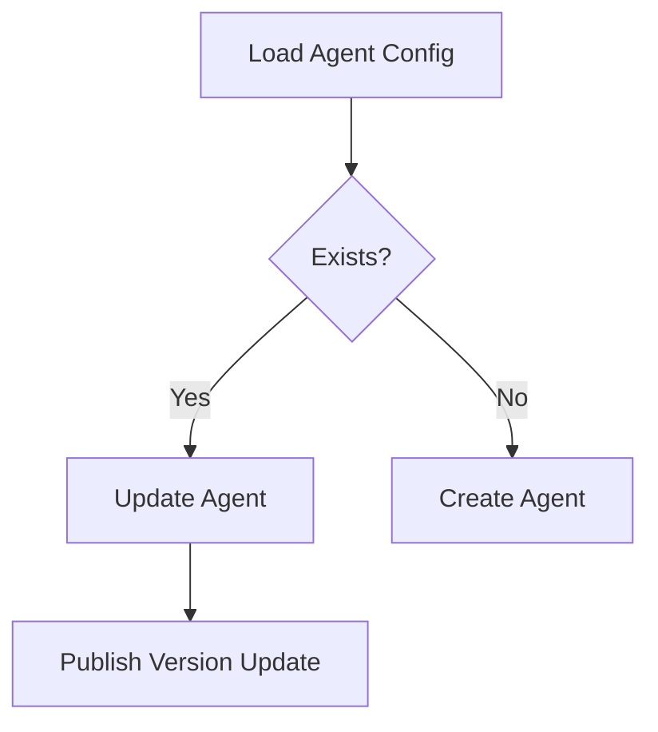

# Management Service Core – Initializers

## Overview

Initializers are responsible for preparing required system state at application startup. They ensure the management service can operate without manual intervention.

They run either at `@PostConstruct`, via `ApplicationRunner`, or on application readiness events.

---

## AgentRegistrationSecretInitializer

### Purpose

Ensures that an initial agent registration secret exists.

### Behavior

- Runs on application startup
- Creates a secret if one does not already exist
- Logs success or failure without blocking startup

---

## IntegratedToolAgentInitializer

### Purpose

Bootstraps **IntegratedToolAgent** definitions from configuration files.

### Behavior

- Loads agent definitions from classpath JSON resources
- Creates or updates existing agents
- Preserves versions for release agents
- Publishes update events when versions change

### Flow

---

## NatsStreamConfigurationInitializer

### Purpose

Ensures required NATS JetStream streams exist.

### Configured Streams

- TOOL_INSTALLATION
- CLIENT_UPDATE
- TOOL_UPDATE
- TOOL_CONNECTIONS
- INSTALLED_AGENTS

Each stream is created with file storage and limits-based retention.

---

## OpenFrameClientConfigurationInitializer

### Purpose

Ensures a default OpenFrame client configuration exists.

### Behavior

- Loads configuration from classpath
- Uses a fixed default ID
- Preserves existing version values
- Updates or creates configuration as needed

---

## TacticalRmmScriptsInitializer

### Purpose

Manages Tactical RMM scripts required by OpenFrame.

### Behavior

- Retrieves Tactical RMM connection details
- Loads script content from resources
- Creates or updates scripts by name

### Key Integration

- **TacticalRmmClient** – External API client

---

## DebeziumConnectorInitializer

### Purpose

Bootstraps Debezium connectors if none exist.

### Behavior

- Runs when application is ready
- Checks existing connectors
- Creates connectors from IntegratedTool configuration

### Conditional Activation

Enabled only when Debezium health checks are turned on.

---

## Design Notes

- Initializers are idempotent by design
- Failures are logged but do not crash the application
- External systems are integrated defensively

This ensures safe startup in both fresh and existing environments.
