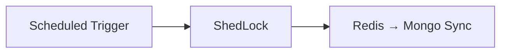
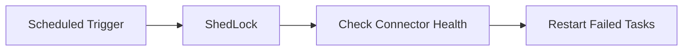

# Management Service Core – Schedulers

## Overview

Schedulers in the management service perform periodic maintenance and synchronization tasks. All schedulers are protected by **ShedLock** to ensure single execution across distributed deployments.

---

## ApiKeyStatsSyncScheduler

### Purpose

Synchronizes API key usage statistics from Redis into MongoDB.

### Activation

- Enabled by default
- Controlled by configuration property

### Execution

### Key Characteristics

- Uses fixed-delay scheduling
- Protected by tenant-scoped distributed lock
- Logs start, success, and failure

---

## DebeziumHealthCheckScheduler

### Purpose

Monitors Debezium connectors and restarts failed tasks.

### Activation

- Enabled only when Debezium health checks are configured

### Execution

---

## Reliability Guarantees

- At-most-once execution per tenant
- Safe for horizontal scaling
- External system failures are handled gracefully

Schedulers are intentionally simple and delegate real work to services.
