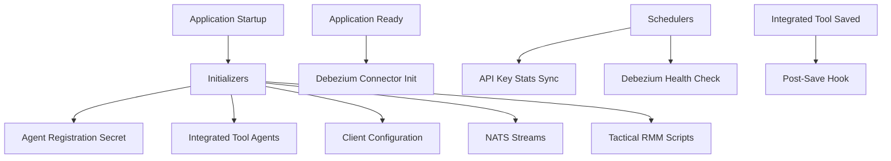

# Management Service – Initializers and Schedulers

## Overview

The **management_service_initializers_and_schedulers** module is responsible for all **startup-time initialization**, **post-save hooks**, and **background scheduled jobs** within the OpenFrame Management Service. These components ensure that:

- Critical platform configuration is bootstrapped on application startup
- External systems (NATS, Debezium, Tactical RMM) are initialized consistently
- Versioned agents and client configurations are safely synchronized
- Periodic maintenance and health-check tasks run reliably in clustered environments

This module is heavily oriented around **Spring lifecycle hooks** (`@PostConstruct`, `ApplicationRunner`, `ApplicationReadyEvent`) and **distributed schedulers** (Spring Scheduler + ShedLock).

---

## Responsibilities

This module covers four main responsibility areas:

1. **Startup Initializers** – Populate required data and external resources at boot
2. **External System Bootstrap** – NATS streams, Debezium connectors, Tactical RMM scripts
3. **Post-Save Hooks** – Lightweight extension points for IntegratedTool lifecycle
4. **Schedulers** – Distributed, fault-tolerant background jobs

---

## Architecture Overview

---

## Component Categories

### Initializers

Initializers execute during application startup and ensure required configuration and metadata exists.

- **AgentRegistrationSecretInitializer** – Creates initial agent registration secrets
- **IntegratedToolAgentInitializer** – Loads and synchronizes tool agent definitions
- **OpenFrameClientConfigurationInitializer** – Ensures default client configuration exists
- **NatsStreamConfigurationInitializer** – Bootstraps NATS JetStream streams
- **TacticalRmmScriptsInitializer** – Creates or updates Tactical RMM scripts

Detailed documentation is available in:
- [Initializers](Initializers.md)

---

### Hooks

Hooks provide lightweight extension points without requiring Spring events.

- **IntegratedToolPostSaveHook** – Triggered after an `IntegratedTool` is persisted

Detailed documentation:
- [Hooks](Hooks.md)

---

### Schedulers

Schedulers run periodic background jobs using **distributed locking** via ShedLock to ensure correctness in clustered deployments.

- **ApiKeyStatsSyncScheduler** – Syncs API key usage statistics from Redis to MongoDB
- **DebeziumHealthCheckScheduler** – Monitors and restarts failed Debezium connectors

Detailed documentation:
- [Schedulers](Schedulers.md)

---

### Supporting Models & Services

- **ScriptConfig** – Declarative model for Tactical RMM script provisioning
- **OpenFrameClientVersionUpdateService** – Placeholder for future client update orchestration

These support the initializers and schedulers but do not run independently.

---

## How This Module Fits in the System

The management service acts as the **control plane** for OpenFrame. This module ensures that:

- Configuration stored in MongoDB is reflected in external systems
- Message streams and CDC pipelines are always present and healthy
- Background synchronization jobs remain safe in multi-instance deployments

It works closely with:

- **data_layer_mongo_documents_and_repos** – Persistent configuration and state
- **data_layer_kafka_shared** – Event-driven updates
- **stream_service_app_and_kafka_processing** – Downstream CDC and enrichment

---

## Key Design Principles

- **Idempotent Initialization** – Safe to run on every startup
- **Fail-Safe Startup** – Errors are logged, not fatal
- **Distributed Safety** – ShedLock prevents duplicate scheduler execution
- **External System Awareness** – Tight integration with NATS, Debezium, Tactical RMM

---

## Operational Notes

- Most components are guarded by feature flags via `@ConditionalOnProperty`
- Initializers should be fast and non-blocking
- Schedulers must be safe to retry

---

✅ This module is critical for ensuring OpenFrame environments are **self-healing**, **consistent**, and **ready-to-operate** immediately after deployment.
