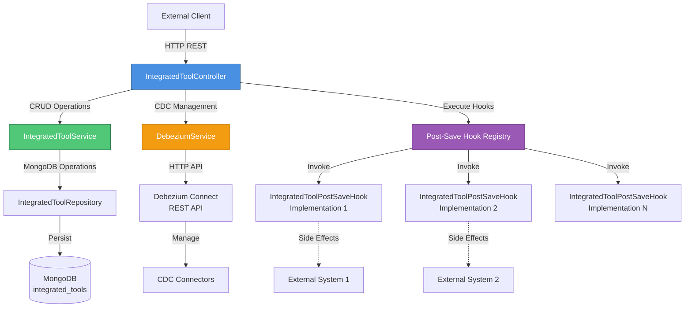
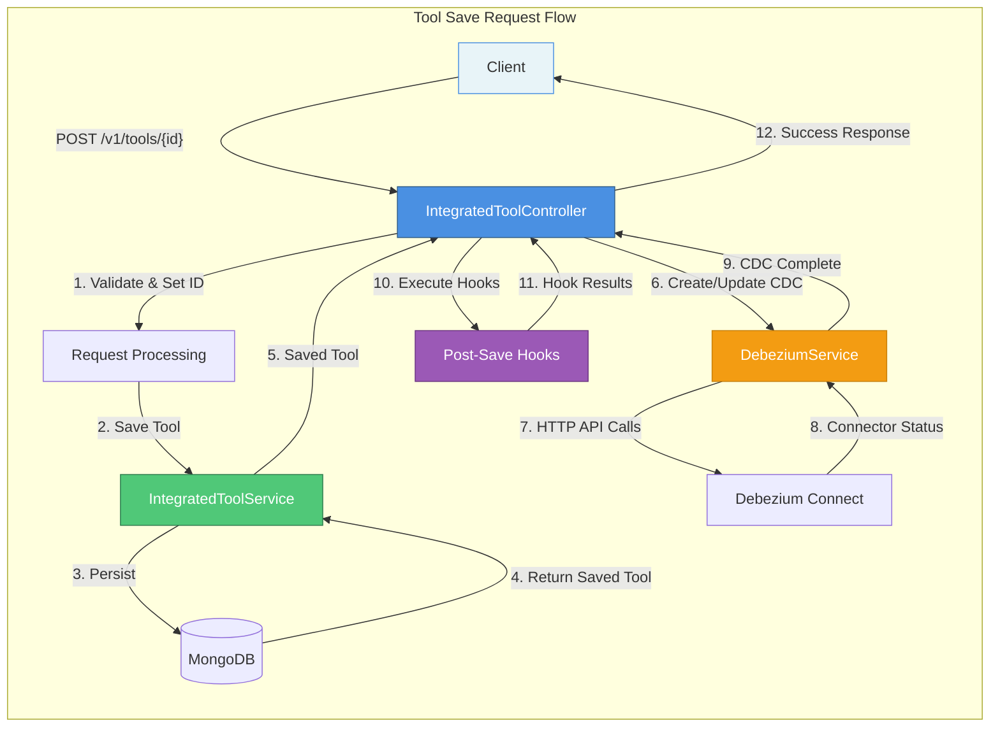
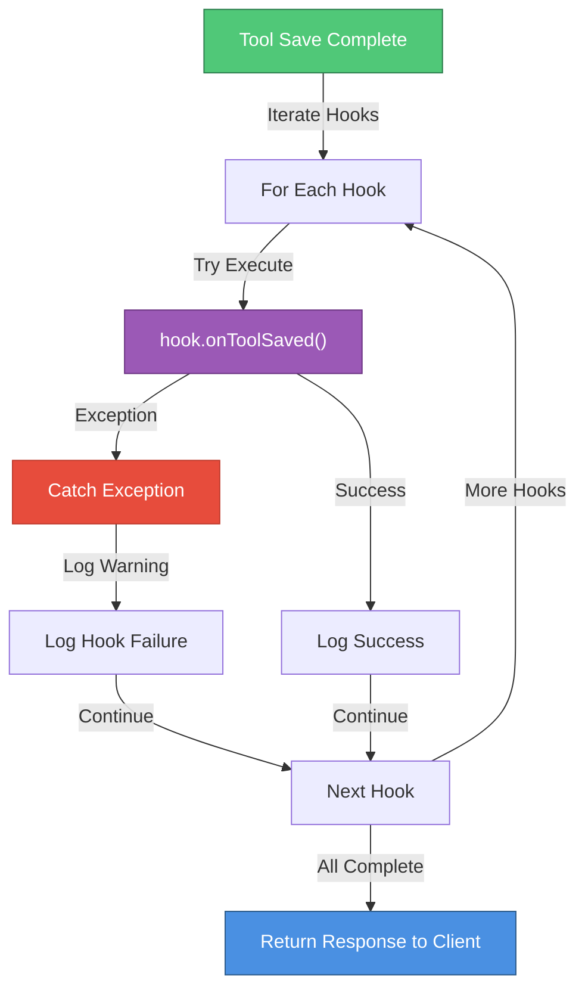
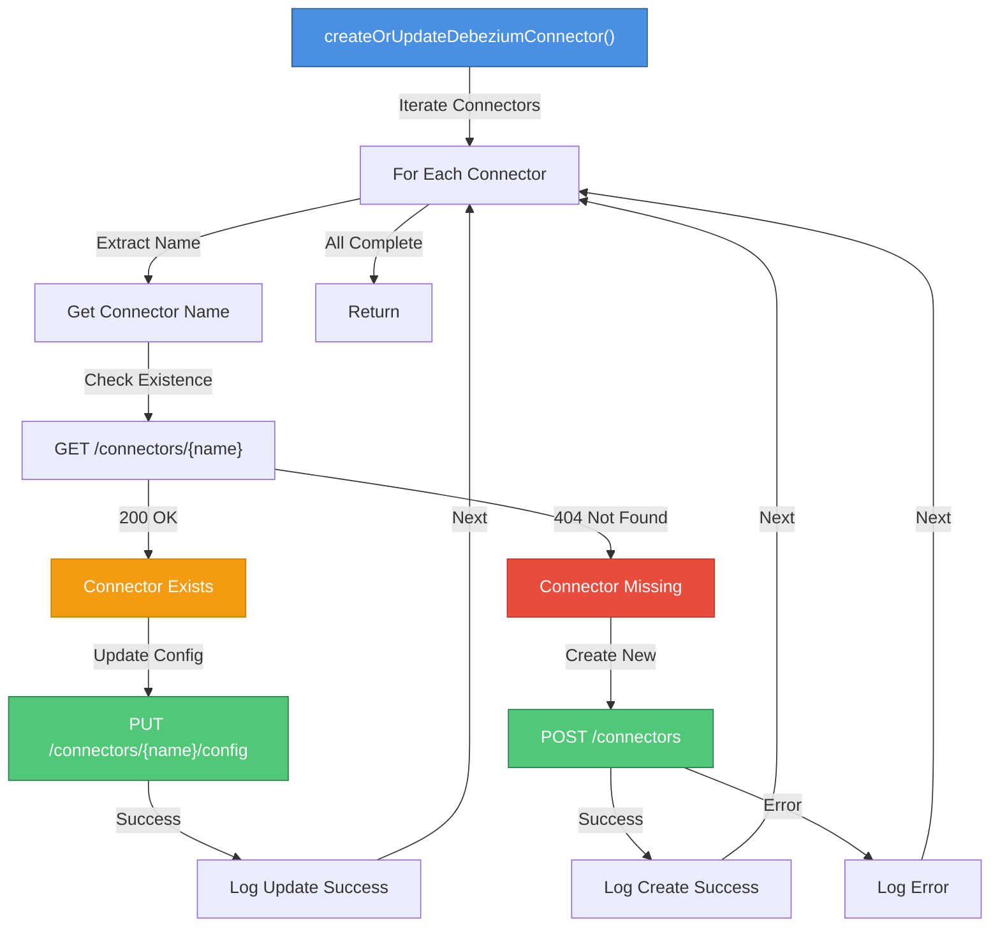
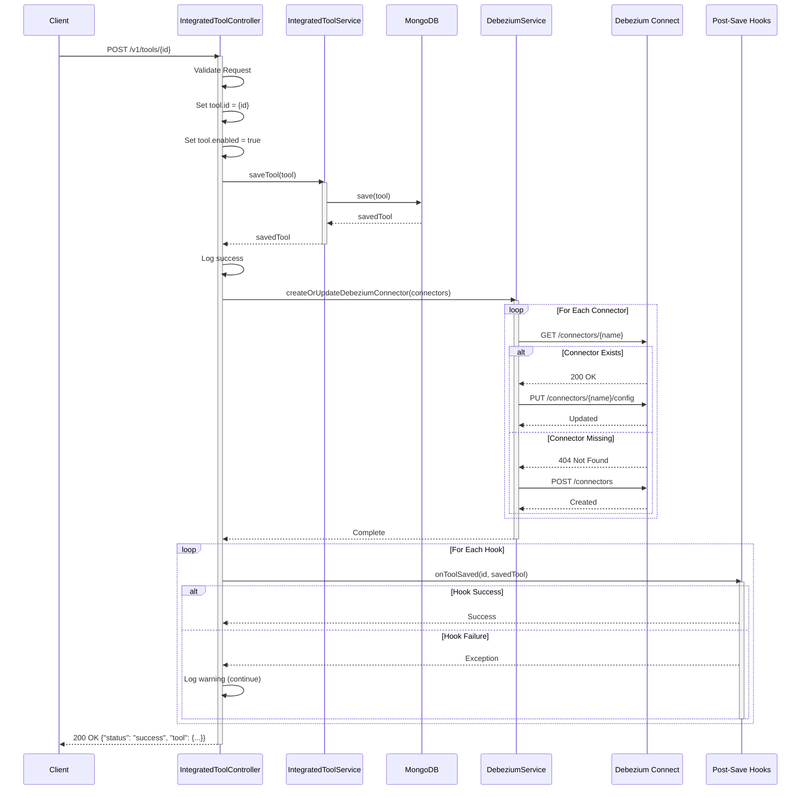
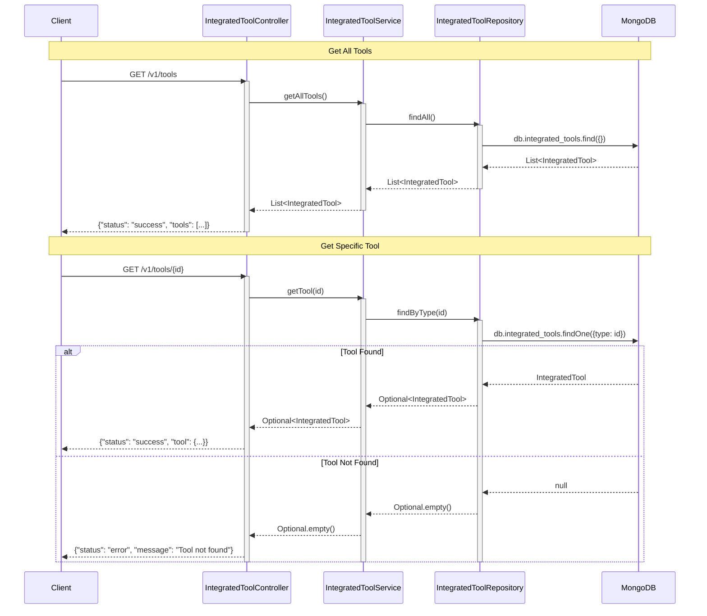
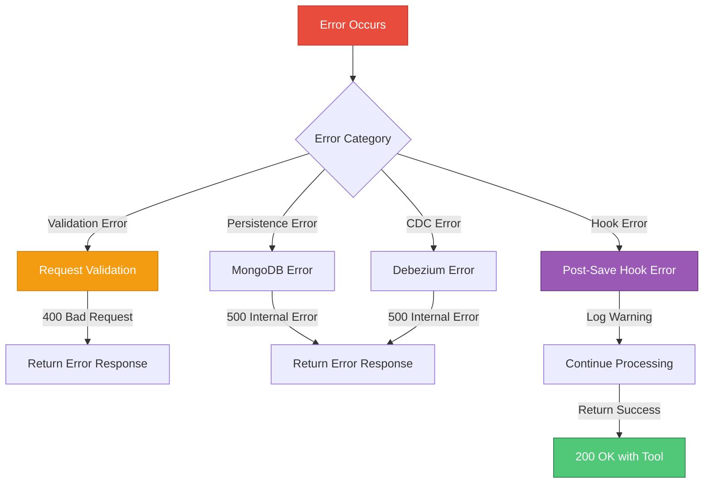
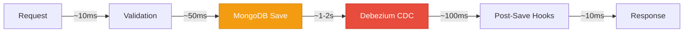

# Management Service - Tool Management Module

## Overview

The **Tool Management Module** is a critical component of the OpenFrame Management Service responsible for managing integrated third-party tools and their configurations. This module provides REST API endpoints for CRUD operations on integrated tools, orchestrates Change Data Capture (CDC) connector lifecycle management via Debezium, and implements an extensible hook system for post-save operations.

**Key Responsibilities:**
- Manage integrated tool configurations (create, read, update)
- Orchestrate Debezium CDC connector provisioning and updates
- Execute post-save hooks for tool-specific side effects
- Provide RESTful API for tool management operations

**Related Modules:**
- [Management Service Configuration](management_service_configuration.md) - Configuration and properties
- [Management Service CDC Management](management_service_cdc_management.md) - Debezium health monitoring
- [Management Service Agent Management](management_service_agent_management.md) - Tool agent initialization
- [Data Layer MongoDB](data_layer_mongo.md) - IntegratedTool document model and repository

---

## Architecture

### Component Overview



### Data Flow



### Hook Execution Pattern



---

## Core Components

### 1. IntegratedToolController

**Location:** `com.openframe.management.controller.IntegratedToolController`

**Purpose:** REST controller providing HTTP endpoints for integrated tool management operations.

**Key Features:**
- RESTful CRUD operations for integrated tools
- Automatic CDC connector provisioning on tool save
- Post-save hook execution with error isolation
- Structured JSON response format

**Endpoints:**

| Method | Path | Description | Request Body | Response |
|--------|------|-------------|--------------|----------|
| `GET` | `/v1/tools` | List all integrated tools | None | `{"status": "success", "tools": [...]}` |
| `GET` | `/v1/tools/{id}` | Get specific tool by ID | None | `{"status": "success", "tool": {...}}` |
| `POST` | `/v1/tools/{id}` | Create or update tool | `SaveToolRequest` | `{"status": "success", "tool": {...}}` |

**Request/Response Models:**

```java
// Request DTO
public static class SaveToolRequest {
    private IntegratedTool tool;
}

// Success Response
{
    "status": "success",
    "tool": {
        "id": "tactical-rmm",
        "name": "Tactical RMM",
        "enabled": true,
        // ... other fields
    }
}

// Error Response
{
    "status": "error",
    "message": "Error details..."
}
```

**Dependencies:**
- `IntegratedToolService` - Tool persistence operations
- `DebeziumService` - CDC connector management
- `List<IntegratedToolPostSaveHook>` - Extensible hook registry

**Error Handling:**
- Hook failures are logged but don't fail the request
- Service exceptions return HTTP 500 with error details
- Missing tools return error status in response body

**Code Example:**

```java
@PostMapping("/{id}")
public ResponseEntity<Map<String, Object>> saveTool(
        @PathVariable String id,
        @RequestBody SaveToolRequest request) {
    try {
        IntegratedTool tool = request.getTool();
        tool.setId(id);
        tool.setEnabled(true);

        // 1. Save tool to MongoDB
        IntegratedTool savedTool = toolService.saveTool(tool);
        log.info("Successfully saved tool configuration for: {}", id);
        
        // 2. Provision CDC connectors
        debeziumService.createOrUpdateDebeziumConnector(
            savedTool.getDebeziumConnectors()
        );
        
        // 3. Execute post-save hooks (non-blocking)
        for (IntegratedToolPostSaveHook hook : postSaveHooks) {
            try {
                hook.onToolSaved(id, savedTool);
            } catch (Exception hookEx) {
                log.warn("Post-save hook failed for toolId={}: {}", 
                    id, hookEx.getMessage(), hookEx);
            }
        }
        
        return ResponseEntity.ok(Map.of("status", "success", "tool", savedTool));
    } catch (Exception e) {
        log.error("Failed to save tool: {}", id, e);
        return ResponseEntity.status(INTERNAL_SERVER_ERROR)
                .body(Map.of("status", "error", "message", e.getMessage()));
    }
}
```

---

### 2. IntegratedToolPostSaveHook

**Location:** `com.openframe.management.hook.IntegratedToolPostSaveHook`

**Purpose:** Lightweight extension point for executing service-specific side effects after tool save operations.

**Design Pattern:** Strategy Pattern / Observer Pattern

**Interface Definition:**

```java
public interface IntegratedToolPostSaveHook {
    void onToolSaved(String toolId, IntegratedTool tool);
}
```

**Key Characteristics:**
- **Lightweight:** No Spring event infrastructure overhead
- **Synchronous:** Executed in request thread (use async internally if needed)
- **Fault-Tolerant:** Exceptions don't fail the save operation
- **Extensible:** Multiple implementations auto-discovered via Spring

**Use Cases:**
1. **Agent Initialization:** Trigger agent deployment after tool configuration
2. **Cache Invalidation:** Clear cached tool metadata
3. **Notification:** Send alerts to monitoring systems
4. **Audit Logging:** Record tool configuration changes
5. **Webhook Triggers:** Notify external systems of tool updates

**Implementation Example:**

```java
@Component
@Slf4j
public class ToolAgentDeploymentHook implements IntegratedToolPostSaveHook {
    
    private final IntegratedToolAgentService agentService;
    
    @Override
    public void onToolSaved(String toolId, IntegratedTool tool) {
        log.info("Deploying agents for tool: {}", toolId);
        
        // Trigger agent initialization
        agentService.deployAgentsForTool(toolId);
        
        log.info("Agent deployment triggered for: {}", toolId);
    }
}
```

**Hook Execution Guarantees:**
- ✅ Hooks execute **after** successful MongoDB save
- ✅ Hooks execute **after** Debezium connector provisioning
- ✅ Hook failures are logged but isolated (don't affect other hooks)
- ✅ All registered hooks execute (no short-circuit on failure)
- ❌ No transaction rollback on hook failure
- ❌ No guaranteed execution order between hooks

---

## Integration Points

### MongoDB Integration

**Document Model:** `IntegratedTool`

```java
@Document(collection = "integrated_tools")
public class IntegratedTool {
    @Id
    private String id;                          // Unique tool identifier
    private String name;                        // Display name
    private String description;                 // Tool description
    private String icon;                        // Icon URL/path
    private List<ToolUrl> toolUrls;            // Access URLs
    private String type;                        // Tool type identifier
    private String toolType;                    // Tool category
    private String category;                    // Business category
    private String platformCategory;            // Platform classification
    private boolean enabled;                    // Activation status
    private ToolCredentials credentials;        // Authentication config
    
    // Layer information
    private String layer;                       // Architecture layer
    private Integer layerOrder;                 // Display order
    private String layerColor;                  // UI color code
    
    // Monitoring configuration
    private String metricsPath;                 // Metrics endpoint
    private String healthCheckEndpoint;         // Health check URL
    private Integer healthCheckInterval;        // Check frequency (seconds)
    private Integer connectionTimeout;          // Connection timeout (ms)
    private Integer readTimeout;                // Read timeout (ms)
    private String[] allowedEndpoints;          // Whitelisted endpoints
    private Object[] debeziumConnectors;        // CDC connector configs
}
```

**Repository Operations:**

```java
// Service layer operations
public List<IntegratedTool> getAllTools() {
    return toolRepository.findAll();
}

public Optional<IntegratedTool> getTool(String toolType) {
    return toolRepository.findByType(toolType);
}

public IntegratedTool saveTool(IntegratedTool tool) {
    return toolRepository.save(tool);
}
```

**See:** [Data Layer MongoDB](data_layer_mongo.md) for complete repository documentation.

---

### Debezium CDC Integration

**Service:** `DebeziumService`

**Purpose:** Manages Debezium Connect REST API interactions for CDC connector lifecycle.

**Connector Provisioning Flow:**



**Connector Configuration Format:**

```json
{
    "name": "mongodb-integrated-tools-connector",
    "config": {
        "connector.class": "io.debezium.connector.mongodb.MongoDbConnector",
        "mongodb.connection.string": "mongodb://localhost:27017",
        "mongodb.connection.mode": "replica_set",
        "topic.prefix": "openframe",
        "collection.include.list": "openframe.integrated_tools",
        "transforms": "unwrap",
        "transforms.unwrap.type": "io.debezium.transforms.ExtractNewRecordState"
    }
}
```

**API Operations:**

| Operation | Method | Endpoint | Purpose |
|-----------|--------|----------|---------|
| List Connectors | `GET` | `/connectors` | Get all connector names |
| Get Status | `GET` | `/connectors/{name}/status` | Check connector health |
| Create | `POST` | `/connectors` | Create new connector |
| Update Config | `PUT` | `/connectors/{name}/config` | Update existing connector |
| Restart Task | `POST` | `/connectors/{name}/tasks/{id}/restart` | Restart failed task |

**Configuration:**

```yaml
openframe:
  debezium:
    base-url: http://debezium-connect:8083
```

**See:** [Management Service CDC Management](management_service_cdc_management.md) for health monitoring details.

---

## Process Flows

### Tool Save Operation



### Tool Retrieval Operations



---

## Configuration

### Application Properties

```yaml
# Tool Integration Feature Toggle
openframe:
  integration:
    tool:
      enabled: true  # Enable IntegratedToolService

# Debezium Connect Configuration
openframe:
  debezium:
    base-url: http://debezium-connect:8083
    health-check:
      enabled: true
      interval: 300000  # 5 minutes

# MongoDB Configuration
spring:
  data:
    mongodb:
      uri: mongodb://localhost:27017/openframe
      database: openframe
```

### Component Activation

**IntegratedToolService Conditions:**

```java
@Service
@ConditionalOnProperty(
    name = "openframe.integration.tool.enabled", 
    havingValue = "true"
)
@ConditionalOnWebApplication(type = ConditionalOnWebApplication.Type.SERVLET)
public class IntegratedToolService {
    // Service implementation
}
```

**Requirements:**
- Property `openframe.integration.tool.enabled=true`
- Servlet-based web application context
- MongoDB connection available

---

## Extension Points

### Implementing Custom Post-Save Hooks

**Step 1: Create Hook Implementation**

```java
package com.openframe.management.hook.impl;

import com.openframe.data.document.tool.IntegratedTool;
import com.openframe.management.hook.IntegratedToolPostSaveHook;
import lombok.RequiredArgsConstructor;
import lombok.extern.slf4j.Slf4j;
import org.springframework.stereotype.Component;

@Slf4j
@Component
@RequiredArgsConstructor
public class CustomToolHook implements IntegratedToolPostSaveHook {
    
    private final CustomService customService;
    
    @Override
    public void onToolSaved(String toolId, IntegratedTool tool) {
        log.info("Custom hook executing for tool: {}", toolId);
        
        try {
            // Perform custom logic
            customService.handleToolUpdate(tool);
            
            log.info("Custom hook completed for: {}", toolId);
        } catch (Exception e) {
            log.error("Custom hook failed for: {}", toolId, e);
            throw e; // Will be caught by controller
        }
    }
}
```

**Step 2: Register as Spring Bean**

The hook is automatically discovered via Spring component scanning when annotated with `@Component`.

**Step 3: Verify Registration**

```bash
# Check application logs on startup
grep "IntegratedToolPostSaveHook" application.log

# Expected output:
# Found 3 IntegratedToolPostSaveHook implementations:
#   - ToolAgentDeploymentHook
#   - CacheInvalidationHook
#   - CustomToolHook
```

### Async Hook Execution Pattern

For long-running operations, use async execution:

```java
@Slf4j
@Component
@RequiredArgsConstructor
public class AsyncToolHook implements IntegratedToolPostSaveHook {
    
    private final AsyncService asyncService;
    
    @Override
    public void onToolSaved(String toolId, IntegratedTool tool) {
        log.info("Triggering async processing for: {}", toolId);
        
        // Trigger async operation (returns immediately)
        asyncService.processToolUpdateAsync(toolId, tool);
        
        log.info("Async processing triggered for: {}", toolId);
    }
}

@Service
public class AsyncService {
    
    @Async("toolHookExecutor")
    public void processToolUpdateAsync(String toolId, IntegratedTool tool) {
        // Long-running operation executes in separate thread
        // ...
    }
}
```

**Async Configuration:**

```java
@Configuration
@EnableAsync
public class AsyncConfig {
    
    @Bean(name = "toolHookExecutor")
    public Executor toolHookExecutor() {
        ThreadPoolTaskExecutor executor = new ThreadPoolTaskExecutor();
        executor.setCorePoolSize(2);
        executor.setMaxPoolSize(5);
        executor.setQueueCapacity(100);
        executor.setThreadNamePrefix("tool-hook-");
        executor.initialize();
        return executor;
    }
}
```

---

## API Reference

### REST Endpoints

#### List All Tools

```http
GET /v1/tools HTTP/1.1
Host: management-service:8080
Accept: application/json
```

**Response:**

```json
{
    "status": "success",
    "tools": [
        {
            "id": "tactical-rmm",
            "name": "Tactical RMM",
            "description": "Remote Monitoring and Management",
            "type": "tactical-rmm",
            "enabled": true,
            "toolUrls": [
                {
                    "url": "https://rmm.example.com",
                    "type": "web"
                }
            ],
            "credentials": {
                "apiKey": "***",
                "apiUrl": "https://rmm.example.com/api"
            },
            "debeziumConnectors": [
                {
                    "name": "tactical-rmm-connector",
                    "config": { /* ... */ }
                }
            ]
        }
    ]
}
```

#### Get Specific Tool

```http
GET /v1/tools/tactical-rmm HTTP/1.1
Host: management-service:8080
Accept: application/json
```

**Response (Success):**

```json
{
    "status": "success",
    "tool": {
        "id": "tactical-rmm",
        "name": "Tactical RMM",
        "enabled": true
        // ... other fields
    }
}
```

**Response (Not Found):**

```json
{
    "status": "error",
    "message": "Tool not found"
}
```

#### Create or Update Tool

```http
POST /v1/tools/tactical-rmm HTTP/1.1
Host: management-service:8080
Content-Type: application/json

{
    "tool": {
        "name": "Tactical RMM",
        "description": "Remote Monitoring and Management Platform",
        "type": "tactical-rmm",
        "toolUrls": [
            {
                "url": "https://rmm.example.com",
                "type": "web"
            }
        ],
        "credentials": {
            "apiKey": "your-api-key",
            "apiUrl": "https://rmm.example.com/api"
        },
        "debeziumConnectors": [
            {
                "name": "tactical-rmm-connector",
                "config": {
                    "connector.class": "io.debezium.connector.mongodb.MongoDbConnector",
                    "mongodb.connection.string": "mongodb://localhost:27017",
                    "topic.prefix": "tactical-rmm",
                    "collection.include.list": "tactical.agents"
                }
            }
        ],
        "healthCheckEndpoint": "/api/health",
        "healthCheckInterval": 60
    }
}
```

**Response (Success):**

```json
{
    "status": "success",
    "tool": {
        "id": "tactical-rmm",
        "name": "Tactical RMM",
        "enabled": true,
        // ... complete saved tool
    }
}
```

**Response (Error):**

```json
{
    "status": "error",
    "message": "Failed to create Debezium connector: Connection refused"
}
```

---

## Error Handling

### Error Categories



### Error Response Format

**Standard Error Response:**

```json
{
    "status": "error",
    "message": "Detailed error message",
    "timestamp": "2024-01-15T10:30:00Z",
    "path": "/v1/tools/tactical-rmm"
}
```

### Common Error Scenarios

| Scenario | HTTP Status | Response | Resolution |
|----------|-------------|----------|------------|
| Tool not found | 200 OK | `{"status": "error", "message": "Tool not found"}` | Verify tool ID exists |
| Invalid request body | 400 Bad Request | Validation error details | Check request format |
| MongoDB connection failure | 500 Internal Error | `{"status": "error", "message": "Database error"}` | Check MongoDB connectivity |
| Debezium Connect unavailable | 500 Internal Error | `{"status": "error", "message": "CDC service unavailable"}` | Verify Debezium Connect is running |
| Hook execution failure | 200 OK | Success (hook error logged) | Check application logs for hook details |

### Logging Strategy

**Log Levels:**

```java
// Success operations
log.info("Successfully saved tool configuration for: {}", id);

// Hook failures (non-critical)
log.warn("Post-save hook failed for toolId={}: {}", id, ex.getMessage(), ex);

// Service failures (critical)
log.error("Failed to save tool: {}", id, e);

// Debezium operations
log.info("Connector '{}' created. Response: {}", name, response.getStatusCode());
log.error("Failed to create connector '{}'", name, e);
```

**Log Correlation:**

All operations include the `toolId` for traceability:

```text
2024-01-15 10:30:00 INFO  [http-nio-8080-exec-1] IntegratedToolController - Successfully saved tool configuration for: tactical-rmm
2024-01-15 10:30:01 INFO  [http-nio-8080-exec-1] DebeziumService - Connector 'tactical-rmm-connector' created. Response: 201
2024-01-15 10:30:02 WARN  [http-nio-8080-exec-1] IntegratedToolController - Post-save hook failed for toolId=tactical-rmm: Connection timeout
```

---

## Monitoring and Observability

### Key Metrics

**Application Metrics:**

```yaml
# Prometheus metrics exposed at /actuator/prometheus

# Request metrics
http_server_requests_seconds_count{uri="/v1/tools",method="GET"}
http_server_requests_seconds_count{uri="/v1/tools/{id}",method="POST"}

# Tool operation metrics
tool_save_operations_total{status="success"}
tool_save_operations_total{status="error"}

# Hook execution metrics
tool_hook_executions_total{hook="ToolAgentDeploymentHook",status="success"}
tool_hook_executions_total{hook="ToolAgentDeploymentHook",status="failure"}

# Debezium connector metrics
debezium_connector_operations_total{operation="create",status="success"}
debezium_connector_operations_total{operation="update",status="success"}
```

### Health Checks

**Endpoint:** `/actuator/health`

```json
{
    "status": "UP",
    "components": {
        "mongo": {
            "status": "UP",
            "details": {
                "version": "6.0.3"
            }
        },
        "debezium": {
            "status": "UP",
            "details": {
                "connectors": 3,
                "healthy": 3,
                "failed": 0
            }
        }
    }
}
```

### Logging Best Practices

**Structured Logging:**

```java
// Use structured logging with context
log.info("Tool operation completed", 
    kv("toolId", toolId),
    kv("operation", "save"),
    kv("duration", duration),
    kv("hookCount", postSaveHooks.size())
);
```

**Correlation IDs:**

```java
// Add correlation ID to MDC for request tracing
MDC.put("correlationId", UUID.randomUUID().toString());
MDC.put("toolId", toolId);

try {
    // Perform operations
} finally {
    MDC.clear();
}
```

---

## Testing

### Unit Testing

**Controller Test Example:**

```java
@WebMvcTest(IntegratedToolController.class)
class IntegratedToolControllerTest {
    
    @Autowired
    private MockMvc mockMvc;
    
    @MockBean
    private IntegratedToolService toolService;
    
    @MockBean
    private DebeziumService debeziumService;
    
    @MockBean
    private List<IntegratedToolPostSaveHook> postSaveHooks;
    
    @Test
    void saveTool_Success() throws Exception {
        // Given
        IntegratedTool tool = IntegratedTool.builder()
            .id("test-tool")
            .name("Test Tool")
            .enabled(true)
            .build();
        
        when(toolService.saveTool(any())).thenReturn(tool);
        
        // When & Then
        mockMvc.perform(post("/v1/tools/test-tool")
                .contentType(MediaType.APPLICATION_JSON)
                .content("{\"tool\": {\"name\": \"Test Tool\"}}"))
            .andExpect(status().isOk())
            .andExpect(jsonPath("$.status").value("success"))
            .andExpect(jsonPath("$.tool.id").value("test-tool"));
        
        verify(toolService).saveTool(any());
        verify(debeziumService).createOrUpdateDebeziumConnector(any());
    }
    
    @Test
    void saveTool_HookFailure_StillSucceeds() throws Exception {
        // Given
        IntegratedTool tool = IntegratedTool.builder()
            .id("test-tool")
            .build();
        
        when(toolService.saveTool(any())).thenReturn(tool);
        
        IntegratedToolPostSaveHook failingHook = mock(IntegratedToolPostSaveHook.class);
        doThrow(new RuntimeException("Hook failed"))
            .when(failingHook).onToolSaved(anyString(), any());
        
        when(postSaveHooks.iterator())
            .thenReturn(List.of(failingHook).iterator());
        
        // When & Then
        mockMvc.perform(post("/v1/tools/test-tool")
                .contentType(MediaType.APPLICATION_JSON)
                .content("{\"tool\": {}}"))
            .andExpect(status().isOk())
            .andExpect(jsonPath("$.status").value("success"));
    }
}
```

### Integration Testing

**Full Flow Test:**

```java
@SpringBootTest
@AutoConfigureMockMvc
@Testcontainers
class IntegratedToolIntegrationTest {
    
    @Container
    static MongoDBContainer mongodb = new MongoDBContainer("mongo:6.0");
    
    @Container
    static GenericContainer<?> debezium = new GenericContainer<>("debezium/connect:2.4")
        .withExposedPorts(8083);
    
    @Autowired
    private MockMvc mockMvc;
    
    @Autowired
    private IntegratedToolRepository toolRepository;
    
    @DynamicPropertySource
    static void setProperties(DynamicPropertyRegistry registry) {
        registry.add("spring.data.mongodb.uri", mongodb::getReplicaSetUrl);
        registry.add("openframe.debezium.base-url", 
            () -> "http://localhost:" + debezium.getMappedPort(8083));
    }
    
    @Test
    void fullToolSaveFlow() throws Exception {
        // When
        mockMvc.perform(post("/v1/tools/integration-test-tool")
                .contentType(MediaType.APPLICATION_JSON)
                .content("""
                    {
                        "tool": {
                            "name": "Integration Test Tool",
                            "type": "test",
                            "debeziumConnectors": [
                                {
                                    "name": "test-connector",
                                    "config": {
                                        "connector.class": "io.debezium.connector.mongodb.MongoDbConnector"
                                    }
                                }
                            ]
                        }
                    }
                    """))
            .andExpect(status().isOk());
        
        // Then - Verify MongoDB persistence
        Optional<IntegratedTool> saved = toolRepository.findById("integration-test-tool");
        assertThat(saved).isPresent();
        assertThat(saved.get().getName()).isEqualTo("Integration Test Tool");
        assertThat(saved.get().isEnabled()).isTrue();
    }
}
```

---

## Troubleshooting

### Common Issues

#### Issue: Tool Save Returns 500 Error

**Symptoms:**
```json
{
    "status": "error",
    "message": "Failed to save tool: Connection refused"
}
```

**Possible Causes:**
1. MongoDB connection failure
2. Debezium Connect unavailable
3. Invalid connector configuration

**Resolution Steps:**

```bash
# 1. Check MongoDB connectivity
mongosh --host localhost:27017 --eval "db.adminCommand('ping')"

# 2. Verify Debezium Connect is running
curl http://localhost:8083/connectors

# 3. Check application logs
kubectl logs -f deployment/management-service | grep "Failed to save tool"

# 4. Validate connector configuration
curl -X GET http://localhost:8083/connector-plugins
```

#### Issue: Post-Save Hook Not Executing

**Symptoms:**
- Tool saves successfully
- Expected hook side effects don't occur
- No hook execution logs

**Possible Causes:**
1. Hook not registered as Spring bean
2. Component scanning not including hook package
3. Hook implementation has wrong method signature

**Resolution Steps:**

```bash
# 1. Verify hook is registered
curl http://localhost:8080/actuator/beans | jq '.contexts[].beans | keys[]' | grep Hook

# 2. Check component scanning configuration
# In @SpringBootApplication or @Configuration:
@ComponentScan(basePackages = {
    "com.openframe.management",
    "com.custom.hooks"  // Add custom hook package
})

# 3. Verify hook implements correct interface
public class MyHook implements IntegratedToolPostSaveHook {
    @Override
    public void onToolSaved(String toolId, IntegratedTool tool) {
        // Implementation
    }
}
```

#### Issue: Debezium Connector Creation Fails

**Symptoms:**
```text
ERROR DebeziumService - Failed to create connector 'my-connector'
```

**Possible Causes:**
1. Invalid connector configuration
2. Debezium Connect not ready
3. Source database not accessible

**Resolution Steps:**

```bash
# 1. Validate connector config manually
curl -X POST http://localhost:8083/connectors \
  -H "Content-Type: application/json" \
  -d @connector-config.json

# 2. Check Debezium Connect logs
kubectl logs -f deployment/debezium-connect

# 3. Verify source database connectivity from Debezium
kubectl exec -it deployment/debezium-connect -- \
  curl -v mongodb://source-db:27017

# 4. Check connector status
curl http://localhost:8083/connectors/my-connector/status
```

### Debug Mode

**Enable Debug Logging:**

```yaml
logging:
  level:
    com.openframe.management.controller: DEBUG
    com.openframe.management.hook: DEBUG
    com.openframe.management.service: DEBUG
    com.openframe.data.service: DEBUG
```

**Debug Output Example:**

```text
DEBUG IntegratedToolController - Received save request for tool: tactical-rmm
DEBUG IntegratedToolController - Tool configuration: IntegratedTool(id=tactical-rmm, name=Tactical RMM, ...)
DEBUG IntegratedToolService - Saving tool to MongoDB: tactical-rmm
DEBUG IntegratedToolService - Tool saved successfully: tactical-rmm
DEBUG DebeziumService - Processing 2 Debezium connectors
DEBUG DebeziumService - Checking connector: tactical-rmm-agents
DEBUG DebeziumService - Connector tactical-rmm-agents exists, updating config
DEBUG IntegratedToolController - Executing 3 post-save hooks
DEBUG ToolAgentDeploymentHook - Deploying agents for tool: tactical-rmm
```

---

## Security Considerations

### Authentication & Authorization

**Controller Security:**

```java
@RestController
@RequestMapping("/v1/tools")
@PreAuthorize("hasRole('ADMIN')")  // Require ADMIN role
public class IntegratedToolController {
    // Endpoints
}
```

**Method-Level Security:**

```java
@GetMapping
@PreAuthorize("hasAnyRole('ADMIN', 'VIEWER')")
public Map<String, Object> getTools() {
    // Read-only operation
}

@PostMapping("/{id}")
@PreAuthorize("hasRole('ADMIN')")
public ResponseEntity<Map<String, Object>> saveTool(...) {
    // Write operation - admin only
}
```

### Credential Management

**Sensitive Data Handling:**

```java
// Never log credentials
log.info("Saving tool: {}", tool.getId());  // ✅ Safe
log.info("Tool config: {}", tool);          // ❌ May expose credentials

// Mask credentials in responses
public IntegratedTool sanitize(IntegratedTool tool) {
    if (tool.getCredentials() != null) {
        tool.getCredentials().setApiKey("***");
        tool.getCredentials().setPassword("***");
    }
    return tool;
}
```

**Environment-Based Secrets:**

```yaml
# Use environment variables for sensitive config
openframe:
  debezium:
    base-url: ${DEBEZIUM_URL:http://localhost:8083}
    auth:
      username: ${DEBEZIUM_USERNAME}
      password: ${DEBEZIUM_PASSWORD}
```

### Input Validation

**Request Validation:**

```java
@PostMapping("/{id}")
public ResponseEntity<Map<String, Object>> saveTool(
        @PathVariable @Pattern(regexp = "[a-z0-9-]+") String id,
        @RequestBody @Valid SaveToolRequest request) {
    // Validated input
}

@Data
public static class SaveToolRequest {
    @NotNull(message = "Tool configuration is required")
    @Valid
    private IntegratedTool tool;
}
```

---

## Performance Considerations

### Optimization Strategies

**1. Async Hook Execution:**

```java
// Execute long-running hooks asynchronously
@Async("toolHookExecutor")
public void onToolSaved(String toolId, IntegratedTool tool) {
    // Long-running operation
}
```

**2. Debezium Connector Batching:**

```java
// Process connectors in parallel
public void createOrUpdateDebeziumConnector(Object[] connectors) {
    if (connectors == null) return;
    
    Arrays.stream(connectors)
        .parallel()
        .forEach(this::processConnector);
}
```

**3. Caching Tool Configurations:**

```java
@Service
public class CachedIntegratedToolService {
    
    @Cacheable(value = "tools", key = "#toolId")
    public Optional<IntegratedTool> getTool(String toolId) {
        return toolRepository.findById(toolId);
    }
    
    @CacheEvict(value = "tools", key = "#tool.id")
    public IntegratedTool saveTool(IntegratedTool tool) {
        return toolRepository.save(tool);
    }
}
```

### Performance Metrics

**Expected Response Times:**

| Operation | Target | Acceptable | Notes |
|-----------|--------|------------|-------|
| GET /v1/tools | < 100ms | < 500ms | Depends on tool count |
| GET /v1/tools/{id} | < 50ms | < 200ms | Single document query |
| POST /v1/tools/{id} | < 2s | < 5s | Includes CDC provisioning |

**Bottleneck Analysis:**



**Optimization Priority:**
1. **Debezium CDC** (1-2s) - Consider async processing
2. **Post-Save Hooks** (variable) - Use async execution
3. **MongoDB Save** (50ms) - Optimize indexes

---

## Related Documentation

- **[Management Service Configuration](management_service_configuration.md)** - Service configuration and properties
- **[Management Service CDC Management](management_service_cdc_management.md)** - Debezium health monitoring and connector management
- **[Management Service Agent Management](management_service_agent_management.md)** - Tool agent initialization and deployment
- **[Data Layer MongoDB](data_layer_mongo.md)** - IntegratedTool document model and repository
- **[API Service](api_service.md)** - External API for tool queries
- **[Stream Processing](stream_processing.md)** - CDC event processing

---

## Summary

The **Tool Management Module** provides a robust, extensible system for managing integrated third-party tools within the OpenFrame platform. Key capabilities include:

✅ **RESTful API** for tool CRUD operations  
✅ **Automatic CDC provisioning** via Debezium Connect  
✅ **Extensible hook system** for custom post-save logic  
✅ **Fault-tolerant design** with isolated error handling  
✅ **MongoDB persistence** with structured document model  
✅ **Comprehensive logging** and observability  

**Architecture Highlights:**
- Clean separation of concerns (Controller → Service → Repository)
- Non-blocking hook execution with error isolation
- Idempotent CDC connector provisioning
- Flexible extension points for custom integrations

**Next Steps:**
- Review [Management Service Agent Management](management_service_agent_management.md) for agent deployment workflows
- Explore [Management Service CDC Management](management_service_cdc_management.md) for connector health monitoring
- See [Data Layer MongoDB](data_layer_mongo.md) for complete data model documentation

---

**Version:** 1.0  
**Last Updated:** 2024-01-15  
**Maintained By:** OpenFrame Platform Team
