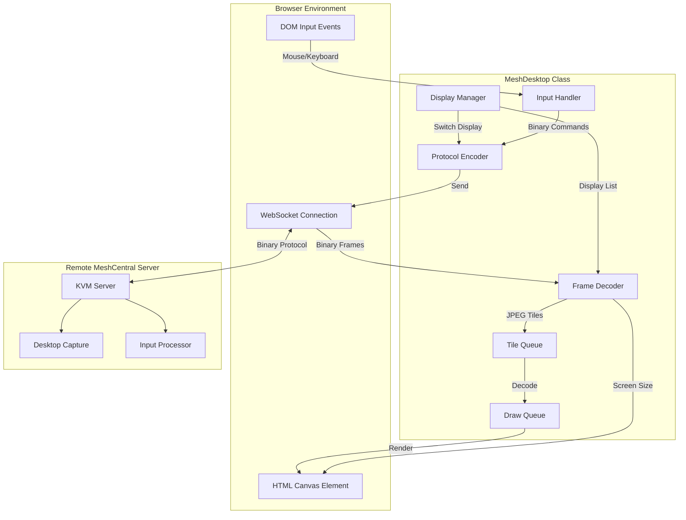
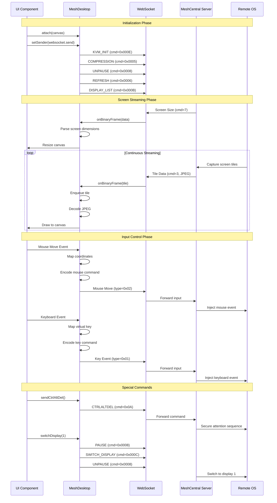
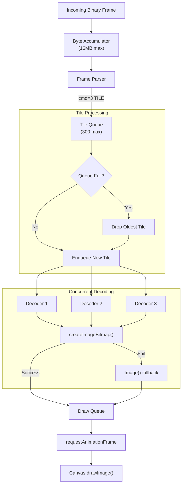
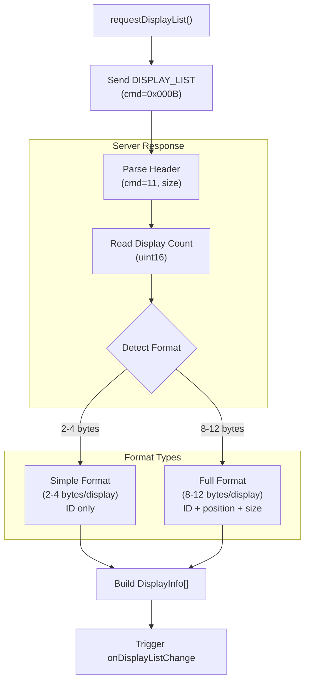

# MeshCentral Desktop Control Module

## Overview

The **MeshCentral Desktop Control** module provides a complete TypeScript implementation of the MeshCentral KVM (Keyboard, Video, Mouse) protocol for remote desktop control within the OpenFrame platform. This module enables technicians to remotely view and control client machines through a browser-based interface, supporting multi-monitor setups, keyboard/mouse input, and real-time screen streaming.

**Key Capabilities:**
- **Remote Desktop Streaming**: Real-time JPEG-compressed screen tile rendering
- **Input Control**: Full keyboard and mouse event handling with extended key support
- **Multi-Monitor Support**: Display enumeration, switching, and coordinate mapping
- **Protocol Compliance**: Binary protocol implementation matching MeshCentral's KVM specification
- **Performance Optimization**: Concurrent tile decoding with backpressure management
- **Special Commands**: Ctrl+Alt+Del, key combinations, screen refresh, and display management

**Related Modules:**
- [MeshCentral File Management](./meshcentral_file_management.md) - File transfer and management protocol
- [MeshCentral Integration](./meshcentral_integration.md) - Parent integration module
- [Frontend Main](./frontend_main.md) - Main frontend application
- [Frontend Device Management](./frontend_device_management.md) - Device listing and selection

---

## Architecture

### High-Level Component Architecture



### Protocol Flow Sequence



### Data Flow Architecture

```mermaid
flowchart LR
    subgraph Input["Input Processing"]
        MouseEvents["Mouse Events"]
        KeyEvents["Keyboard Events"]
        SpecialCmds["Special Commands"]
    end
    
    subgraph Encoding["Binary Encoding"]
        MouseEncoder["Mouse Encoder"]
        KeyEncoder["Key Encoder"]
        CmdEncoder["Command Encoder"]
    end
    
    subgraph Transport["Transport Layer"]
        Sender["Sender Function"]
        Receiver["Receiver Handler"]
    end
    
    subgraph Decoding["Frame Decoding"]
        Accumulator["Byte Accumulator"]
        FrameParser["Frame Parser"]
        JumboHandler["Jumbo Frame Handler"]
    end
    
    subgraph Rendering["Rendering Pipeline"]
        TileQueue["Tile Queue<br/>(max 300)"]
        Decoder["JPEG Decoder<br/>(3 concurrent)"]
        DrawQueue["Draw Queue"]
        Canvas["Canvas 2D Context"]
    end
    
    MouseEvents --> MouseEncoder
    KeyEvents --> KeyEncoder
    SpecialCmds --> CmdEncoder
    
    MouseEncoder --> Sender
    KeyEncoder --> Sender
    CmdEncoder --> Sender
    
    Sender -->|"Binary Data"| Transport
    Transport -->|"Binary Frames"| Receiver
    
    Receiver --> Accumulator
    Accumulator --> FrameParser
    FrameParser --> JumboHandler
    
    JumboHandler -->|"cmd=7"| Canvas
    JumboHandler -->|"cmd=3"| TileQueue
    JumboHandler -->|"cmd=11"| DisplayMgr["Display Manager"]
    
    TileQueue --> Decoder
    Decoder --> DrawQueue
    DrawQueue --> Canvas
```



---

## Core Components

### MeshDesktop Class

The main class implementing the `DesktopInputHandlers` interface, managing the complete lifecycle of remote desktop control.

**Responsibilities:**
- Canvas attachment and event listener management
- Binary protocol encoding/decoding
- Input event capture and transmission
- Frame buffering and tile rendering
- Display management and switching

**Key Properties:**

```typescript
class MeshDesktop {
  // Canvas and rendering
  private canvas: HTMLCanvasElement | null
  private ctx: CanvasRenderingContext2D | null
  private remoteWidth: number
  private remoteHeight: number
  
  // Input state
  private viewOnly: boolean
  private swapMouseButtons: boolean
  private useRemoteKeyboardMap: boolean
  private pressedKeys: Array<{ vk: number; extended: boolean }>
  
  // Frame processing
  private accum: Uint8Array | null
  private accumOffset: number
  private tileQueue: Array<{ x: number; y: number; bytes: Uint8Array }>
  private drawQueue: Array<{ x: number; y: number; bitmap: ImageBitmap | HTMLImageElement }>
  
  // Concurrency control
  private activeDecodes: number
  private readonly maxConcurrentDecodes = 3
  private readonly maxAccumBytes = 16 * 1024 * 1024
  
  // Display management
  private displayList: DisplayInfo[]
  private currentDisplay: number
  private onDisplayListCallback: ((displays: DisplayInfo[]) => void) | null
  
  // Transport
  private sender: ((data: Uint8Array) => void) | null
}
```

### DisplayInfo Interface

Represents a single display/monitor in a multi-monitor setup.

```typescript
interface DisplayInfo {
  id: number          // Display identifier
  x: number           // X position in virtual desktop
  y: number           // Y position in virtual desktop
  w: number           // Width in pixels
  h: number           // Height in pixels
  primary: boolean    // Primary display flag
}
```

### DesktopInputHandlers Interface

Public API contract for desktop control operations.

```typescript
interface DesktopInputHandlers {
  attach(canvas: HTMLCanvasElement): void
  detach(): void
  setViewOnly(viewOnly: boolean): void
  sendCtrlAltDel?(): void
  sendKeyCombo?(combo: string): void
  requestRefresh?(): void
  requestDisplayList?(): void
  switchDisplay?(displayId: number): void
  getDisplayList?(): DisplayInfo[]
  onDisplayListChange?(callback: (displays: DisplayInfo[]) => void): void
}
```

---

## Protocol Specification

### Binary Message Format

All messages follow a standard header format with optional jumbo frame support:

**Standard Frame (4-byte header):**
```text
Bytes 0-1: Command (uint16, big-endian)
Bytes 2-3: Total Size (uint16, big-endian)
Bytes 4+:  Payload data
```

**Jumbo Frame (8-byte shim + standard frame):**
```text
Bytes 0-1: Command 27 (0x001B)
Bytes 2-3: Size 8 (0x0008)
Bytes 4:   Reserved (0x00)
Bytes 5-7: Jumbo Size (24-bit, big-endian)
Bytes 8-9: Actual Command (uint16, big-endian)
Bytes 10+: Payload data
```

### Command Reference

#### Outbound Commands (Client → Server)

| Command | Hex | Size | Description | Payload Format |
|---------|-----|------|-------------|----------------|
| **KVM_INIT** | `0x000E` | 8 | Initialize desktop session | `uint32 flags` (0=normal) |
| **COMPRESSION** | `0x0005` | 10 | Set compression settings | `uint8 type, uint8 quality, uint16 scaling, uint16 frameTimer` |
| **PAUSE** | `0x0008` | 5 | Pause/unpause stream | `uint8 state` (0=unpause, 1=pause) |
| **REFRESH** | `0x0006` | 4 | Request screen refresh | None |
| **DISPLAY_LIST** | `0x000B` | 4 | Request display list | None |
| **SWITCH_DISPLAY** | `0x000C` | 6 | Switch to display | `uint16 displayId` |
| **CTRLALTDEL** | `0x000A` | 4 | Send Ctrl+Alt+Del | None |
| **MOUSE** | `0x0002` | 10 | Mouse event | `uint8 buttons, uint16 x, uint16 y` (+ optional `int16 wheel`) |
| **KEY** | `0x0001` | 6 | Keyboard event | `uint8 action, uint8 vkCode` |

#### Inbound Commands (Server → Client)

| Command | Hex | Description | Payload Format |
|---------|-----|-------------|----------------|
| **SCREEN_SIZE** | `0x0007` | Screen dimensions | `uint16 width, uint16 height` |
| **TILE** | `0x0003` | JPEG tile data | `uint16 x, uint16 y, bytes[] jpeg` |
| **DISPLAY_LIST** | `0x000B` | Display enumeration | `uint16 count, DisplayInfo[] displays` |
| **DISPLAY_LOCATION** | `0x0052` | Display position info | `uint16 id, uint16 x, uint16 y, uint16 w, uint16 h, uint16 flags` |

### Input Event Encoding

#### Mouse Events

**Mouse Move/Button:**
```typescript
// Byte layout (10 bytes total)
[0x00, 0x02,           // Type: MOUSE
 0x00, 0x0A,           // Size: 10
 0x00,                 // Reserved
 buttonByte,           // Button state
 (x >> 8), (x & 0xFF), // X coordinate (big-endian)
 (y >> 8), (y & 0xFF)] // Y coordinate (big-endian)
```

**Button Byte Values:**
- `0x00`: No buttons
- `0x02`: Left button (or right if swapped)
- `0x08`: Right button (or left if swapped)
- `0x20`: Middle button
- `0x88`: Double-click marker

**Mouse Wheel:**
```typescript
// Byte layout (12 bytes total)
[0x00, 0x02,                    // Type: MOUSE
 0x00, 0x0C,                    // Size: 12
 0x00, 0x00,                    // Reserved
 (x >> 8), (x & 0xFF),          // X coordinate
 (y >> 8), (y & 0xFF),          // Y coordinate
 (delta >> 8), (delta & 0xFF)]  // Wheel delta (signed int16)
```

#### Keyboard Events

**Key Press/Release:**
```typescript
// Byte layout (6 bytes total)
[0x00, 0x01,      // Type: KEY
 0x00, 0x06,      // Size: 6
 action,          // Action code
 vkCode]          // Virtual key code
```

**Action Codes:**
- `0x00`: Key down (normal)
- `0x01`: Key up (normal)
- `0x03`: Key up (extended)
- `0x04`: Key down (extended)

**Extended Keys:**
- Right modifier keys (Shift, Ctrl, Alt)
- Navigation keys (Home, End, Insert, Delete, PageUp, PageDown)
- Arrow keys
- Numpad Enter, Numpad Divide
- Windows/Meta keys
- Pause/Break

---

## Key Mapping System

### Virtual Key Code Mapping

The module implements Windows Virtual-Key code mapping for cross-platform compatibility:

**Modifier Keys:**
```typescript
{
  'Shift': 0x10,
  'Control': 0x11,
  'Alt': 0x12,
  'Meta': 0x5B,      // Left Windows key
  'MetaRight': 0x5C  // Right Windows key
}
```

**Function Keys:**
```typescript
// F1-F12: 0x70-0x7B (112-123)
'F1': 0x70, 'F2': 0x71, ..., 'F12': 0x7B
```

**Alphanumeric Keys:**
```typescript
// A-Z: 0x41-0x5A (65-90)
// 0-9: 0x30-0x39 (48-57)
'KeyA': 0x41, 'KeyB': 0x42, ..., 'KeyZ': 0x5A
'Digit0': 0x30, 'Digit1': 0x31, ..., 'Digit9': 0x39
```

**Navigation Keys:**
```typescript
{
  'Home': 0x24,
  'End': 0x23,
  'PageUp': 0x21,
  'PageDown': 0x22,
  'ArrowLeft': 0x25,
  'ArrowUp': 0x26,
  'ArrowRight': 0x27,
  'ArrowDown': 0x28,
  'Insert': 0x2D,
  'Delete': 0x2E
}
```

**Special Keys:**
```typescript
{
  'Backspace': 0x08,
  'Tab': 0x09,
  'Enter': 0x0D,
  'Escape': 0x1B,
  'Space': 0x20,
  'CapsLock': 0x14,
  'NumLock': 0x90,
  'ScrollLock': 0x91,
  'PrintScreen': 0x2C,
  'Pause': 0x13
}
```

**Numpad Keys:**
```typescript
// Numpad 0-9: 0x60-0x69 (96-105)
'Numpad0': 0x60, ..., 'Numpad9': 0x69,
'NumpadMultiply': 0x6A,
'NumpadAdd': 0x6B,
'NumpadSubtract': 0x6D,
'NumpadDecimal': 0x6E,
'NumpadDivide': 0x6F,
'NumpadEnter': 0x0D
```

### Key Combination Support

Pre-defined key combinations for common operations:

```typescript
const keyComboSequences = {
  'ctrl+c': [Ctrl Down, C Down, C Up, Ctrl Up],
  'ctrl+v': [Ctrl Down, V Down, V Up, Ctrl Up],
  'ctrl+a': [Ctrl Down, A Down, A Up, Ctrl Up],
  'ctrl+x': [Ctrl Down, X Down, X Up, Ctrl Up],
  'ctrl+z': [Ctrl Down, Z Down, Z Up, Ctrl Up],
  'alt+f4': [Alt Down, F4 Down, F4 Up, Alt Up],
  'alt+tab': [Alt Down, Tab Down, Tab Up, Alt Up],
  'win+l': [Win Down, L Down, L Up, Win Up],
  'win+r': [Win Down, R Down, R Up, Win Up],
  'ctrl+shift+esc': [Ctrl Down, Shift Down, Esc Down, Esc Up, Shift Up, Ctrl Up]
}
```

---

## Frame Processing Pipeline

### Tile Queue Management



### Backpressure Strategy

**Queue Limits:**
- **Tile Queue**: 300 tiles maximum
- **Concurrent Decoders**: 3 simultaneous JPEG decodes
- **Accumulator Buffer**: 16MB maximum

**Overflow Handling:**
```typescript
// When tile queue exceeds 300 items
if (this.tileQueue.length >= 300) {
  this.tileQueue.shift()  // Drop oldest tile
  this.tileQueue.push(newTile)  // Add newest tile
}

// When accumulator exceeds 16MB
if (this.accum.length > this.maxAccumBytes) {
  this.accum = new Uint8Array(0)  // Reset buffer
  this.accumOffset = 0
}
```

### Rendering Optimization

**Batch Drawing:**
```typescript
private scheduleDraw() {
  if (this.drawScheduled) return
  this.drawScheduled = true
  
  requestAnimationFrame(() => {
    this.drawScheduled = false
    
    // Draw all queued tiles in single frame
    while (this.drawQueue.length > 0) {
      const tile = this.drawQueue.shift()!
      this.ctx!.drawImage(tile.bitmap, tile.x, tile.y)
      
      // Cleanup resources
      if ('close' in tile.bitmap) {
        tile.bitmap.close()
      }
      if (tile.url) {
        URL.revokeObjectURL(tile.url)
      }
    }
  })
}
```

---

## Multi-Monitor Support

### Display Enumeration



### Display Switching Process

```typescript
switchDisplay(displayId: number) {
  // 1. Pause current stream
  this.send(pauseCommand(1))
  
  // 2. Switch display
  this.send(switchDisplayCommand(displayId))
  this.currentDisplay = displayId
  
  // 3. Unpause stream
  this.send(pauseCommand(0))
  
  // 4. Request refresh
  this.requestRefresh()
}
```

### Coordinate Mapping

For multi-monitor setups, coordinates are mapped to the virtual desktop space:

```typescript
private getRemoteXY(e: MouseEvent): { x: number; y: number } {
  const rect = this.canvas.getBoundingClientRect()
  
  // Normalize to 0-1 range
  const cx = (e.clientX - rect.left) / rect.width
  const cy = (e.clientY - rect.top) / rect.height
  
  // Scale to remote dimensions
  let x = Math.round(cx * this.remoteWidth)
  let y = Math.round(cy * this.remoteHeight)
  
  // Clamp to uint16 range
  x = Math.max(0, Math.min(65535, x))
  y = Math.max(0, Math.min(65535, y))
  
  return { x, y }
}
```

---

## Usage Examples

### Basic Setup

```typescript
import { MeshDesktop } from '@/lib/meshcentral/meshcentral-desktop'

// Create instance
const desktop = new MeshDesktop()

// Attach to canvas
const canvas = document.getElementById('remote-desktop') as HTMLCanvasElement
desktop.attach(canvas)

// Connect to WebSocket
const ws = new WebSocket('wss://meshcentral.example.com/desktop')

// Set sender function
desktop.setSender((data: Uint8Array) => {
  if (ws.readyState === WebSocket.OPEN) {
    ws.send(data)
  }
})

// Handle incoming frames
ws.onmessage = (event) => {
  const reader = new FileReader()
  reader.onload = () => {
    const data = new Uint8Array(reader.result as ArrayBuffer)
    desktop.onBinaryFrame(data)
  }
  reader.readAsArrayBuffer(event.data)
}

// Cleanup on disconnect
ws.onclose = () => {
  desktop.detach()
}
```

### View-Only Mode

```typescript
// Enable view-only mode (disable input)
desktop.setViewOnly(true)

// Re-enable input
desktop.setViewOnly(false)
```

### Multi-Monitor Control

```typescript
// Request display list
desktop.requestDisplayList()

// Listen for display changes
desktop.onDisplayListChange((displays) => {
  console.log('Available displays:', displays)
  
  displays.forEach(display => {
    console.log(`Display ${display.id}:`, {
      position: `${display.x}, ${display.y}`,
      size: `${display.w}x${display.h}`,
      primary: display.primary
    })
  })
})

// Switch to display 1
desktop.switchDisplay(1)

// Get current display list
const displays = desktop.getDisplayList()
```

### Special Commands

```typescript
// Send Ctrl+Alt+Del
desktop.sendCtrlAltDel()

// Send key combinations
desktop.sendKeyCombo('ctrl+c')
desktop.sendKeyCombo('ctrl+v')
desktop.sendKeyCombo('alt+tab')
desktop.sendKeyCombo('win+l')
desktop.sendKeyCombo('ctrl+shift+esc')

// Request screen refresh
desktop.requestRefresh()
```

### Mouse Button Swapping

```typescript
// Swap left/right mouse buttons (for left-handed users)
desktop.setSwapMouseButtons(true)

// Restore default mapping
desktop.setSwapMouseButtons(false)
```

### Remote Keyboard Layout

```typescript
// Use remote machine's keyboard layout
desktop.setUseRemoteKeyboardMap(true)

// Use local keyboard layout (default)
desktop.setUseRemoteKeyboardMap(false)
```

---

## Integration with OpenFrame

### Component Integration

```typescript
// React component example
import { useEffect, useRef, useState } from 'react'
import { MeshDesktop, DisplayInfo } from '@/lib/meshcentral/meshcentral-desktop'

export function RemoteDesktopViewer({ deviceId }: { deviceId: string }) {
  const canvasRef = useRef<HTMLCanvasElement>(null)
  const desktopRef = useRef<MeshDesktop | null>(null)
  const [displays, setDisplays] = useState<DisplayInfo[]>([])
  const [currentDisplay, setCurrentDisplay] = useState(0)
  
  useEffect(() => {
    if (!canvasRef.current) return
    
    const desktop = new MeshDesktop()
    desktopRef.current = desktop
    
    desktop.attach(canvasRef.current)
    
    // Setup WebSocket connection
    const ws = connectToDevice(deviceId)
    desktop.setSender((data) => ws.send(data))
    ws.onmessage = (event) => {
      const reader = new FileReader()
      reader.onload = () => {
        desktop.onBinaryFrame(new Uint8Array(reader.result as ArrayBuffer))
      }
      reader.readAsArrayBuffer(event.data)
    }
    
    // Monitor display changes
    desktop.onDisplayListChange(setDisplays)
    
    return () => {
      desktop.detach()
      ws.close()
    }
  }, [deviceId])
  
  const handleDisplaySwitch = (displayId: number) => {
    desktopRef.current?.switchDisplay(displayId)
    setCurrentDisplay(displayId)
  }
  
  const handleCtrlAltDel = () => {
    desktopRef.current?.sendCtrlAltDel()
  }
  
  return (
    <div className="remote-desktop-container">
      <div className="toolbar">
        <select 
          value={currentDisplay} 
          onChange={(e) => handleDisplaySwitch(Number(e.target.value))}
        >
          {displays.map(d => (
            <option key={d.id} value={d.id}>
              Display {d.id} {d.primary ? '(Primary)' : ''}
            </option>
          ))}
        </select>
        
        <button onClick={handleCtrlAltDel}>
          Ctrl+Alt+Del
        </button>
        
        <button onClick={() => desktopRef.current?.requestRefresh()}>
          Refresh
        </button>
      </div>
      
      <canvas 
        ref={canvasRef}
        className="remote-desktop-canvas"
        tabIndex={0}
      />
    </div>
  )
}
```

### WebSocket Integration

The module integrates with OpenFrame's WebSocket infrastructure:

```typescript
// WebSocket setup with authentication
const connectToDevice = (deviceId: string) => {
  const token = getAuthToken()
  const ws = new WebSocket(
    `wss://${window.location.host}/ws/desktop/${deviceId}`,
    ['bearer', token]
  )
  
  ws.binaryType = 'blob'
  
  ws.onopen = () => {
    console.log('Desktop connection established')
  }
  
  ws.onerror = (error) => {
    console.error('Desktop connection error:', error)
  }
  
  ws.onclose = () => {
    console.log('Desktop connection closed')
  }
  
  return ws
}
```

---

## Performance Considerations

### Optimization Strategies

**1. Concurrent Decoding:**
```typescript
// Limit concurrent JPEG decodes to prevent memory exhaustion
private readonly maxConcurrentDecodes = 3

private kickDecoders() {
  while (this.activeDecodes < this.maxConcurrentDecodes && 
         this.tileQueue.length > 0) {
    const task = this.tileQueue.shift()!
    this.activeDecodes++
    this.decodeTile(task).finally(() => {
      this.activeDecodes--
      this.kickDecoders()
    })
  }
}
```

**2. Batch Rendering:**
```typescript
// Use requestAnimationFrame for efficient rendering
private scheduleDraw() {
  if (this.drawScheduled) return
  this.drawScheduled = true
  
  requestAnimationFrame(() => {
    // Draw all queued tiles in single frame
    while (this.drawQueue.length > 0) {
      const tile = this.drawQueue.shift()!
      this.ctx!.drawImage(tile.bitmap, tile.x, tile.y)
    }
  })
}
```

**3. Resource Cleanup:**
```typescript
// Properly cleanup ImageBitmap and blob URLs
if ('close' in bitmap && typeof bitmap.close === 'function') {
  bitmap.close()
}
if (url) {
  URL.revokeObjectURL(url)
}
```

### Memory Management

**Buffer Limits:**
- Accumulator: 16MB maximum
- Tile Queue: 300 tiles maximum
- Draw Queue: Unbounded (cleared each frame)

**Cleanup on Detach:**
```typescript
detach() {
  this.stopped = true
  this.tileQueue = []
  this.drawQueue = []
  this.activeDecodes = 0
  this.accum = null
  this.accumOffset = 0
  
  // Remove all event listeners
  for (const off of this.listeners) off()
  this.listeners = []
  
  this.canvas = null
  this.ctx = null
}
```

### Network Optimization

**Compression Settings:**
```typescript
// Configure JPEG quality and frame rate
const compBuffer = new Uint8Array(10)
compView.setUint8(4, 1)      // Type: JPEG
compView.setUint8(5, 50)     // Quality: 50% (balance quality/bandwidth)
compView.setUint16(6, 1024)  // Scaling: 100%
compView.setUint16(8, 100)   // Frame timer: 100ms (10 FPS)
```

---

## Error Handling

### Frame Parsing Errors

```typescript
async onBinaryFrame(data: Uint8Array) {
  try {
    // Merge with accumulator
    if (!this.accum || this.accumOffset >= this.accum.length) {
      this.accum = data.slice(0)
      this.accumOffset = 0
    } else {
      const remaining = this.accum.length - this.accumOffset
      const merged = new Uint8Array(remaining + data.length)
      merged.set(this.accum.subarray(this.accumOffset), 0)
      merged.set(data, remaining)
      this.accum = merged
      this.accumOffset = 0
    }
    
    // Check buffer overflow
    if (this.accum.length > this.maxAccumBytes) {
      this.accum = new Uint8Array(0)
      this.accumOffset = 0
      return
    }
    
    // Parse frames...
  } catch {
    // Silently ignore parse errors
  }
}
```

### Decode Failures

```typescript
private async decodeTile(task: { x: number; y: number; bytes: Uint8Array }) {
  if (this.stopped) return
  
  try {
    const blob = new Blob([task.bytes.buffer], { type: 'image/jpeg' })
    
    try {
      // Try modern createImageBitmap API
      const bitmap = await createImageBitmap(blob)
      if (this.stopped || !bitmap) return
      this.drawQueue.push({ x: task.x, y: task.y, bitmap })
      this.scheduleDraw()
    } catch {
      // Fallback to Image() for older browsers
      const url = URL.createObjectURL(blob)
      const img = await new Promise<HTMLImageElement>((resolve, reject) => {
        const i = new Image()
        i.onload = () => resolve(i)
        i.onerror = reject
        i.src = url
      })
      
      if (this.stopped) {
        URL.revokeObjectURL(url)
        return
      }
      
      this.drawQueue.push({ x: task.x, y: task.y, bitmap: img, url })
      this.scheduleDraw()
    }
  } catch {
    // Silently ignore decode errors
  }
}
```

### Connection Loss Handling

```typescript
// Component-level error handling
ws.onclose = () => {
  desktop.detach()
  showNotification('Desktop connection lost')
}

ws.onerror = (error) => {
  console.error('Desktop WebSocket error:', error)
  desktop.detach()
}
```

---

## Security Considerations

### Input Validation

**Coordinate Clamping:**
```typescript
// Prevent coordinate overflow attacks
let x = Math.round(cx * this.remoteWidth)
let y = Math.round(cy * this.remoteHeight)

x = Math.max(0, Math.min(65535, x))
y = Math.max(0, Math.min(65535, y))
```

**Buffer Size Limits:**
```typescript
// Prevent memory exhaustion
if (this.accum.length > this.maxAccumBytes) {
  this.accum = new Uint8Array(0)
  this.accumOffset = 0
  return
}
```

### View-Only Mode

```typescript
// Disable all input when in view-only mode
private onMouseMove(e: MouseEvent) {
  if (this.viewOnly) return
  // ... process input
}

private onKeyDown(e: KeyboardEvent) {
  if (this.viewOnly) return
  // ... process input
}
```

### Authentication

Desktop control requires proper authentication through the WebSocket connection:

```typescript
// WebSocket authentication via bearer token
const ws = new WebSocket(url, ['bearer', authToken])
```

See [Gateway Service Security](./gateway_service_security.md) for authentication details.

---

## Troubleshooting

### Common Issues

**1. Black Screen / No Video:**
```typescript
// Verify initialization sequence
desktop.setSender(sender)  // Must be called to trigger initialization

// Check WebSocket connection
console.log('WebSocket state:', ws.readyState)

// Request manual refresh
desktop.requestRefresh()
```

**2. Input Not Working:**
```typescript
// Check view-only mode
desktop.setViewOnly(false)

// Verify canvas has focus
canvas.focus()

// Check WebSocket is open
if (ws.readyState !== WebSocket.OPEN) {
  console.error('WebSocket not connected')
}
```

**3. Keyboard Keys Not Mapping:**
```typescript
// Enable remote keyboard map
desktop.setUseRemoteKeyboardMap(true)

// Check browser console for unmapped keys
// Add custom mappings if needed
```

**4. Performance Issues:**
```typescript
// Reduce JPEG quality
// (modify compression settings in initializeDesktop)
compView.setUint8(5, 30)  // Lower quality = less bandwidth

// Increase frame timer
compView.setUint16(8, 200)  // 200ms = 5 FPS
```

**5. Multi-Monitor Not Working:**
```typescript
// Request display list explicitly
desktop.requestDisplayList()

// Check display list callback
desktop.onDisplayListChange((displays) => {
  console.log('Displays:', displays)
})
```

### Debug Logging

```typescript
// Enable protocol debugging
class MeshDesktop {
  private debug = true
  
  private send(bytes: Uint8Array) {
    if (this.debug) {
      const cmd = (bytes[0] << 8) | bytes[1]
      console.log(`[SEND] Command: 0x${cmd.toString(16)}, Size: ${bytes.length}`)
    }
    this.sender?.(bytes)
  }
  
  async onBinaryFrame(data: Uint8Array) {
    if (this.debug) {
      const cmd = (data[0] << 8) | data[1]
      console.log(`[RECV] Command: 0x${cmd.toString(16)}, Size: ${data.length}`)
    }
    // ... process frame
  }
}
```

---

## Testing

### Unit Test Examples

```typescript
import { describe, it, expect, vi } from 'vitest'
import { MeshDesktop } from './meshcentral-desktop'

describe('MeshDesktop', () => {
  it('should attach to canvas', () => {
    const desktop = new MeshDesktop()
    const canvas = document.createElement('canvas')
    
    desktop.attach(canvas)
    
    expect(desktop['canvas']).toBe(canvas)
    expect(desktop['ctx']).toBeTruthy()
  })
  
  it('should encode mouse move correctly', () => {
    const desktop = new MeshDesktop()
    const result = desktop['encodeMouseMove'](100, 200)
    
    expect(result.length).toBe(10)
    expect(result[0]).toBe(0x00)
    expect(result[1]).toBe(0x02)  // MOUSE type
    expect(result[6]).toBe(0x00)  // X high byte
    expect(result[7]).toBe(0x64)  // X low byte (100)
    expect(result[8]).toBe(0x00)  // Y high byte
    expect(result[9]).toBe(0xC8)  // Y low byte (200)
  })
  
  it('should map virtual keys correctly', () => {
    const desktop = new MeshDesktop()
    const event = new KeyboardEvent('keydown', { key: 'Enter' })
    
    const vk = desktop['mapKeyToVirtualKey'](event)
    
    expect(vk).toBe(0x0D)  // VK_RETURN
  })
  
  it('should handle view-only mode', () => {
    const desktop = new MeshDesktop()
    const sender = vi.fn()
    
    desktop.setSender(sender)
    desktop.setViewOnly(true)
    
    const canvas = document.createElement('canvas')
    desktop.attach(canvas)
    
    // Simulate mouse move
    const event = new MouseEvent('mousemove', { clientX: 50, clientY: 50 })
    canvas.dispatchEvent(event)
    
    // Should not send any data in view-only mode
    expect(sender).not.toHaveBeenCalled()
  })
})
```

### Integration Test Example

```typescript
describe('MeshDesktop Integration', () => {
  it('should handle full desktop session', async () => {
    const desktop = new MeshDesktop()
    const canvas = document.createElement('canvas')
    const sentData: Uint8Array[] = []
    
    desktop.attach(canvas)
    desktop.setSender((data) => sentData.push(data))
    
    // Should send initialization commands
    expect(sentData.length).toBeGreaterThan(0)
    
    // Simulate screen size frame
    const sizeFrame = new Uint8Array([
      0x00, 0x07,  // Command: SCREEN_SIZE
      0x00, 0x08,  // Size: 8
      0x05, 0x00,  // Width: 1280
      0x04, 0x00   // Height: 1024
    ])
    
    await desktop.onBinaryFrame(sizeFrame)
    
    expect(canvas.width).toBe(1280)
    expect(canvas.height).toBe(1024)
  })
})
```

---

## Related Documentation

- **[MeshCentral File Management](./meshcentral_file_management.md)** - File transfer protocol implementation
- **[MeshCentral Integration](./meshcentral_integration.md)** - Parent integration module overview
- **[Frontend Device Management](./frontend_device_management.md)** - Device selection and management
- **[Gateway Service](./gateway_service.md)** - WebSocket routing and authentication
- **[Frontend Main](./frontend_main.md)** - Main application structure

---

## References

### External Resources

- **MeshCentral Protocol Documentation**: [MeshCentral GitHub](https://github.com/Ylianst/MeshCentral)
- **Virtual-Key Codes**: [Microsoft VK Codes](https://learn.microsoft.com/en-us/windows/win32/inputdev/virtual-key-codes)
- **Canvas API**: [MDN Canvas Reference](https://developer.mozilla.org/en-US/docs/Web/API/Canvas_API)
- **ImageBitmap API**: [MDN ImageBitmap](https://developer.mozilla.org/en-US/docs/Web/API/ImageBitmap)
- **WebSocket Binary**: [MDN WebSocket](https://developer.mozilla.org/en-US/docs/Web/API/WebSocket)

### Internal APIs

- `DesktopInputHandlers` - Public interface contract
- `DisplayInfo` - Display metadata structure
- `MeshDesktop` - Main implementation class

---

## Changelog

### Version 1.0.0 (Current)
- Initial implementation of MeshCentral KVM protocol
- Full keyboard and mouse input support
- Multi-monitor display management
- JPEG tile decoding with concurrent processing
- Special command support (Ctrl+Alt+Del, key combos)
- Backpressure management for tile queue
- Extended key support for navigation and modifiers

---

**For questions or issues, please consult the OpenMSP Slack community: https://www.openmsp.ai/**
