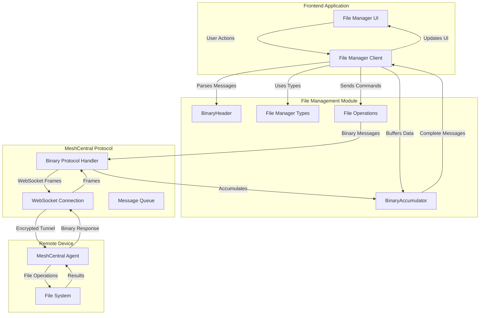
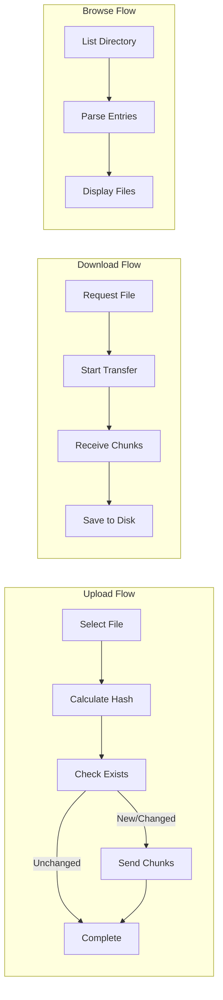
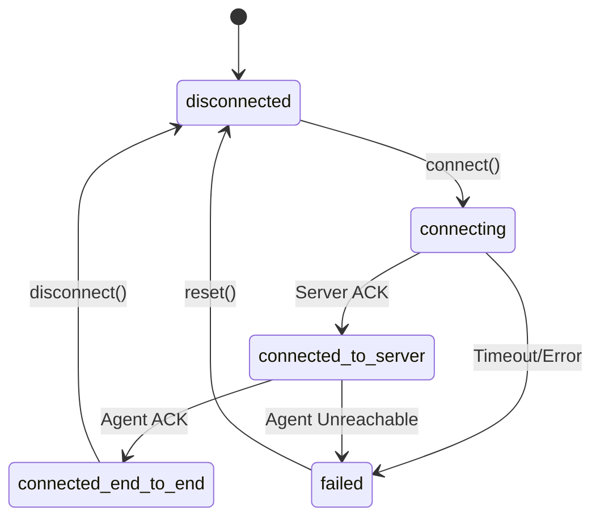
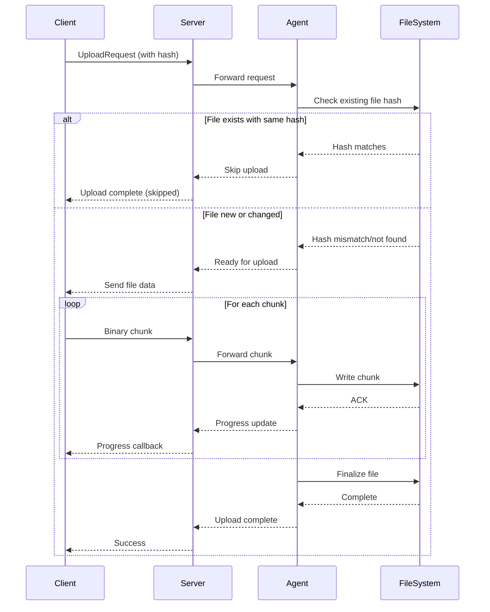
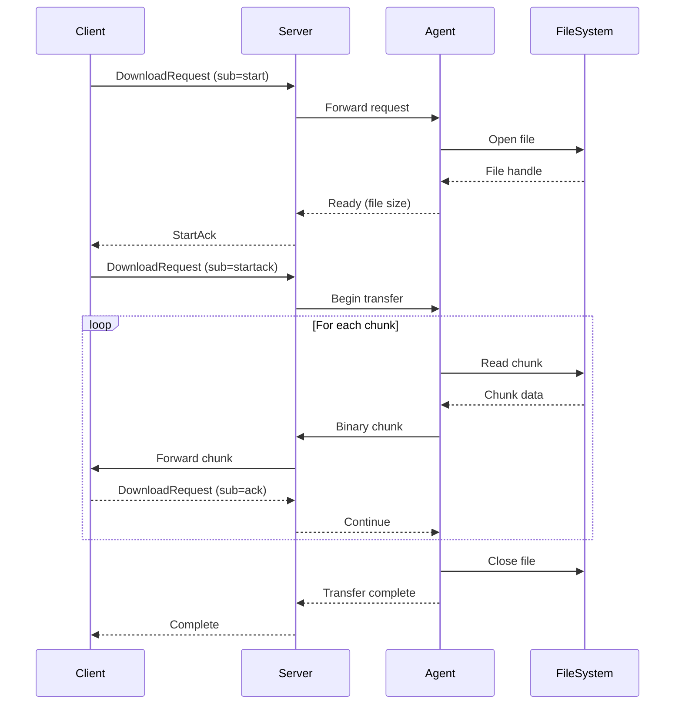
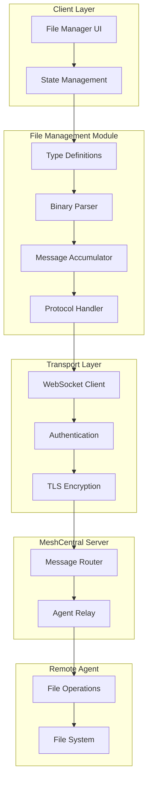

# MeshCentral File Management Module

## Overview

The **MeshCentral File Management** module provides a comprehensive TypeScript-based file system interface for remote device management through the MeshCentral protocol. This module enables secure file operations (browse, upload, download, delete, rename) on remote machines via WebSocket connections, supporting both direct agent connections and relay-based communication.

**Key Capabilities:**
- Remote file system browsing with directory listings
- Bidirectional file transfers (upload/download) with progress tracking
- File operations (create, delete, rename, move)
- Binary protocol handling with accumulator pattern for fragmented messages
- Hash-based upload optimization (skip unchanged files)
- Multi-file transfer queue management
- Search functionality across remote file systems
- Permission-based access control integration

**Related Modules:**
- [meshcentral_desktop_control](meshcentral_desktop_control.md) - Remote desktop control via MeshCentral
- [frontend_meshcentral](frontend_meshcentral.md) - Parent integration module
- [frontend_api_clients](frontend_api_clients.md) - API client infrastructure

---

## Architecture

### High-Level Component Structure



### Data Flow Architecture



---

## Core Components

### 1. BinaryHeader

**Purpose:** Parses binary message headers from MeshCentral protocol frames.

**Type Definition:**

```typescript
interface BinaryHeader {
  command: number      // Command type identifier
  size: number        // Total message size in bytes
  headerSize: number  // Size of header portion
}
```

**Responsibilities:**
- Extract command type from binary frames
- Determine message boundaries for fragmented data
- Validate header integrity
- Support both standard and jumbo frame formats

**Usage Pattern:**

```typescript
// Parse incoming binary frame
function parseBinaryHeader(data: Uint8Array): BinaryHeader {
  const view = new DataView(data.buffer)
  const command = view.getUint16(0, false)  // Big-endian
  const size = view.getUint16(2, false)
  
  return {
    command,
    size,
    headerSize: 4  // Standard header is 4 bytes
  }
}
```

**Command Types:**

| Command | Value | Description |
|---------|-------|-------------|
| `ls` | Directory listing response |
| `upload` | Upload file request |
| `uploadhash` | Upload with hash check |
| `download` | Download file request |
| `mkdir` | Create directory |
| `rm` | Delete file/directory |
| `rename` | Rename/move file |
| `search` | Search file system |

---

### 2. BinaryAccumulator

**Purpose:** Buffers fragmented binary messages until complete frames are received.

**Type Definition:**

```typescript
interface BinaryAccumulator {
  buffer: Uint8Array      // Accumulated data buffer
  expectedSize: number    // Expected total message size
  command: number         // Command type being accumulated
}
```

**Responsibilities:**
- Handle WebSocket frame fragmentation
- Accumulate partial messages across multiple frames
- Detect message completion
- Prevent buffer overflow attacks
- Support streaming large file transfers

**Implementation Pattern:**

```typescript
class FileMessageAccumulator {
  private accumulator: BinaryAccumulator | null = null
  private readonly maxBufferSize = 16 * 1024 * 1024  // 16MB limit
  
  processFrame(data: Uint8Array): Uint8Array[] {
    const completeMessages: Uint8Array[] = []
    
    // Initialize accumulator if needed
    if (!this.accumulator) {
      const header = this.parseHeader(data)
      this.accumulator = {
        buffer: new Uint8Array(header.size),
        expectedSize: header.size,
        command: header.command
      }
    }
    
    // Append data to buffer
    const remaining = this.accumulator.expectedSize - this.accumulator.buffer.length
    const toAppend = Math.min(remaining, data.length)
    this.accumulator.buffer.set(data.subarray(0, toAppend))
    
    // Check if message is complete
    if (this.accumulator.buffer.length >= this.accumulator.expectedSize) {
      completeMessages.push(this.accumulator.buffer)
      this.accumulator = null
    }
    
    return completeMessages
  }
}
```

**Buffer Management:**
- Maximum buffer size: 16MB (configurable)
- Automatic overflow protection
- Memory-efficient chunked processing
- Support for concurrent transfers

---

### 3. File Manager Types

**Purpose:** Comprehensive type definitions for file operations and protocol messages.

#### FileEntry

Represents a file or directory in the remote file system.

```typescript
interface FileEntry {
  n: string           // Name
  t: number          // Type: 1=Link, 2=Directory, 3=File
  s?: number          // Size in bytes
  d?: number          // Modified date (Unix timestamp)
  nx?: string        // Normalized key (server supplied)
  dt?: string        // Drive type (FIXED, REMOVABLE, etc.)
  path?: string      // Absolute path when supplied
  icon?: string      // Optional icon hint
}
```

**Type Values:**
- `1` - Symbolic link
- `2` - Directory
- `3` - Regular file

**Example:**

```typescript
const fileEntry: FileEntry = {
  n: "document.pdf",
  t: 3,
  s: 1048576,  // 1MB
  d: 1704067200,  // 2024-01-01 00:00:00 UTC
  path: "/home/user/documents/document.pdf"
}
```

#### DirectoryListing

Response containing directory contents.

```typescript
interface DirectoryListing {
  action: 'ls'
  reqid: string      // Request ID for correlation
  path: string       // Directory path
  dir: FileEntry[]   // Array of entries
}
```

#### FileOperationRequest

Generic file operation request structure.

```typescript
interface FileOperationRequest {
  action: string     // Operation type
  reqid: string      // Unique request ID
  path?: string      // Target path
  [key: string]: any // Additional operation-specific fields
}
```

**Common Operations:**

```typescript
// List directory
const listRequest: FileOperationRequest = {
  action: 'ls',
  reqid: 'req-001',
  path: '/home/user'
}

// Create directory
const mkdirRequest: FileOperationRequest = {
  action: 'mkdir',
  reqid: 'req-002',
  path: '/home/user/newfolder'
}

// Delete file
const deleteRequest: FileOperationRequest = {
  action: 'rm',
  reqid: 'req-003',
  path: '/home/user/oldfile.txt'
}

// Rename/move file
const renameRequest: FileOperationRequest = {
  action: 'rename',
  reqid: 'req-004',
  path: '/home/user/oldname.txt',
  newpath: '/home/user/newname.txt'
}
```

#### UploadRequest

File upload with optional hash-based optimization.

```typescript
interface UploadRequest {
  action: 'upload' | 'uploadhash'
  reqid: string
  path: string       // Destination directory
  name: string       // File name
  size?: number      // File size in bytes
  append?: boolean   // Append to existing file
  tag?: {
    h?: string      // SHA-256 hash
    s?: number      // Size
    skip?: boolean  // Skip if hash matches
  }
}
```

**Hash-Based Upload Example:**

```typescript
// Calculate file hash
const fileHash = await calculateSHA256(fileData)

// Send upload request with hash
const uploadRequest: UploadRequest = {
  action: 'uploadhash',
  reqid: 'upload-001',
  path: '/home/user/uploads',
  name: 'largefile.zip',
  size: fileData.length,
  tag: {
    h: fileHash,
    s: fileData.length,
    skip: true  // Skip if hash matches existing file
  }
}
```

#### DownloadRequest

File download request with flow control.

```typescript
interface DownloadRequest {
  action: 'download'
  sub: 'start' | 'startack' | 'ack' | 'cancel'
  id: string         // Transfer ID
  path: string       // File path to download
}
```

**Download Flow:**

```typescript
// 1. Start download
const startRequest: DownloadRequest = {
  action: 'download',
  sub: 'start',
  id: 'dl-001',
  path: '/home/user/file.zip'
}

// 2. Acknowledge start
const ackStart: DownloadRequest = {
  action: 'download',
  sub: 'startack',
  id: 'dl-001',
  path: '/home/user/file.zip'
}

// 3. Acknowledge each chunk
const ackChunk: DownloadRequest = {
  action: 'download',
  sub: 'ack',
  id: 'dl-001',
  path: '/home/user/file.zip'
}

// 4. Cancel if needed
const cancelRequest: DownloadRequest = {
  action: 'download',
  sub: 'cancel',
  id: 'dl-001',
  path: '/home/user/file.zip'
}
```

#### FileTransferProgress

Progress tracking for uploads and downloads.

```typescript
interface FileTransferProgress {
  file: string              // File name
  progress: number          // Percentage (0-100)
  bytesTransferred: number  // Bytes completed
  totalBytes: number        // Total file size
  type?: 'upload' | 'download'
}
```

**Usage Example:**

```typescript
function onTransferProgress(progress: FileTransferProgress) {
  console.log(`${progress.type}: ${progress.file}`)
  console.log(`Progress: ${progress.progress.toFixed(2)}%`)
  console.log(`${progress.bytesTransferred} / ${progress.totalBytes} bytes`)
  
  // Update UI progress bar
  updateProgressBar(progress.progress)
}
```

#### FileManagerOptions

Configuration for file manager client initialization.

```typescript
interface FileManagerOptions {
  nodeId?: string                    // Target device ID
  isRemote?: boolean                 // Remote vs local connection
  authCookie?: string                // Authentication cookie
  consent?: number                   // User consent flags
  controlClient?: MeshControlClient  // Shared control client
  domainPrefix?: string              // Multi-tenant domain prefix
  
  // Event callbacks
  onStateChange?: (state: FileConnectionState) => void
  onDirectoryChange?: (files: FileEntry[]) => void
  onTransferProgress?: (progress: FileTransferProgress) => void
  onServerCancelDownload?: (fileName: string, reason?: string) => void
  onError?: (error: Error) => void
  onSearchStart?: () => void
  onSearchResult?: (result: FileEntry, allResults: FileEntry[]) => void
  onSearchComplete?: (results: FileEntry[], cancelled?: boolean) => void
}
```

#### FileConnectionState

Connection state enumeration.

```typescript
type FileConnectionState = 
  | 'disconnected'
  | 'connecting'
  | 'connected_to_server'
  | 'connected_end_to_end'
  | 'failed'
```

**State Transitions:**



---

## Permission System

### MeshRights

File access permissions at the device/mesh level.

```typescript
const MeshRights = {
  SERVERFILES: 0x00000020,     // 32 - Server file access
  NOFILES: 0x00000400,         // 1024 - Block file access (negative permission)
} as const
```

**Permission Check:**

```typescript
function hasFileAccess(userRights: number): boolean {
  // Check if file access is explicitly blocked
  if (userRights & MeshRights.NOFILES) {
    return false
  }
  
  // Check if server file access is granted
  return (userRights & MeshRights.SERVERFILES) !== 0
}
```

### SiteRights

Site-level file access permissions.

```typescript
const SiteRights = {
  FILEACCESS: 0x00000008,       // 8 - Site-level file access
} as const
```

**Combined Permission Check:**

```typescript
function canAccessFiles(userRights: number, siteRights: number): boolean {
  // Must have site-level file access
  if (!(siteRights & SiteRights.FILEACCESS)) {
    return false
  }
  
  // Must not be blocked at mesh level
  if (userRights & MeshRights.NOFILES) {
    return false
  }
  
  // Must have server file access at mesh level
  return (userRights & MeshRights.SERVERFILES) !== 0
}
```

---

## Protocol Implementation

### Binary Message Format

MeshCentral file protocol uses big-endian binary messages:

```text
Standard Frame:
┌─────────────┬─────────────┬──────────────────┐
│ Command (2) │ Size (2)    │ Payload (N)      │
│ Big-endian  │ Big-endian  │ Variable length  │
└─────────────┴─────────────┴──────────────────┘

Jumbo Frame (for large transfers):
┌─────────────┬─────────────┬─────────────┬─────────────┬──────────────────┐
│ Cmd=27 (2)  │ Size=8 (2)  │ Reserved(1) │ JumboSize(3)│ Actual Payload   │
│ Big-endian  │ Big-endian  │ 0x00        │ Big-endian  │ Variable length  │
└─────────────┴─────────────┴─────────────┴─────────────┴──────────────────┘
```

### Message Parsing Example

```typescript
function parseMessage(data: Uint8Array): { command: number; payload: Uint8Array } {
  const view = new DataView(data.buffer)
  let command = view.getUint16(0, false)  // Big-endian
  let size = view.getUint16(2, false)
  let payloadOffset = 4
  
  // Check for jumbo frame
  if (command === 27 && size === 8) {
    // Jumbo frame format
    const jumboSize = (data[5] << 16) | (data[6] << 8) | data[7]
    command = view.getUint16(8, false)
    size = jumboSize
    payloadOffset = 10
  }
  
  const payload = data.subarray(payloadOffset, payloadOffset + size - payloadOffset)
  return { command, payload }
}
```

### File Transfer Protocol

#### Upload Flow



#### Download Flow



---

## Usage Examples

### Initialize File Manager

```typescript
import type { FileManagerOptions, FileConnectionState } from './file-manager-types'

const options: FileManagerOptions = {
  nodeId: 'node-abc123',
  isRemote: true,
  authCookie: 'session-token',
  consent: 0x00000020,  // File access consent
  
  onStateChange: (state: FileConnectionState) => {
    console.log(`Connection state: ${state}`)
    if (state === 'connected_end_to_end') {
      console.log('Ready for file operations')
    }
  },
  
  onDirectoryChange: (files) => {
    console.log(`Directory contains ${files.length} items`)
    files.forEach(file => {
      const type = file.t === 2 ? 'DIR' : 'FILE'
      console.log(`${type}: ${file.n} (${file.s} bytes)`)
    })
  },
  
  onTransferProgress: (progress) => {
    console.log(`${progress.file}: ${progress.progress.toFixed(1)}%`)
  },
  
  onError: (error) => {
    console.error('File operation error:', error)
  }
}

const fileManager = new FileManager(options)
```

### Browse Directory

```typescript
async function browseDirectory(path: string) {
  const request: FileOperationRequest = {
    action: 'ls',
    reqid: generateRequestId(),
    path: path
  }
  
  await fileManager.sendRequest(request)
  
  // Response handled by onDirectoryChange callback
}

// Example: List home directory
await browseDirectory('/home/user')
```

### Upload File with Hash Check

```typescript
async function uploadFileWithHash(
  localFile: File,
  remotePath: string
) {
  // Calculate file hash
  const arrayBuffer = await localFile.arrayBuffer()
  const hashBuffer = await crypto.subtle.digest('SHA-256', arrayBuffer)
  const hashArray = Array.from(new Uint8Array(hashBuffer))
  const hashHex = hashArray.map(b => b.toString(16).padStart(2, '0')).join('')
  
  // Send upload request with hash
  const request: UploadRequest = {
    action: 'uploadhash',
    reqid: generateRequestId(),
    path: remotePath,
    name: localFile.name,
    size: localFile.size,
    tag: {
      h: hashHex,
      s: localFile.size,
      skip: true  // Skip if hash matches
    }
  }
  
  await fileManager.sendRequest(request)
  
  // If server responds with "send", upload file data
  // If server responds with "skip", file already exists
}
```

### Download File

```typescript
async function downloadFile(remotePath: string, fileName: string) {
  const transferId = generateTransferId()
  
  // Start download
  const startRequest: DownloadRequest = {
    action: 'download',
    sub: 'start',
    id: transferId,
    path: remotePath
  }
  
  await fileManager.sendRequest(startRequest)
  
  // Acknowledge start (handled by client)
  const ackStart: DownloadRequest = {
    action: 'download',
    sub: 'startack',
    id: transferId,
    path: remotePath
  }
  
  await fileManager.sendRequest(ackStart)
  
  // Chunks received via binary frames
  // Progress tracked via onTransferProgress callback
  
  // Save to local file system when complete
}
```

### Search File System

```typescript
async function searchFiles(searchPath: string, pattern: string) {
  const request: FileOperationRequest = {
    action: 'search',
    reqid: generateRequestId(),
    path: searchPath,
    pattern: pattern
  }
  
  await fileManager.sendRequest(request)
  
  // Results handled by callbacks:
  // - onSearchStart: Search initiated
  // - onSearchResult: Each result found
  // - onSearchComplete: Search finished
}

// Example: Search for PDF files
await searchFiles('/home/user', '*.pdf')
```

### Create Directory

```typescript
async function createDirectory(path: string) {
  const request: FileOperationRequest = {
    action: 'mkdir',
    reqid: generateRequestId(),
    path: path
  }
  
  await fileManager.sendRequest(request)
}
```

### Delete File or Directory

```typescript
async function deleteItem(path: string) {
  const request: FileOperationRequest = {
    action: 'rm',
    reqid: generateRequestId(),
    path: path,
    rec: 1  // Recursive delete for directories
  }
  
  await fileManager.sendRequest(request)
}
```

### Rename or Move File

```typescript
async function renameFile(oldPath: string, newPath: string) {
  const request: FileOperationRequest = {
    action: 'rename',
    reqid: generateRequestId(),
    path: oldPath,
    newpath: newPath
  }
  
  await fileManager.sendRequest(request)
}
```

---

## Integration with Desktop Control

The file management module shares infrastructure with the desktop control module:

```typescript
import { MeshControlClient } from './meshcentral-control'
import type { FileManagerOptions } from './file-manager-types'

// Shared control client for both desktop and file operations
const controlClient = new MeshControlClient({
  nodeId: 'node-abc123',
  authCookie: 'session-token'
})

// Initialize file manager with shared client
const fileManager = new FileManager({
  controlClient: controlClient,
  onStateChange: (state) => {
    console.log(`File connection: ${state}`)
  }
})

// Both desktop and file operations use same WebSocket connection
```

**Benefits of Shared Client:**
- Single WebSocket connection for multiple protocols
- Reduced connection overhead
- Consistent authentication and session management
- Coordinated state management

---

## Error Handling

### Common Error Scenarios

```typescript
interface FileOperationResponse {
  action: string
  reqid?: string
  result?: string
  error?: string
  [key: string]: any
}

function handleFileResponse(response: FileOperationResponse) {
  if (response.error) {
    switch (response.error) {
      case 'PERMISSION_DENIED':
        console.error('Insufficient permissions for file operation')
        break
      
      case 'FILE_NOT_FOUND':
        console.error('File or directory not found')
        break
      
      case 'DISK_FULL':
        console.error('Insufficient disk space')
        break
      
      case 'PATH_TOO_LONG':
        console.error('File path exceeds maximum length')
        break
      
      case 'INVALID_NAME':
        console.error('Invalid file or directory name')
        break
      
      default:
        console.error(`File operation error: ${response.error}`)
    }
  }
}
```

### Connection Error Handling

```typescript
const fileManager = new FileManager({
  onStateChange: (state) => {
    if (state === 'failed') {
      console.error('File connection failed')
      // Attempt reconnection
      setTimeout(() => fileManager.reconnect(), 5000)
    }
  },
  
  onError: (error) => {
    console.error('File manager error:', error)
    
    // Log error details
    if (error.message.includes('timeout')) {
      console.error('Operation timed out - check network connection')
    } else if (error.message.includes('unauthorized')) {
      console.error('Authentication failed - refresh session')
    }
  }
})
```

### Transfer Error Recovery

```typescript
class FileTransferManager {
  private activeTransfers = new Map<string, TransferState>()
  
  async uploadWithRetry(
    file: File,
    remotePath: string,
    maxRetries: number = 3
  ) {
    let attempt = 0
    
    while (attempt < maxRetries) {
      try {
        await this.uploadFile(file, remotePath)
        return  // Success
      } catch (error) {
        attempt++
        console.warn(`Upload attempt ${attempt} failed:`, error)
        
        if (attempt < maxRetries) {
          // Exponential backoff
          const delay = Math.pow(2, attempt) * 1000
          await new Promise(resolve => setTimeout(resolve, delay))
        } else {
          throw new Error(`Upload failed after ${maxRetries} attempts`)
        }
      }
    }
  }
}
```

---

## Performance Optimization

### Chunked Transfer Strategy

```typescript
const CHUNK_SIZE = 64 * 1024  // 64KB chunks

async function uploadLargeFile(file: File, remotePath: string) {
  const totalChunks = Math.ceil(file.size / CHUNK_SIZE)
  
  for (let i = 0; i < totalChunks; i++) {
    const start = i * CHUNK_SIZE
    const end = Math.min(start + CHUNK_SIZE, file.size)
    const chunk = file.slice(start, end)
    
    await uploadChunk(chunk, i, totalChunks)
    
    // Update progress
    const progress = ((i + 1) / totalChunks) * 100
    onProgress(progress)
  }
}
```

### Concurrent Transfer Management

```typescript
class TransferQueue {
  private queue: TransferTask[] = []
  private active = 0
  private readonly maxConcurrent = 3
  
  async addTransfer(task: TransferTask) {
    this.queue.push(task)
    this.processQueue()
  }
  
  private async processQueue() {
    while (this.active < this.maxConcurrent && this.queue.length > 0) {
      const task = this.queue.shift()!
      this.active++
      
      try {
        await task.execute()
      } finally {
        this.active--
        this.processQueue()
      }
    }
  }
}
```

### Memory-Efficient Streaming

```typescript
class StreamingFileReader {
  async *readFileInChunks(file: File, chunkSize: number) {
    let offset = 0
    
    while (offset < file.size) {
      const chunk = file.slice(offset, offset + chunkSize)
      const arrayBuffer = await chunk.arrayBuffer()
      yield new Uint8Array(arrayBuffer)
      offset += chunkSize
    }
  }
}

// Usage
const reader = new StreamingFileReader()
for await (const chunk of reader.readFileInChunks(file, CHUNK_SIZE)) {
  await sendChunk(chunk)
}
```

---

## Security Considerations

### Path Traversal Prevention

```typescript
function sanitizePath(path: string): string {
  // Remove path traversal attempts
  const normalized = path.replace(/\.\./g, '')
  
  // Ensure absolute path
  if (!normalized.startsWith('/')) {
    throw new Error('Path must be absolute')
  }
  
  // Remove duplicate slashes
  return normalized.replace(/\/+/g, '/')
}
```

### File Size Limits

```typescript
const MAX_FILE_SIZE = 2 * 1024 * 1024 * 1024  // 2GB

function validateFileSize(size: number) {
  if (size > MAX_FILE_SIZE) {
    throw new Error(`File size exceeds maximum allowed (${MAX_FILE_SIZE} bytes)`)
  }
}
```

### Permission Validation

```typescript
function validateFileOperation(
  operation: string,
  userRights: number,
  siteRights: number
) {
  // Check site-level access
  if (!(siteRights & SiteRights.FILEACCESS)) {
    throw new Error('File access not permitted at site level')
  }
  
  // Check mesh-level access
  if (userRights & MeshRights.NOFILES) {
    throw new Error('File access explicitly blocked')
  }
  
  if (!(userRights & MeshRights.SERVERFILES)) {
    throw new Error('Server file access not granted')
  }
  
  // Operation-specific checks
  if (operation === 'upload' || operation === 'mkdir' || operation === 'rm') {
    // Write operations require additional permissions
    // (implementation depends on extended permission model)
  }
}
```

---

## Testing

### Unit Test Example

```typescript
import { describe, it, expect } from 'vitest'
import type { BinaryHeader, BinaryAccumulator } from './file-manager-types'

describe('BinaryHeader', () => {
  it('should parse standard frame header', () => {
    const data = new Uint8Array([0x00, 0x03, 0x00, 0x10])  // cmd=3, size=16
    const header = parseBinaryHeader(data)
    
    expect(header.command).toBe(3)
    expect(header.size).toBe(16)
    expect(header.headerSize).toBe(4)
  })
  
  it('should parse jumbo frame header', () => {
    const data = new Uint8Array([
      0x00, 0x1B,  // cmd=27 (jumbo)
      0x00, 0x08,  // size=8
      0x00,        // reserved
      0x00, 0x10, 0x00,  // jumbo size=4096
      0x00, 0x03   // actual command=3
    ])
    const header = parseBinaryHeader(data)
    
    expect(header.command).toBe(3)
    expect(header.size).toBe(4096)
  })
})

describe('BinaryAccumulator', () => {
  it('should accumulate fragmented messages', () => {
    const accumulator: BinaryAccumulator = {
      buffer: new Uint8Array(100),
      expectedSize: 100,
      command: 3
    }
    
    // Simulate receiving data in chunks
    const chunk1 = new Uint8Array(50)
    const chunk2 = new Uint8Array(50)
    
    // Process chunks
    // ... accumulation logic
    
    expect(accumulator.buffer.length).toBe(100)
  })
})
```

### Integration Test Example

```typescript
describe('File Manager Integration', () => {
  it('should list directory contents', async () => {
    const fileManager = new FileManager({
      nodeId: 'test-node',
      authCookie: 'test-cookie'
    })
    
    const files = await fileManager.listDirectory('/home/user')
    
    expect(files).toBeInstanceOf(Array)
    expect(files.length).toBeGreaterThan(0)
    expect(files[0]).toHaveProperty('n')
    expect(files[0]).toHaveProperty('t')
  })
  
  it('should upload file successfully', async () => {
    const fileManager = new FileManager({
      nodeId: 'test-node',
      authCookie: 'test-cookie'
    })
    
    const testFile = new File(['test content'], 'test.txt')
    const result = await fileManager.uploadFile(testFile, '/tmp')
    
    expect(result.success).toBe(true)
  })
})
```

---

## Troubleshooting

### Common Issues

#### Issue: Files not appearing in directory listing

**Symptoms:**
- Directory listing returns empty array
- Expected files are missing

**Solutions:**
1. Check file permissions on remote system
2. Verify path is correct (case-sensitive on Linux)
3. Ensure user has read access to directory
4. Check for hidden files (may require special flag)

```typescript
// Request with show hidden files flag
const request: FileOperationRequest = {
  action: 'ls',
  reqid: generateRequestId(),
  path: '/home/user',
  showhidden: 1  // Show hidden files
}
```

#### Issue: Upload fails with "Permission Denied"

**Symptoms:**
- Upload request returns error
- File not created on remote system

**Solutions:**
1. Verify user has write permissions to target directory
2. Check disk space availability
3. Ensure file name is valid for target OS
4. Verify MeshRights.SERVERFILES permission is granted

```typescript
// Check permissions before upload
if (!(userRights & MeshRights.SERVERFILES)) {
  throw new Error('Server file access not granted')
}
```

#### Issue: Download stalls or times out

**Symptoms:**
- Download starts but never completes
- Progress stops at certain percentage

**Solutions:**
1. Check network connectivity
2. Verify file is not locked by another process
3. Increase timeout values
4. Implement retry logic with exponential backoff

```typescript
const downloadWithTimeout = async (path: string, timeoutMs: number) => {
  const timeoutPromise = new Promise((_, reject) => {
    setTimeout(() => reject(new Error('Download timeout')), timeoutMs)
  })
  
  const downloadPromise = fileManager.downloadFile(path)
  
  return Promise.race([downloadPromise, timeoutPromise])
}
```

#### Issue: Binary accumulator buffer overflow

**Symptoms:**
- Memory usage increases rapidly
- Application crashes with out-of-memory error

**Solutions:**
1. Implement buffer size limits
2. Clear accumulator on connection reset
3. Add overflow detection and recovery

```typescript
const MAX_BUFFER_SIZE = 16 * 1024 * 1024  // 16MB

if (accumulator.buffer.length > MAX_BUFFER_SIZE) {
  console.error('Buffer overflow detected - resetting accumulator')
  accumulator = null
  // Reconnect or request retransmission
}
```

---

## Related Documentation

- **[meshcentral_desktop_control](meshcentral_desktop_control.md)** - Remote desktop control implementation
- **[frontend_api_clients](frontend_api_clients.md)** - API client infrastructure and patterns
- **[security_core](security_core.md)** - Authentication and authorization framework
- **[gateway_service](gateway_service.md)** - WebSocket gateway and routing

---

## References

### External Resources

- **MeshCentral Protocol Documentation:** [https://github.com/Ylianst/MeshCentral](https://github.com/Ylianst/MeshCentral)
- **WebSocket Binary Frames:** [MDN WebSocket API](https://developer.mozilla.org/en-US/docs/Web/API/WebSocket)
- **File API:** [MDN File API](https://developer.mozilla.org/en-US/docs/Web/API/File)
- **Crypto API (SHA-256):** [MDN SubtleCrypto](https://developer.mozilla.org/en-US/docs/Web/API/SubtleCrypto)

### Internal Architecture



---

## Changelog

### Version 1.0.0 (Current)
- Initial implementation of file management types
- Binary header and accumulator support
- Complete file operation type definitions
- Permission system integration
- Transfer progress tracking
- Search functionality support

### Planned Features
- Clipboard integration for file paths
- Drag-and-drop upload support
- Thumbnail preview for images
- Archive extraction (zip, tar)
- File comparison and sync
- Batch operations optimization

---

**For questions or issues, please consult the OpenMSP Slack community: [https://www.openmsp.ai/](https://www.openmsp.ai/)**
