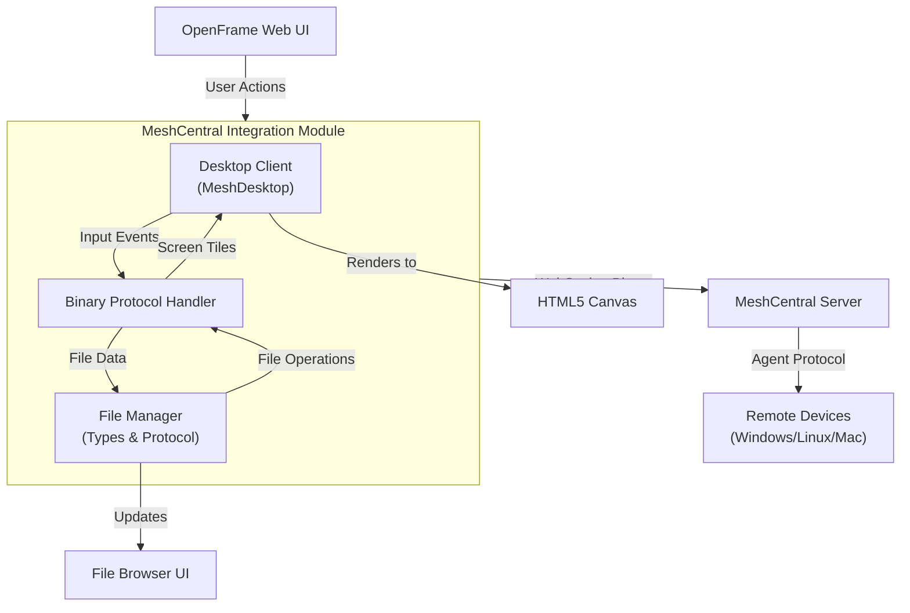
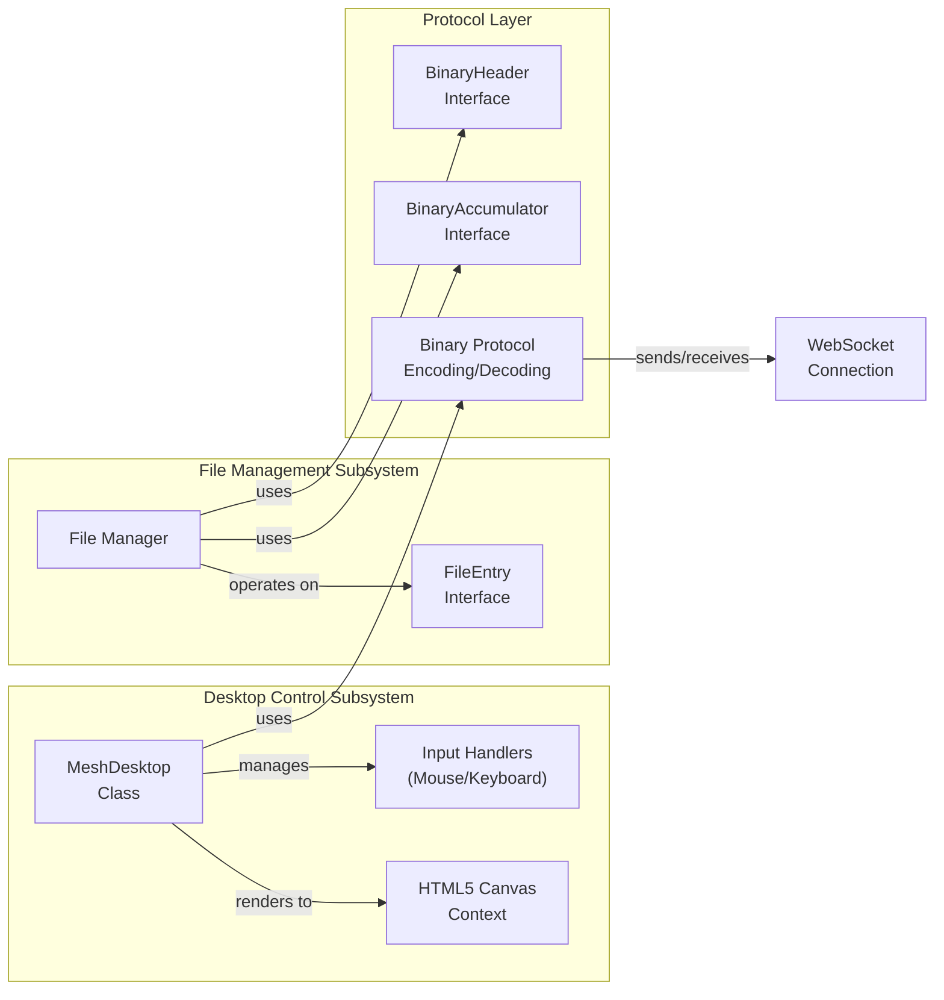
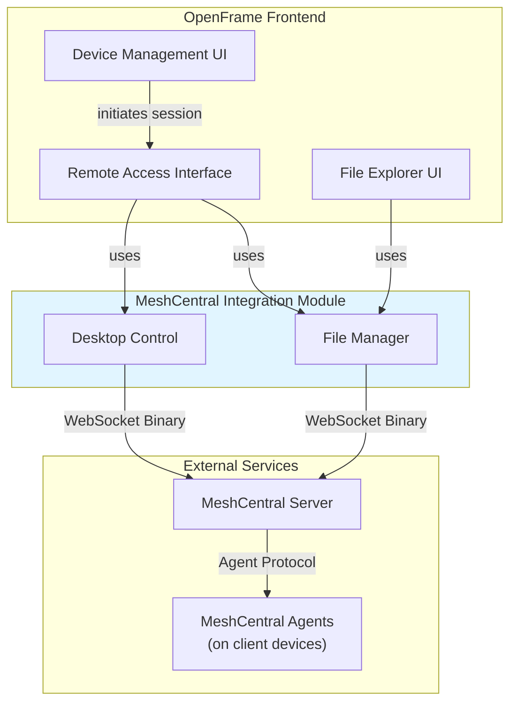

# MeshCentral Integration Module

## Overview

The **MeshCentral Integration Module** provides a comprehensive TypeScript-based client implementation for integrating with MeshCentral's remote desktop and file management capabilities within the OpenFrame platform. This module enables browser-based remote desktop control, file transfer operations, and multi-display management through WebSocket communication with MeshCentral servers.

MeshCentral is an open-source remote management solution that OpenFrame leverages to provide technicians with powerful remote access capabilities for managing client devices. This integration module acts as the frontend bridge between OpenFrame's web interface and MeshCentral's binary protocol.

## Purpose

The MeshCentral integration module serves several critical functions:

1. **Remote Desktop Control**: Provides full keyboard, mouse, and display control over remote machines through a browser-based canvas interface
2. **File Management**: Enables file browsing, upload, download, and manipulation on remote systems
3. **Multi-Display Support**: Handles multiple monitor configurations and display switching
4. **Binary Protocol Implementation**: Implements MeshCentral's proprietary binary protocol for efficient data transmission
5. **Real-time Streaming**: Manages JPEG tile-based screen streaming with optimized decoding and rendering

## Architecture Overview

The module is structured around two primary subsystems that work together to provide comprehensive remote management capabilities:



### Key Architectural Components

1. **Desktop Control System**: Handles real-time remote desktop streaming and input
2. **File Management System**: Manages file operations and transfers
3. **Binary Protocol Layer**: Encodes/decodes MeshCentral's binary message format
4. **WebSocket Transport**: Maintains persistent connection to MeshCentral server

## Module Structure

The MeshCentral integration consists of the following core components:

### Core Components

| Component | File | Purpose |
|-----------|------|---------|
| **MeshDesktop** | `meshcentral-desktop.ts` | Remote desktop control and rendering engine |
| **BinaryHeader** | `file-manager-types.ts` | Binary message header structure |
| **BinaryAccumulator** | `file-manager-types.ts` | Binary data buffering and accumulation |
| **FileManagerOptions** | `file-manager-types.ts` | File manager configuration interface |
| **FileEntry** | `file-manager-types.ts` | Remote file system entry representation |

### Component Relationships



## Sub-Modules

The MeshCentral integration is organized into two primary sub-modules:

### 1. Desktop Control Subsystem

**Purpose**: Provides browser-based remote desktop control with full input/output capabilities.

**Key Features**:
- Real-time screen streaming using JPEG tile compression
- Full keyboard and mouse input handling
- Multi-display support and switching
- Special key combinations (Ctrl+Alt+Del, Win+L, etc.)
- View-only mode support
- Configurable mouse button swapping

**Documentation**: See [meshcentral_desktop_control.md](meshcentral_desktop_control.md)

### 2. File Management Subsystem

**Purpose**: Enables remote file system operations through binary protocol communication.

**Key Features**:
- Directory browsing and navigation
- File upload/download with progress tracking
- File operations (rename, delete, create directory)
- Binary message framing and accumulation
- Transfer cancellation and error handling
- Hash-based upload optimization

**Documentation**: See [meshcentral_file_management.md](meshcentral_file_management.md)

## Integration with OpenFrame

The MeshCentral integration module fits into the broader OpenFrame ecosystem as follows:



### Related Modules

- **[Frontend Main](frontend_main.md)**: Parent module containing the main OpenFrame web application
- **[Frontend API Clients](frontend_api_clients.md)**: API client implementations for backend communication
- **[Frontend Device Management](frontend_device_management.md)**: Device listing and management interface
- **[Client Service](client_service.md)**: Backend service managing device connections and agent registration

## Protocol Overview

### MeshCentral Binary Protocol

The MeshCentral protocol uses a binary message format for efficient data transmission:

#### Standard Message Format

```text
Bytes 0-1: Command (uint16, big-endian)
Bytes 2-3: Total Size (uint16, big-endian)
Bytes 4+:  Payload data
```

#### Jumbo Message Format

For messages larger than 65KB:

```text
Bytes 0-1: Command 27 (0x001B) - Jumbo indicator
Bytes 2-3: Size 8 (0x0008)
Bytes 4:   Reserved
Bytes 5-7: Jumbo Size (24-bit, big-endian)
Bytes 8-9: Actual Command (uint16, big-endian)
Bytes 10+: Payload data
```

### Desktop Protocol Commands

| Command | Hex | Purpose | Direction |
|---------|-----|---------|-----------|
| KVM_INIT | 0x000E | Initialize desktop session | Client → Server |
| COMPRESSION | 0x0005 | Set compression settings | Client → Server |
| PAUSE | 0x0008 | Pause/unpause stream | Client → Server |
| REFRESH | 0x0006 | Request screen refresh | Client → Server |
| SCREEN_SIZE | 0x0007 | Screen dimensions | Server → Client |
| TILE | 0x0003 | JPEG screen tile | Server → Client |
| MNG_KVM_KEY | 0x0001 | Keyboard event | Client → Server |
| MOUSE | 0x0002 | Mouse event | Client → Server |
| CTRLALTDEL | 0x000A | Ctrl+Alt+Del | Client → Server |
| DISPLAY_LIST | 0x000B | Request/receive display list | Bidirectional |
| SWITCH_DISPLAY | 0x000C | Switch active display | Client → Server |
| DISPLAY_LOCATION | 0x0052 | Display position info | Server → Client |

### File Protocol Commands

| Command | Purpose | Direction |
|---------|---------|-----------|
| `ls` | List directory contents | Client → Server |
| `upload` | Upload file | Client → Server |
| `uploadhash` | Upload with hash check | Client → Server |
| `download` | Download file | Bidirectional |
| `rename` | Rename file/directory | Client → Server |
| `delete` | Delete file/directory | Client → Server |
| `mkdir` | Create directory | Client → Server |

## Key Features

### Desktop Control Features

#### 1. Input Handling

- **Mouse Events**: Move, click, double-click, wheel, button mapping
- **Keyboard Events**: Full keyboard support with virtual key codes
- **Extended Keys**: Proper handling of extended scan codes (arrows, numpad, etc.)
- **Key State Tracking**: Maintains pressed key state to handle window blur events
- **Special Combinations**: Pre-defined sequences for common shortcuts

#### 2. Display Management

- **Multi-Monitor Support**: Detects and switches between multiple displays
- **Display Information**: Tracks position, size, and primary display
- **Dynamic Switching**: Seamless switching between displays with pause/unpause
- **All Displays View**: Support for viewing all monitors simultaneously

#### 3. Screen Rendering

- **Tile-Based Streaming**: Receives screen updates as JPEG tiles
- **Concurrent Decoding**: Parallel JPEG decoding (max 3 concurrent)
- **Backpressure Management**: Queue limiting to prevent memory overflow
- **Efficient Drawing**: RequestAnimationFrame-based rendering
- **ImageBitmap Support**: Uses modern browser APIs when available

#### 4. Configuration Options

- **View-Only Mode**: Disable input for observation-only sessions
- **Mouse Button Swapping**: Swap left/right buttons for left-handed users
- **Remote Keyboard Map**: Use remote system's keyboard layout
- **Compression Settings**: Configurable JPEG quality and scaling
- **Frame Rate Control**: Adjustable frame timing

### File Management Features

#### 1. File Operations

- **Directory Listing**: Browse remote file systems
- **File Upload**: Transfer files to remote system with progress tracking
- **File Download**: Retrieve files from remote system
- **Hash-Based Upload**: Skip unchanged files using hash comparison
- **Batch Operations**: Multiple file operations in sequence

#### 2. Binary Protocol Handling

- **Message Framing**: Proper handling of variable-length messages
- **Buffer Accumulation**: Handles partial message reception
- **Jumbo Message Support**: Processes messages larger than 64KB
- **Error Recovery**: Graceful handling of protocol errors

#### 3. Transfer Management

- **Progress Tracking**: Real-time upload/download progress
- **Cancellation**: Abort transfers in progress
- **Resume Support**: Continue interrupted transfers (via hash check)
- **Error Handling**: Detailed error reporting and recovery

## Usage Examples

### Desktop Control Example

```typescript
import { MeshDesktop } from './lib/meshcentral/meshcentral-desktop'

// Create desktop instance
const desktop = new MeshDesktop()

// Attach to canvas element
const canvas = document.getElementById('remote-desktop') as HTMLCanvasElement
desktop.attach(canvas)

// Set up WebSocket sender
desktop.setSender((data: Uint8Array) => {
  websocket.send(data)
})

// Handle incoming binary frames
websocket.onmessage = (event) => {
  const data = new Uint8Array(event.data)
  desktop.onBinaryFrame(data)
}

// Enable view-only mode
desktop.setViewOnly(true)

// Send Ctrl+Alt+Del
desktop.sendCtrlAltDel()

// Send custom key combo
desktop.sendKeyCombo('win+l') // Lock Windows

// Handle display list changes
desktop.onDisplayListChange((displays) => {
  console.log('Available displays:', displays)
  // Update UI with display options
})

// Switch to second display
desktop.switchDisplay(1)

// Clean up
desktop.detach()
```

### File Manager Example

```typescript
import type { 
  FileManagerOptions, 
  FileEntry, 
  DirectoryListing 
} from './lib/meshcentral/file-manager-types'

// Configure file manager
const options: FileManagerOptions = {
  nodeId: 'device-node-id',
  isRemote: true,
  authCookie: 'session-cookie',
  onDirectoryChange: (files: FileEntry[]) => {
    console.log('Directory contents:', files)
    updateFileList(files)
  },
  onTransferProgress: (progress) => {
    console.log(`${progress.file}: ${progress.progress}%`)
    updateProgressBar(progress)
  },
  onError: (error) => {
    console.error('File operation error:', error)
  }
}

// List directory
const listRequest = {
  action: 'ls',
  reqid: generateRequestId(),
  path: '/home/user/documents'
}
sendFileCommand(listRequest)

// Upload file
const uploadRequest = {
  action: 'upload',
  reqid: generateRequestId(),
  path: '/home/user/documents',
  name: 'report.pdf',
  size: fileData.byteLength
}
sendFileCommand(uploadRequest)
// Follow with binary file data

// Download file
const downloadRequest = {
  action: 'download',
  sub: 'start',
  id: generateRequestId(),
  path: '/home/user/documents/report.pdf'
}
sendFileCommand(downloadRequest)
```

## Performance Considerations

### Desktop Streaming

1. **Tile Queue Management**: Limited to 300 tiles to prevent memory exhaustion
2. **Concurrent Decoding**: Maximum 3 parallel JPEG decodes to balance CPU usage
3. **Draw Scheduling**: Uses `requestAnimationFrame` for optimal rendering
4. **Buffer Limits**: 16MB maximum accumulation buffer to prevent memory leaks
5. **Bitmap Cleanup**: Proper disposal of ImageBitmap objects after rendering

### File Transfers

1. **Chunked Transfers**: Large files transferred in manageable chunks
2. **Hash Optimization**: Skip uploading unchanged files using hash comparison
3. **Progress Throttling**: Limit progress update frequency to reduce UI overhead
4. **Binary Accumulation**: Efficient buffer management for partial messages

## Security Considerations

### Authentication

- **Session Cookies**: Uses MeshCentral authentication cookies
- **Node Authorization**: Validates access rights to specific devices
- **Consent Mechanism**: Supports user consent requirements for remote access

### Data Protection

- **WebSocket Encryption**: All communication over WSS (WebSocket Secure)
- **Binary Protocol**: Reduces attack surface compared to text-based protocols
- **Input Validation**: Validates all incoming binary messages
- **Resource Limits**: Prevents memory exhaustion attacks

### Permission Model

The module respects MeshCentral's permission system:

```typescript
export const MeshRights = {
  SERVERFILES: 0x00000020,     // 32 - Server file access
  NOFILES: 0x00000400,         // 1024 - Block file access
} as const

export const SiteRights = {
  FILEACCESS: 0x00000008,       // 8 - Site-level file access
} as const
```

## Error Handling

### Desktop Control Errors

- **Connection Loss**: Graceful handling of WebSocket disconnection
- **Decode Failures**: Fallback to HTMLImageElement if ImageBitmap fails
- **Invalid Frames**: Silently ignore malformed binary messages
- **Canvas Errors**: Catch and ignore drawing errors

### File Operation Errors

- **Transfer Failures**: Report errors via callback with detailed messages
- **Protocol Errors**: Handle malformed responses gracefully
- **Permission Denied**: Surface access control errors to user
- **Network Timeouts**: Implement retry logic for transient failures

## Browser Compatibility

### Required Features

- **WebSocket API**: For binary communication
- **Canvas 2D Context**: For screen rendering
- **Typed Arrays**: For binary data manipulation
- **Blob API**: For file handling
- **ImageBitmap API**: Preferred for JPEG decoding (fallback available)

### Tested Browsers

- Chrome/Edge 90+
- Firefox 88+
- Safari 14+

## Future Enhancements

### Planned Features

1. **Audio Streaming**: Add support for remote audio
2. **Clipboard Sync**: Bidirectional clipboard synchronization
3. **File Drag-and-Drop**: Drag files from local to remote system
4. **Video Codec Support**: H.264/VP9 for better compression
5. **Touch Input**: Support for touch-enabled devices
6. **Recording**: Session recording and playback
7. **Bandwidth Optimization**: Adaptive quality based on connection speed

### Performance Improvements

1. **WebAssembly Decoder**: Faster JPEG decoding using WASM
2. **WebGL Rendering**: Hardware-accelerated screen rendering
3. **Delta Compression**: Only transmit changed screen regions
4. **Predictive Prefetch**: Anticipate user actions for lower latency

## Troubleshooting

### Common Issues

#### Desktop Not Displaying

**Symptoms**: Black screen or no updates

**Solutions**:
1. Check WebSocket connection is established
2. Verify `setSender()` was called with valid function
3. Ensure `onBinaryFrame()` is receiving data
4. Check browser console for decode errors
5. Verify MeshCentral server is sending desktop stream

#### Input Not Working

**Symptoms**: Keyboard/mouse events not reaching remote system

**Solutions**:
1. Verify view-only mode is disabled: `setViewOnly(false)`
2. Check canvas has focus
3. Ensure WebSocket sender is functioning
4. Verify remote system is accepting input
5. Check for JavaScript errors in console

#### File Transfers Failing

**Symptoms**: Uploads/downloads not completing

**Solutions**:
1. Verify file permissions on remote system
2. Check available disk space
3. Ensure binary message framing is correct
4. Verify request IDs are unique
5. Check for network interruptions

#### Performance Issues

**Symptoms**: Laggy or choppy desktop streaming

**Solutions**:
1. Reduce JPEG quality setting (lower bandwidth)
2. Increase frame timer (reduce frame rate)
3. Check network latency and bandwidth
4. Reduce screen resolution on remote system
5. Close other bandwidth-intensive applications

## Related Documentation

- **[MeshCentral Desktop Control](meshcentral_desktop_control.md)**: Detailed desktop control implementation
- **[MeshCentral File Management](meshcentral_file_management.md)**: File operations and protocol details
- **[Frontend Main](frontend_main.md)**: Parent frontend application module
- **[Frontend API Clients](frontend_api_clients.md)**: Backend API integration
- **[Client Service](client_service.md)**: Backend device management service

## External Resources

- **MeshCentral Official**: https://meshcentral.com/
- **MeshCentral GitHub**: https://github.com/Ylianst/MeshCentral
- **MeshCentral Protocol Documentation**: https://github.com/Ylianst/MeshCentral/tree/master/docs
- **OpenFrame Platform**: https://openframe.ai
- **Flamingo MSP**: https://flamingo.run

## Contributing

When contributing to the MeshCentral integration module:

1. **Test Across Browsers**: Verify functionality in Chrome, Firefox, and Safari
2. **Handle Binary Protocol Carefully**: Ensure proper byte ordering (big-endian)
3. **Memory Management**: Always clean up resources (ImageBitmap, Blob URLs)
4. **Error Handling**: Never let protocol errors crash the application
5. **Performance Testing**: Test with high-resolution displays and slow networks
6. **Documentation**: Update protocol command tables when adding features

## Support

For issues or questions about the MeshCentral integration:

- **OpenMSP Slack Community**: https://www.openmsp.ai/
- **Join Slack**: https://join.slack.com/t/openmsp/shared_invite/zt-36bl7mx0h-3~U2nFH6nqHqoTPXMaHEHA

---

**Last Updated**: 2024  
**Module Version**: 1.0  
**OpenFrame Version**: Latest
