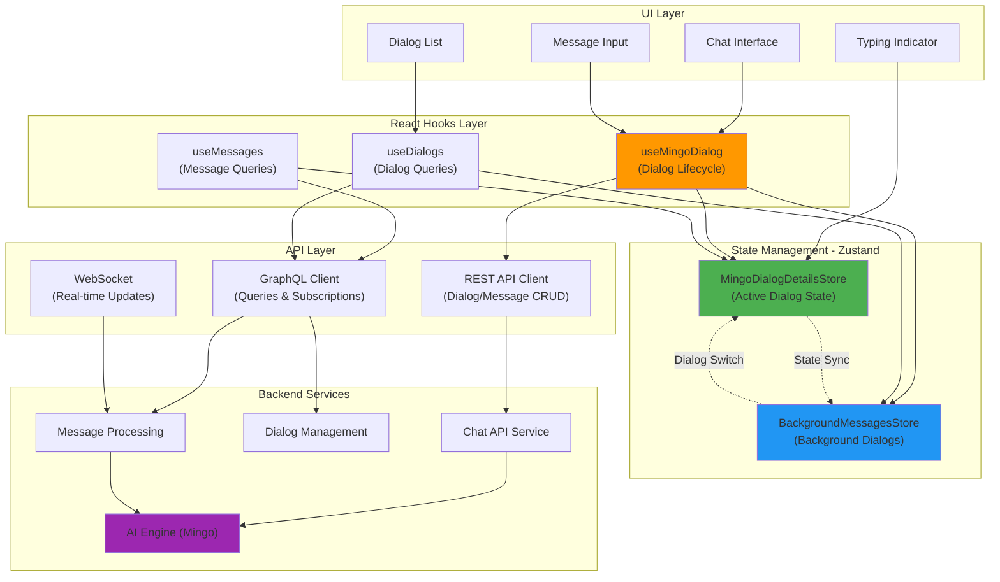
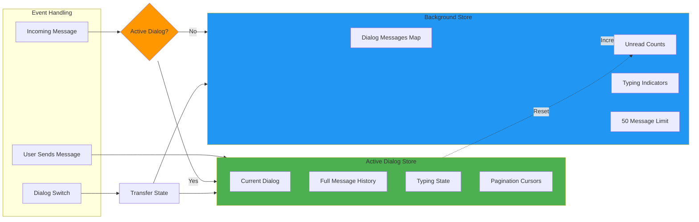
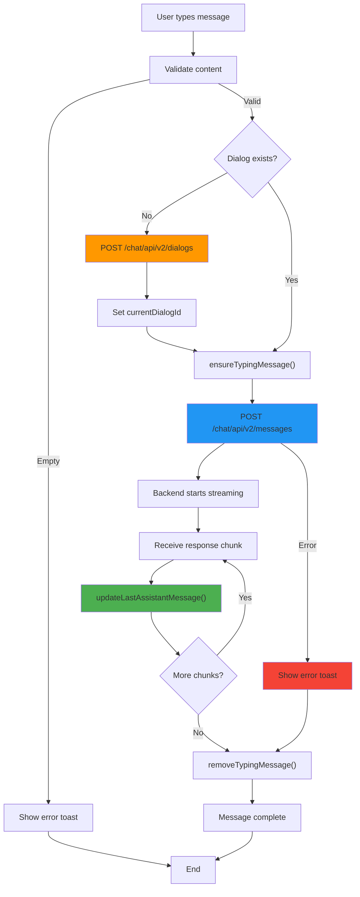
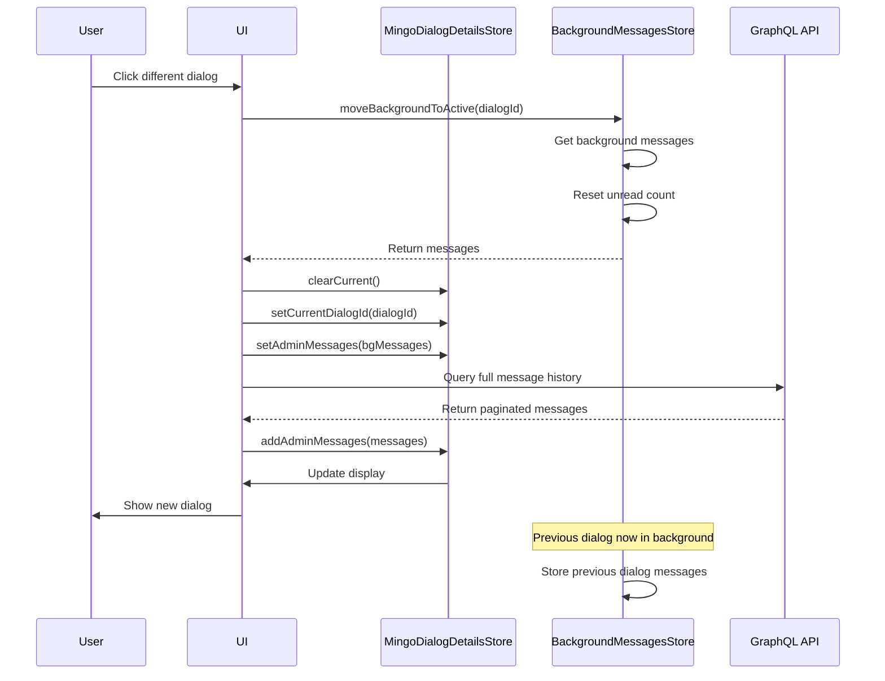
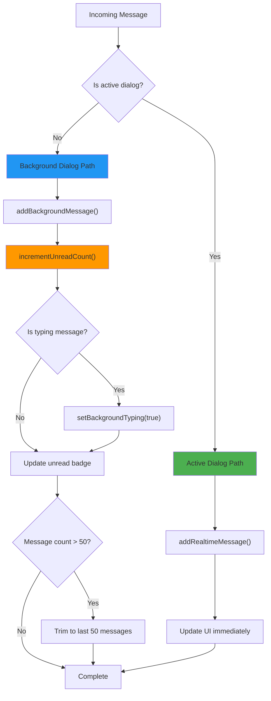
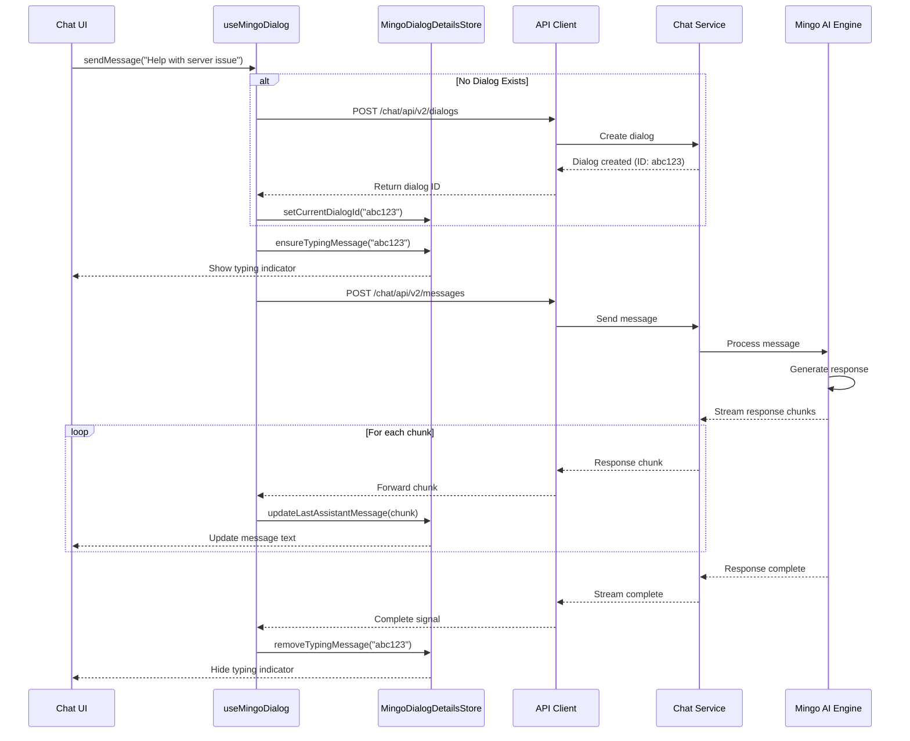

# Mingo AI Assistant Module

## Overview

The **Mingo AI Assistant Module** is the frontend implementation of Mingo, OpenFrame's AI-powered IT support assistant designed specifically for MSP technicians. This module provides a sophisticated real-time chat interface with intelligent state management, enabling technicians to interact with an AI assistant that helps troubleshoot issues, query system data, and automate IT support workflows.

Mingo AI represents the "technician-facing" AI assistant in the Flamingo platform ecosystem, complementing Fae (the client-facing assistant). The module implements advanced features including multi-dialog management, real-time message streaming, background message processing, and intelligent state synchronization across multiple concurrent conversations.

**Part of:** [Frontend Main Application](./frontend_main.md)  
**Related Modules:** [Frontend Chat](./frontend_chat.md), [Frontend Core Components](./frontend_core_components.md)

---

## Key Capabilities

- ✅ **Real-time AI Chat Interface** - Streaming responses with typing indicators
- ✅ **Multi-Dialog Management** - Handle multiple concurrent conversations
- ✅ **Background Message Processing** - Receive messages in inactive dialogs
- ✅ **Intelligent State Synchronization** - Seamless switching between conversations
- ✅ **Unread Message Tracking** - Per-dialog unread counts and notifications
- ✅ **Optimistic UI Updates** - Immediate feedback with error recovery
- ✅ **GraphQL Integration** - Efficient data fetching with pagination
- ✅ **Automatic Dialog Creation** - Seamless conversation initialization
- ✅ **Error Handling & Recovery** - User-friendly error messages and retry logic

---

## Architecture Overview

The Mingo AI Assistant follows a **state-driven architecture** with clear separation between active dialog state and background dialog state, enabling efficient multi-conversation management without performance degradation.

### High-Level Architecture



### State Management Architecture

The module uses **two separate Zustand stores** to optimize performance and manage complexity:

1. **MingoDialogDetailsStore** - Manages the currently active dialog
   - Full message history with pagination
   - Typing indicators and streaming state
   - Loading and error states
   - Message deduplication

2. **BackgroundMessagesStore** - Manages inactive dialogs
   - Limited message buffer (50 messages per dialog)
   - Unread message counts
   - Background typing indicators
   - Efficient memory management



---

## Core Components

The Mingo AI Assistant module consists of three primary components that work together to provide a seamless chat experience:

### 1. useMingoDialog Hook

**Purpose:** Dialog lifecycle management and message sending operations

**Location:** `openframe/services/openframe-frontend/src/app/mingo/hooks/use-mingo-dialog.ts`

**Key Responsibilities:**
- Automatic dialog creation when needed
- Message validation and sending
- Error handling with user notifications
- State synchronization with stores
- Loading state management

**API Interface:**

```typescript
interface UseMingoDialogReturn {
  // State
  currentDialogId: string | null
  hasDialog: boolean
  
  // Loading states
  isCreatingDialog: boolean
  isSendingMessage: boolean
  
  // Error state
  error: Error | null
  
  // Actions
  createDialog: () => Promise<string | null>
  sendMessage: (content: string, selectedDialogId?: string | null) => Promise<boolean>
  resetDialog: () => void
}
```

**For detailed documentation, see:** [useMingoDialog Hook Documentation](#usemingodialog-hook-detailed)

---

### 2. MingoDialogDetailsStore

**Purpose:** Active dialog state management with full message history

**Location:** `openframe/services/openframe-frontend/src/app/mingo/stores/mingo-dialog-details-store.ts`

**Key Responsibilities:**
- Store current dialog and full message history
- Manage typing indicators and streaming messages
- Handle pagination for message history
- Provide loading and error states
- Support real-time message updates

**State Structure:**

```typescript
interface MingoDialogDetailsStore {
  // Current dialog
  currentDialogId: string | null
  currentDialog: DialogNode | null
  adminMessages: Message[]
  
  // Loading states
  isLoadingDialog: boolean
  isLoadingMessages: boolean
  
  // Error states
  dialogError: string | null
  messagesError: string | null
  
  // Pagination
  hasMoreMessages: boolean
  messagesCursor: string | null
  newestMessageCursor: string | null
  
  // Per-dialog typing indicators
  dialogTypingStates: Record<string, boolean>
}
```

**For detailed documentation, see:** [MingoDialogDetailsStore Documentation](#mingodialogdetailsstore-detailed)

---

### 3. BackgroundMessagesStore

**Purpose:** Background dialog state management with memory optimization

**Location:** `openframe/services/openframe-frontend/src/app/mingo/stores/mingo-background-messages-store.ts`

**Key Responsibilities:**
- Store messages for inactive dialogs (max 50 per dialog)
- Track unread message counts per dialog
- Manage background typing indicators
- Provide efficient dialog switching
- Preserve streaming messages during background updates

**State Structure:**

```typescript
interface BackgroundMessagesStore {
  // Per-dialog message storage
  dialogMessages: Record<string, Message[]>
  
  // Per-dialog unread counts
  unreadCounts: Record<string, number>
  
  // Per-dialog typing indicators
  backgroundTypingIndicators: Record<string, boolean>
  
  // Current active dialog
  activeDialogId: string | null
}
```

**For detailed documentation, see:** [BackgroundMessagesStore Documentation](#backgroundmessagesstore-detailed)

---

## Data Types

### Dialog Types

```typescript
// Dialog node from GraphQL
interface DialogNode {
  id: string
  title: string
  status: string
  owner?: {
    machineId?: string
    machine?: {
      id: string
      machineId: string
      hostname: string
      organizationId: string
    }
  }
  createdAt: string
  statusUpdatedAt?: string
  resolvedAt?: string
  aiResolutionSuggestedAt?: string
  rating?: {
    id: string
    dialogId: string
    createdAt: string
  }
}

// GraphQL response for dialogs query
interface DialogsResponse {
  data: {
    dialogs: {
      edges: Array<{
        cursor: string
        node: DialogNode
      }>
      pageInfo: {
        hasNextPage: boolean
        hasPreviousPage: boolean
        startCursor?: string
        endCursor?: string
      }
    }
  }
}
```

### Message Types

```typescript
// Message structure
interface Message {
  id: string
  dialogId: string
  chatType: ChatType  // 'ADMIN_AI_CHAT'
  dialogMode: string
  createdAt: string
  owner: {
    type: OwnerType  // 'USER' | 'ASSISTANT'
    model?: string   // 'mingo' for AI messages
  }
  messageData: {
    type: string     // 'TEXT'
    text: string
  }
}

// GraphQL response for messages query
interface MessagesResponse {
  data: {
    messages: {
      edges: Array<{
        cursor: string
        node: Message
      }>
      pageInfo: {
        hasNextPage: boolean
        hasPreviousPage: boolean
        startCursor?: string
        endCursor?: string
      }
    }
  }
}
```

### Request Types

```typescript
// Create dialog request
interface CreateDialogRequest {
  agentType: 'ADMIN'
}

// Send message request
interface SendMessageRequest {
  dialogId: string
  content: string
  chatType: 'ADMIN_AI_CHAT'
}
```

---

## Key Workflows

### 1. Message Sending Flow



### 2. Dialog Switching Flow



### 3. Background Message Handling



---

## Component Details

### useMingoDialog Hook (Detailed)

#### Purpose

The `useMingoDialog` hook is the primary interface for managing Mingo AI dialog lifecycle and message operations. It provides a clean API for creating dialogs, sending messages, and handling errors with automatic state management.

#### Implementation Details

**Dialog Creation Logic:**

```typescript
const createDialog = useCallback(async (): Promise<string | null> => {
  // Prevent duplicate creation
  if (createDialogMutation.isPending) {
    return currentDialogId
  }

  try {
    const result = await createDialogMutation.mutateAsync()
    return result.id
  } catch (error) {
    return null
  }
}, [createDialogMutation, currentDialogId])
```

**Message Sending Logic:**

```typescript
const sendMessage = useCallback(async (
  content: string, 
  selectedDialogId?: string | null
): Promise<boolean> => {
  // Validate content
  const trimmedContent = content.trim()
  if (!trimmedContent) {
    toast({
      title: "Empty Message",
      description: "Please enter a message to send",
      variant: "destructive",
      duration: 3000
    })
    return false
  }

  // Get or create dialog
  let dialogId = getActiveDialogId(selectedDialogId)
  if (!dialogId) {
    dialogId = await createDialog()
    if (!dialogId) {
      return false
    }
  }

  // Send message
  try {
    await sendMessageMutation.mutateAsync({ 
      dialogId, 
      content: trimmedContent 
    })
    return true
  } catch (error) {
    return false
  }
}, [getActiveDialogId, createDialog, sendMessageMutation, toast])
```

#### Usage Examples

**Basic Usage:**

```typescript
import { useMingoDialog } from '@app/mingo/hooks/use-mingo-dialog'

function ChatInterface() {
  const {
    currentDialogId,
    isCreatingDialog,
    isSendingMessage,
    sendMessage,
    resetDialog
  } = useMingoDialog()
  
  const handleSendMessage = async (content: string) => {
    const success = await sendMessage(content)
    if (success) {
      console.log('Message sent successfully')
    }
  }
  
  return (
    <div>
      {isCreatingDialog && <p>Creating new conversation...</p>}
      {isSendingMessage && <p>Sending message...</p>}
      <MessageInput onSend={handleSendMessage} />
      <button onClick={resetDialog}>Start New Chat</button>
    </div>
  )
}
```

**Advanced Usage with Dialog Selection:**

```typescript
function MultiDialogChat() {
  const { sendMessage, isSendingMessage } = useMingoDialog()
  const [selectedDialogId, setSelectedDialogId] = useState<string | null>(null)
  
  const handleSendToSpecificDialog = async (content: string) => {
    // Send to specific dialog instead of current
    const success = await sendMessage(content, selectedDialogId)
    if (success) {
      console.log(`Message sent to dialog ${selectedDialogId}`)
    }
  }
  
  return (
    <div>
      <DialogSelector 
        onSelect={setSelectedDialogId} 
        selected={selectedDialogId} 
      />
      <MessageInput 
        onSend={handleSendToSpecificDialog}
        disabled={isSendingMessage}
      />
    </div>
  )
}
```

#### Error Handling

The hook provides comprehensive error handling with user-friendly notifications:

```typescript
// Dialog creation error
onError: (error) => {
  const errorMessage = error instanceof Error 
    ? error.message 
    : 'Failed to create new chat'
  
  toast({
    title: "Failed to Create Chat",
    description: errorMessage,
    variant: "destructive",
    duration: 5000
  })
}

// Message sending error
onError: (error) => {
  const errorMessage = error instanceof Error 
    ? error.message 
    : 'Failed to send message'

  toast({
    title: "Send Failed",
    description: errorMessage,
    variant: "destructive",
    duration: 5000
  })
}
```

---

### MingoDialogDetailsStore (Detailed)

#### Purpose

The `MingoDialogDetailsStore` manages the state of the currently active dialog, including full message history, typing indicators, pagination, and loading states. It's optimized for real-time updates and streaming message handling.

#### Key Features

**1. Message Deduplication:**

```typescript
addAdminMessages: (newMessages: Message[]) => {
  set(state => {
    const existingIds = new Set(state.adminMessages.map(msg => msg.id))
    const uniqueNewMessages = newMessages.filter(msg => !existingIds.has(msg.id))
    
    return {
      adminMessages: [...state.adminMessages, ...uniqueNewMessages]
    }
  })
}
```

**2. Streaming Message Pattern:**

The store implements a sophisticated pattern for handling streaming AI responses:

```typescript
// Step 1: Create empty typing message
ensureTypingMessage: (dialogId: string) => {
  set(state => {
    // Remove any existing typing messages
    const filteredMessages = state.adminMessages.filter(msg => 
      !(msg.dialogId === dialogId && 
        msg.owner?.type === 'ASSISTANT' && 
        (!msg.messageData?.text || msg.messageData.text === '') &&
        msg.id.startsWith('typing-'))
    )

    // Create new typing message
    const typingMessage: Message = {
      id: `typing-${dialogId}-${Date.now()}`,
      dialogId,
      chatType: 'ADMIN_AI_CHAT',
      dialogMode: 'DEFAULT',
      createdAt: new Date().toISOString(),
      owner: {
        type: 'ASSISTANT',
        model: 'mingo'
      },
      messageData: {
        type: 'TEXT',
        text: ''
      }
    }

    return {
      adminMessages: [...filteredMessages, typingMessage]
    }
  })
}

// Step 2: Accumulate text chunks
updateLastAssistantMessage: (dialogId: string, content: any) => {
  set(state => {
    const newMessages = [...state.adminMessages]
    const lastDialogMessageIndex = newMessages.findLastIndex(msg => 
      msg.dialogId === dialogId && msg.owner?.type === 'ASSISTANT'
    )
    
    const lastMessage = newMessages[lastDialogMessageIndex]
    if (lastMessage?.dialogId === dialogId && lastMessage.owner?.type === 'ASSISTANT') {
      const currentText = lastMessage.messageData?.text || ''
      const newText = typeof content === 'string' ? content : ''
      
      // Accumulate text instead of replacing
      newMessages[lastDialogMessageIndex] = {
        ...lastMessage,
        messageData: {
          ...lastMessage.messageData,
          text: currentText + newText
        }
      }
    }
    
    return { adminMessages: newMessages }
  })
}

// Step 3: Remove typing message when complete
removeTypingMessage: (dialogId: string) => {
  set(state => ({
    adminMessages: state.adminMessages.filter(msg => 
      !(msg.dialogId === dialogId && 
        msg.owner?.type === 'ASSISTANT' && 
        (!msg.messageData?.text || msg.messageData.text === '') &&
        msg.id.startsWith('typing-'))
    )
  }))
}
```

**3. Real-time Message Updates:**

```typescript
addRealtimeMessage: (message: Message) => {
  set(state => {
    const existingIndex = state.adminMessages.findIndex(msg => msg.id === message.id)
    if (existingIndex !== -1) {
      // Update existing message
      const newMessages = [...state.adminMessages]
      newMessages[existingIndex] = message
      return { adminMessages: newMessages }
    } else {
      // Add new message
      return {
        adminMessages: [...state.adminMessages, message]
      }
    }
  })
}
```

#### Usage Examples

**Basic Message Display:**

```typescript
import { useMingoDialogDetailsStore } from '@app/mingo/stores/mingo-dialog-details-store'

function ChatMessages() {
  const {
    adminMessages,
    isLoadingMessages,
    hasMoreMessages,
    messagesCursor
  } = useMingoDialogDetailsStore()
  
  return (
    <div>
      {adminMessages.map(msg => (
        <MessageBubble key={msg.id} message={msg} />
      ))}
      {isLoadingMessages && <LoadingSpinner />}
      {hasMoreMessages && (
        <LoadMoreButton cursor={messagesCursor} />
      )}
    </div>
  )
}
```

**Streaming Message Display:**

```typescript
function StreamingMessage({ dialogId }: { dialogId: string }) {
  const {
    adminMessages,
    hasTypingMessage,
    getLastEmptyAssistantMessage
  } = useMingoDialogDetailsStore()
  
  const isStreaming = hasTypingMessage(dialogId)
  const streamingMessage = getLastEmptyAssistantMessage(dialogId)
  
  return (
    <div>
      {adminMessages
        .filter(msg => msg.dialogId === dialogId)
        .map(msg => (
          <MessageBubble 
            key={msg.id} 
            message={msg}
            isStreaming={msg.id === streamingMessage?.id}
          />
        ))}
      {isStreaming && <TypingIndicator />}
    </div>
  )
}
```

---

### BackgroundMessagesStore (Detailed)

#### Purpose

The `BackgroundMessagesStore` manages messages for inactive dialogs with memory optimization, ensuring efficient performance even with many concurrent conversations. It implements a 50-message limit per dialog and provides unread count tracking.

#### Key Features

**1. Memory-Optimized Message Storage:**

```typescript
addBackgroundMessage: (dialogId: string, message: Message) => {
  set(state => {
    if (!state.dialogMessages[dialogId]) {
      state.dialogMessages[dialogId] = []
    }

    const existingIndex = state.dialogMessages[dialogId].findIndex(
      msg => msg.id === message.id
    )
    
    if (existingIndex !== -1) {
      // Update existing message
      state.dialogMessages[dialogId][existingIndex] = message
    } else {
      // Add new message
      state.dialogMessages[dialogId].push(message)
      
      // Enforce 50 message limit
      if (state.dialogMessages[dialogId].length > MAX_BACKGROUND_MESSAGES_PER_DIALOG) {
        state.dialogMessages[dialogId] = 
          state.dialogMessages[dialogId].slice(-MAX_BACKGROUND_MESSAGES_PER_DIALOG)
      }
    }
  })
}
```

**2. Unread Count Management:**

```typescript
incrementUnreadCount: (dialogId: string) => {
  set(state => {
    if (!state.unreadCounts[dialogId]) {
      state.unreadCounts[dialogId] = 0
    }
    state.unreadCounts[dialogId] += 1
  })
}

resetUnreadCount: (dialogId: string) => {
  set(state => {
    state.unreadCounts[dialogId] = 0
  })
}

getUnreadCount: (dialogId: string) => {
  const state = get()
  return state.unreadCounts[dialogId] || 0
}
```

**3. Dialog Activation Pattern:**

```typescript
moveBackgroundToActive: (dialogId: string) => {
  const state = get()
  const backgroundMessages = state.dialogMessages[dialogId] || []
  
  // Reset unread count when moving to active
  set(state => {
    state.unreadCounts[dialogId] = 0
  })
  
  // Return messages for active store
  return [...backgroundMessages]
}
```

**4. Streaming Message Preservation:**

```typescript
preserveStreamingMessage: (dialogId: string, streamingMessage: Message) => {
  set(state => {
    if (!state.dialogMessages[dialogId]) {
      state.dialogMessages[dialogId] = []
    }
    
    // Remove old version of streaming message
    const filtered = state.dialogMessages[dialogId].filter(
      msg => msg.id !== streamingMessage.id
    )
    
    // Add updated version
    state.dialogMessages[dialogId] = [...filtered, streamingMessage]
    
    // Enforce size limit
    if (state.dialogMessages[dialogId].length > MAX_BACKGROUND_MESSAGES_PER_DIALOG) {
      state.dialogMessages[dialogId] = 
        state.dialogMessages[dialogId].slice(-MAX_BACKGROUND_MESSAGES_PER_DIALOG)
    }
  })
}
```

#### Usage Examples

**Dialog List with Unread Counts:**

```typescript
import { useMingoBackgroundMessagesStore } from '@app/mingo/stores/mingo-background-messages-store'

function DialogListItem({ dialogId, isActive }: Props) {
  const {
    getUnreadCount,
    isBackgroundTyping,
    resetUnreadCount,
    getDialogMessages
  } = useMingoBackgroundMessagesStore()
  
  const unreadCount = getUnreadCount(dialogId)
  const isTyping = isBackgroundTyping(dialogId)
  const messages = getDialogMessages(dialogId)
  const lastMessage = messages[messages.length - 1]
  
  const handleClick = () => {
    resetUnreadCount(dialogId)
    // Switch to this dialog
  }
  
  return (
    <div 
      onClick={handleClick}
      className={isActive ? 'active' : ''}
    >
      <span>Dialog {dialogId}</span>
      {lastMessage && (
        <p className="preview">{lastMessage.messageData.text}</p>
      )}
      {unreadCount > 0 && (
        <Badge variant="destructive">{unreadCount}</Badge>
      )}
      {isTyping && <TypingIndicator size="small" />}
    </div>
  )
}
```

**Background Message Handler:**

```typescript
function BackgroundMessageHandler() {
  const {
    activeDialogId,
    addBackgroundMessage,
    incrementUnreadCount,
    setBackgroundTyping
  } = useMingoBackgroundMessagesStore()
  
  useEffect(() => {
    const handleIncomingMessage = (message: Message) => {
      // Check if message is for active dialog
      if (message.dialogId === activeDialogId) {
        // Handle in active store
        return
      }
      
      // Add to background store
      addBackgroundMessage(message.dialogId, message)
      
      // Increment unread if not typing message
      if (message.owner.type === 'ASSISTANT' && message.messageData.text) {
        incrementUnreadCount(message.dialogId)
      }
      
      // Update typing indicator
      if (message.owner.type === 'ASSISTANT' && !message.messageData.text) {
        setBackgroundTyping(message.dialogId, true)
      } else {
        setBackgroundTyping(message.dialogId, false)
      }
    }
    
    // Subscribe to message events
    const unsubscribe = subscribeToMessages(handleIncomingMessage)
    return unsubscribe
  }, [activeDialogId, addBackgroundMessage, incrementUnreadCount, setBackgroundTyping])
  
  return null
}
```

---

## Integration with Backend

### API Endpoints

**REST API Endpoints:**

```typescript
// Create new dialog
POST /chat/api/v2/dialogs
Request: {
  agentType: 'ADMIN'
}
Response: {
  id: string
  agentType: string
  currentMode: string
  status: string
  title: string
  createdAt: string
  statusUpdatedAt: string
  resolvedAt: string
}

// Send message
POST /chat/api/v2/messages
Request: {
  dialogId: string
  content: string
  chatType: 'ADMIN_AI_CHAT'
}
Response: {
  // Message sent confirmation
}
```

**GraphQL Queries:**

```graphql
# Query dialogs with pagination
query GetDialogs($first: Int, $after: String, $search: String) {
  dialogs(first: $first, after: $after, search: $search) {
    edges {
      cursor
      node {
        id
        title
        status
        owner {
          machineId
          machine {
            id
            machineId
            hostname
            organizationId
          }
        }
        createdAt
        statusUpdatedAt
        resolvedAt
        aiResolutionSuggestedAt
        rating {
          id
          dialogId
          createdAt
        }
      }
    }
    pageInfo {
      hasNextPage
      hasPreviousPage
      startCursor
      endCursor
    }
  }
}

# Query messages for a dialog
query GetMessages($dialogId: ID!, $first: Int, $after: String) {
  messages(dialogId: $dialogId, first: $first, after: $after) {
    edges {
      cursor
      node {
        id
        dialogId
        chatType
        dialogMode
        createdAt
        owner {
          type
          model
        }
        messageData
      }
    }
    pageInfo {
      hasNextPage
      hasPreviousPage
      startCursor
      endCursor
    }
  }
}
```

### Data Flow Sequence



---

## Performance Considerations

### Memory Management

**1. Background Message Limit:**

The `BackgroundMessagesStore` enforces a 50-message limit per dialog to prevent memory bloat:

```typescript
const MAX_BACKGROUND_MESSAGES_PER_DIALOG = 50

// Automatic trimming when limit exceeded
if (state.dialogMessages[dialogId].length > MAX_BACKGROUND_MESSAGES_PER_DIALOG) {
  state.dialogMessages[dialogId] = 
    state.dialogMessages[dialogId].slice(-MAX_BACKGROUND_MESSAGES_PER_DIALOG)
}
```

**2. Message Deduplication:**

Both stores implement deduplication to prevent duplicate messages:

```typescript
const existingIds = new Set(state.adminMessages.map(msg => msg.id))
const uniqueNewMessages = newMessages.filter(msg => !existingIds.has(msg.id))
```

### Optimization Strategies

**1. Lazy Loading:**

Messages are loaded on-demand with pagination:

```typescript
// Only load messages when dialog is activated
const { data, fetchNextPage, hasNextPage } = useInfiniteQuery({
  queryKey: ['messages', dialogId],
  queryFn: ({ pageParam }) => fetchMessages(dialogId, pageParam),
  enabled: !!dialogId && isActive
})
```

**2. State Separation:**

Active and background states are separated to optimize rendering:

- **Active Store:** Full message history, frequent updates
- **Background Store:** Limited messages, infrequent updates

**3. Selective Re-rendering:**

Zustand's selector pattern prevents unnecessary re-renders:

```typescript
// Only re-render when specific state changes
const unreadCount = useMingoBackgroundMessagesStore(
  state => state.getUnreadCount(dialogId)
)
```

---

## Error Handling

### Error Types

**1. Network Errors:**

```typescript
// Handled by React Query with automatic retry
const sendMessageMutation = useMutation({
  mutationFn: sendMessageAPI,
  retry: 3,
  retryDelay: attemptIndex => Math.min(1000 * 2 ** attemptIndex, 30000)
})
```

**2. Validation Errors:**

```typescript
// Client-side validation before API call
const sendMessage = async (content: string) => {
  const trimmedContent = content.trim()
  if (!trimmedContent) {
    toast({
      title: "Empty Message",
      description: "Please enter a message to send",
      variant: "destructive"
    })
    return false
  }
  // Proceed with API call
}
```

**3. API Errors:**

```typescript
// Error handling with user-friendly messages
onError: (error) => {
  const errorMessage = error instanceof Error 
    ? error.message 
    : 'Failed to send message'

  toast({
    title: "Send Failed",
    description: errorMessage,
    variant: "destructive",
    duration: 5000
  })
  
  console.error('Failed to send message:', error)
}
```

### Recovery Strategies

**1. Optimistic Updates:**

```typescript
// Update UI immediately, rollback on error
const sendMessage = async (content: string) => {
  // Add optimistic message
  const optimisticMessage = createOptimisticMessage(content)
  addRealtimeMessage(optimisticMessage)
  
  try {
    await sendMessageAPI(content)
  } catch (error) {
    // Remove optimistic message on error
    removeMessage(optimisticMessage.id)
    showError(error)
  }
}
```

**2. Automatic Retry:**

```typescript
// React Query handles automatic retry with exponential backoff
const mutation = useMutation({
  mutationFn: sendMessageAPI,
  retry: 3,
  retryDelay: attemptIndex => Math.min(1000 * 2 ** attemptIndex, 30000)
})
```

**3. State Recovery:**

```typescript
// Reset state on critical errors
const resetDialog = useCallback(() => {
  setCurrentDialogId(null)
  dialogIdRef.current = null
  createDialogMutation.reset()
  sendMessageMutation.reset()
}, [createDialogMutation, sendMessageMutation])
```

---

## Testing Considerations

### Unit Testing

**Testing Hooks:**

```typescript
import { renderHook, act } from '@testing-library/react'
import { useMingoDialog } from './use-mingo-dialog'

describe('useMingoDialog', () => {
  it('should create dialog automatically when sending message', async () => {
    const { result } = renderHook(() => useMingoDialog())
    
    await act(async () => {
      const success = await result.current.sendMessage('Test message')
      expect(success).toBe(true)
    })
    
    expect(result.current.currentDialogId).toBeTruthy()
  })
  
  it('should show error toast for empty messages', async () => {
    const { result } = renderHook(() => useMingoDialog())
    
    await act(async () => {
      const success = await result.current.sendMessage('')
      expect(success).toBe(false)
    })
  })
})
```

**Testing Stores:**

```typescript
import { renderHook, act } from '@testing-library/react'
import { useMingoDialogDetailsStore } from './mingo-dialog-details-store'

describe('MingoDialogDetailsStore', () => {
  beforeEach(() => {
    // Reset store before each test
    useMingoDialogDetailsStore.getState().clearCurrent()
  })
  
  it('should add messages without duplicates', () => {
    const { result } = renderHook(() => useMingoDialogDetailsStore())
    
    act(() => {
      result.current.addAdminMessages([
        { id: '1', content: 'Message 1' },
        { id: '2', content: 'Message 2' }
      ])
      
      result.current.addAdminMessages([
        { id: '2', content: 'Message 2' },  // Duplicate
        { id: '3', content: 'Message 3' }
      ])
    })
    
    expect(result.current.adminMessages).toHaveLength(3)
  })
  
  it('should handle streaming messages correctly', () => {
    const { result } = renderHook(() => useMingoDialogDetailsStore())
    const dialogId = 'test-dialog'
    
    act(() => {
      result.current.ensureTypingMessage(dialogId)
    })
    
    expect(result.current.hasTypingMessage(dialogId)).toBe(true)
    
    act(() => {
      result.current.updateLastAssistantMessage(dialogId, 'Hello')
      result.current.updateLastAssistantMessage(dialogId, ' World')
    })
    
    const lastMessage = result.current.getLastEmptyAssistantMessage(dialogId)
    expect(lastMessage?.messageData.text).toBe('Hello World')
  })
})
```

### Integration Testing

**Testing Message Flow:**

```typescript
import { render, screen, waitFor } from '@testing-library/react'
import userEvent from '@testing-library/user-event'
import { ChatInterface } from './ChatInterface'

describe('ChatInterface Integration', () => {
  it('should send message and display response', async () => {
    render(<ChatInterface />)
    
    const input = screen.getByPlaceholderText('Type a message...')
    const sendButton = screen.getByRole('button', { name: /send/i })
    
    await userEvent.type(input, 'Help with server issue')
    await userEvent.click(sendButton)
    
    // Wait for typing indicator
    await waitFor(() => {
      expect(screen.getByTestId('typing-indicator')).toBeInTheDocument()
    })
    
    // Wait for response
    await waitFor(() => {
      expect(screen.getByText(/I can help you with that/i)).toBeInTheDocument()
    }, { timeout: 5000 })
    
    // Typing indicator should be removed
    expect(screen.queryByTestId('typing-indicator')).not.toBeInTheDocument()
  })
})
```

---

## Future Enhancements

### Planned Features

1. **WebSocket Integration**
   - Real-time message delivery without polling
   - Reduced latency for message updates
   - Server-sent typing indicators

2. **Message Search**
   - Full-text search across all dialogs
   - Filter by date, sender, content
   - Search result highlighting

3. **Rich Message Types**
   - Code blocks with syntax highlighting
   - File attachments
   - Interactive buttons and forms
   - Embedded media (images, videos)

4. **Voice Input**
   - Speech-to-text for message input
   - Voice commands for common actions
   - Audio message support

5. **Offline Support**
   - Local message caching
   - Offline message composition
   - Automatic sync when online

6. **Advanced Analytics**
   - Message sentiment analysis
   - Response time tracking
   - User engagement metrics
   - AI performance monitoring

### Technical Improvements

1. **Performance Optimization**
   - Virtual scrolling for large message lists
   - Message pagination improvements
   - Lazy loading of message attachments

2. **State Management**
   - Migrate to Redux Toolkit for complex state
   - Implement state persistence
   - Add state debugging tools

3. **Testing**
   - Increase test coverage to 90%+
   - Add E2E tests with Playwright
   - Implement visual regression testing

4. **Accessibility**
   - WCAG 2.1 AA compliance
   - Screen reader optimization
   - Keyboard navigation improvements

---

## Related Documentation

- **[Frontend Main Application](./frontend_main.md)** - Parent application structure
- **[Frontend Chat](./frontend_chat.md)** - Shared chat components and services
- **[Frontend Core Components](./frontend_core_components.md)** - UI component library
- **[API Service](./api_service.md)** - Backend API endpoints
- **[Frontend Support Tickets](./frontend_support_tickets.md)** - Related ticket system

---

## Support and Community

For questions, issues, or contributions related to the Mingo AI Assistant module:

- **OpenMSP Slack Community:** [Join here](https://join.slack.com/t/openmsp/shared_invite/zt-36bl7mx0h-3~U2nFH6nqHqoTPXMaHEHA)
- **Flamingo Platform:** [https://flamingo.run](https://flamingo.run)
- **OpenFrame Platform:** [https://openframe.ai](https://openframe.ai)

**Note:** We don't use GitHub Issues or GitHub Discussions. All support and discussions happen in our OpenMSP Slack community.

---

## Conclusion

The Mingo AI Assistant module provides a robust, performant, and user-friendly interface for MSP technicians to interact with AI-powered support. Its sophisticated state management, real-time streaming capabilities, and multi-dialog support make it a powerful tool for modern IT support workflows.

The module's architecture emphasizes:
- **Performance** through optimized state management and memory limits
- **User Experience** with real-time updates and error recovery
- **Scalability** supporting multiple concurrent conversations
- **Maintainability** with clear separation of concerns and comprehensive documentation

As the Flamingo platform continues to evolve, the Mingo AI Assistant will remain a core component, enabling technicians to work more efficiently and effectively with AI assistance.
