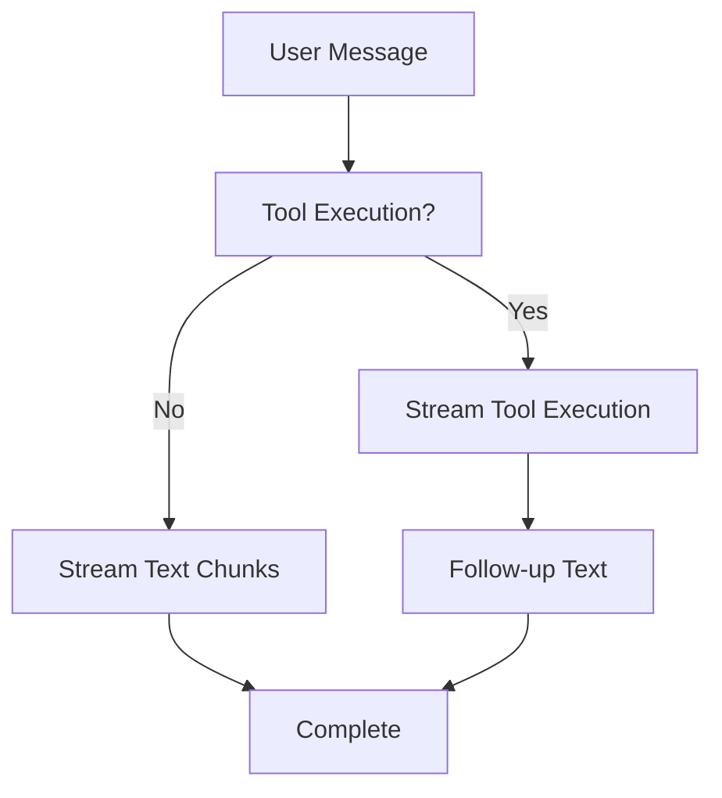

# MockChatService

## Purpose
`MockChatService` simulates AI chat behavior for demos, development, and testing. It produces streaming responses that closely resemble real AI interactions, including tool execution and error scenarios.

---

## Core Responsibilities

- Stream text responses incrementally
- Simulate tool execution lifecycle
- Produce realistic demo data
- Inject controlled errors for resilience testing

---

## Streaming Model

---

## Tool Execution Simulation

The service emits structured message segments representing:

- Tool execution start
- Tool execution completion
- Execution results and metadata

This allows the UI to render rich, step-by-step AI actions.

---

## Error Injection

- Randomized error generation (~20%)
- Simulates network or backend failures
- Useful for testing retry and recovery logic

---

## Integration Points

- **Chat UI** – Used when backend is unavailable or in demo mode
- **DebugModeContext** – Often paired with debug or mock scenarios

---

## Design Notes

- Fully client-side
- Deterministic enough for demos, non-deterministic enough for realism
- Does not require authentication or backend services
