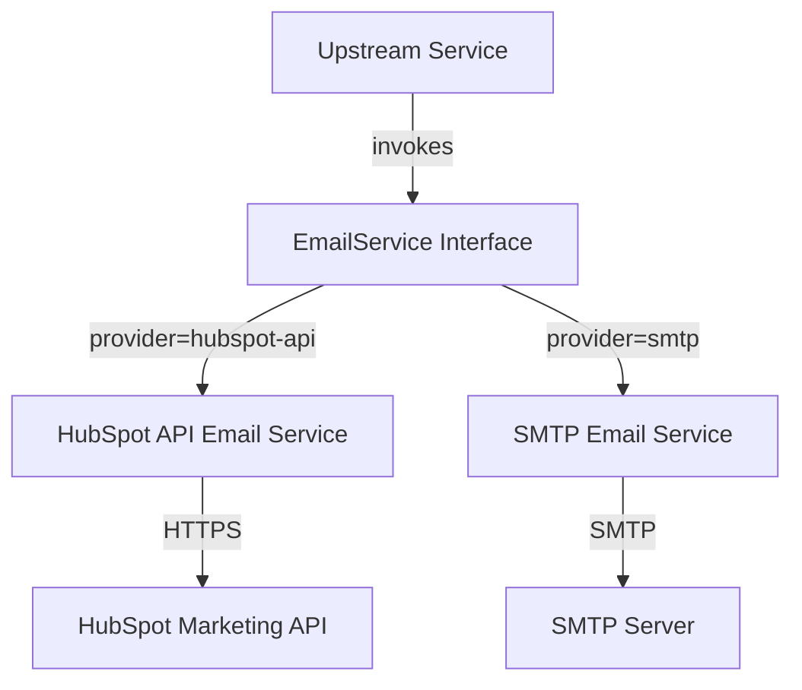

# Notification Mail Module

## Overview
The **notification_mail** module provides outbound email notification capabilities for the OpenFrame platform. It abstracts email delivery behind a common `EmailService` contract and supports multiple providers that can be switched via configuration.

Current providers:
- **HubSpot API** (recommended for production): Template-driven transactional emails via HubSpot Marketing API
- **SMTP** (default/fallback): Simple plaintext emails using standard SMTP

This module is consumed by other services (for example authorization and API services) to deliver:
- User invitations
- Password reset emails
- Email verification messages

Provider selection is controlled via the `openframe.mail.provider` configuration property.

---

## Architecture Overview



### Key Design Points
- **Provider abstraction**: Callers depend only on `EmailService`, not on concrete implementations
- **Conditional activation**: Spring `@ConditionalOnProperty` ensures only one provider bean is active
- **Configuration-driven behavior**: Links, templates, and credentials are injected via properties

---

## Core Responsibilities

- Provide a unified interface for sending transactional emails
- Support multiple delivery mechanisms without changing callers
- Centralize link generation for invitation, password reset, and verification flows
- Log delivery attempts and failures consistently

---

## Sub-modules

### Email Providers

- **HubSpot API Provider**  
  Handles rich, template-based emails using HubSpot's single-send API. Supports invitations, password reset, and email verification flows.

  See: [HubSpot API Provider](HubSpot API Provider.md)

- **SMTP Provider**  
  Sends simple plaintext emails over SMTP. Intended for development or minimal setups. Does not support email verification.

  See: [SMTP Provider](SMTP Provider.md)

---

## Configuration Overview

Typical configuration keys used by this module:

```text
openframe.mail.provider
openframe.mail.from
openframe.invitations.link-template
openframe.password-reset.link-template
openframe.email-verify.link-template
```

Provider-specific properties are documented in each provider’s sub-module documentation.

---

## Interaction With Other Modules

- **authorization_service_core**: Triggers invitation, password reset, and verification emails during auth flows
- **api_service_core**: May initiate invitation workflows that rely on email delivery

This module contains no persistence or API endpoints of its own and is purely a supporting service.

---

## Extensibility

To add a new email provider:
1. Implement the `EmailService` interface
2. Annotate with `@ConditionalOnProperty` using a new provider value
3. Add provider-specific configuration properties

No changes are required in upstream callers.
