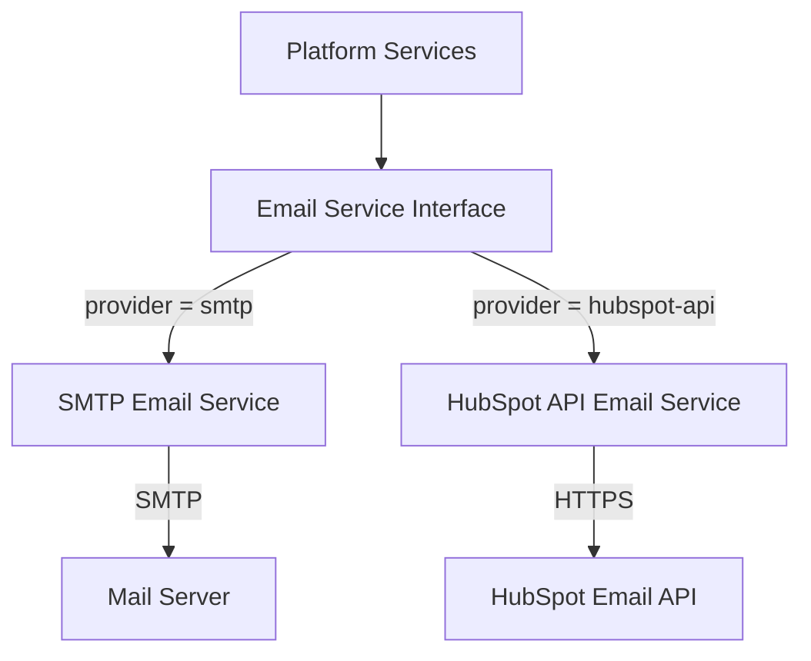
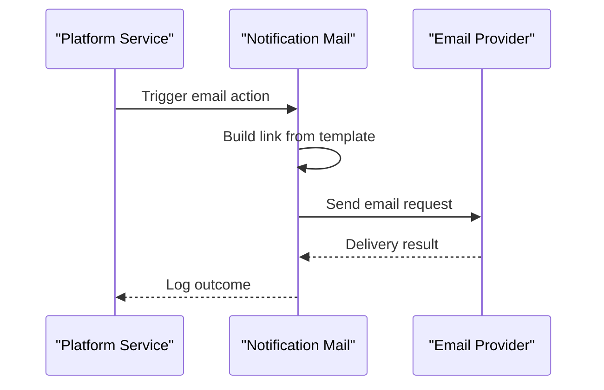

# Notification Mail

## Overview

The **Notification Mail** module is responsible for delivering transactional emails across the OpenFrame / Flamingo platform. It provides a pluggable email delivery abstraction that supports multiple providers, allowing deployments to choose between a simple SMTP-based setup or a fully templated external email service.

Typical use cases include:
- User invitation emails
- Password reset emails
- Email verification flows

The module is designed to be **configuration-driven**, **provider-agnostic**, and **easily extensible** for future email delivery mechanisms.

---

## Core Responsibilities

- Provide a unified email sending interface for the platform
- Select an email provider at runtime via configuration
- Generate secure action links (invitation, reset, verification)
- Integrate with external email APIs or local SMTP servers
- Ensure reliable delivery and structured logging

---

## Architecture Overview

The Notification Mail module exposes a single logical email service that is backed by one of multiple concrete implementations. Spring Boot conditional configuration is used to activate exactly one provider at runtime.



---

## Provider Selection

Email provider selection is controlled using application configuration:

- `openframe.mail.provider=smtp` (default)
- `openframe.mail.provider=hubspot-api`

Spring’s conditional annotations ensure that only the selected provider bean is loaded at runtime.

---

## Email Providers

### SMTP Email Service

The **SMTP Email Service** provides a lightweight, dependency-free way to send plain-text transactional emails using a standard mail server.

**Key Characteristics:**
- Uses `JavaMailSender`
- Sends plain-text emails only
- Suitable for development, testing, or simple production setups
- Does **not** support email verification messages

**Supported Emails:**
- Invitation email
- Password reset email

**Limitations:**
- No HTML templates
- No email verification support
- Limited branding and customization

---

### HubSpot API Email Service

The **HubSpot API Email Service** integrates with HubSpot’s transactional email API to send fully templated, branded emails.

**Key Characteristics:**
- Uses reactive `WebClient`
- Sends emails using HubSpot single-send templates
- Supports advanced personalization via template properties
- Designed for production-grade deployments

**Supported Emails:**
- Invitation email
- Password reset email
- Email verification email

**Key Features:**
- Externalized templates managed in HubSpot
- Secure bearer-token authentication
- Detailed debug logging

---

## Configuration Properties

The Notification Mail module relies on external configuration for flexibility and security.

### Common Properties

```text
openframe.mail.provider
openframe.mail.from
openframe.invitations.link-template
openframe.password-reset.link-template
openframe.email-verify.link-template
```

### HubSpot-Specific Properties

```text
openframe.mail.hubspot.base-url
openframe.mail.hubspot.access-token
openframe.mail.hubspot.invitation-email-id
openframe.mail.hubspot.reset-email-id
openframe.mail.hubspot.verify-email-id
```

**Link Templates**

Link templates are simple string patterns that are expanded at runtime:

```text
https://example.com/invite/{id}
https://example.com/reset/{token}
https://example.com/verify/{token}
```

---

## Email Sending Flow

The following diagram illustrates the high-level flow when an email is triggered by another service.



---

## Error Handling and Logging

- SMTP provider relies on the underlying mail sender for error propagation
- HubSpot provider:
  - Treats non-2xx responses as failures
  - Logs response status and body for diagnostics
  - Throws runtime exceptions on delivery errors

Debug logging can be enabled to inspect outgoing payloads without exposing secrets.

---

## Security Considerations

- Access tokens for external providers must be stored securely
- Invitation, reset, and verification links must point to trusted domains
- Tokens embedded in links should be short-lived and single-use

The Notification Mail module itself does not generate tokens; it only transports them.

---

## Extensibility

The module is designed to be extended with minimal effort:

- Add a new provider by implementing the email service interface
- Activate it using conditional configuration
- Reuse existing link template infrastructure

This design allows OpenFrame deployments to adopt new email platforms without impacting upstream services.

---

## Summary

The **Notification Mail** module provides a clean, extensible, and configuration-driven solution for transactional email delivery in OpenFrame. By abstracting provider-specific details and supporting both simple and advanced setups, it ensures reliable communication with users across all environments.
