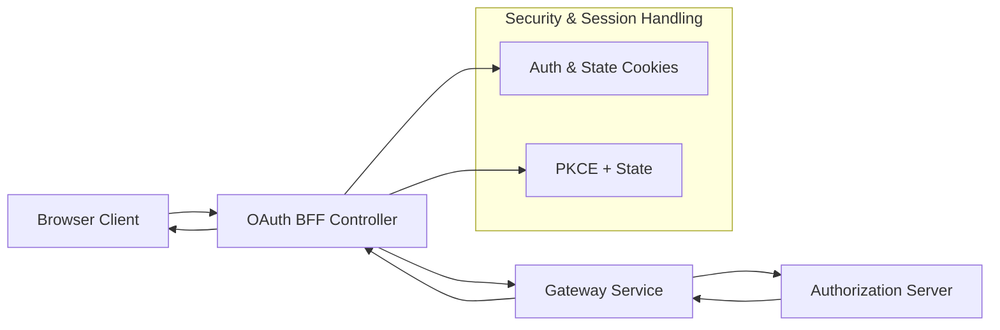
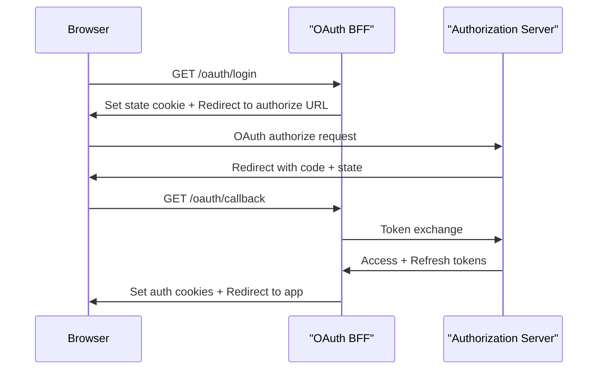

# OAuth BFF Support Module

The **oauth_bff_support** module provides the Backend-for-Frontend (BFF) layer for OAuth 2.0 and OpenID Connect authentication flows within the OpenFrame platform. It acts as the browser-facing entry point for login, callback handling, token refresh, logout, and developer convenience flows, abstracting OAuth complexity away from frontend clients.

This module is typically enabled in the **Gateway Service** and integrates tightly with:

- The **Authorization Server** (OAuth 2.0 / OIDC provider)
- **Gateway security and cookie handling**
- **Shared security utilities** (JWT, PKCE, constants)

Its primary goal is to provide **secure, cookie-based authentication** for web clients while supporting multi-tenant OAuth, SSO providers, and development workflows.

---

## Responsibilities

- Initiate OAuth authorization requests (with state and PKCE)
- Manage OAuth state using signed cookies
- Handle OAuth callbacks and token exchange
- Set and clear authentication cookies (access & refresh tokens)
- Support token refresh and logout flows
- Provide optional developer ticket-based token exchange
- Resolve safe redirect targets after authentication

---

## High-Level Architecture

---

## Main Components

### 1. OAuthBffController

**File:** `OAuthBffController.java`  
**Type:** Reactive Spring WebFlux REST Controller

This controller exposes the browser-facing OAuth endpoints under `/oauth/*`. It orchestrates redirects, cookie management, and calls into the OAuth service layer.

Key endpoints:

- `GET /oauth/login`
- `GET /oauth/continue`
- `GET /oauth/callback`
- `POST /oauth/refresh`
- `GET /oauth/logout`
- `GET /oauth/dev-exchange`

Detailed documentation: see [oauth_bff_controller.md](oauth_bff_controller.md)

---

### 2. Redirect Target Resolution

**Default Implementation:** `DefaultRedirectTargetResolver`

This component determines the final redirect destination after login or callback, based on:

- Explicit `redirectTo` parameter
- HTTP `Referer` header
- Safe fallback to root path (`/`)

It is designed to be **overridable** via Spring bean replacement.

Detailed documentation: see [redirect_target_resolver.md](redirect_target_resolver.md)

---

## OAuth Flow Overview

---

## Security Considerations

- **State protection:** OAuth state is signed and stored in short-lived cookies
- **PKCE:** Used implicitly via the OAuth service layer
- **Cookie-based auth:** Access and refresh tokens are never exposed in URLs
- **Safe redirects:** Non-absolute redirects are sanitized
- **Multi-tenant isolation:** Tenant context is always explicit

---

## Integration Points

This module depends on and collaborates with:

- Authorization server core (token issuance, SSO, tenant discovery)
- Gateway service (cookie handling, routing, CORS)
- Security shared core (JWT, PKCE utilities, OAuth constants)
- Data layer (refresh token lookup and revocation via services)

For details on OAuth token issuance and SSO providers, refer to the **authorization server documentation**.

---

## When to Customize

You may want to extend or replace parts of this module if you need:

- Custom redirect validation logic
- Alternate cookie strategies (headers only, mobile clients)
- Different dev or test token handling
- Tight integration with a custom frontend routing model

---

## Summary

The **oauth_bff_support** module is the bridge between browsers and OpenFrame’s OAuth infrastructure. By centralizing OAuth flows, cookie handling, and redirect logic, it enables secure and consistent authentication across all web clients while remaining flexible for multi-tenant and SSO-driven environments.
