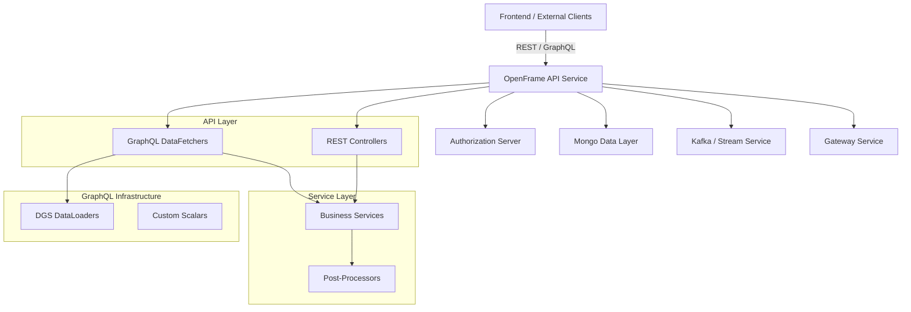
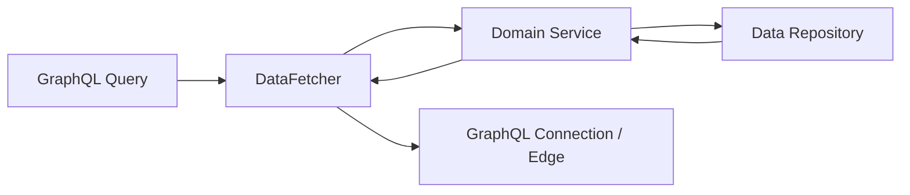

# OpenFrame API Service

## Overview
The **openframe-api-service** is the primary backend API for the OpenFrame platform. It exposes **REST** and **GraphQL** endpoints used by the OpenFrame frontend, external integrations, and internal services. The service is built on **Spring Boot** and **Netflix DGS** (GraphQL) and acts as the orchestration layer between authentication, data layers, and downstream services.

Key responsibilities:
- User, organization, device, and tool management APIs
- GraphQL queries and mutations for devices, events, logs, organizations, and tools
- API key management and agent registration
- SSO configuration and lifecycle management
- Force actions (agent install, update, reinstall)
- Client configuration discovery for OpenFrame agents

---

## High-Level Architecture



---

## Application Bootstrap

### ApiApplication
The entry point of the service.

Responsibilities:
- Boots the Spring application
- Registers component scanning across API, data, core, notification, and Kafka packages

```java
SpringApplication.run(ApiApplication.class, args);
```

---

## Configuration Layer

### Core Configurations

| Configuration Class | Responsibility |
|--------------------|----------------|
| ApiApplicationConfig | Password encoder (BCrypt) |
| AuthenticationConfig | Registers `AuthPrincipalArgumentResolver` |
| RestTemplateConfig | Provides `RestTemplate` bean |
| DataInitializer | Initializes default OAuth client |
| DateScalarConfig | GraphQL `Date` scalar |
| InstantScalarConfig | GraphQL `Instant` scalar |

### Startup Data Initialization
`DataInitializer` ensures a default OAuth client exists or is updated at startup based on environment configuration.

---

## REST Controllers

### HealthController
- `GET /health`
- Used for liveness and readiness checks

### MeController
- `GET /me`
- Returns authenticated user details derived from `AuthPrincipal`

### UserController
- `GET /users`
- `GET /users/{id}`
- `PUT /users/{id}`
- `DELETE /users/{id}`

Handles user listing, retrieval, update, and soft deletion.

### InvitationController
- `POST /invitations`
- `GET /invitations`
- `DELETE /invitations/{id}`
- `POST /invitations/{id}/resend`

Manages user invitations lifecycle.

### ApiKeyController
- CRUD operations for API keys
- Supports regeneration and usage statistics

### SSOConfigController
- Manages SSO provider configuration
- Enable/disable providers
- Supports auto-provisioning rules and domain validation

### ForceAgentController
Provides administrative force actions:
- Agent installation
- Client update
- Tool agent update and reinstall

### AgentRegistrationSecretController
- Manages agent registration secrets

### OpenFrameClientConfigurationController
- Exposes OpenFrame client configuration (e.g., versioning)

---

## GraphQL Layer (Netflix DGS)

The API service uses **GraphQL DGS** for complex querying with pagination, filtering, and batching.

### DataFetchers

| DataFetcher | Purpose |
|------------|---------|
| DeviceDataFetcher | Devices, filters, relations |
| EventDataFetcher | Events and mutations |
| LogDataFetcher | Audit logs and details |
| OrganizationDataFetcher | Organizations |
| ToolsDataFetcher | Integrated tools |

### Example Flow



---

## GraphQL DataLoaders

To avoid N+1 query problems, the service uses DGS `DataLoader`s:

| DataLoader | Batches |
|-----------|---------|
| InstalledAgentDataLoader | Installed agents by machine |
| OrganizationDataLoader | Organizations by ID |
| TagDataLoader | Tags by machine |
| ToolConnectionDataLoader | Tool connections by machine |

---

## Service & Processor Pattern

The API service uses **post-processor hooks** to allow extensibility without modifying core logic.

### Default Processors

| Processor | Trigger |
|---------|--------|
| DefaultUserProcessor | User lifecycle events |
| DefaultInvitationProcessor | Invitation lifecycle |
| DefaultSSOConfigProcessor | SSO config lifecycle |
| DefaultDeviceStatusProcessor | Device status updates |

These are registered with `@ConditionalOnMissingBean`, allowing tenant-specific overrides.

---

## DTOs and API Contracts

The module defines a rich set of DTOs used by REST and GraphQL:

- Pagination and connection models (`GenericEdge`, `CountedGenericConnection`)
- User, invitation, and API key responses
- SSO configuration requests and responses
- Event, log, device, organization, and tool filters
- Force action request/response objects

These DTOs act as the **contract boundary** between frontend, external clients, and backend services.

---

## Integration with Other Modules

The **openframe-api-service** depends on and integrates with:

- **authorization-server** – OAuth2, OIDC, SSO, tenant authentication
- **gateway-service** – Request routing, WebSocket proxying, API key auth
- **data-layer-mongo** – Primary persistence for users, devices, orgs, tools
- **stream-service** – Event ingestion and enrichment
- **management-service** – System initialization and scheduled operations

Refer to the respective module documentation for implementation details.

---

## Summary

The OpenFrame API Service is the **central API backbone** of the platform. It:
- Unifies REST and GraphQL access patterns
- Enforces authentication and tenant context
- Provides extensible domain logic via processors
- Scales efficiently with cursor pagination and DataLoaders

This design allows OpenFrame to evolve rapidly while supporting tenant-specific customization and large-scale MSP workloads.
