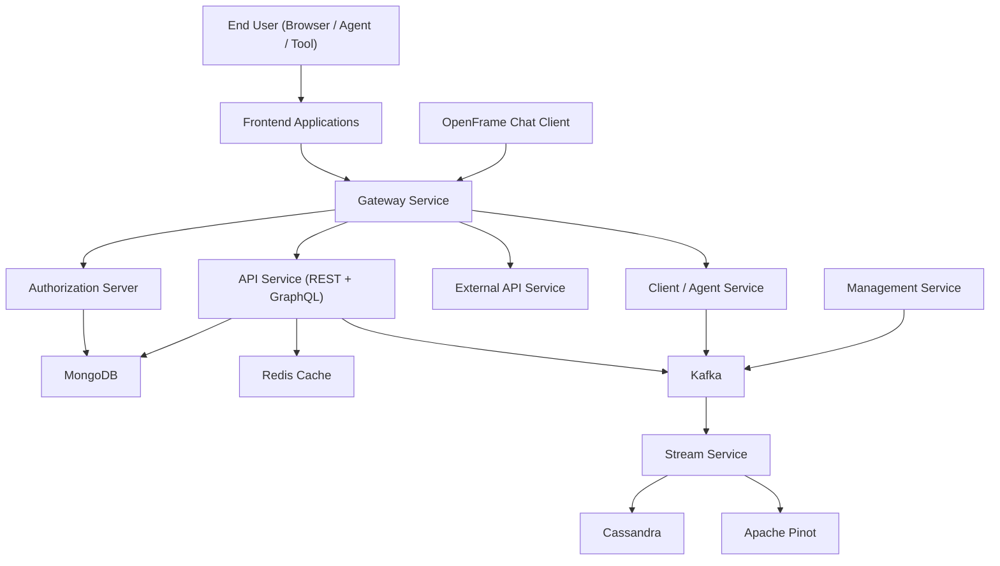
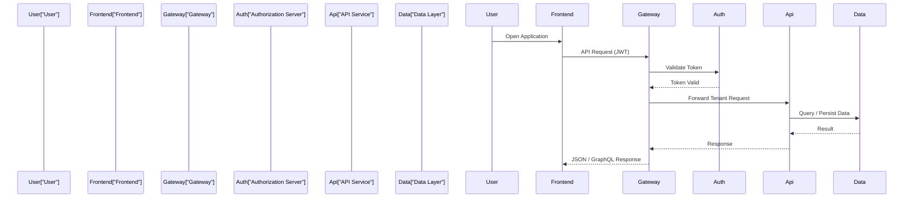

# openframe-oss-tenant — Repository Overview

## Purpose

`openframe-oss-tenant` is the **multi-tenant OpenFrame OSS distribution** used by Flamingo to run a complete MSP platform stack.  
It composes frontend clients, API services, authorization, gateway, streaming, management, and data layers into a **tenant-aware, secure, and scalable system** that powers OpenFrame’s AI-driven IT operations.

This repository acts as:
- The **tenant runtime** for OpenFrame OSS services
- An **integration layer** that assembles reusable `openframe-oss-lib` modules
- The **reference architecture** for running OpenFrame in production or self-hosted MSP environments

---

## High-Level Architecture

The platform follows a **layered, service-oriented architecture** with strict separation between UI, gateway, security, domain services, streaming, and data layers.

---

## Core Repository Structure

### Frontend & Client Layer
- **openframe-frontend**  
  Tenant UI, authentication flows, device views, logs, tickets, policies, and Mingo AI interactions.
- **clients/openframe-chat**  
  Standalone chat client with model support, token handling, and GraphQL dialog services.
- **openframe-frontend-core**  
  Shared chat types, streaming processors, and message transformation utilities.

---

### Gateway & Security
- **openframe-gateway-service-core**  
  Central ingress for HTTP and WebSocket traffic, JWT validation, API key auth, rate limiting, and tenant routing.
- **openframe-authorization-service-core**  
  OAuth2/OIDC authorization server with:
  - Tenant-aware security context
  - SSO providers (Google, Microsoft)
  - Dynamic client registration
- **openframe-security-core / openframe-security-oauth**  
  Shared JWT, PKCE, OAuth BFF, and redirect handling logic.

---

### API & Domain Services
- **openframe-api-service-core**  
  Core REST controllers, GraphQL data fetchers, domain processors, and user/org/device management.
- **openframe-api-lib**  
  Public DTOs, filters, pagination models, and mappers used across services.
- **openframe-external-api-service-core**  
  Public-facing REST API for tools and external integrations.

---

### Client, Management & Streaming
- **openframe-client-core**  
  Agent registration, authentication, heartbeat, and tool connection handling.
- **openframe-management-service-core**  
  Tenant initialization, integrated tool lifecycle, schedulers, versioning, and system automation.
- **openframe-stream-service-core**  
  Kafka-based event processing, Debezium handlers, enrichment pipelines, and activity normalization.

---

### Data Layer
- **openframe-data-mongo**  
  Primary operational datastore (users, orgs, devices, tools, auth).
- **openframe-data-kafka**  
  Kafka configuration, tenant topic management, and message models.
- **openframe-data (Cassandra + Pinot)**  
  Time-series, analytics, and event storage.
- **openframe-data-redis**  
  Distributed caching and fast lookup keys.

---

## End-to-End Request Flow (Example)

---

## Core Module Documentation References

The following modules are the **foundation** of this repository and should be reviewed first:

- **Gateway:** `openframe-gateway-service-core`
- **Auth & Security:** `openframe-authorization-service-core`, `openframe-security-core`
- **API Core:** `openframe-api-service-core`, `openframe-api-lib`
- **Client & Agents:** `openframe-client-core`
- **Streaming:** `openframe-stream-service-core`
- **Management:** `openframe-management-service-core`
- **Data:**  
  - `openframe-data-mongo`  
  - `openframe-data-kafka`  
  - `openframe-data` (Cassandra + Pinot)  
  - `openframe-data-redis`
- **Frontend:** `openframe-frontend`, `openframe-frontend-core`, `clients/openframe-chat`

---

## Summary

`openframe-oss-tenant` is the **complete, tenant-ready OpenFrame OSS stack**.  
It demonstrates how Flamingo assembles modular open-source components into a **secure, AI-enabled MSP platform** capable of handling authentication, device management, streaming telemetry, analytics, and conversational automation at scale.