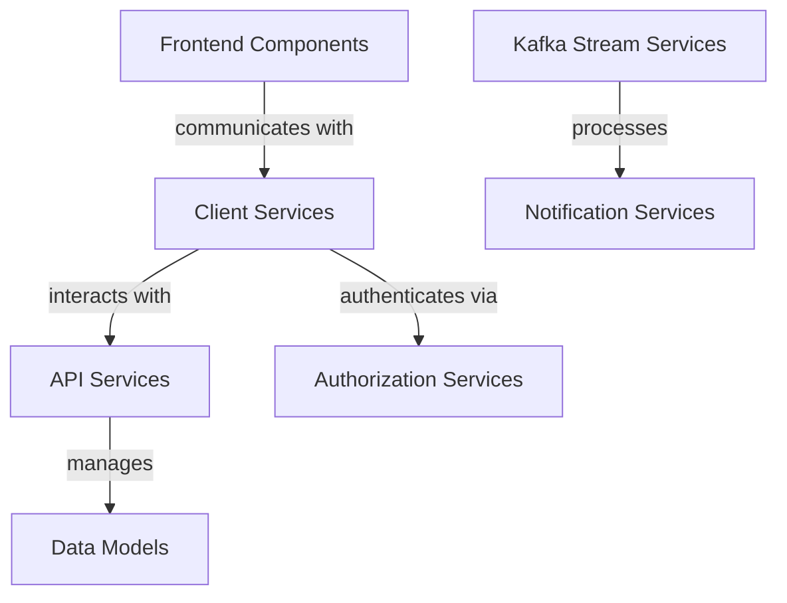

# OpenFrame OSS Tenant Repository Overview

The `openframe-oss-tenant` repository is a core component of the Flamingo platform, designed to facilitate the management of multi-tenant environments. It integrates various services and modules to provide a seamless experience for users and administrators alike.

## End-to-End Architecture

The architecture of the OpenFrame OSS Tenant repository can be visualized as follows:

## Core Modules Documentation

### 1. API Services
- **Path**: `openframe/services/openframe-api/src/main/java/com/openframe/api`
- **Overview**: Manages API interactions and provides essential services related to installed agents and tool connections.
- **Documentation**: [API Services Documentation](#)

### 2. Authorization Services
- **Path**: `openframe/services/openframe-authorization-server/src/main/java/com/openframe/authz`
- **Overview**: Handles user authentication and authorization, ensuring secure access across multiple tenants.
- **Documentation**: [Authorization Services Documentation](#)

### 3. Client Services
- **Path**: `openframe/services/openframe-client/src/main/java/com/openframe/client`
- **Overview**: Manages client interactions and agent registrations, serving as the interface between client applications and backend services.
- **Documentation**: [Client Services Documentation](#)

### 4. Frontend Components
- **Path**: `openframe/services/openframe-frontend/src/app`
- **Overview**: Provides the user interface and interaction logic for various functionalities, integrating with backend services.
- **Documentation**: [Frontend Components Documentation](#)

### 5. Data Models
- **Path**: `deps-openframe-oss-lib/openframe-data-mongo/src/main/java/com/openframe/data/document`
- **Overview**: Defines the core data structures used throughout the OpenFrame platform, including devices, organizations, and users.
- **Documentation**: [Data Models Documentation](#)

### 6. Kafka Stream Services
- **Path**: `deps-openframe-oss-lib/openframe-stream-service-core/src/main/java/com/openframe/stream`
- **Overview**: Handles streaming data within the Flamingo platform, integrating with Kafka for real-time data processing.
- **Documentation**: [Kafka Stream Services Documentation](#)

### 7. Notification Services
- **Path**: `deps-openframe-oss-lib/openframe-notification-mail/src/main/java/com/openframe/notification/mail/service`
- **Overview**: Manages email notifications within the Flamingo platform, supporting various email service providers.
- **Documentation**: [Notification Services Documentation](#)

For detailed information on each module, please refer to the respective documentation links provided above.