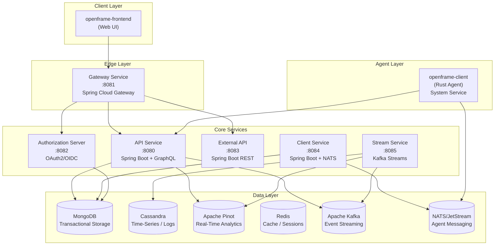
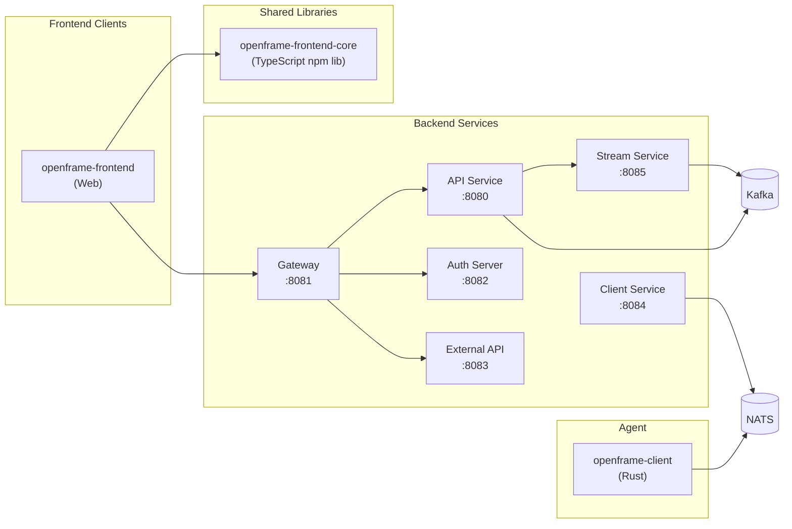
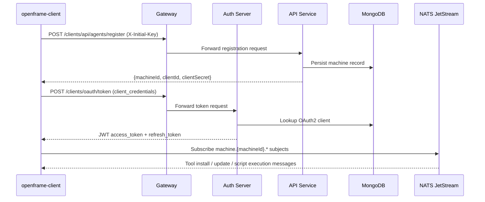
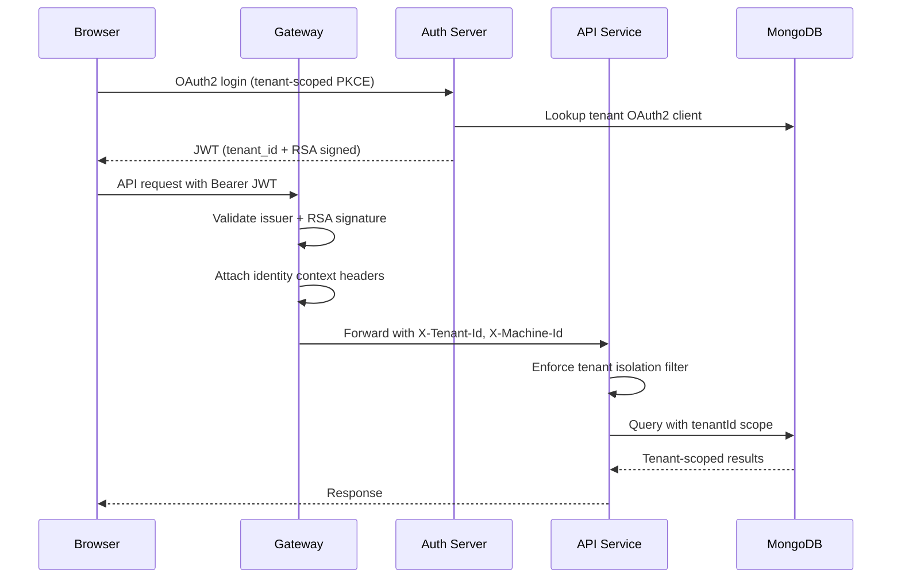

# openframe-oss-tenant Module Documentation

# OpenFrame OSS Tenant — Architecture Documentation

## Overview

OpenFrame OSS Tenant is the multi-service, multi-tenant open-source foundation of the OpenFrame platform — an AI-powered MSP (Managed Service Provider) platform that replaces expensive proprietary software with intelligent automation. It integrates device management, real-time messaging, AI-assisted support (Mingo AI for technicians, Fae for clients), and event-driven automation across a polyglot microservice architecture built on Spring Boot (Java) and Rust.

---

## Architecture

### High-Level System Architecture



---

## Core Components

| Component | Language | Port | Responsibility |
|---|---|---|---|
| **API Service** | Java / Spring Boot 3.3 | 8080 | Internal REST + GraphQL APIs; ticket, dialog, AI settings, tenant management |
| **Authorization Server** | Java / Spring Authorization Server | 8082 | Multi-tenant OAuth2/OIDC; JWT issuance with RSA keys; SSO (Google, Microsoft) |
| **Gateway** | Java / Spring Cloud Gateway | 8081 | Security enforcement, JWT validation, request routing, WebSocket proxy |
| **External API** | Java / Spring Boot | 8083 | Rate-limited public API endpoints with API key management |
| **Stream Service** | Java / Kafka Streams | 8085 | Real-time event normalization, enrichment, Cassandra/Pinot write |
| **Client Service** | Java / Spring Boot + NATS | 8084 | Agent lifecycle management, tool orchestration |
| **openframe-client** | Rust | — | Cross-platform system agent; device registration, tool management, script execution, NATS messaging |
| **openframe-frontend** | TypeScript / Node.js | 3000 | Web-based tenant dashboard (Mingo AI) |
| **openframe-frontend-core** | TypeScript (lib) | — | Shared UI component library; ODS design tokens, chat components, NATS hooks |

---

## Component Relationships

### Service Dependency Graph



---

## Data Flow

### Agent Registration and Authentication



### Multi-Tenant OAuth2 Security Flow



---

## Key Files

| File | Purpose |
|---|---|
| [`clients/openframe-client/src/main.rs`](https://github.com/flamingo-stack/openframe-oss-tenant/blob/main/clients/openframe-client/src/main.rs) | Thin agent entry point — calls `openframe::run()` from openframe-agent-lib |
| [`clients/openframe-client/src/lib.rs`](https://github.com/flamingo-stack/openframe-oss-lib/blob/main/clients/openframe-client/src/lib.rs) | Agent core: wires all services (NATS, auth, registration, execution, update, logging) |
| [`clients/openframe-client/src/service.rs`](https://github.com/flamingo-stack/openframe-oss-lib/blob/main/clients/openframe-client/src/service.rs) | Cross-platform service lifecycle (install/uninstall/run); Windows SCM integration |
| [`clients/openframe-client/src/service_adapter.rs`](https://github.com/flamingo-stack/openframe-oss-lib/blob/main/clients/openframe-client/src/service_adapter.rs) | `CrossPlatformServiceManager`: macOS launchd, Linux systemd, Windows SCM |
| [`clients/openframe-client/src/installation_initial_config_service.rs`](https://github.com/flamingo-stack/openframe-oss-lib/blob/main/clients/openframe-client/src/installation_initial_config_service.rs) | Builds and persists `InitialConfiguration`; resolves mkcert CA in local mode |
| [`clients/openframe-client/src/doctor/mod.rs`](https://github.com/flamingo-stack/openframe-oss-lib/blob/main/clients/openframe-client/src/doctor/mod.rs) | Pre-install + post-install health check runner (`DoctorReport`) |
| [`clients/openframe-client/src/executor/mod.rs`](https://github.com/flamingo-stack/openframe-oss-lib/blob/main/clients/openframe-client/src/executor/mod.rs) | Cross-platform script execution engine (bash, powershell, python, nushell) |
| [`clients/openframe-client/src/listener/execution_listener.rs`](https://github.com/flamingo-stack/openframe-oss-lib/blob/main/clients/openframe-client/src/listener/execution_listener.rs) | Generic NATS core subscription; bounded concurrency, durable result outbox |
| [`clients/openframe-client/src/listener/tool_installation_message_listener.rs`](https://github.com/flamingo-stack/openframe-oss-lib/blob/main/clients/openframe-client/src/listener/tool_installation_message_listener.rs) | JetStream consumer for tool install messages; parks during client update |
| [`clients/openframe-client/src/clients/auth_client.rs`](https://github.com/flamingo-stack/openframe-oss-lib/blob/main/clients/openframe-client/src/clients/auth_client.rs) | OAuth2 `client_credentials` and `refresh_token` flows against the auth server |
| [`clients/openframe-client/src/clients/registration_client.rs`](https://github.com/flamingo-stack/openframe-oss-lib/blob/main/clients/openframe-client/src/clients/registration_client.rs) | `/register` + `/reinstall` with `CLIENT_SECRET_*` error detection |
| [`clients/openframe-client/src/updater.rs`](https://github.com/flamingo-stack/openframe-oss-lib/blob/main/clients/openframe-client/src/updater.rs) | Velopack-based self-update: check → download → apply + restart |
| [`clients/openframe-client/src/logging/nats_streaming.rs`](https://github.com/flamingo-stack/openframe-oss-lib/blob/main/clients/openframe-client/src/logging/nats_streaming.rs) | Batched log shipping to NATS `agents.logs` subject (60s intervals) |
| [`clients/openframe-client/src/config/update_config.rs`](https://github.com/flamingo-stack/openframe-oss-lib/blob/main/clients/openframe-client/src/config/update_config.rs) | All timing/retry/concurrency constants for updates, NATS, and execution |
| [`clients/openframe-client/src/models/mod.rs`](https://github.com/flamingo-stack/openframe-oss-lib/blob/main/clients/openframe-client/src/models/mod.rs) | Central re-export of all domain models (registration, tools, execution, updates) |

---

## Dependencies

The repository consumes `../deps/openframe-oss-lib/` as a monorepo dependency workspace.

### `openframe-frontend-core` (TypeScript npm package `@flamingo-stack/openframe-frontend-core`)

This is the shared UI library consumed by `openframe-frontend` (the web UI). It provides chat UI surfaces, NATS streaming hooks, ODS design tokens, and UI primitives.

The library ships two tsup build configurations: a **server-safe** entry (pure types, configs, platform domains — no React) and a **client-side** entry (React components with `"use client"` banner).

### `openframe-client` in `../deps/openframe-oss-lib/clients/openframe-client`

The agent implementation lives there as the `openframe-agent-lib` crate; the in-repo `clients/openframe-client` is a thin binary that depends on it via a pinned git tag and calls `openframe::run()`. The library's `build.rs` requires `OPENFRAME_VERSION` at build time (optional tool/agent version env vars can be injected at compile time).

---

## CLI Commands

The `openframe-client` Rust binary exposes the following subcommands:

```bash
openframe-client install \
  --serverUrl <https://your-server> \
  --initialKey <key> \
  --orgId <org-id> \
  [--localMode] \
  [--tag key=value ...]
```

```bash
openframe-client uninstall
```

```bash
openframe-client run
```

```bash
openframe-client doctor
```

### Command Reference

| Command | Requires Admin | Description |
|---|---|---|
| `install` | ✅ | Runs pre-install doctor checks, writes `initial_config.json`, registers agent as OS service |
| `uninstall` | ✅ | Stops and removes the system service, cleans up registration |
| `run` | — | Runs the agent directly in the foreground (non-service mode, for debugging) |
| `run-as-service` | — | Hidden; invoked by the OS service manager (launchd / systemd / SCM) |
| `check-permissions` | — | Hidden; verifies admin capability for the current process |
| `doctor` | ✅ | Reads installed config, checks connectivity and disk, prints `[+]`/`[x]`/`[!]` report |

### Doctor Check Categories

```text
[+] Pass    [x] Fail    [!] Warn    [i] Info

Pre-install checks:
  Command   — all required CLI args present
  Admin     — running as root/Administrator
  Disk      — install path writable, 200MB free, log/secured dirs writable
  Network   — DNS resolves server URL, TCP connects :443, HTTPS handshake succeeds

Health check (post-install):
  Command   — initial_config.json readable, server_host present
  Admin     — elevated privileges
  Network   — same DNS/TCP/TLS checks against persisted server_host
```

### Install Flags

| Flag | Required | Description |
|---|---|---|
| `--serverUrl` | ✅ | Base URL of the OpenFrame server (e.g. `https://tenant.openframe.example`) |
| `--initialKey` | ✅ | One-time registration key issued by the tenant admin |
| `--orgId` | ✅ | Organization ID the device belongs to |
| `--localMode` | — | Enables mkcert CA resolution for local TLS (dev environments) |
| `--tag key=value` | — | Repeatable; assigns device tags (e.g. `--tag site=CHICAGO --tag env=prod`) |

---

## Community & Links

- **Community (Slack):** [OpenMSP Community](https://join.slack.com/t/openmsp/shared_invite/zt-36bl7mx0h-3~U2nFH6nqHqoTPXMaHEHA)
- **Platform:** [flamingo.run](https://flamingo.run)
- **OpenFrame Product:** [flamingo.run/openframe](https://www.flamingo.run/openframe)
- **OpenMSP:** [openmsp.ai](https://www.openmsp.ai/)
- **Repository:** [flamingo-stack/openframe-oss-tenant](https://github.com/flamingo-stack/openframe-oss-tenant)
- **Issues / PRs:** [github.com/flamingo-stack/openframe-oss-tenant/pulls](https://github.com/flamingo-stack/openframe-oss-tenant/pulls)
- **Releases:** [github.com/flamingo-stack/openframe-oss-tenant/releases](https://github.com/flamingo-stack/openframe-oss-tenant/releases)
