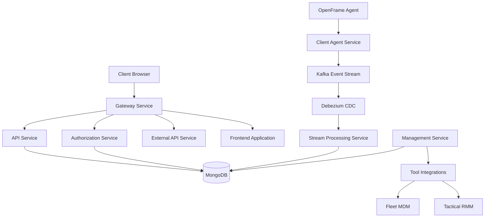
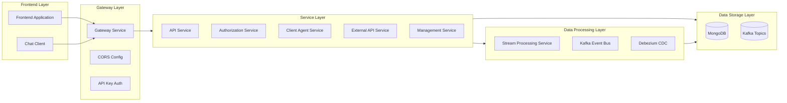
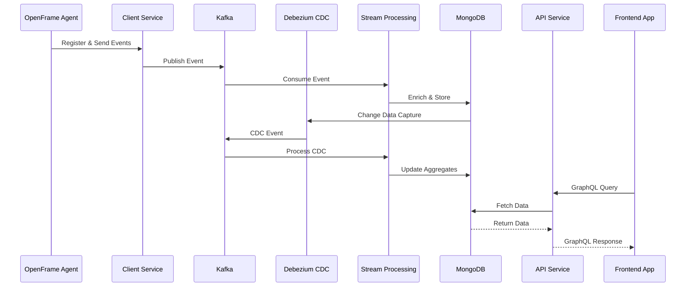

# OpenFrame OSS Tenant Repository

## Overview

The **openframe-oss-tenant** repository is the core multi-tenant deployment of the OpenFrame platform - an AI-driven MSP (Managed Service Provider) platform that unifies IT support operations across multiple tools and services. This repository contains the complete stack for running OpenFrame as a tenant-isolated system, including microservices, frontend applications, data layers, and tool integrations.

OpenFrame replaces expensive proprietary MSP software with open-source alternatives enhanced by intelligent automation, featuring:
- **Mingo AI**: AI assistant for technicians
- **Fae**: AI assistant for clients
- **Unified Interface**: Single platform integrating multiple MSP tools

## Architecture Overview

### High-Level System Architecture

### Service Layer Architecture

### Data Flow Architecture

## Core Modules

### Frontend Applications

#### 1. Frontend Application
**Path:** `openframe/services/openframe-frontend/src/app`

Main web application providing the unified MSP interface.

**Key Components:**
- **Authentication:** Multi-tenant authentication with OAuth2/PKCE flow
- **Device Management:** Real-time device monitoring and management
- **Logs Viewer:** Centralized log aggregation and search
- **Mingo AI Chat:** AI-powered technician assistant
- **Ticket System:** Integrated ticketing with AI support

**Documentation:** [Frontend Application Module](./docs/modules/frontend_application.md)

#### 2. Chat Client
**Path:** `clients/openframe-chat`

Standalone chat client for Mingo AI and Fae assistants.

**Key Services:**
- `DialogGraphQLService`: GraphQL-based dialog management
- `MockChatService`: Development/testing chat service
- `SupportedModelsService`: AI model configuration
- `TokenService`: Authentication token management

**Documentation:** [Chat Client Module](./docs/modules/chat_client.md)

#### 3. Chat UI Components
**Path:** `deps-openframe-oss-lib/openframe-frontend-core/src/components/chat`

Reusable React components for chat interfaces.

**Key Types:**
- `Message`: Chat message structure
- `ChatInputProps`: Input component configuration
- `ChatMessageListProps`: Message list configuration
- `WebSocketConfig`: Real-time communication setup
- `ChunkProcessor`: Streaming response handling

**Documentation:** [Chat UI Components Module](./docs/modules/chat_ui_components.md)

### Backend Services

#### 4. API Service
**Path:** `deps-openframe-oss-lib/openframe-api-service-core`

GraphQL API gateway providing unified data access.

**Key Controllers:**
- `DeviceController`: Device CRUD operations
- `OrganizationController`: Multi-tenant organization management

**Key Data Fetchers:**
- `DeviceDataFetcher`: GraphQL device queries
- `EventDataFetcher`: Event stream queries
- `LogDataFetcher`: Log aggregation queries

**Documentation:** [API Service Module](./docs/modules/api_service.md)

#### 5. Authorization Service
**Path:** `deps-openframe-oss-lib/openframe-authorization-service-core`

OAuth2 authorization server with multi-tenant support.

**Key Features:**
- OAuth2/OIDC authorization server
- Tenant-specific JWT signing keys
- PKCE flow support
- Tenant registration and onboarding

**Key Components:**
- `AuthorizationServerConfig`: OAuth2 server configuration
- `TenantKeyService`: Per-tenant key management
- `MongoAuthorizationService`: Authorization data persistence

**Documentation:** [Authorization Service Module](./docs/modules/authorization_service.md)

#### 6. Client Agent Service
**Path:** `deps-openframe-oss-lib/openframe-client-core`

Manages OpenFrame agent connections and data ingestion.

**Key Features:**
- Agent registration and authentication
- Real-time agent connection management
- Event ingestion from agents
- Agent health monitoring

**Key Components:**
- `AgentAuthController`: Agent authentication
- `ClientConnectionListener`: WebSocket connection handling
- `InstalledAgentListener`: Agent lifecycle events
- `DefaultAgentRegistrationProcessor`: Agent onboarding

**Documentation:** [Client Agent Service Module](./docs/modules/client_agent_service.md)

#### 7. External API Service
**Path:** `deps-openframe-oss-lib/openframe-external-api-service-core`

REST API for external integrations and webhooks.

**Key Controllers:**
- `DeviceController`: Device REST endpoints
- `EventController`: Event ingestion endpoints
- `LogController`: Log ingestion endpoints
- `OrganizationController`: Organization management

**Documentation:** [External API Service Module](./docs/modules/external_api_service.md)

#### 8. Gateway Service
**Path:** `deps-openframe-oss-lib/openframe-gateway-service-core`

API Gateway with routing, authentication, and CORS.

**Key Features:**
- Request routing to backend services
- API key authentication
- JWT token validation
- CORS configuration
- Rate limiting

**Key Components:**
- `GatewaySecurityConfig`: Security configuration
- `ApiKeyAuthenticationFilter`: API key validation
- `CorsConfig`: Cross-origin resource sharing

**Documentation:** [Gateway Service Module](./docs/modules/gateway_service.md)

#### 9. Management Service
**Path:** `deps-openframe-oss-lib/openframe-management-service-core`

System management and tool integration orchestration.

**Key Features:**
- Tool integration lifecycle management
- Agent initialization for integrated tools
- Health check scheduling
- System configuration management

**Key Components:**
- `IntegratedToolController`: Tool management API
- `IntegratedToolAgentInitializer`: Tool agent setup
- `DebeziumHealthCheckScheduler`: CDC health monitoring

**Documentation:** [Management Service Module](./docs/modules/management_service.md)

#### 10. Stream Processing Service
**Path:** `deps-openframe-oss-lib/openframe-stream-service-core`

Real-time event stream processing with Kafka Streams.

**Key Features:**
- Kafka Streams topology for event processing
- Debezium CDC event handling
- Activity enrichment and aggregation
- Real-time data transformation

**Key Components:**
- `KafkaStreamsConfig`: Stream processing configuration
- `DebeziumMessageHandler`: CDC event processing
- `JsonKafkaListener`: Event consumption
- `ActivityEnrichmentService`: Data enrichment

**Documentation:** [Stream Processing Service Module](./docs/modules/stream_processing_service.md)

### Data Layers

#### 11. MongoDB Data Layer
**Path:** `deps-openframe-oss-lib/openframe-data-mongo`

MongoDB persistence layer with multi-tenant data isolation.

**Key Documents:**
- `Device`: Device information and state
- `Machine`: Machine/endpoint details
- `Organization`: Tenant organization data
- `User`: User accounts and profiles
- `IntegratedTool`: Tool integration configurations
- `CoreEvent`: System events and audit logs

**Documentation:** [MongoDB Data Layer Module](./docs/modules/data_layer_mongo.md)

#### 12. Kafka Data Layer
**Path:** `deps-openframe-oss-lib/openframe-data-kafka`

Kafka event streaming infrastructure.

**Key Features:**
- Topic configuration and management
- Debezium CDC integration
- Event serialization/deserialization
- Retry and error handling

**Key Components:**
- `OssKafkaConfig`: Kafka client configuration
- `KafkaTopicProperties`: Topic definitions
- `DebeziumMessage`: CDC message structure
- `KafkaRecoveryHandlerImpl`: Error recovery

**Documentation:** [Kafka Data Layer Module](./docs/modules/data_layer_kafka.md)

### Tool Integrations

#### 13. Tool Integration SDK
**Path:** `deps-openframe-oss-lib/sdk`

SDKs for integrating external MSP tools.

**Supported Tools:**
- **Fleet MDM**: Mobile device management integration
  - `Host`: Device/host information
  - `Query`: Fleet query execution
- **Tactical RMM**: Remote monitoring and management
  - `AgentInfo`: RMM agent details
  - `RegistrationSecretParser`: Agent registration

**Documentation:** [Tool Integrations Module](./docs/modules/tool_integrations.md)

### Security & Infrastructure

#### 14. Security Core
**Path:** `deps-openframe-oss-lib/openframe-security-core`

Shared security components and utilities.

**Key Features:**
- JWT token generation and validation
- PKCE (Proof Key for Code Exchange) utilities
- Multi-tenant security context
- OAuth2 resource server configuration

**Key Components:**
- `JwtSecurityConfig`: JWT security configuration
- `JwtConfig`: JWT token settings
- `PKCEUtils`: PKCE code generation/validation

**Documentation:** [Security Core Module](./docs/modules/security_core.md)

## Technology Stack

### Frontend
- **React** with TypeScript
- **Next.js** for server-side rendering
- **GraphQL** for API communication
- **WebSocket** for real-time updates
- **Zustand** for state management

### Backend
- **Java 17** with Spring Boot 3.x
- **Spring Cloud Gateway** for API gateway
- **Spring Security** with OAuth2
- **GraphQL Java** for GraphQL API
- **Kafka Streams** for stream processing

### Data Storage
- **MongoDB** for primary data storage
- **Apache Kafka** for event streaming
- **Debezium** for change data capture

### Infrastructure
- **Docker** for containerization
- **Kubernetes** for orchestration (deployment-ready)
- **OAuth2/OIDC** for authentication
- **Multi-tenant architecture** with data isolation

## Getting Started

For detailed setup instructions, deployment guides, and development workflows, please refer to the main repository documentation:

- **Installation Guide:** [Getting Started](./docs/getting-started.md)
- **Development Setup:** [Development Guide](./docs/development.md)
- **Deployment:** [Deployment Guide](./docs/deployment.md)
- **API Documentation:** [API Reference](./docs/api-reference.md)

## Community & Support

OpenFrame is part of the OpenMSP community. For questions, discussions, and support:

- **Slack Community:** [Join OpenMSP Slack](https://join.slack.com/t/openmsp/shared_invite/zt-36bl7mx0h-3~U2nFH6nqHqoTPXMaHEHA)
- **Website:** [https://www.openmsp.ai/](https://www.openmsp.ai/)
- **Flamingo Platform:** [https://flamingo.run](https://flamingo.run)
- **OpenFrame:** [https://openframe.ai](https://openframe.ai)

**Note:** We do not use GitHub Issues or GitHub Discussions. All community interaction happens on our OpenMSP Slack workspace.

## Demo Video

Watch the OpenFrame platform demo to see the unified MSP interface in action, including device management, AI-powered chat, and real-time monitoring capabilities.

## License

This project is part of the OpenFrame open-source initiative. Please refer to the LICENSE file in the repository root for licensing information.