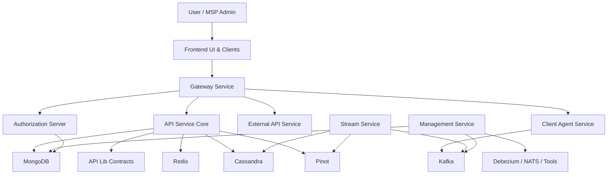
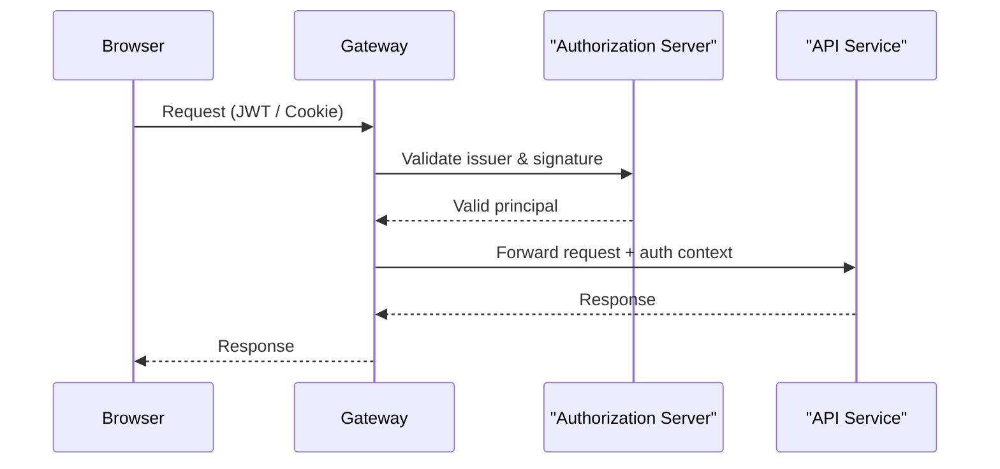
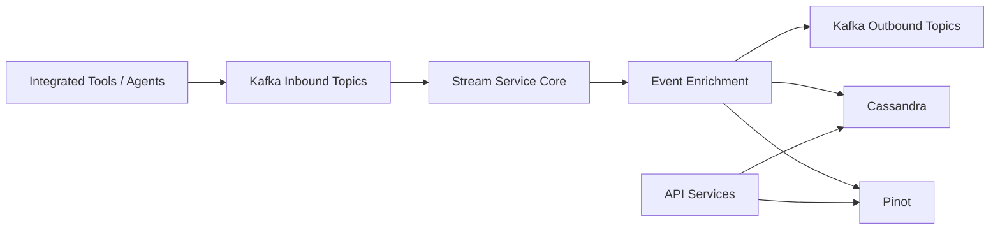

# openframe-oss-tenant

## Overview

The **openframe-oss-tenant** repository is the **open-source, multi-tenant backbone of the OpenFrame platform**, which powers Flamingo’s AI-driven MSP stack.  
It brings together **edge services, APIs, authorization, streaming, data layers, frontend clients, and agents** into a cohesive, tenant-aware system designed for scale, automation, and extensibility.

At a high level, this repository:

- Implements a **multi-tenant control plane** for MSP environments
- Provides **secure authentication and authorization** (OAuth2 / OIDC, SSO, API keys)
- Exposes **GraphQL and REST APIs** for devices, organizations, logs, events, tools, and AI chat
- Ingests and processes **real-time events** via Kafka, Debezium, and streams
- Integrates **agents and external tools** through a secure gateway
- Powers **frontend experiences** (OpenFrame UI, Mingo AI chat, desktop chat clients)
- Centralizes **data access** across MongoDB, Redis, Cassandra, Pinot, and Kafka

This repo is the canonical OSS reference for how OpenFrame is assembled end-to-end.

---

## End-to-End Architecture

### High-Level System View



---

### Request & Identity Flow



---

### Event & Streaming Flow



---

## Repository Structure (Conceptual)

```text
openframe-oss-tenant/
├─ clients/
│  └─ openframe-chat/                 # Desktop chat client (React + Tauri)
│
├─ openframe/
│  ├─ services/                       # Runtime Spring Boot services
│  │  ├─ openframe-api
│  │  ├─ openframe-gateway
│  │  ├─ openframe-authorization-server
│  │  ├─ openframe-external-api
│  │  ├─ openframe-management
│  │  ├─ openframe-stream
│  │  ├─ openframe-client
│  │  └─ openframe-config
│  │
│  └─ frontend/                       # OpenFrame frontend app & libraries
│
├─ openframe-oss-lib/                 # Shared service-core & data-layer modules
│  ├─ api-service-core
│  ├─ authorization-service-core
│  ├─ gateway-service-core
│  ├─ external-api-service-core
│  ├─ management-service-core
│  ├─ stream-service-core
│  ├─ client-service-core
│  ├─ security-oauth-*
│  ├─ data-layer-*
│  └─ config-core
```

---

## Core Modules & Documentation References

Below are the **primary building blocks** of the repository and where to look for their detailed documentation (all docs live alongside the modules themselves).

### Edge & Security
- **Gateway Service Core** – request routing, JWT & API-key enforcement  
  `openframe-oss-lib/openframe-gateway-service-core`
- **Authorization Service Core** – multi-tenant OAuth2 / OIDC, SSO, invitations  
  `openframe-oss-lib/openframe-authorization-service-core`
- **security_oauth_bff_core / security_oauth_web** – JWT, PKCE, OAuth BFF flows  
  `openframe-oss-lib/openframe-security-core`  
  `openframe-oss-lib/openframe-security-oauth`

---

### APIs
- **API Service Core (GraphQL & REST)** – primary read/write API surface  
  `openframe-oss-lib/openframe-api-service-core`
- **API Lib Contracts & Services** – shared DTOs, filters, mappers  
  `openframe-oss-lib/openframe-api-lib`
- **External API Service Core** – API-key–based integrations  
  `openframe-oss-lib/openframe-external-api-service-core`

---

### Agents & Tools
- **Client Service Core** – agent registration, heartbeats, lifecycle  
  `openframe-oss-lib/openframe-client-core`
- **Service Client Agent** – runtime wrapper for agent-facing APIs  
  `openframe/services/openframe-client`

---

### Streaming & Automation
- **Stream Service Core** – Kafka, Debezium, enrichment, event unification  
  `openframe-oss-lib/openframe-stream-service-core`
- **Management Service Core** – bootstrapping, schedulers, integrations  
  `openframe-oss-lib/openframe-management-service-core`

---

### Data Layers
- **MongoDB Data Layer** – users, OAuth, tenants  
  `openframe-oss-lib/openframe-data-mongo`
- **Redis Data Layer** – caching, rate limits, ephemeral state  
  `openframe-oss-lib/openframe-data-redis`
- **Kafka Data Layer** – tenant-aware Kafka configuration  
  `openframe-oss-lib/openframe-data-kafka`
- **Cassandra & Pinot Data Layer** – logs, analytics, time-series  
  `openframe-oss-lib/openframe-data`

---

### Frontend & Chat
- **Frontend Service Core Clients** – typed API & tool clients  
  `openframe/services/openframe-frontend/src/lib`
- **Frontend Auth Hooks** – tenant discovery, login, SSO  
  `openframe/services/openframe-frontend/src/app/auth/hooks`
- **Frontend Mingo Chat Core** – AI chat UX and state  
  `openframe/services/openframe-frontend/src/app/mingo`
- **OpenFrame Desktop Chat Client** – Tauri-based chat app  
  `clients/openframe-chat`

---

## Design Principles

- **Multi-tenant by default** – every layer is tenant-aware
- **Thin services, shared cores** – logic lives in reusable libraries
- **Gateway-first security** – centralized auth & enforcement
- **Event-driven** – Kafka and streams power automation and analytics
- **OSS-friendly** – composable, replaceable, and transparent

---

## Summary

The **openframe-oss-tenant** repository is the **reference implementation of OpenFrame’s full-stack architecture**.  
It demonstrates how Flamingo replaces proprietary MSP tooling with an **open, AI-augmented, multi-tenant platform**—from agents and gateways to APIs, data, streams, and AI-powered chat experiences.

This repo is best read **module by module**, using each module’s embedded documentation as the source of truth.