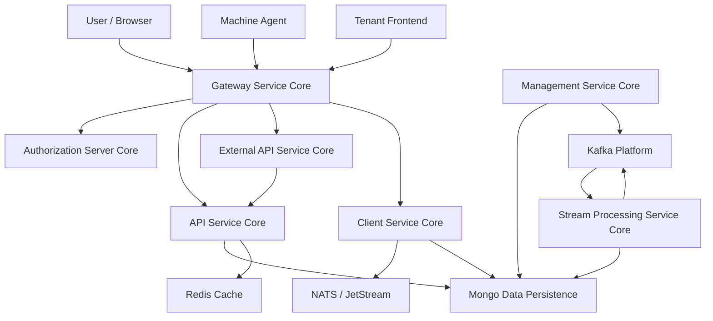

# openframe-oss-tenant — Repository Overview

## Purpose

`openframe-oss-tenant` is the **tenant-scoped OpenFrame runtime** that assembles Flamingo’s open‑source service cores into a deployable, multi-tenant MSP platform.  
It wires together identity, gateway, APIs, client/agent services, management, streaming, and data platforms into a cohesive system that powers **OpenFrame**—the unified AI-driven MSP interface.

This repository does **not** duplicate business logic. Instead, it:
- Composes reusable **OpenFrame OSS libraries**
- Defines **service entrypoints** for each backend service
- Represents the **reference tenant deployment** of the OpenFrame stack

---

## What This Repository Provides

- ✅ Multi-tenant **OAuth2 / OIDC Authorization Server**
- ✅ Reactive **Gateway** for HTTP and WebSocket traffic
- ✅ Internal **API Service** (REST + GraphQL)
- ✅ Public **External API** (API-key based)
- ✅ **Client / Agent Service** for machine onboarding and telemetry
- ✅ **Management Service** for tools, releases, schedulers
- ✅ **Stream Processing** for real-time events
- ✅ Shared **Mongo, Kafka, Redis** data platforms
- ✅ Frontend **tenant API clients and AI chat (Mingo)** integration

---

## End-to-End Architecture

### High-Level Platform Flow



**Key architectural principles:**
- Single ingress via **Gateway Service Core**
- Centralized identity via **Authorization Server Core**
- Clear separation between **internal APIs** and **external APIs**
- Event-driven workflows via **Kafka, NATS, JetStream**
- Strong tenant isolation across security, data, and caching layers

---

## Repository Structure (Conceptual)

```text
openframe-oss-tenant/
├─ openframe-oss-lib/          # Reusable service cores and data platforms
│  ├─ api-service-core
│  ├─ authorization-service-core
│  ├─ gateway-service-core
│  ├─ external-api-service-core
│  ├─ client-core
│  ├─ management-service-core
│  ├─ stream-service-core
│  ├─ data-mongo
│  ├─ data-kafka
│  ├─ data-redis
│  └─ security-core / oauth-bff
│
├─ openframe/services/         # Deployable service entrypoints
│  ├─ openframe-api
│  ├─ openframe-authorization-server
│  ├─ openframe-gateway
│  ├─ openframe-external-api
│  ├─ openframe-client
│  ├─ openframe-management
│  ├─ openframe-stream
│  └─ openframe-config
│
└─ openframe-frontend/         # Tenant frontend API clients and AI chat
```

---

## Core Modules and Documentation References

The following core modules are assembled by this repository. Each module contains its own detailed documentation within the codebase.

### Backend Service Cores
- **API Service Core** — Internal REST + GraphQL domain APIs
- **Authorization Server Core** — Multi-tenant OAuth2 / OIDC, SSO, invitations
- **Gateway Service Core** — Security, routing, rate limits, WebSockets
- **External API Service Core** — Public, API-key–based REST APIs
- **Client Service Core** — Agent auth, registration, heartbeats, tool events
- **Management Service Core** — Tool lifecycle, schedulers, initialization
- **Stream Processing Service Core** — Kafka-based event normalization and enrichment

### Data and Infrastructure
- **Data Persistence Mongo** — Tenant-aware MongoDB documents and repositories
- **Data Platform Kafka** — Kafka configuration, topics, CDC message models
- **Data Platform Redis Cache** — Tenant-safe caching and ephemeral state
- **Security Core & OAuth BFF** — JWT, PKCE, browser-based OAuth flows

### Frontend Integration
- **Frontend Tenant API Clients and Chat**
  - Central API client with auth and refresh handling
  - Tool-specific clients (Fleet MDM, Tactical RMM)
  - AI chat state management (Mingo)
  - Shared frontend domain models

---

## How to Think About This Repository

- This is the **assembly layer**, not the logic layer
- Each service is independently deployable
- All heavy logic lives in `openframe-oss-lib`
- Ideal starting point for:
  - Running OpenFrame locally or in production
  - Understanding full-system interactions
  - Building tenant-specific extensions without forking core libraries

---

## Summary

`openframe-oss-tenant` represents the **complete, open-source tenant deployment of OpenFrame**.  
It demonstrates how Flamingo’s modular OSS service cores combine into a secure, scalable, event-driven MSP platform—ready to power AI-assisted operations with Mingo and Fae across the entire stack.