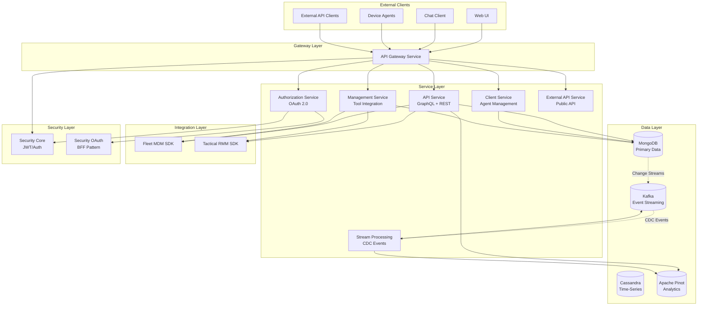
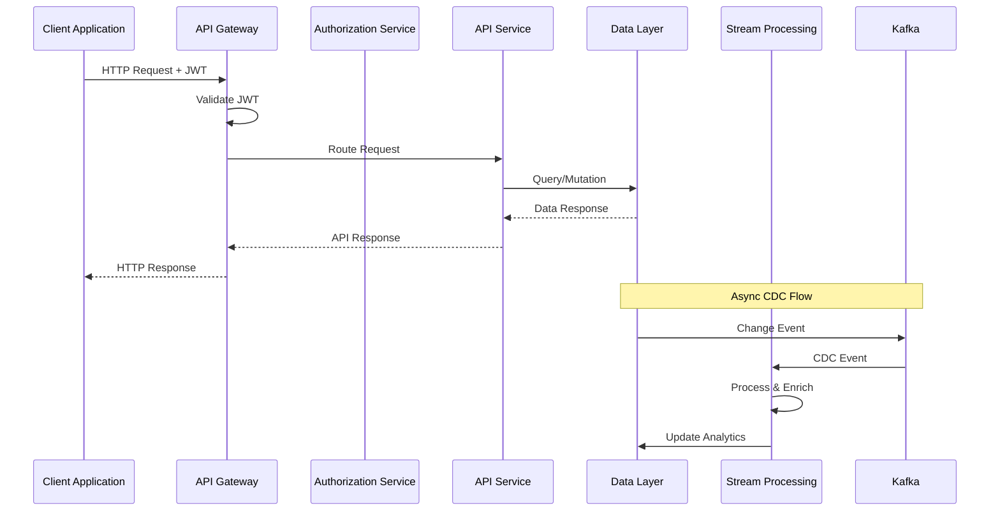
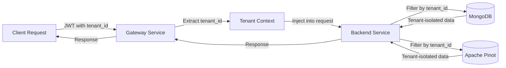
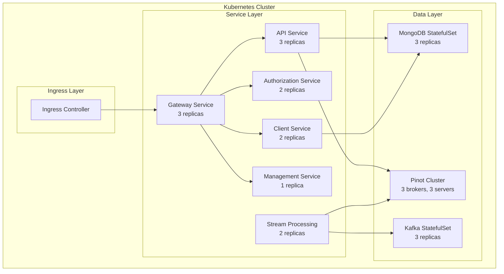
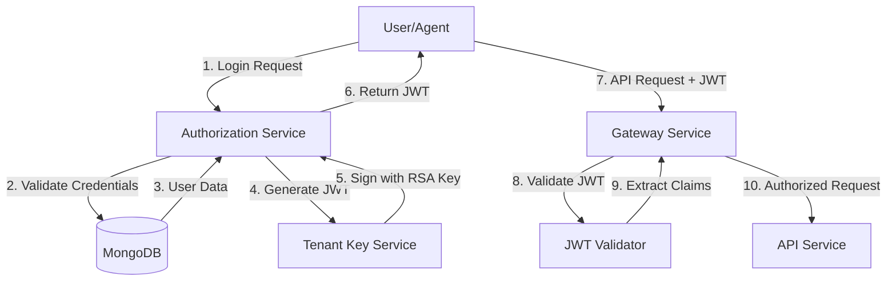

# OpenFrame OSS Tenant Repository Overview

## Introduction

The **openframe-oss-tenant** repository is the core multi-tenant backend infrastructure for the OpenFrame platform, an AI-powered MSP (Managed Service Provider) solution that replaces expensive proprietary software with open-source alternatives enhanced by intelligent automation. This repository contains the complete backend service architecture, data layers, security infrastructure, and integration SDKs that power the OpenFrame unified platform.

OpenFrame serves as the foundation for **Flamingo** (https://flamingo.run), providing Mingo AI for technicians and Fae for clients, all integrated through the OpenFrame unified interface (https://www.flamingo.run/openframe).

## Repository Purpose

The openframe-oss-tenant repository provides:

- **Multi-Tenant Backend Services**: Scalable microservices architecture supporting isolated tenant environments
- **Unified API Gateway**: Single entry point for all client requests with intelligent routing and security
- **AI-Powered Chat Services**: Real-time chat infrastructure for Mingo AI assistant integration
- **Device Management**: Comprehensive device monitoring and management across multiple RMM tools
- **Authentication & Authorization**: OAuth 2.0/OIDC-compliant multi-tenant authentication system
- **Data Layer Abstraction**: Unified data access across MongoDB, Cassandra, Apache Pinot, and Kafka
- **Integration SDKs**: Type-safe client libraries for Fleet MDM and Tactical RMM
- **Stream Processing**: Real-time event processing and CDC (Change Data Capture) integration

## Architecture Overview

The repository follows a **microservices architecture** with clear separation of concerns across multiple service layers:



### Key Architectural Principles

1. **Multi-Tenancy**: Tenant isolation at all layers (data, security, configuration)
2. **Microservices**: Independent, scalable services with clear boundaries
3. **Event-Driven**: Kafka-based event streaming for real-time data processing
4. **API-First**: GraphQL and REST APIs for flexible client integration
5. **Security-First**: OAuth 2.0, JWT-based authentication, and role-based access control
6. **Observability**: Comprehensive logging, metrics, and health checks

## Core Modules

The repository is organized into the following core modules:

### 1. API Service

**Purpose**: Primary internal GraphQL and REST API gateway for OpenFrame platform

**Key Features**:
- GraphQL API with Netflix DGS framework
- REST endpoints for CRUD operations
- Multi-tenant data isolation
- Cursor-based pagination
- Advanced filtering and search
- DataLoader batching for N+1 query prevention

**Technology Stack**: Spring Boot 3.x, Netflix DGS, Spring Data MongoDB

**Documentation**: [API Service](./api_service.md)

---

### 2. Authorization Service

**Purpose**: OAuth 2.0/OIDC-compliant multi-tenant authorization server

**Key Features**:
- OAuth 2.0 Authorization Code flow with PKCE
- Multi-tenant JWT signing with RSA key pairs
- Enterprise SSO integration (Microsoft Entra ID, Google Workspace)
- User lifecycle management (registration, invitation, password reset)
- Tenant-specific issuer URLs
- Dynamic OIDC client registration

**Technology Stack**: Spring Authorization Server, Spring Security OAuth2

**Documentation**: [Authorization Service](./authorization_service.md)

---

### 3. Gateway Service

**Purpose**: Central entry point for all client requests with intelligent routing and security

**Key Features**:
- Multi-tenant JWT authentication with issuer caching
- API key authentication with rate limiting
- WebSocket proxying for real-time communication
- CORS management
- Request routing to backend services
- Token refresh and session management

**Technology Stack**: Spring Cloud Gateway, Spring WebFlux

**Documentation**: [Gateway Service](./gateway_service.md)

---

### 4. Client Service

**Purpose**: Agent-based client connection management and device registration

**Key Features**:
- Agent registration and onboarding
- OAuth2-based agent authentication
- Real-time event processing via NATS
- Machine status management (online/offline)
- Installed agent tracking
- Heartbeat processing

**Technology Stack**: Spring Boot, NATS JetStream, Spring Cloud Stream

**Documentation**: [Client Service](./client_service.md)

---

### 5. Stream Processing Service

**Purpose**: Real-time event processing and data enrichment using Kafka Streams

**Key Features**:
- Debezium CDC event processing
- Stream-based data enrichment
- Activity-host join operations
- Multi-tenant event routing
- Kafka Streams topology
- Event handler extensibility

**Technology Stack**: Apache Kafka, Kafka Streams, Spring Kafka

**Documentation**: [Stream Processing](./stream_processing.md)

---

### 6. Management Service

**Purpose**: Configuration and lifecycle management of integrated tools and CDC connectors

**Key Features**:
- Integrated tool CRUD operations
- Agent lifecycle management
- Debezium connector provisioning
- Health monitoring with automatic recovery
- Hook-based extensibility
- Distributed scheduling with ShedLock

**Technology Stack**: Spring Boot, Debezium, MongoDB

**Documentation**: [Management Service](./management_service.md)

---

### 7. External API Service

**Purpose**: RESTful API gateway for external integrations and third-party applications

**Key Features**:
- API key authentication
- Rate limiting (minute/hour/day windows)
- Comprehensive resource access (devices, events, logs, organizations)
- Cursor-based pagination
- OpenAPI/Swagger documentation
- Error handling with standard HTTP status codes

**Technology Stack**: Spring Boot, Spring MVC, OpenAPI

**Documentation**: [External API](./external_api.md)

---

### 8. Data Layer - MongoDB

**Purpose**: Primary data persistence layer for transactional data

**Key Features**:
- Multi-tenant data isolation
- Document models for users, organizations, devices, machines, tools, events
- Blocking and reactive repository support
- Automatic auditing (timestamps)
- Soft delete pattern
- Custom converters for special data types

**Technology Stack**: Spring Data MongoDB, MongoDB

**Documentation**: [Data Layer MongoDB](./data_layer_mongo.md)

---

### 9. Data Layer - Core

**Purpose**: Analytical data access with Apache Cassandra and Apache Pinot

**Key Features**:
- Real-time analytics with sub-second query latency
- Time-series storage with Cassandra
- Dynamic filter options for UI components
- Log search and retrieval with pagination
- Device filter aggregations
- Query optimization for analytical workloads

**Technology Stack**: Apache Cassandra, Apache Pinot, Spring Data Cassandra

**Documentation**: [Data Layer Core](./data_layer_core.md)

---

### 10. Data Layer - Kafka

**Purpose**: Event streaming and CDC integration layer

**Key Features**:
- Kafka producer/consumer auto-configuration
- Debezium message models
- Retry and recovery mechanisms
- Topic management
- JSON serialization support
- Multi-tenant cluster support

**Technology Stack**: Apache Kafka, Spring Kafka, Debezium

**Documentation**: [Data Layer Kafka](./data_layer_kafka.md)

---

### 11. Security Core

**Purpose**: Foundational security library for JWT-based authentication

**Key Features**:
- JWT token management (encoding, decoding, validation)
- Authentication principal extraction
- OAuth2 security primitives (PKCE utilities)
- Secure cookie management
- Multi-actor support (ADMIN, AGENT)
- Multi-tenant security

**Technology Stack**: Spring Security, Nimbus JOSE+JWT

**Documentation**: [Security Core](./security_core.md)

---

### 12. Security OAuth

**Purpose**: Backend-for-Frontend (BFF) OAuth 2.0 implementation

**Key Features**:
- OAuth 2.0 Authorization Code flow with PKCE
- Secure cookie-based session management
- Multi-tenant OAuth flow support
- Development ticket system
- Token refresh and revocation
- Redirect target resolution

**Technology Stack**: Spring Security OAuth2, Spring WebFlux

**Documentation**: [Security OAuth](./security_oauth.md)

---

### 13. Fleet MDM SDK

**Purpose**: Java client library for Fleet Device Management integration

**Key Features**:
- Type-safe Fleet MDM API client
- Host management (search, retrieve, query)
- Query execution (osquery SQL)
- Enrollment secret retrieval
- Query management
- Comprehensive error handling

**Technology Stack**: Java 11+, Jackson

**Documentation**: [Fleet MDM SDK](./fleet_mdm_sdk.md)

---

### 14. Tactical RMM SDK

**Purpose**: Java client library for Tactical RMM integration

**Key Features**:
- Agent information retrieval
- Agent list management
- Registration secret parsing
- API response mapping
- Jackson-based JSON serialization

**Technology Stack**: Java 11+, Jackson

**Documentation**: [Tactical RMM SDK](./tactical_rmm_sdk.md)

---

## Data Flow Architecture

### End-to-End Request Flow



### Multi-Tenant Data Flow



## Technology Stack

### Backend Services

- **Framework**: Spring Boot 3.x, Spring Cloud
- **API**: Netflix DGS (GraphQL), Spring MVC (REST)
- **Security**: Spring Security, Spring Authorization Server
- **Reactive**: Spring WebFlux, Project Reactor

### Data Stores

- **Primary Database**: MongoDB (transactional data)
- **Time-Series**: Apache Cassandra (logs, metrics)
- **Analytics**: Apache Pinot (real-time OLAP)
- **Event Streaming**: Apache Kafka (CDC, events)

### Messaging & Events

- **Event Bus**: Apache Kafka
- **Real-Time**: NATS JetStream
- **CDC**: Debezium

### Integration

- **RMM Tools**: Fleet MDM, Tactical RMM, MeshCentral
- **Service Discovery**: Consul
- **Distributed Locking**: ShedLock

### Observability

- **Logging**: SLF4J, Logback
- **Metrics**: Spring Boot Actuator, Micrometer
- **Health Checks**: Spring Boot Actuator

## Deployment Architecture

### Kubernetes Deployment



### High Availability Configuration

- **Service Replication**: Multiple instances per service
- **Database Replication**: MongoDB replica sets, Kafka replication factor 3
- **Load Balancing**: Kubernetes service load balancing
- **Health Checks**: Liveness and readiness probes
- **Auto-Scaling**: Horizontal Pod Autoscaler (HPA)

## Security Architecture

### Authentication Flow



### Multi-Tenant Security

- **Tenant Isolation**: JWT claims include `tenant_id` for data filtering
- **Tenant-Specific Keys**: Each tenant has unique RSA signing keys
- **Issuer Validation**: JWT issuer includes tenant identifier
- **Data Filtering**: All queries automatically filtered by tenant ID
- **Cross-Tenant Prevention**: Strict validation prevents cross-tenant access

## Configuration Management

### Environment Variables

Key configuration variables across services:

| Variable | Description | Services |
|----------|-------------|----------|
| `MONGODB_URI` | MongoDB connection string | All services |
| `KAFKA_BOOTSTRAP_SERVERS` | Kafka broker addresses | Stream, Client, Management |
| `NATS_SERVERS` | NATS server URLs | Client |
| `PINOT_BROKER_URL` | Apache Pinot broker endpoint | API, External API |
| `JWT_SECRET` | JWT signing secret | Authorization |
| `CONSUL_HOST` | Consul server host | All services |

### Application Profiles

- **Development**: `dev` - Local development with debug logging
- **Staging**: `staging` - Pre-production testing environment
- **Production**: `prod` - Production deployment with optimized settings

## Monitoring & Observability

### Health Checks

All services expose Spring Boot Actuator health endpoints:

```bash
# Service health
GET /actuator/health

# Detailed health with components
GET /actuator/health/readiness
GET /actuator/health/liveness
```

### Metrics

Prometheus-compatible metrics exposed via Actuator:

```bash
# All metrics
GET /actuator/metrics

# Specific metric
GET /actuator/metrics/http.server.requests
```

### Logging

Structured logging with correlation IDs:

```text
2024-01-15 10:30:00.123 INFO [api-service,abc123,xyz789] Processing device query
```

## Development Workflow

### Local Development Setup

```bash
# Clone repository
git clone https://github.com/openframe/openframe-oss-tenant.git
cd openframe-oss-tenant

# Start infrastructure services
docker-compose up -d mongodb kafka consul

# Build all services
./mvnw clean install

# Run specific service
./mvnw spring-boot:run -pl services/openframe-api
```

### Testing

```bash
# Unit tests
./mvnw test

# Integration tests
./mvnw verify

# Specific module tests
./mvnw test -pl deps/openframe-oss-lib/openframe-api-service-core
```

## Integration Points

### External Tool Integration

The platform integrates with multiple RMM and management tools:

- **Fleet MDM**: Device management, policies, osquery
- **Tactical RMM**: Windows agent management, scripts, checks
- **MeshCentral**: Remote desktop, file management

### Frontend Integration

The backend services are consumed by:

- **[Frontend Main Application](./frontend_main.md)**: Web-based admin dashboard
- **[Frontend Chat Client](./frontend_chat.md)**: Desktop chat application
- **Mobile Applications**: iOS/Android apps (future)

## Performance Characteristics

### Throughput

- **API Service**: 1,000-10,000 requests/second per instance
- **Gateway Service**: 5,000-50,000 requests/second per instance
- **Stream Processing**: 10,000-100,000 events/second per instance

### Latency

- **API Queries**: <100ms (p95)
- **GraphQL Queries**: <200ms (p95)
- **Stream Processing**: <500ms (p95)
- **Real-time Events**: <50ms (p95)

### Scalability

- **Horizontal Scaling**: All services support horizontal scaling
- **Database Scaling**: MongoDB sharding, Kafka partitioning
- **Multi-Tenant**: Supports 1,000+ tenants per cluster

## Future Roadmap

### Planned Features

1. **Enhanced AI Capabilities**: Advanced Mingo AI features with multi-model support
2. **Mobile SDKs**: Native iOS and Android client libraries
3. **Advanced Analytics**: Real-time dashboards and reporting
4. **Workflow Automation**: Visual workflow builder for IT automation
5. **Multi-Region Support**: Geographic distribution for global deployments

### Technical Improvements

1. **gRPC Support**: High-performance inter-service communication
2. **GraphQL Federation**: Distributed GraphQL schema
3. **Service Mesh**: Istio integration for advanced traffic management
4. **Observability**: Distributed tracing with OpenTelemetry
5. **Chaos Engineering**: Automated resilience testing

## Contributing

For questions, issues, or contributions:

- **OpenMSP Slack Community**: [Join here](https://join.slack.com/t/openmsp/shared_invite/zt-36bl7mx0h-3~U2nFH6nqHqoTPXMaHEHA)
- **Website**: [https://www.openmsp.ai/](https://www.openmsp.ai/)

**Note**: We don't use GitHub Issues or GitHub Discussions. All support and discussions happen in our OpenMSP Slack community.

## License

OpenFrame is part of the Flamingo open-source MSP platform. See the main repository for license information.

---

**Last Updated**: 2024  
**Repository Version**: 1.0  
**Maintained By**: Flamingo/OpenFrame Team