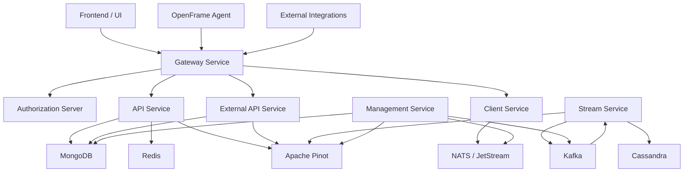
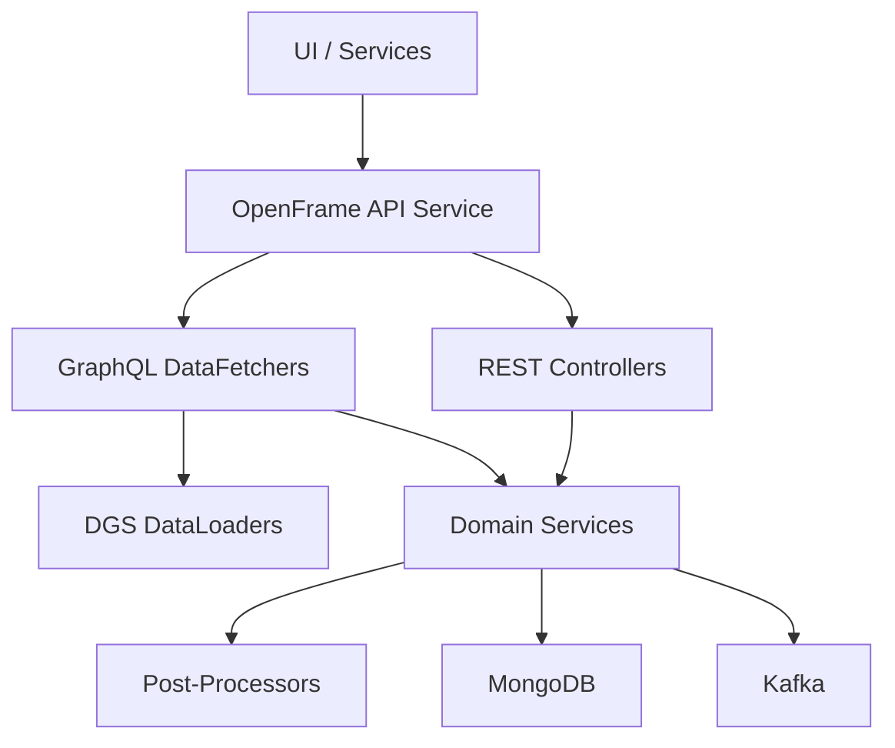
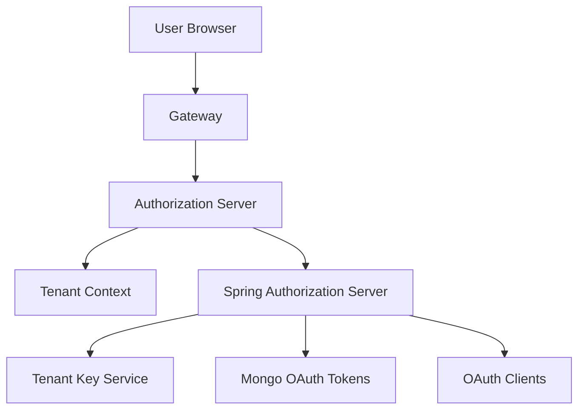
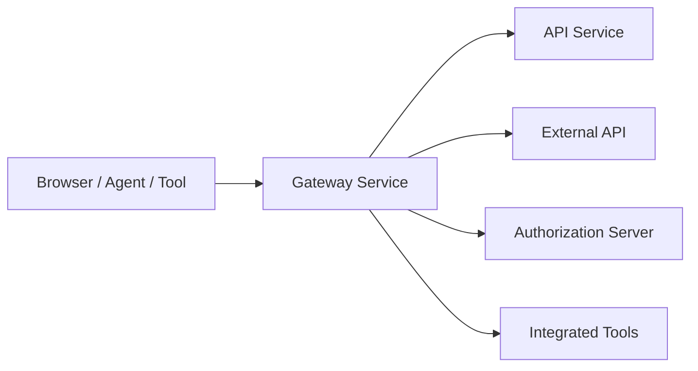
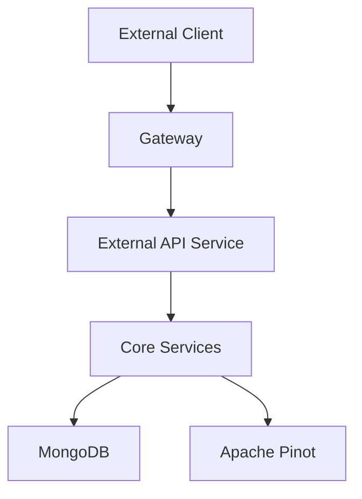
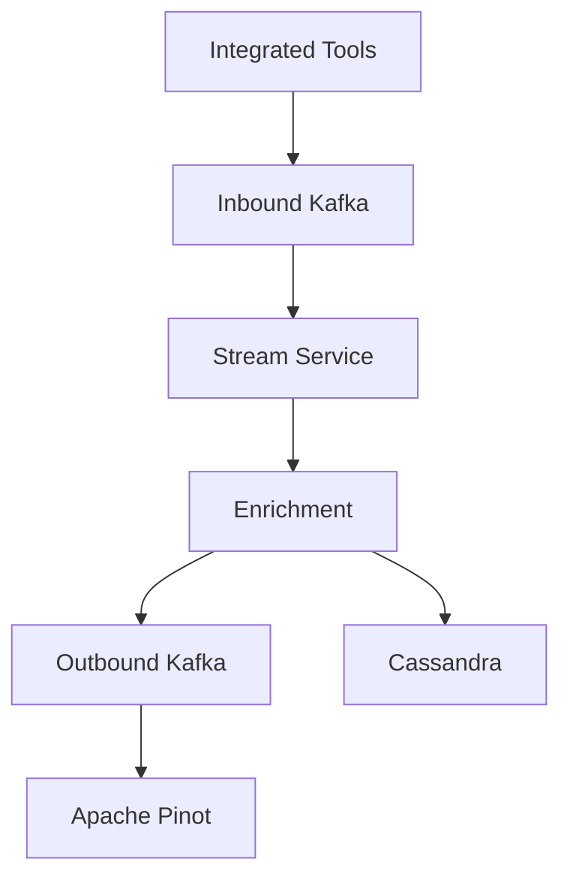
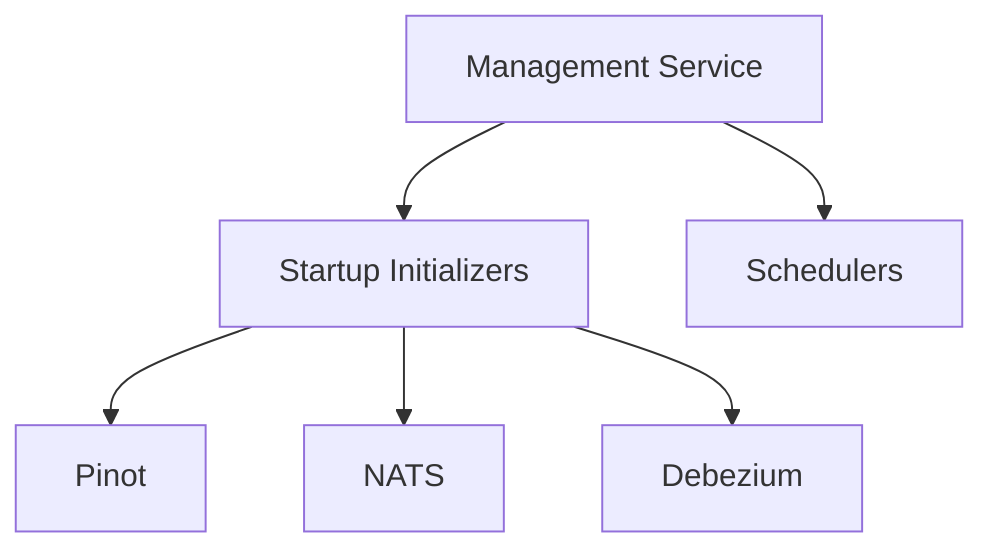

<OVERVIEW>

# openframe-oss-tenant — Repository Overview

## Overview

The **`openframe-oss-tenant`** repository is the **tenant-aware, open-source core of the OpenFrame platform**, powering Flamingo’s AI-driven MSP stack.  
It brings together all **runtime services**, **shared libraries**, and **data layers** required to operate OpenFrame as a **multi-tenant, cloud-native MSP platform**.

At a high level, this repository provides:

- A **multi-tenant control plane** (authentication, authorization, tenant discovery)
- A **unified API layer** (REST + GraphQL) for UI, agents, and integrations
- A **gateway ingress** that centralizes security, routing, and WebSockets
- **External APIs** for partners and automations (API-key–based)
- **Real-time streaming & enrichment** for events and logs
- **Lifecycle management** for tools, agents, connectors, and infrastructure
- **Shared data & security libraries** reused across all services

This repository is designed to be:
- **Composable** (services + shared libs)
- **Extensible** (processor hooks, overrides, tenant customization)
- **Scalable** (Kafka, Pinot, Cassandra, Redis)
- **Vendor-neutral** (open-source-first MSP tooling)

---

## Repository Structure (High Level)

```text
openframe-oss-tenant/
├── openframe/services/              # Runtime microservices
│   ├── openframe-api                # Core REST + GraphQL API
│   ├── openframe-authorization-server
│   ├── openframe-gateway
│   ├── openframe-external-api
│   ├── openframe-client
│   ├── openframe-stream
│   └── openframe-management
│
├── openframe-oss-lib/                # Shared libraries
│   ├── openframe-data-mongo
│   ├── openframe-data (Kafka, Redis, Cassandra, Pinot)
│   ├── openframe-security-core
│   ├── openframe-security-oauth
│   ├── openframe-api-lib
│   └── openframe-core
│
└── openframe-frontend (consumer)     # Referenced by APIs (not the focus here)
```

---

## End-to-End Architecture

### Platform-Level View



**Key ideas:**
- **Gateway-first**: All ingress flows through the gateway
- **Tenant-aware security**: Tokens, keys, and issuers are tenant-scoped
- **Event-driven core**: Kafka + Stream Service normalize all tool activity
- **Read/write separation**: Mongo for transactions, Pinot for analytics

---

## Core Runtime Services

### 1. OpenFrame API Service

**Purpose**
- Central backend API for OpenFrame
- Serves the UI, agents, and internal services

**Key Capabilities**
- REST + GraphQL (Netflix DGS)
- User, organization, device, tool management
- SSO configuration & lifecycle
- Agent registration & force actions
- Cursor-based pagination with DataLoaders

**Architecture (Internal)**



📘 **Core documentation**: `openframe-api-service`

---

### 2. Authorization Server

**Purpose**
- Multi-tenant OAuth 2.1 / OIDC authorization server

**Key Capabilities**
- Tenant discovery & registration
- Username/password and SSO (Google, Microsoft)
- Per-tenant signing keys (JWKS)
- Invitations, password reset, lifecycle hooks

**Architecture**



📘 **Core documentation**: `authorization-server`

---

### 3. Gateway Service

**Purpose**
- Unified ingress and security enforcement layer

**Key Capabilities**
- JWT & API-key authentication
- Rate limiting
- WebSocket proxying (agents, tools, NATS)
- Tenant-aware issuer validation
- CORS and header normalization

**Architecture**



📘 **Core documentation**: `gateway-service`

---

### 4. External API Service

**Purpose**
- Stable, API-key–secured REST API for integrations

**Key Capabilities**
- Events, logs, devices, tools, organizations
- Cursor-based pagination
- Filtering & sorting optimized for automation
- No UI coupling, no GraphQL

**Architecture**



📘 **Core documentation**: `external-api-service`

---

### 5. Stream Service

**Purpose**
- Real-time ingestion, normalization, and enrichment of events

**Key Capabilities**
- Kafka & Kafka Streams
- Debezium CDC handling
- Tool-specific deserialization (Fleet, Tactical, MeshCentral)
- Unified event model
- Fan-out to Kafka, Cassandra, Pinot

**Architecture**



📘 **Core documentation**: `stream-service`

---

### 6. Management Service

**Purpose**
- Platform control plane & lifecycle orchestration

**Key Capabilities**
- Integrated tool management
- Debezium connector lifecycle
- Pinot schema & table initialization
- NATS JetStream provisioning
- Distributed schedulers (ShedLock)

**Architecture**



📘 **Core documentation**: `management-service`

---

## Shared Libraries (openframe-oss-lib)

### Data Layers
- **Mongo**: System of record (users, orgs, tools, config)
- **Kafka**: Event streaming backbone
- **Redis**: Tenant-aware caching & locks
- **Cassandra**: Scalable audit/event storage
- **Pinot**: Real-time analytics & filtering

📘 Docs:
- `data-layer-mongo`
- `data-layer-kafka-redis-cassandra-pinot`

---

### Security Libraries
- **security-core**: JWT, PKCE, shared constants
- **security-oauth-bff**: Browser-friendly OAuth BFF

📘 Docs:
- `security-core`
- `security-oauth-bff`

---

### Core Utilities & API Contracts
- **core-shared-utils**: Pagination, slugs, validation
- **api-lib-dtos**: Shared API & filter DTOs

📘 Docs:
- `core-shared-utils`
- `api-lib-dtos`

---

## Summary

The **`openframe-oss-tenant`** repository is the **complete, tenant-aware backend foundation** of OpenFrame and Flamingo:

- ✅ Multi-tenant by design  
- ✅ Event-driven and analytics-ready  
- ✅ Secure OAuth2/OIDC foundation  
- ✅ Extensible via processors and hooks  
- ✅ Open-source–first MSP platform core  

It enables Flamingo to replace proprietary MSP software with a **modern, open, AI-ready platform** that scales from single tenants to large MSPs operating thousands of endpoints.

---