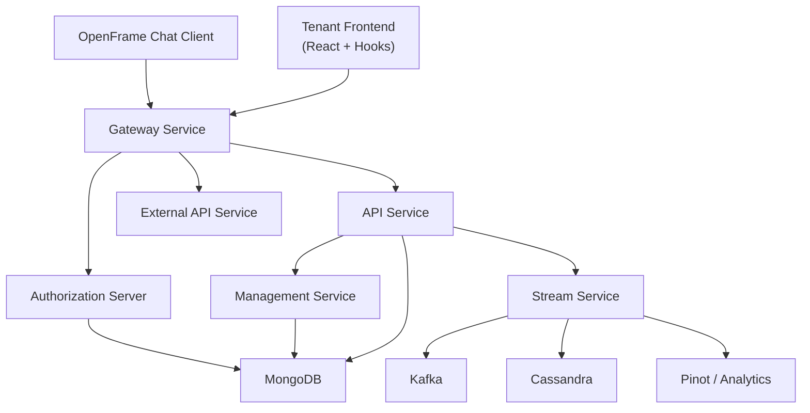

# openframe-oss-tenant

## Overview

The **`openframe-oss-tenant`** repository is the **open-source, tenant-aware distribution of OpenFrame**, Flamingo’s unified AI-powered MSP platform.  
It brings together **frontend clients**, **API services**, **authorization**, **gateway**, **stream processing**, **management**, and **data layers** into a cohesive, modular system designed for:

- Multi-tenant MSP environments  
- Open-source–first replacements for proprietary MSP tooling  
- AI-assisted workflows (Mingo AI for technicians, Fae for clients)  
- Strong separation of concerns with clear extension points  

This repository represents the **full end-to-end OpenFrame stack**, wired together in a way that supports both OSS deployments and SaaS-style multi-tenant hosting.

---

## What This Repository Is For

`openframe-oss-tenant` serves as:

- ✅ The **reference OSS implementation** of OpenFrame  
- ✅ A **tenant-scoped assembly** of all core Flamingo/OpenFrame services  
- ✅ A foundation for MSPs to self-host, extend, or customize OpenFrame  
- ✅ The integration point between frontend UX, backend APIs, auth, and data  

It intentionally avoids monolithic design and instead favors **clear service boundaries**, **shared libraries**, and **contract-driven APIs**.

---

## End-to-End Architecture

At a high level, OpenFrame follows a **Gateway → API/Auth → Domain Services → Data/Stream** model, with frontend and chat clients consuming the platform through secure, tenant-aware entry points.

### High-Level System View



---

## Core Architectural Layers

### 1. Client & Frontend Layer

- **Tenant Frontend**  
  - Domain hooks and Zustand stores  
  - API clients and auth hooks  
  - GraphQL and REST consumption via Gateway  

- **Chat Client Core**  
  - Token management and API routing  
  - GraphQL-based dialog and message retrieval  
  - Mock and debug tooling for development  

These layers never talk directly to backend services—**everything flows through the Gateway**.

---

### 2. Gateway & Security Layer

- **Gateway Service**
  - Single ingress for all HTTP and WebSocket traffic  
  - JWT and API key authentication  
  - Tenant-aware routing and header enrichment  
  - WebSocket proxying for tools and agents  

- **Security Core & OAuth BFF**
  - Shared JWT, OAuth, and PKCE primitives  
  - OAuth Backend-for-Frontend flows  
  - Cookie-based session handling  

This layer enforces **platform-wide security and tenancy guarantees**.

---

### 3. Identity & Authorization

- **Authorization Server**
  - OAuth2 / OIDC provider  
  - Per-tenant JWT issuers and signing keys  
  - SSO (Google, Microsoft) and invitation flows  
  - Dynamic client registration  

This service is the **single source of truth for identity** across OpenFrame.

---

### 4. API Layer

- **API Service**
  - REST controllers for core platform operations  
  - GraphQL layer (Netflix DGS) for rich querying  
  - Cursor-based pagination and DataLoaders  
  - Thin orchestration over domain services  

- **External API Service**
  - API-key–secured REST APIs for third parties  
  - Stable, versioned DTO contracts  
  - Proxy access to integrated tools  

The API layer is intentionally **transport-focused**, delegating logic downward.

---

### 5. Domain & Processing Layer

- **Core Domain Services**
  - Stateless business services  
  - Batch-oriented APIs for GraphQL DataLoaders  
  - Shared mappers and processors  

- **Processors & User Services**
  - User lifecycle management  
  - SSO configuration services  
  - Tenant-extensible processors via safe defaults  

This layer contains **business meaning without transport coupling**.

---

### 6. Management & Control Plane

- **Management Service**
  - Startup initialization and orchestration  
  - Distributed schedulers (ShedLock + Redis)  
  - Tool lifecycle hooks  
  - Pinot and Debezium bootstrap  

This service ensures the platform is **self-initializing and self-healing**.

---

### 7. Stream & Event Processing

- **Stream Service**
  - Kafka and Kafka Streams processing  
  - CDC ingestion (Debezium)  
  - Event normalization and enrichment  
  - Fan-out to analytics and storage  

- **Shared Kafka Layer**
  - Tenant-aware Kafka configuration  
  - Shared message models and headers  

This enables **real-time observability and analytics** across tenants.

---

### 8. Data Layer

- **MongoDB**
  - Primary transactional store  
  - Users, orgs, devices, tools, OAuth, config  

- **Kafka**
  - Event backbone  
  - CDC, activity streams, analytics feeds  

- **Cassandra**
  - High-volume log and event persistence  

- **Apache Pinot**
  - Low-latency analytics and filtering  

All data layers are **explicitly separated** and accessed through repositories.

---

## Repository Structure (Conceptual)

```text
openframe-oss-tenant/
├── clients/
│   └── openframe-chat/            # Chat client core
├── openframe/
│   └── services/
│       ├── openframe-frontend/    # Tenant frontend
│       ├── openframe-gateway/     # Gateway service
│       ├── openframe-api/         # API service
│       ├── openframe-authz/       # Authorization server
│       ├── openframe-management/  # Management service
│       ├── openframe-stream/      # Stream service
│       └── openframe-external-api/# External API
├── openframe-oss-lib/
│   ├── openframe-api-lib/
│   ├── openframe-data-*/
│   ├── openframe-security-*/
│   ├── openframe-stream-service-core/
│   └── sdk/                       # Tool SDK integrations
```

---

## Core Modules Documentation (Entry Points)

The following modules form the **conceptual backbone** of the repository and are documented in detail within the codebase:

- **Chat Client Core** – client-side chat orchestration and GraphQL access  
- **API Service (App, REST, GraphQL)** – primary business API surface  
- **Authorization Server** – OAuth2, OIDC, SSO, tenant identity  
- **Gateway Service** – security, routing, WebSockets  
- **Management Service** – initialization, schedulers, tool lifecycle  
- **Stream Service** – Kafka ingestion, enrichment, analytics pipelines  
- **Data Layer (Mongo, Kafka, Cassandra, Pinot)** – persistence and analytics  
- **Security Core & OAuth Support** – shared JWT, PKCE, and OAuth utilities  
- **SDK Integrations** – FleetDM and Tactical RMM models and parsers  
- **Tenant Frontend Hooks & Stores** – frontend domain logic and state  

Each module is designed to be **independently understandable**, **replaceable**, and **extensible**, while still fitting cleanly into the overall OpenFrame platform.

---

## Summary

`openframe-oss-tenant` is not just a code repository—it is the **reference architecture** for OpenFrame as an open-source, AI-first MSP platform.  

It demonstrates how Flamingo brings together:

- 🔐 Secure, tenant-aware identity  
- 🌐 Unified gateway access  
- 🧠 AI-assisted workflows  
- 📊 Real-time analytics  
- 🔌 Tool integrations  
- 🧩 Clean modular design  

All while remaining **OSS-friendly, extensible, and production-grade**.