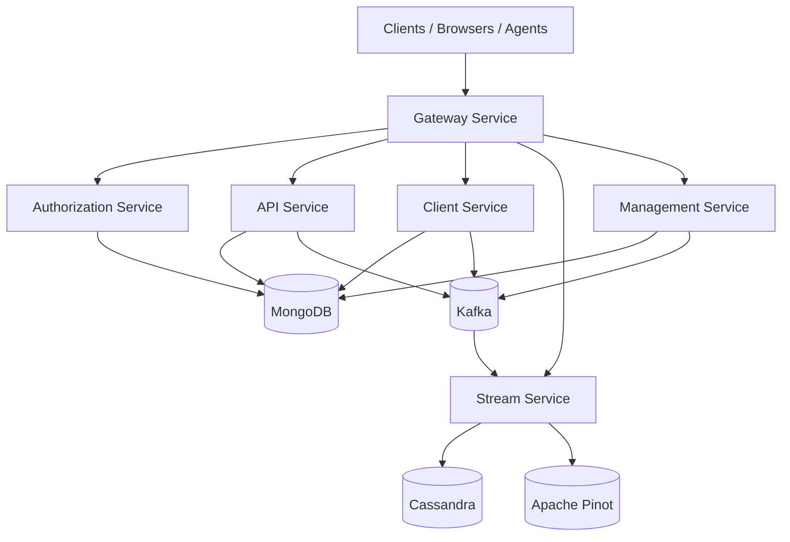
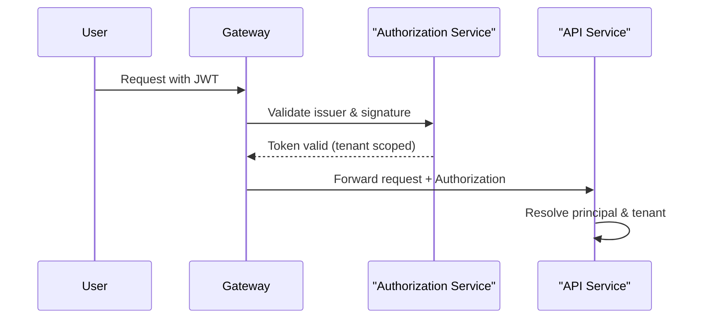

# openframe-oss-tenant — Repository Overview

## Purpose

The **`openframe-oss-tenant`** repository is the **multi-tenant, open-source backbone of the OpenFrame platform**, powering Flamingo’s AI-driven MSP stack.  
It contains all **runtime services**, **shared libraries**, and **infrastructure modules** required to operate OpenFrame as a secure, scalable, and tenant-isolated SaaS platform.

This repository enables:

- ✅ Multi-tenant authentication & authorization (OAuth2 / OIDC / SSO)
- ✅ Unified API layer (REST + GraphQL)
- ✅ Secure gateway routing (HTTP + WebSocket)
- ✅ Agent & client lifecycle management
- ✅ Event streaming & enrichment (Kafka, Debezium)
- ✅ Centralized management & orchestration
- ✅ Shared persistence, security, and messaging foundations

In short: **this repo is the full OpenFrame control plane and data plane for tenant-based deployments**.

---

## High-Level Architecture

At a system level, OpenFrame follows a **gateway-first, service-oriented architecture** with strong separation between:

- **Edge & Security**
- **Domain APIs**
- **Streaming & Event Processing**
- **Management & Control Plane**
- **Shared Infrastructure Libraries**

### End-to-End Platform Flow

---

## Core Runtime Services

### 1. Gateway Service
**Path:** `openframe/services/openframe-gateway`

**Role:**  
The **single entry point** for all external traffic.

**Responsibilities:**
- JWT & API key authentication
- Tenant resolution via issuer URLs
- REST & WebSocket proxying
- CORS and origin sanitization

📄 Documentation:
- Gateway Application
- Gateway Service Core

---

### 2. Authorization Service
**Path:** `openframe/services/openframe-authorization-server`

**Role:**  
Multi-tenant **OAuth2 / OIDC Authorization Server**.

**Responsibilities:**
- Tenant-aware JWT issuance
- SSO (Google, Microsoft) onboarding
- Invitations & tenant registration
- Secure key management per tenant

📄 Core documentation modules:
- authz_service_core_security_tenant
- authz_service_core_controllers
- authz_service_core_dtos
- authz_service_core_keys_and_persistence
- authz_service_core_auth_flow_and_processors

---

### 3. API Service
**Path:** `openframe/services/openframe-api`

**Role:**  
Primary **business API layer** (REST + GraphQL).

**Responsibilities:**
- User, device, organization, tool APIs
- GraphQL data access & pagination
- Delegation to domain services

📄 Core documentation modules:
- api_service_core_config_security
- api_service_core_rest_controllers
- api_service_core_graphql_fetchers_loaders
- api_service_core_domain_services_processors
- api_service_core_dtos

---

### 4. Client Service
**Path:** `openframe/services/openframe-client`

**Role:**  
Manages **agents, client authentication, and telemetry**.

**Responsibilities:**
- Agent registration & authentication
- Heartbeats and metrics ingestion
- Tool agent lifecycle handling

📄 Core documentation modules:
- client_core_agent_controllers_and_flow

---

### 5. Stream Service
**Path:** `openframe/services/openframe-stream`

**Role:**  
Real-time **event ingestion, normalization, and enrichment**.

**Responsibilities:**
- Consume Debezium CDC events
- Normalize tool-specific events
- Enrich with tenant & device context
- Persist to Cassandra / Pinot

📄 Core documentation modules:
- stream_service_core_kafka_processing

---

### 6. Management Service
**Path:** `openframe/services/openframe-management`

**Role:**  
Platform **control plane & orchestration service**.

**Responsibilities:**
- Bootstrap tools, agents, streams
- Manage release versions
- Run schedulers and health checks
- Initialize Kafka, NATS, Pinot, Debezium

📄 Core documentation modules:
- management_service_app
- management_service_core

---

## Shared Libraries & Foundations

These modules are **consumed across all services** and define platform-wide contracts.

### Security & OAuth
- **shared_security_oauth_utilities**  
  JWT config, PKCE helpers, OAuth constants
- **shared_security_oauth_bff**  
  OAuth Backend-for-Frontend (cookie-based auth)

### Persistence
- **shared_data_mongo_core**  
  MongoDB documents, repositories, indexes
- **shared_data_platform_config**  
  Cassandra, Pinot, SDK configuration

### Messaging
- **shared_kafka_library**  
  Kafka config, topics, Debezium models, recovery handlers

### API Contracts
- **api_lib_dtos_and_services**  
  Shared DTOs, mappers, and read-focused services

---

## Tenant-Aware Security Model (Conceptual)

---

## Design Principles

- **Tenant-first**: every request is tenant-scoped
- **Gateway-enforced security**: services trust the gateway
- **Thin controllers**: logic lives in domain services
- **Extensible by default**: `Default*` processors are overridable
- **Event-driven**: Kafka & streams decouple writes from reads
- **OSS-friendly**: replaces proprietary MSP tooling

---

## Summary

The **`openframe-oss-tenant`** repository is not a single service—it is the **entire OpenFrame platform**:

- 🔐 Secure, multi-tenant authentication & authorization  
- 🌐 Unified API & gateway layer  
- ⚙️ Agent, client, and tool lifecycle management  
- 📊 Event-driven streaming & analytics  
- 🧩 Modular, extensible, and OSS-native  

It forms the **technical foundation of Flamingo and OpenFrame**, enabling MSPs to run a modern, AI-powered, open-source operations stack at scale.