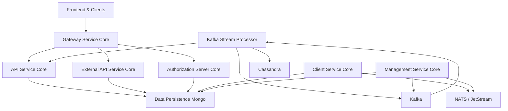
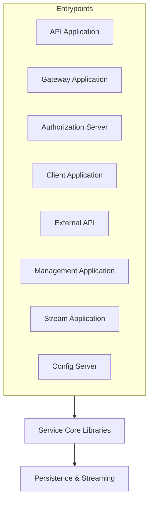
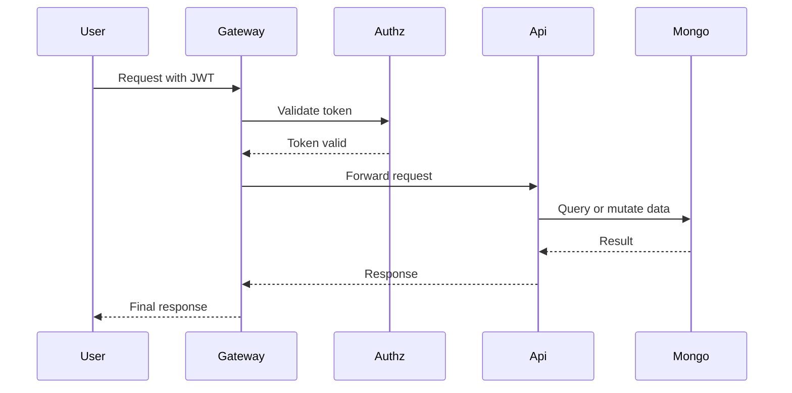

# openframe-oss-tenant — Repository Overview

## Purpose

`openframe-oss-tenant` is the **tenant-level OpenFrame distribution** that assembles all core OpenFrame OSS libraries into deployable, production-ready services.  
It represents a **full multi-tenant MSP platform backend**, powering Flamingo and OpenFrame deployments across SaaS and self‑hosted environments.

This repository does **not** re‑implement core logic. Instead, it:

- Composes **service-core libraries** from `openframe-oss-lib`
- Defines **service entrypoints** (Spring Boot applications)
- Establishes **runtime boundaries** between API, Gateway, Auth, Streaming, Management, and Client services
- Acts as the **canonical reference architecture** for OpenFrame tenants

In short:  
**If you want to run OpenFrame for a tenant, this is the repository you deploy.**

---

## High-Level System Architecture

The platform follows a **gateway-first, multi-service architecture** with strict separation of concerns.

**Key architectural principles:**

- **Single ingress** via Gateway  
- **JWT & API key enforcement** at the edge  
- **Multi-tenant isolation** enforced at Auth, Gateway, and Data layers  
- **Event-driven enrichment** via Kafka Streams  
- **Clear read/write boundaries** between internal APIs and external integrations  

---

## Repository Structure (Conceptual)

The repository is organized into **three logical layers**:

---

## Core Service Entrypoints

These are the **deployable Spring Boot applications** defined in this repository:

- **API Application**  
  Internal REST + GraphQL APIs for users, orgs, devices, tools, logs, events

- **Gateway Application**  
  Single ingress point, routing, JWT & API key auth, WebSocket proxying

- **Authorization Server Application**  
  OAuth2 / OIDC, SSO, invitations, tenant onboarding, JWT issuance

- **Client Application**  
  Agent authentication, machine registration, heartbeat & lifecycle events

- **External API Application**  
  Versioned, API-key–secured REST APIs for third‑party integrations

- **Management Application**  
  Operational control plane: tool lifecycle, Debezium, NATS, schedulers

- **Stream Application**  
  Kafka Streams–based real-time event normalization and enrichment

- **Config Server Application**  
  Centralized configuration bootstrap for all services

---

## Core Libraries (Referenced by This Repo)

Each service entrypoint wires one or more **service-core libraries** from `openframe-oss-lib`:

| Core Module | Responsibility |
|------------|---------------|
| **API Service Core** | Internal REST + GraphQL APIs, orchestration layer |
| **API Lib Contracts** | Shared DTOs, filters, pagination, mappers |
| **Authorization Server Core** | OAuth2, OIDC, SSO, tenant-aware identity |
| **Gateway Service Core** | Routing, JWT & API key enforcement, WebSockets |
| **Client Service Core** | Agent registration, auth, NATS event listeners |
| **Data Persistence Mongo** | MongoDB documents, repositories, indexes |
| **Kafka Stream Processor** | Event ingestion, enrichment, fan‑out |
| **Management Service Core** | Tool management, schedulers, initializers |
| **Security OAuth BFF** | Frontend OAuth orchestration layer |

Each of these modules is documented **in its own README** within the corresponding library path and should be treated as the authoritative reference for behavior and extension points.

---

## End-to-End Request Flow Example

---

## What This Repository Is (and Is Not)

✅ **Is:**
- A full **tenant runtime** for OpenFrame
- The **assembly point** for all backend services
- A **reference deployment architecture**
- Suitable for SaaS and self-hosted environments

❌ **Is Not:**
- A monolith
- A place for core business logic (that lives in service-core libs)
- A frontend-only repository
- A simple SDK or client library

---

## Summary

`openframe-oss-tenant` is the **canonical OpenFrame backend distribution**.  
It defines how all OpenFrame OSS components come together to form a secure, multi-tenant, event-driven MSP platform.

If you understand this repository, you understand **how OpenFrame runs in production**.