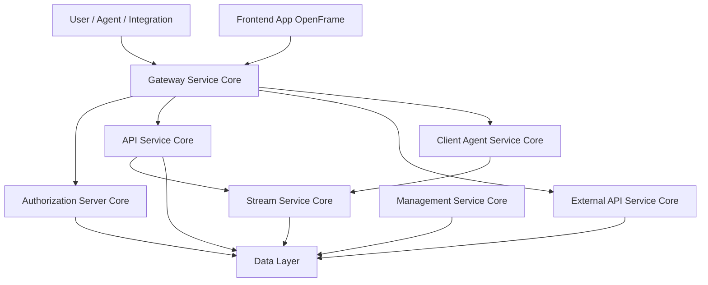
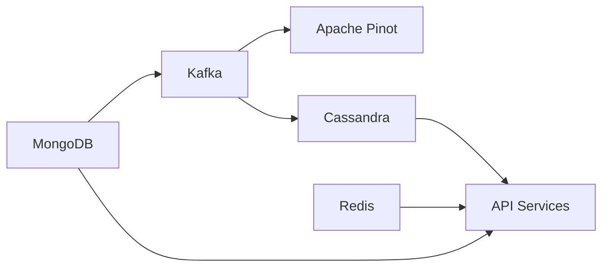
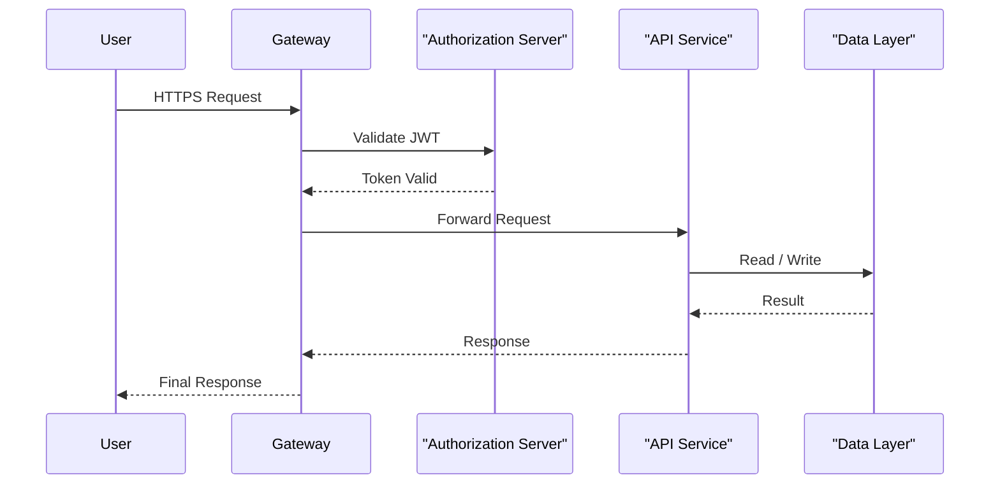

# openframe-oss-tenant — Repository Overview

## Purpose

The **`openframe-oss-tenant`** repository is the **canonical open-source, tenant-aware distribution of OpenFrame**, Flamingo’s AI-powered MSP platform.  
It brings together **all core backend services, shared libraries, data layers, client agents, and frontend applications** required to run OpenFrame as a complete, multi-tenant system.

This repository is designed to:

- Provide a **production-grade, end-to-end MSP platform** built on open-source technologies  
- Enable **multi-tenant SaaS or self-hosted deployments**
- Act as the **integration point** between AI-driven workflows (Mingo AI), automation, agents, and external tools
- Serve as the **single source of truth** for service composition, contracts, and runtime entrypoints

In practice, `openframe-oss-tenant` is not a single service—it is the **entire OpenFrame platform assembled as a cohesive system**.

---

## High-Level Platform Architecture

At the highest level, OpenFrame follows a **gateway-first, service-oriented architecture** with strict separation between ingress, identity, APIs, streaming, management, and data persistence.

**Key architectural principles:**

- **Single ingress** via Gateway Service Core  
- **Tenant-aware identity** via Authorization Server Core  
- **Clear command/query separation** (REST + GraphQL)  
- **Event-driven architecture** for agents, tools, and observability  
- **Shared contracts** across all services to ensure consistency  

---

## Repository Structure (Conceptual)

The repository is organized around **shared libraries**, **service entrypoints**, **clients**, and **frontend applications**:

- **Shared Libraries (`openframe-oss-lib/`)**
  - API contracts and DTOs
  - Security and OAuth primitives
  - Gateway, authorization, streaming, and data abstractions

- **Service Entrypoints (`openframe/services/`)**
  - Executable Spring Boot applications
  - Each entrypoint assembles a production-ready service

- **Clients**
  - Desktop and embedded clients (for example, OpenFrame Chat)
  - Client-side services used by the frontend and Tauri-based apps

- **Frontend**
  - The OpenFrame web application used by technicians and administrators

---

## Core Runtime Services

### 1. Gateway Service Core
**Role:** Unified ingress and security perimeter

- Routes HTTP and WebSocket traffic
- Enforces JWT and API key authentication
- Applies rate limiting, CORS, and origin sanitization
- Proxies traffic to internal services and integrated tools

📘 Reference: *Gateway Service Core documentation*

---

### 2. Authorization Server Core
**Role:** Tenant-aware OAuth2 and OpenID Connect issuer

- Handles login, SSO, invitations, and tenant registration
- Issues tenant-scoped JWTs with custom claims
- Manages per-tenant signing keys and OIDC metadata

📘 Reference: *Authorization Server Core documentation*

---

### 3. API Service Core
**Role:** Internal system-of-record API

- REST APIs for commands and admin operations
- GraphQL APIs for rich querying and relationships
- Uses DataLoaders to prevent N+1 queries
- Delegates persistence to the Data Layer

📘 Reference: *Api Service Core documentation*

---

### 4. External API Service Core
**Role:** Public, API-key–authenticated integration surface

- Stable REST APIs for external systems
- Cursor-based pagination and advanced filtering
- Safe proxying to integrated third-party tools

📘 Reference: *External Api Service Core documentation*

---

### 5. Client Agent Service Core
**Role:** Agent lifecycle and connectivity backend

- Registers and authenticates client agents
- Tracks machine heartbeats and online status
- Processes tool installation and connection events
- Bridges agent events into the streaming system

📘 Reference: *Client Agent Service Core documentation*

---

### 6. Stream Service Core
**Role:** Real-time event ingestion and normalization

- Consumes Kafka and Debezium events
- Normalizes tool-specific events into unified models
- Enriches events with tenant, machine, and org context
- Persists events to Cassandra and publishes downstream

📘 Reference: *Stream Service Core documentation*

---

### 7. Management Service Core
**Role:** Platform control plane and orchestration

- Bootstraps tools, agents, streams, and analytics
- Manages Debezium, NATS, Pinot, and version propagation
- Runs distributed schedulers and health checks

📘 Reference: *Management Service Core documentation*

---

## Data Layer

The **Data Layer** provides a unified abstraction over multiple storage and streaming technologies:

**Responsibilities:**

- MongoDB for transactional and tenant data
- Redis for caching and ephemeral state
- Kafka for event streaming and CDC
- Cassandra for high-volume, time-series data
- Pinot for real-time analytics and filtering

📘 Reference: *Data Layer Mongo Redis Kafka Pinot Cassandra documentation*

---

## Frontend and Clients

### Frontend App OpenFrame
**Role:** Primary technician and admin UI

- React and Next.js–based web application
- Consumes APIs via Gateway Service Core
- Exposes device management, logs, tickets, and AI workflows
- Integrates Mingo AI directly into the UI

📘 Reference: *Frontend App OpenFrame Frontend documentation*

---

### Chat Client OpenFrame Chat
**Role:** Client-side conversational interface

- Handles dialog streaming and AI responses
- Manages tokens and environment awareness
- Supports multiple AI models and providers
- Provides debug and mock services for development

📘 Reference: *Chat Client Openframe Chat documentation*

---

## Service Entrypoints

All runtime services are launched from dedicated **Spring Boot entrypoints**, including:

- API Service
- Authorization Server
- Gateway Service
- External API Service
- Client Agent Service
- Stream Service
- Management Service
- Configuration Service

These entrypoints define **what actually runs in production** and how shared libraries are assembled.

📘 Reference: *Service Entrypoints documentation*

---

## End-to-End Request Flow

---

## Summary

The **`openframe-oss-tenant`** repository is:

- ✅ A **full-stack, production-ready MSP platform**
- ✅ Built around **multi-tenancy, extensibility, and automation**
- ✅ Composed of **clearly separated, independently deployable services**
- ✅ Backed by a **robust data and streaming foundation**
- ✅ Designed to power **AI-driven IT operations at scale**

This repository is the **authoritative OpenFrame OSS distribution**, intended for operators, contributors, and integrators who want to run or extend OpenFrame as a complete platform.