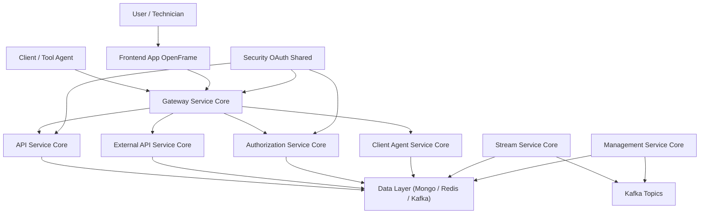

# openframe-oss-tenant — Repository Overview

## Purpose

The **`openframe-oss-tenant`** repository is the **reference multi-tenant OpenFrame distribution** used by Flamingo and the OpenMSP ecosystem.  
It assembles all OpenFrame **service cores**, **shared libraries**, **runtime entrypoints**, **frontend applications**, and **agent-facing services** into a single, production-ready OSS tenant stack.

This repository answers one core question:

> **How do all OpenFrame OSS components run together as a complete, multi-tenant MSP platform?**

It is designed for:
- MSPs deploying OpenFrame as a self-hosted or managed SaaS
- Contributors who need a full-system view (not just libraries)
- Operators who want a clear service topology and responsibility boundaries

---

## What This Repository Contains

At a high level, `openframe-oss-tenant` provides:

- ✅ **Service Entrypoints** (Spring Boot applications)
- ✅ **Service Core Libraries** (API, Auth, Gateway, Stream, Management, Client)
- ✅ **Shared Infrastructure Layers** (Mongo, Redis, Kafka, Security)
- ✅ **Frontend Applications** (Web UI, Desktop Chat Client)
- ✅ **Agent & Tool Connectivity Services**
- ✅ **Multi-tenant security and OAuth foundations**

This repo does **not** duplicate business logic.  
Instead, it **composes and wires together** the OpenFrame OSS building blocks into runnable services.

---

## End-to-End Platform Architecture

The diagram below shows the **runtime architecture** of an OpenFrame tenant deployment.

### Key Architectural Principles

- **Gateway-first security**  
  All HTTP and WebSocket traffic flows through the Gateway, where authentication, authorization, CORS, rate limits, and tenant isolation are enforced.

- **Thin services, strong cores**  
  Entrypoints contain almost no logic. All behavior lives in reusable service-core libraries.

- **Multi-tenant by default**  
  Tenant context is enforced across OAuth, JWTs, Kafka, MongoDB, Redis, and caches.

- **Event-driven backbone**  
  Kafka, Debezium, and Stream Service Core normalize events across tools and agents.

---

## Core Service Domains (With Documentation References)

Below is how the repository is logically organized, with references to the **core module documentation already present in this repo**.

### Backend Service Cores

| Domain | Module |
|------|--------|
| Internal APIs & GraphQL | **Api Service Core** |
| OAuth2 / OIDC / SSO | **Authorization Service Core** |
| Ingress, routing, security | **Gateway Service Core** |
| Public API (API keys) | **External Api Service Core** |
| Platform automation & schedulers | **Management Service Core** |
| Event processing & enrichment | **Stream Service Core** |
| Agent lifecycle & connectivity | **Client Agent Service Core** |

Each of these modules is documented inline in this repository under their respective paths in `openframe-oss-lib`.

---

### Shared Infrastructure Layers

| Layer | Responsibility |
|-----|----------------|
| **Data Layer (Mongo / Redis / Kafka)** | Persistence, caching, streaming primitives |
| **Security OAuth Shared** | JWT, PKCE, OAuth BFF, shared security utilities |

These layers ensure:
- Consistent schemas and repositories
- Safe multi-tenant caching
- Standardized Kafka messaging
- Centralized cryptography and OAuth logic

---

### Service Entrypoints

The **Service Entrypoints** module defines the actual **deployable applications**:

- API Service
- Authorization Server
- Gateway
- External API
- Management
- Stream Processor
- Client Agent Service
- Config Server

Each entrypoint is a Spring Boot application that **assembles one service core into a runnable unit**.

---

### Frontend & Client Applications

| Component | Role |
|---------|------|
| **Frontend App OpenFrame** | Main web UI for technicians and admins |
| **Frontend Chat Client** | Desktop (Tauri) AI chat experience |

These clients communicate **only through the Gateway**, using OAuth, cookies, and GraphQL/REST APIs.

---

## How to Use This Repository

You typically use `openframe-oss-tenant` when you want to:

- Run **a full OpenFrame tenant** locally or in production
- Understand **how services interact end-to-end**
- Extend or customize behavior at the service-core level
- Operate OpenFrame as part of Flamingo or OpenMSP

For contribution and coordination, discussions and planning happen in the **OpenMSP Slack community**, not GitHub Issues.

---

## Summary

**`openframe-oss-tenant` is the canonical, full-stack OpenFrame OSS tenant implementation.**

It brings together:
- Modular service cores
- Strong multi-tenant security
- Event-driven infrastructure
- Agent and tool connectivity
- Frontend and desktop clients

All wired into a cohesive, production-grade MSP platform foundation.

If you understand this repository, you understand **how OpenFrame actually runs**.