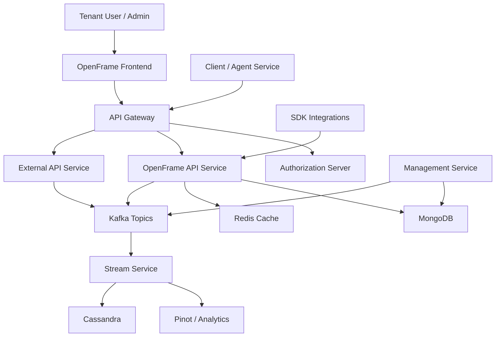

<OVERVIEW>

# openframe-oss-tenant — Repository Overview

## Purpose

`openframe-oss-tenant` is the **tenant-facing OpenFrame OSS monorepo**.  
It provides the full, end-to-end implementation of the OpenFrame platform for Managed Service Providers (MSPs), covering:

- **Multi-tenant backend services** (API, Auth, Gateway, Management, Stream, Client)
- **Shared OSS libraries** (data, security, messaging, SDKs)
- **Tenant web frontend** (OpenFrame UI)
- **AI-powered chat and automation clients**
- **Event-driven data ingestion and streaming**

The repository is designed to run OpenFrame as a **cloud-native, microservice-based platform**, replacing proprietary MSP tooling with open-source components enhanced by automation and AI.

---

## High-Level Architecture

At a high level, OpenFrame follows a layered, event-driven architecture:

- **Frontend & Clients** → Tenant UI, Chat, Agents  
- **Gateway & Security** → Routing, OAuth2/OIDC, JWT, API keys  
- **Core Services** → API, Authorization, Management, External API  
- **Streaming & Messaging** → Kafka, Debezium, real-time enrichment  
- **Persistence & Caching** → MongoDB, Cassandra/Pinot, Redis  
- **SDKs & Integrations** → FleetDM, TacticalRMM, external tools  

---

## End-to-End Architecture Diagram

**Key characteristics:**

- **Gateway-first access** for all frontend and agent traffic  
- **OAuth2 / OIDC multi-tenant security** via Authorization Server  
- **Event-driven data flow** using Kafka and Debezium  
- **Separation of concerns** between API, Management, Streaming, and Auth  
- **Pluggable integrations** via SDK modules  

---

## Core Service Modules

### Service Bootstrap Applications (`openframe/services`)

These are the runnable Spring Boot services:

- **openframe-api** — Core tenant GraphQL/REST API
- **openframe-authorization-server** — OAuth2/OIDC, SSO, tenant registration
- **openframe-gateway** — API gateway, security filters, WebSocket proxying
- **openframe-management** — Tool lifecycle, versioning, schedulers
- **openframe-external-api** — Public-facing REST API for integrations
- **openframe-stream** — Kafka consumers, event enrichment
- **openframe-client** — Agent and client communication
- **openframe-config** — Centralized configuration service

---

## Shared OSS Libraries

### API & Domain Logic
- **openframe-api-service-core** — Controllers, GraphQL fetchers, services
- **openframe-api-lib** — DTOs, filters, shared API contracts

### Security
- **openframe-authorization-service-core** — Tenant-aware auth logic
- **openframe-security-core / oauth** — JWT, PKCE, OAuth BFF utilities

### Gateway
- **openframe-gateway-service-core** — Routing, filters, WebSocket support

### Data & Messaging
- **openframe-data-mongo** — MongoDB documents and repositories
- **openframe-data-kafka** — Kafka config, models, retry handling
- **openframe-data-redis** — Redis cache configuration
- **openframe-data** — Cassandra, Pinot, NATS models and services

### Streaming
- **openframe-stream-service-core** — Kafka Streams, event handlers

### Management
- **openframe-management-service-core** — Tool registration, schedulers

### Client & Agent
- **openframe-client-core** — Agent auth, registration, heartbeat listeners

### Notifications
- **openframe-notification-mail** — SMTP and HubSpot email providers

### SDKs
- **sdk/fleetmdm** — FleetDM integration models
- **sdk/tacticalrmm** — TacticalRMM integration utilities

---

## Frontend & Client Applications

### Tenant Frontend
- **openframe-frontend** — Main tenant UI
  - Auth & SSO hooks
  - Devices, logs, policies, tickets
  - Mingo AI integration
  - Typed API clients (Fleet, Tactical, Auth)

### Chat & AI Clients
- **clients/openframe-chat**
  - Dialog GraphQL service
  - Token handling
  - Supported model discovery
  - Debug and mock services

### Shared Frontend Types
- **openframe-frontend-core (chat types)**
  - Chat API contracts
  - Component props and message models
  - Streaming and WebSocket types

---

## Summary

`openframe-oss-tenant` is the **complete, production-grade OpenFrame tenant stack**, combining:

- Modular microservices
- Strong multi-tenant security
- Event-driven data pipelines
- Rich frontend and AI-powered chat experiences
- Extensible SDK-based integrations

It serves as the foundation for running OpenFrame as an **open-source, AI-enabled MSP platform** at scale.

---