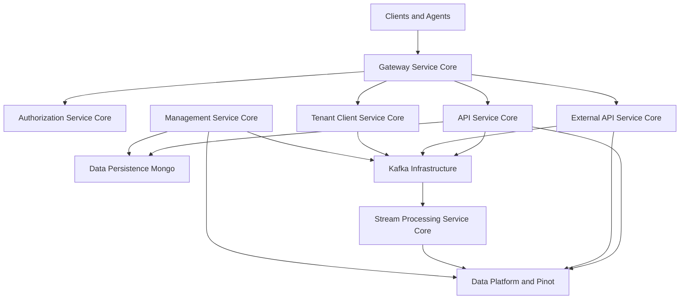
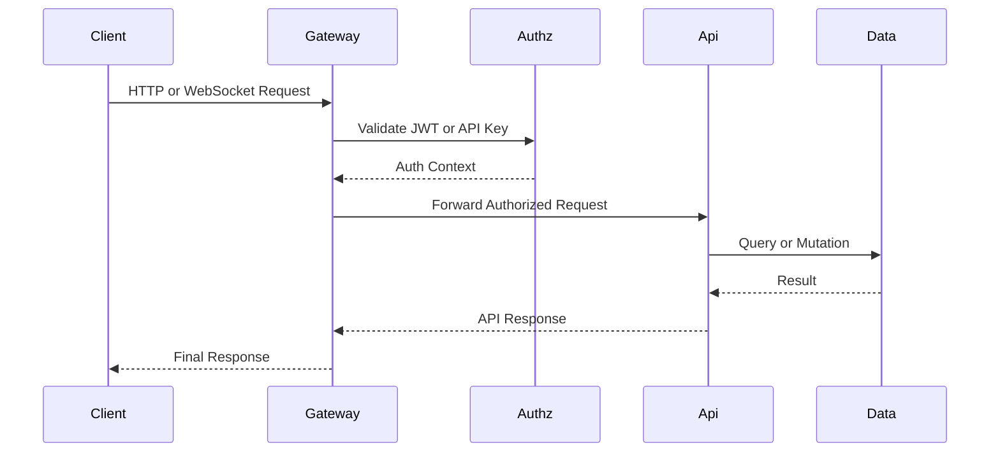
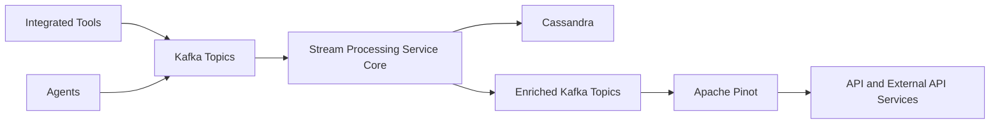

# openframe-oss-tenant — Repository Overview

## Purpose

The **`openframe-oss-tenant`** repository is the **multi-tenant, open-source backbone of the OpenFrame platform**, powering Flamingo’s AI-driven MSP stack.  
It assembles all **core backend services, shared libraries, data infrastructure, and client integrations** required to operate OpenFrame in an OSS or self-hosted tenant environment.

This repository is responsible for:

- Running the **full OpenFrame backend** (Gateway, API, Auth, Stream, Management, External API)
- Enforcing **multi-tenant security and identity** (OAuth2, OIDC, SSO)
- Providing **event-driven, real-time data pipelines** (Kafka, Streams, Pinot)
- Exposing **internal, external, and agent-facing APIs**
- Supplying **shared contracts, data models, and infrastructure primitives**
- Powering **client and chat experiences** via shared frontend types and services

In short:  
> **If OpenFrame is the platform, `openframe-oss-tenant` is the system that runs it.**

---

## High-Level Architecture

At a platform level, OpenFrame follows a **Gateway-first, event-driven, multi-service architecture**.

---

## End-to-End Request and Data Flow

### User / Agent Request Flow

---

### Event and Analytics Flow

---

## Repository Structure (Conceptual)

The repository is organized into **three major layers**:

### 1. Service Entrypoints (Runnable Applications)

These are the **deployable Spring Boot services**:

- **Gateway Service**
- **API Service**
- **Authorization Server**
- **External API Service**
- **Client (Agent) Service**
- **Stream Processing Service**
- **Management Service**
- **Config Service**

📄 See: **Service Entrypoints** documentation

---

### 2. Core Service Modules

These implement the actual platform behavior:

- **Gateway Service Core** — routing, security, WebSockets
- **Authorization Service Core** — OAuth2, OIDC, SSO, tenants
- **API Service Core** — internal REST + GraphQL APIs
- **External API Service Core** — API-key–based public APIs
- **Stream Processing Service Core** — Kafka-based event normalization
- **Management Service Core** — initialization, schedulers, tooling
- **Tenant Client Service Core** — agents and client-facing APIs

Each core module is **framework-focused and reusable**, composed into services by entrypoints.

---

### 3. Shared Libraries and Infrastructure

These libraries are consumed across services:

- **API Lib Contracts** — shared DTOs, filters, pagination
- **Data Persistence Mongo** — MongoDB schema and repositories
- **Data Platform and Pinot** — analytics, Cassandra, Pinot queries
- **Data Infra Kafka and Topics** — Kafka config and message contracts
- **Data Infra Redis Cache** — tenant-aware caching
- **Security OAuth Support** — JWT, PKCE, OAuth primitives
- **Security OAuth BFF** — browser-friendly OAuth flows
- **Config Service Core** — centralized configuration
- **IDP Configuration** — gateway OAuth client bootstrap
- **Core Shared Utilities** — pagination, slugging, validation
- **Notification Mail** — SMTP and HubSpot email delivery
- **Frontend Chat Core Types** — shared frontend chat schemas
- **Chat Client Services** — client-side chat service layer

---

## Core Module Documentation References

Use these module docs as **entry points for deeper understanding**:

- **Gateway Service Core** — request routing, security, WebSockets  
- **Authorization Service Core** — identity, tenants, OAuth2, SSO  
- **API Service Core** — internal REST and GraphQL APIs  
- **External API Service Core** — public API surface  
- **Stream Processing Service Core** — event ingestion and enrichment  
- **Management Service Core** — initialization and platform control  
- **API Lib Contracts** — shared DTOs and filters  
- **Data Persistence Mongo** — MongoDB data model  
- **Data Platform Services and Pinot** — analytics and querying  
- **Data Infra Kafka and Topics** — Kafka backbone  
- **Data Infra Redis Cache** — caching infrastructure  
- **Security OAuth Support** — shared security primitives  
- **Security OAuth BFF** — browser OAuth flows  
- **Service Entrypoints** — how services are assembled and run  

Each of these modules is fully documented within the repository and designed to evolve independently while remaining contract-compatible.

---

## Design Principles

`openframe-oss-tenant` is built around a few non-negotiable principles:

- **Gateway-first security** — no service trusts the edge
- **Tenant isolation everywhere** — identity, data, cache, streams
- **Event-driven by default** — Kafka as the backbone
- **Contract-first APIs** — shared DTOs and schemas
- **Composable services** — cores reused across entrypoints
- **OSS-friendly** — no proprietary lock-in required

---

## Summary

The **`openframe-oss-tenant`** repository is the **complete, production-grade OpenFrame backend**, packaged as a multi-tenant open-source system.

It brings together:
- Identity and security
- APIs (internal and external)
- Streaming and analytics
- Data persistence and caching
- Management and automation
- Client and chat enablement

If you are:
- Deploying OpenFrame
- Extending Flamingo
- Building MSP automations
- Contributing to the OpenFrame ecosystem

👉 **This repository is the foundation you build on.**