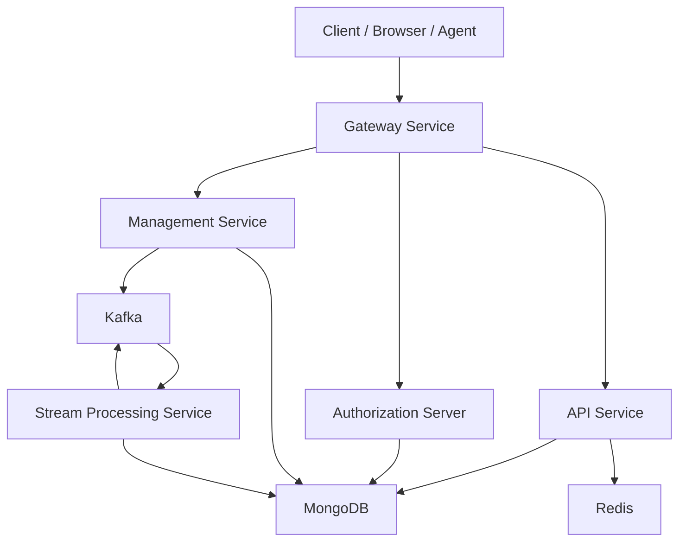
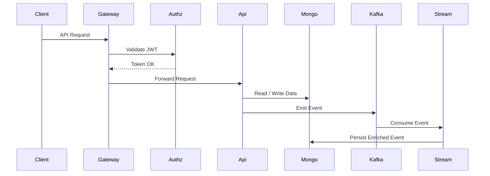

# openframe-oss-tenant — Repository Overview

## Purpose

`openframe-oss-tenant` is the **multi-tenant, open-source backend stack** that powers **OpenFrame** and **Flamingo**.  
It provides a full, modular MSP platform covering **API services, gateway, authorization, management, streaming, data layers, and shared security**, designed to replace proprietary MSP tooling with open, extensible infrastructure.

This repository acts as:

- ✅ The **canonical OSS tenant implementation** of OpenFrame
- ✅ A **reference architecture** for running OpenFrame in production
- ✅ A **monorepo** that composes reusable libraries into deployable services

---

## High-Level Architecture

At a system level, OpenFrame follows a **layered, service-oriented architecture** with a clear separation between:

- **Edge & Access**
- **API & Business Logic**
- **Authorization & Security**
- **Management & Orchestration**
- **Streaming & Events**
- **Shared Data & Infrastructure**



---

## Repository Structure (Conceptual)

The repository is organized into **reusable core libraries** and **service entrypoints**.

```text
openframe-oss-tenant/
├─ openframe-oss-lib/
│  ├─ api_service_core
│  ├─ api_contracts_and_domain_services
│  ├─ authorization_server_core
│  ├─ gateway_service_core
│  ├─ management_service_core
│  ├─ stream_processing_core
│  ├─ data_mongo_layer
│  ├─ data_redis_cache_layer
│  ├─ kafka_shared_config_and_models
│  ├─ security_shared_core
│  └─ oauth_bff_support
└─ openframe/services/
   ├─ openframe-api
   ├─ openframe-gateway
   ├─ openframe-authorization-server
   ├─ openframe-management
   ├─ openframe-stream
   ├─ openframe-external-api
   ├─ openframe-client
   └─ openframe-config
```

---

## Core Modules Overview

### API Service Core

**Role:** Primary REST and GraphQL backend  
**Responsibilities:**
- User, device, organization, and tool APIs
- GraphQL data fetchers and loaders
- API-level orchestration and validation

Consumes:
- API contracts
- Mongo data layer
- Redis cache
- Security shared core

---

### API Contracts and Domain Services

**Role:** Stable contract boundary  
**Responsibilities:**
- DTOs and filter models
- Pagination contracts
- Shared mappers
- Lightweight domain services

Used by:
- API service
- Gateway
- Stream processing
- External APIs

---

### Authorization Server Core

**Role:** OAuth2 / OIDC identity provider  
**Responsibilities:**
- Login and SSO
- Tenant registration
- Token issuance
- Password reset flows

Integrates:
- MongoDB
- Shared security core
- OAuth BFF support

---

### Gateway Service Core

**Role:** Platform edge and traffic control  
**Responsibilities:**
- Request routing (REST & WebSocket)
- JWT and API key enforcement
- CORS and origin sanitization
- Rate limiting

Acts as:
- The **single ingress point** for all clients and agents

---

### Management Service Core

**Role:** Operational control plane  
**Responsibilities:**
- Tool lifecycle management
- System bootstrap (NATS, Pinot, Debezium)
- Background schedulers
- Cluster and release coordination

This module is **automation-heavy** and **idempotent by design**.

---

### Stream Processing Core

**Role:** Real-time event pipeline  
**Responsibilities:**
- Kafka consumption
- Debezium CDC handling
- Event normalization and enrichment
- Persistence to analytics stores

Enables:
- Unified audit logs
- Fleet and device activity streams
- Real-time automation

---

### Data Mongo Layer

**Role:** Primary persistence layer  
**Responsibilities:**
- MongoDB configuration
- Domain documents
- Query filters
- Custom repositories (blocking & reactive)

Shared by **all backend services**.

---

### Data Redis Cache Layer

**Role:** High-speed cache and ephemeral storage  
**Responsibilities:**
- Spring Cache integration
- Reactive and blocking Redis templates
- Tenant-aware key strategy

Used for:
- Caching
- Rate limiting
- Distributed locking

---

### Kafka Shared Config and Models

**Role:** Kafka infrastructure foundation  
**Responsibilities:**
- Auto-configuration
- Topic definitions
- Shared headers
- Debezium message models
- Producer recovery hooks

Consumed by:
- Stream service
- Management service
- API services

---

### Security Shared Core

**Role:** Shared security primitives  
**Responsibilities:**
- JWT encoding/decoding
- OAuth constants
- PKCE utilities

Ensures **consistent security behavior** across all services.

---

### OAuth BFF Support

**Role:** Browser-facing OAuth layer  
**Responsibilities:**
- OAuth login and callback handling
- Cookie-based authentication
- Secure redirect resolution

Used primarily by:
- Gateway service
- Web-based clients

---

## Service Entrypoints

The `openframe/services` directory contains **runnable Spring Boot applications** that compose the core modules into deployable services:

- API Service
- Gateway Service
- Authorization Server
- Management Service
- Stream Processing Service
- External API
- Client Service
- Config Server

Each service:
- Has a single responsibility
- Can be deployed independently
- Shares common libraries from `openframe-oss-lib`

---

## End-to-End Request Flow



---

## Summary

`openframe-oss-tenant` is the **complete OSS backend implementation** of OpenFrame:

- ✅ Modular and extensible
- ✅ Multi-tenant by design
- ✅ Event-driven and API-first
- ✅ Built entirely on open-source infrastructure

It is intended to be both:
- A **production-grade MSP backend**
- A **reference architecture** for OpenFrame-based deployments