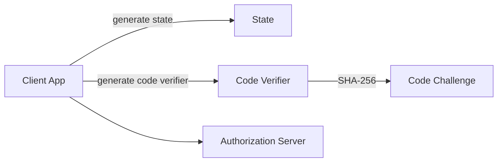

# PKCE Utilities

This document describes the PKCE (Proof Key for Code Exchange) utilities provided by the **security_shared_core** module.

---

## Component

### PKCEUtils

**Component ID**
- `deps.openframe-oss-lib.openframe-security-core.src.main.java.com.openframe.security.pkce.PKCEUtils.PKCEUtils`

**Responsibility**

- Provides stateless helper methods for OAuth2 PKCE flows
- Ensures secure generation of:
  - State parameters (CSRF protection)
  - Code verifiers
  - Code challenges (SHA-256)

---

## PKCE Flow Support

---

## Key Methods

| Method | Purpose |
|------|---------|
| `generateState()` | Generates a random state parameter for CSRF protection |
| `generateCodeVerifier()` | Creates a secure PKCE code verifier |
| `generateCodeChallenge(String)` | Derives a SHA-256 challenge from a verifier |
| `urlEncode(String)` | URL-encodes values for OAuth2 requests |

---

## Security Guarantees

- Uses `SecureRandom` for entropy
- Applies SHA-256 hashing for PKCE challenges
- Produces Base64URL-encoded output without padding

---

## Usage Context

These utilities are primarily used in:

- Browser-based OAuth2 login flows
- BFF (Backend-for-Frontend) authentication
- SSO integrations with external identity providers

They help ensure **standards-compliant and secure OAuth2 interactions**.
