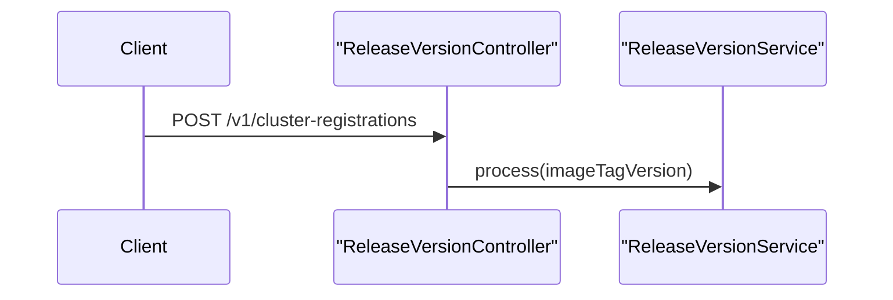

# Release Version Controller

The **ReleaseVersionController** receives cluster-level release version updates and forwards them to the internal release processing pipeline. This endpoint is typically invoked by deployment automation or cluster registration workflows.

## Purpose

- Accept the current image tag or release version of a running cluster
- Trigger internal processing to reconcile version state
- Enable fleet-wide awareness of deployed versions

Unlike user-facing APIs, this controller is optimized for **machine-to-machine communication**.

## Exposed Endpoint

| Method | Path | Description |
|------|------|-------------|
| POST | /v1/cluster-registrations | Submit a cluster release version |

## Core Components

- `ReleaseVersionController`

## Dependencies

- **ReleaseVersionService** – processes and reconciles version information

The controller itself contains no business logic beyond request forwarding.

## Processing Flow

## Characteristics

- Fire-and-forget style endpoint
- No response body on success
- Failures are handled within the service layer

This keeps the API surface minimal while allowing flexible internal handling.
