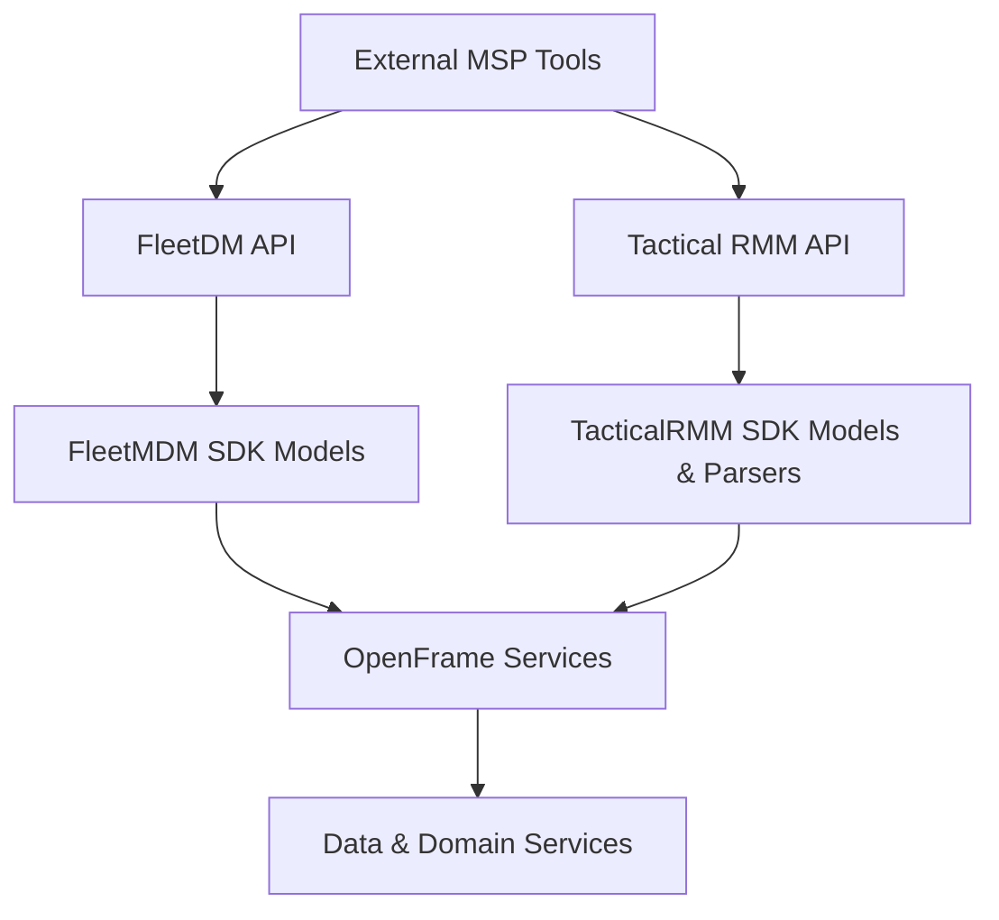
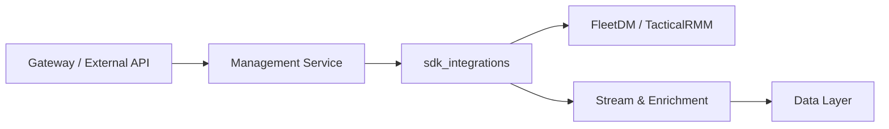

# SDK Integrations Module

The **sdk_integrations** module provides lightweight Java SDK models and utilities that allow OpenFrame services to integrate with external MSP tools in a consistent, type-safe way. In the current scope, this module focuses on **FleetDM (MDM)** and **Tactical RMM** integrations.

These SDKs are consumed by higher-level services such as:
- **Management Service** (tool onboarding, agent registration)
- **Stream and Enrichment Services** (device and agent context)
- **External and Gateway APIs** (normalizing external tool data)

Rather than implementing HTTP clients directly, this module defines **shared domain models and parsers** that sit at the boundary between OpenFrame services and third-party platforms.

---

## Architecture Overview

The sdk_integrations module acts as a translation layer between external tool APIs and OpenFrame internal services.

**Key characteristics:**
- No transport logic (HTTP clients live in service layers)
- Jackson-friendly POJOs for API responses
- Utilities for parsing and normalizing external command formats

---

## Sub-modules

The sdk_integrations module is currently composed of two focused sub-modules.

### FleetMDM SDK

The FleetMDM SDK defines models that represent **hosts** and **query execution results** returned by the FleetDM API. These models are commonly used when ingesting device inventory and osquery results.

- Strongly typed host metadata
- Pagination-aware search responses
- Generic query execution result handling

📄 See detailed documentation: [fleetmdm_sdk.md](fleetmdm_sdk.md)

---

### TacticalRMM SDK

The TacticalRMM SDK provides models for **agent inventory** and a utility to extract **registration secrets** from Tactical RMM installation commands.

- Agent list and agent detail models
- Robust parsing of `--auth` registration secrets
- Designed for onboarding and reconciliation workflows

📄 See detailed documentation: [tacticalrmm_sdk.md](tacticalrmm_sdk.md)

---

## How This Module Fits Into OpenFrame

- **Management Service** uses SDK models when syncing tools and agents
- **Stream Service** enriches events with device and agent context
- **External API** layers rely on normalized models downstream

---

## Design Principles

- **Minimal surface area**: Only models and utilities required for integration
- **Loose coupling**: No direct dependency on service or persistence layers
- **Forward compatible**: `@JsonIgnoreProperties(ignoreUnknown = true)` used extensively
- **Shared ownership**: SDKs are reusable across multiple OpenFrame services

---

## Extending sdk_integrations

When adding support for a new external tool:

1. Create a new SDK package under `sdk_integrations`
2. Add API response models with Jackson annotations
3. Add parsers or helpers only if normalization is required
4. Keep transport logic out of the SDK

This approach ensures external integrations remain maintainable and consistent across the OpenFrame platform.
