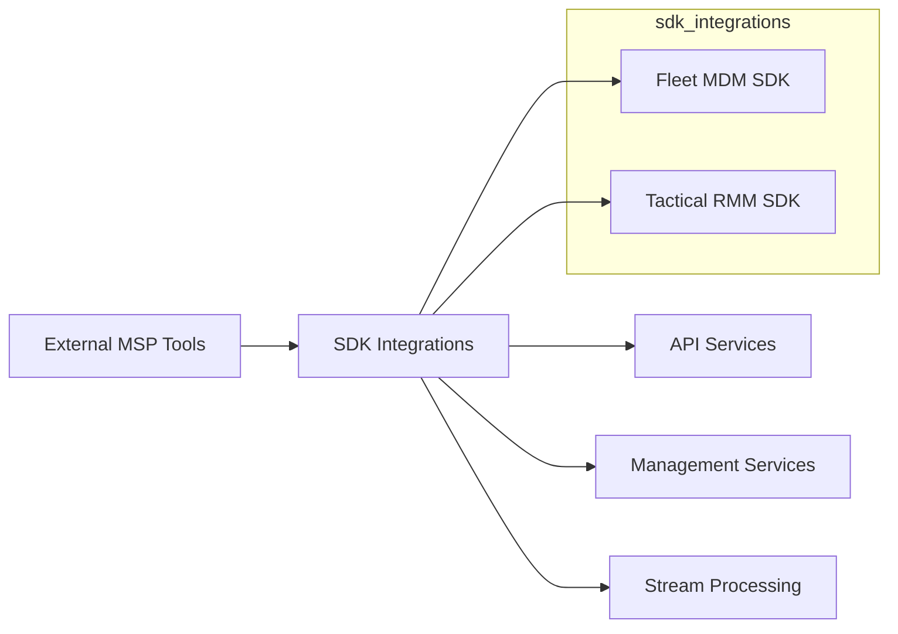

# SDK Integrations

## Overview
The **sdk_integrations** module provides lightweight Java SDK models and helpers that allow OpenFrame services to integrate with third-party MSP tools. In its current scope, the module focuses on:

- **Fleet MDM**: Device and query result models used when interacting with Fleet MDM APIs.
- **Tactical RMM**: Agent models and utilities for parsing and handling Tactical RMM registration workflows.

This module is intentionally minimal: it does **not** contain HTTP clients or business logic. Instead, it defines **stable contracts** (POJOs and helpers) that are consumed by higher-level services such as:

- API services (see platform API services)
- Management and onboarding workflows
- Stream and event ingestion pipelines

---

## Architecture Overview

The SDK integrations sit at the edge between OpenFrame core services and external MSP platforms.

**Key characteristics:**
- Pure data models and parsing helpers
- Jackson-annotated POJOs for API compatibility
- No persistence, no networking, no framework dependencies

---

## Sub-modules

### Fleet MDM SDK
Provides models representing hosts, search responses, and osquery execution results returned by Fleet MDM.

- Focused on **device inventory** and **query execution results**
- Designed to deserialize Fleet MDM REST and query APIs

➡️ See [Fleet MDM SDK](Fleet_MDM_SDK.md)

---

### Tactical RMM SDK
Provides models for Tactical RMM agents and utilities to support agent registration workflows.

- Agent metadata representations
- Command parsing utilities for installation secrets

➡️ See [Tactical RMM SDK](Tactical_RMM_SDK.md)

---

## How This Module Fits Into OpenFrame

- **API layer** uses these models when proxying or aggregating data from integrated tools
- **Management services** rely on parsed secrets and identifiers during onboarding
- **Stream and analytics services** may reuse these DTOs when normalizing incoming data

This separation ensures external integrations evolve independently from core OpenFrame business logic.

---

## Design Principles

- **Stability over features**: breaking changes are avoided
- **Explicit contracts**: fields mirror upstream APIs closely
- **Low coupling**: no dependency on OpenFrame internal services

---

## Extending SDK Integrations

When adding a new external integration:
1. Create a new SDK package under `sdk_integrations`
2. Add only models, DTOs, and pure helpers
3. Avoid HTTP clients or persistence logic
4. Keep naming aligned with upstream APIs

For integration logic, use service-core modules instead.
