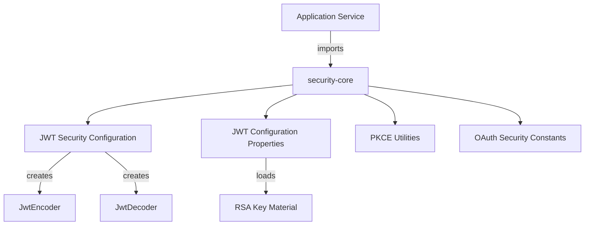
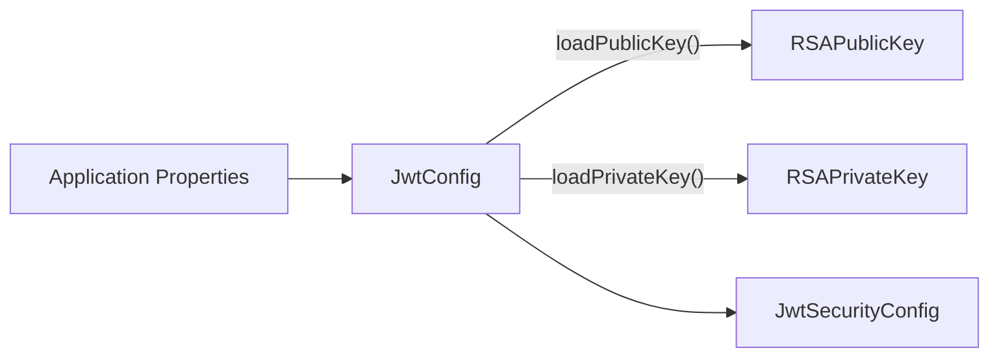
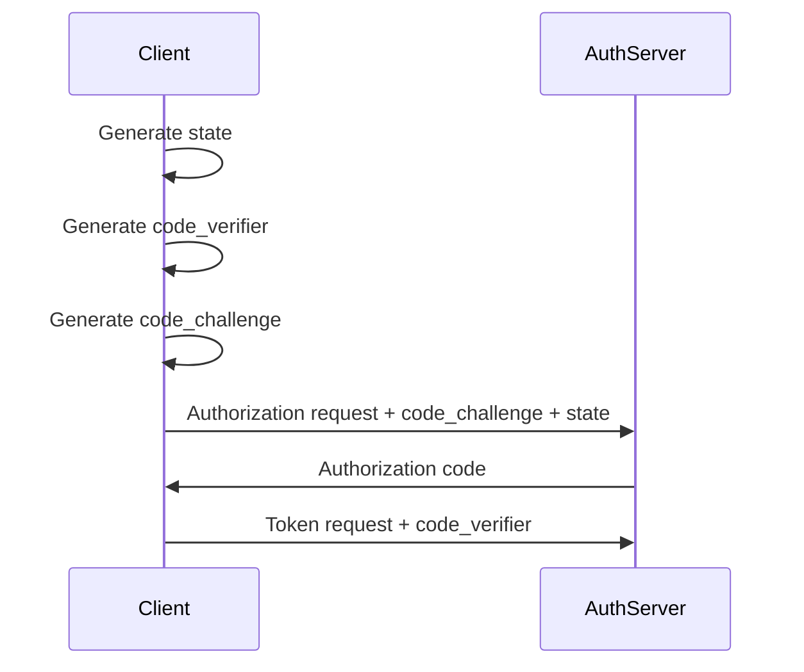

# Security Core Module

## Overview

The **security-core** module provides foundational security building blocks shared across the OpenFrame / Flamingo platform. It is intentionally lightweight and framework-oriented, focusing on **JWT handling**, **OAuth2/PKCE primitives**, and **security constants** that are reused by higher-level services such as:

- authorization-server
- gateway-service
- api-service
- security-oauth-bff

This module does **not** expose HTTP endpoints. Instead, it contributes Spring Security beans, cryptographic utilities, and shared constants that ensure consistent authentication and authorization behavior across the platform.

---

## Responsibilities

The security-core module is responsible for:

- Configuring JWT encoding and decoding using RSA key pairs
- Loading and managing JWT cryptographic material from configuration
- Defining shared OAuth2 / token-related constants
- Providing PKCE (Proof Key for Code Exchange) utilities for OAuth2 authorization code flows

---

## High-Level Architecture

---

## Core Components

### 1. JwtSecurityConfig

**Package:** `com.openframe.security.config`

`JwtSecurityConfig` is a Spring `@Configuration` class that wires up JWT infrastructure using Spring Security and Nimbus JOSE.

**Key responsibilities:**

- Exposes a `JwtEncoder` bean backed by an RSA private/public key pair
- Exposes a `JwtDecoder` bean backed by the RSA public key
- Integrates with `JwtConfig` for key loading

**Why it matters:**

All services that issue or validate JWTs rely on this configuration to ensure:

- Tokens are signed consistently
- Tokens can be validated across service boundaries
- Cryptographic material is centrally managed

---

### 2. JwtConfig

**Package:** `com.openframe.security.jwt`

`JwtConfig` is a Spring `@ConfigurationProperties`-backed service responsible for loading JWT-related configuration.

**Configuration scope:**

- RSA public key
- RSA private key
- JWT issuer
- JWT audience

**Key responsibilities:**

- Convert PEM-encoded RSA keys into Java `RSAPublicKey` and `RSAPrivateKey`
- Abstract key parsing and decoding logic away from consumers

**Typical usage flow:**

This separation allows environment-specific key management (local, staging, production) without changing application code.

---

### 3. SecurityConstants

**Package:** `com.openframe.security.oauth`

`SecurityConstants` defines shared string constants used across OAuth2 and token-handling flows.

**Included constants:**

- Authorization query parameter names
- Access and refresh token identifiers
- HTTP header names for token propagation

**Why this exists:**

- Prevents duplication of literal strings across services
- Ensures consistent naming conventions
- Reduces integration errors between gateway, auth server, and API services

---

### 4. PKCEUtils

**Package:** `com.openframe.security.pkce`

`PKCEUtils` is a pure utility class implementing PKCE (Proof Key for Code Exchange) helpers used in OAuth2 authorization code flows.

**Supported operations:**

- Generate cryptographically secure `state` parameters (CSRF protection)
- Generate PKCE `code_verifier` values
- Generate `code_challenge` values using SHA-256
- Perform URL-safe Base64 encoding

**PKCE flow context:**

This utility is commonly consumed by:

- authorization-server
- security-oauth-bff
- frontend OAuth flows

---

## How security-core Fits Into the Platform

- **authorization-server** uses PKCE utilities and JWT configuration to issue secure tokens
- **gateway-service** relies on compatible JWT decoding for request authentication
- **api-service** validates JWTs and trusts issuers configured via `JwtConfig`
- **security-oauth-bff** depends on PKCE helpers for browser-based OAuth flows

The module acts as the **cryptographic and protocol foundation**, while higher-level services implement business-specific security logic.

---

## Design Principles

- **No business logic**: Only security primitives and configuration
- **Stateless**: No persistence or runtime state
- **Reusable**: Safe to import into any Spring-based service
- **Explicit cryptography**: RSA keys, issuers, and audiences are always explicit and configurable

---

## Summary

The **security-core** module is a critical low-level dependency that ensures:

- Consistent JWT signing and validation
- Secure OAuth2 PKCE flows
- Shared security semantics across microservices

By centralizing these concerns, OpenFrame reduces duplication, improves security posture, and simplifies long-term maintenance.
