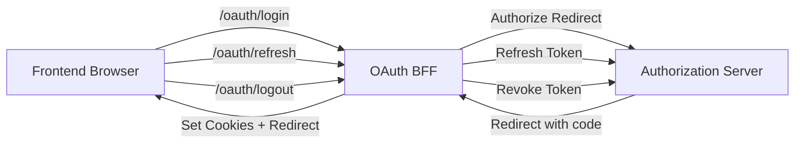

# Security OAuth BFF

## Overview

The **security-oauth-bff** module acts as a Backend-for-Frontend (BFF) layer that orchestrates OAuth 2.0 and OpenID Connect authentication flows between the OpenFrame frontend, the Gateway, and the Authorization Server. Its primary responsibility is to simplify OAuth interactions for browser-based clients by:

- Initiating OAuth authorization flows (including PKCE and state handling)
- Managing secure cookies for access and refresh tokens
- Handling OAuth callbacks and token exchange
- Providing refresh and logout endpoints
- Supporting developer-friendly token exchange during local development

This module is reactive (Spring WebFlux) and is conditionally enabled behind the Gateway when OAuth support is turned on.

---

## Responsibilities in the OpenFrame Platform

Within the broader OpenFrame architecture, the OAuth BFF:

- Sits behind the **Gateway Service** and exposes `/oauth/*` endpoints to the frontend
- Delegates OAuth protocol operations to the **Authorization Server**
- Relies on **security-core** utilities for JWT, PKCE, and constants
- Uses cookies as the primary token transport mechanism for browsers

It deliberately avoids embedding authorization-server logic, acting instead as a thin orchestration and security boundary optimized for frontend needs.

---

## High-Level Architecture

---

## Core Components

The module is intentionally small and composed of a few focused sub-modules:

| Sub-module | Description |
|-----------|-------------|
| OAuth BFF Controller | Reactive REST endpoints that drive login, callback, refresh, logout, and dev flows |
| Dev Ticket Store | Optional in-memory ticket mechanism for exposing tokens during development |
| Redirect Resolution | Determines safe and user-friendly redirect targets and forwarded headers behavior |

Detailed documentation for each sub-module is provided separately:

- [OAuth BFF Controller](oauth-bff-controller.md)
- [Dev Ticket Store](dev-ticket-store.md)
- [Redirect Resolution](redirect-resolution.md)

---

## OAuth Flow Overview

### Login & Authorization

1. Frontend calls `/oauth/login` with tenant and optional redirect information
2. BFF:
   - Clears existing auth cookies
   - Builds OAuth authorize URL (state + PKCE)
   - Stores state in an HTTP-only cookie
3. Browser is redirected to the Authorization Server

### Callback Handling

1. Authorization Server redirects back with `code` and `state`
2. BFF exchanges the code for tokens
3. Access and refresh tokens are written to secure cookies
4. OAuth state cookie is cleared
5. Browser is redirected back to the resolved target

### Refresh & Logout

- `/oauth/refresh` rotates tokens using the refresh token
- `/oauth/logout` revokes refresh tokens and clears cookies

---

## Development Mode Support

When enabled, the module supports **developer ticket exchange**:

- Tokens are temporarily stored server-side
- A short-lived `devTicket` can be appended to redirect URLs
- Developers can exchange the ticket for tokens via `/oauth/dev-exchange`

This mechanism is **disabled or replaced** in production-grade deployments.

---

## Security Considerations

- Tokens are stored in HTTP-only cookies by default
- OAuth `state` is signed and time-bound
- Redirect targets are sanitized and resolved defensively
- No tokens are exposed in URLs unless explicitly enabled for development

The module relies on upstream components (Gateway, Authorization Server, security-core) for cryptographic guarantees and tenant isolation.

---

## Configuration Highlights

The behavior of the OAuth BFF is primarily controlled via configuration properties:

- Enable/disable OAuth BFF routing via the Gateway
- State cookie TTL
- Development ticket support

Exact property names and defaults are defined in the security and gateway configuration layers.

---

## When to Extend This Module

Typical extension points include:

- Custom `OAuthDevTicketStore` implementations
- Custom redirect resolution strategies
- Additional forwarded header contributors for proxy setups

These are all designed to be replaced via Spring bean overrides without modifying core logic.

---

## Summary

The **security-oauth-bff** module provides a clean, frontend-friendly OAuth abstraction that:

- Reduces OAuth complexity in browser clients
- Centralizes cookie and redirect handling
- Integrates seamlessly with OpenFrame's multi-tenant authorization model

It is a critical security boundary that balances protocol correctness, developer experience, and production safety.
