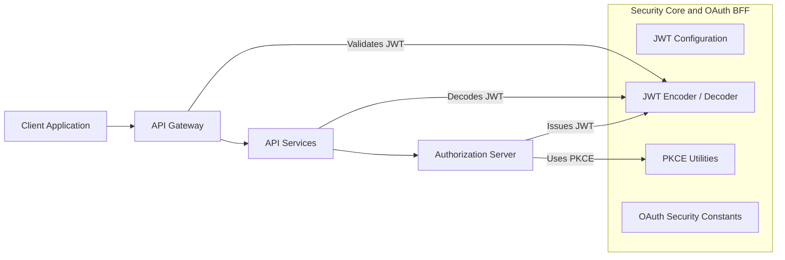
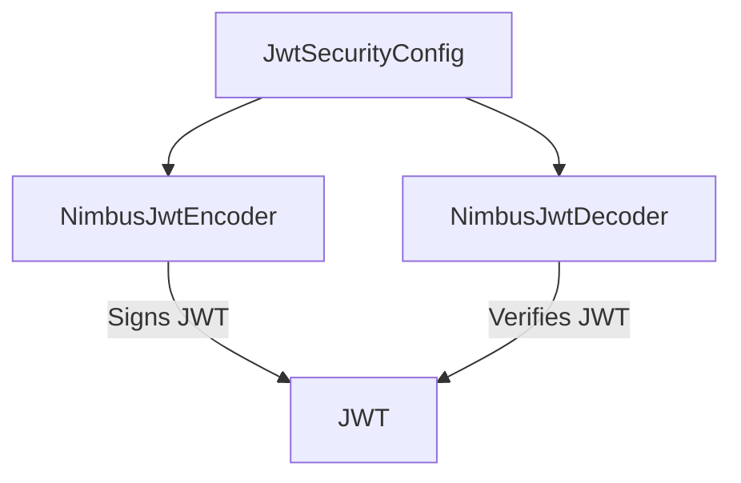
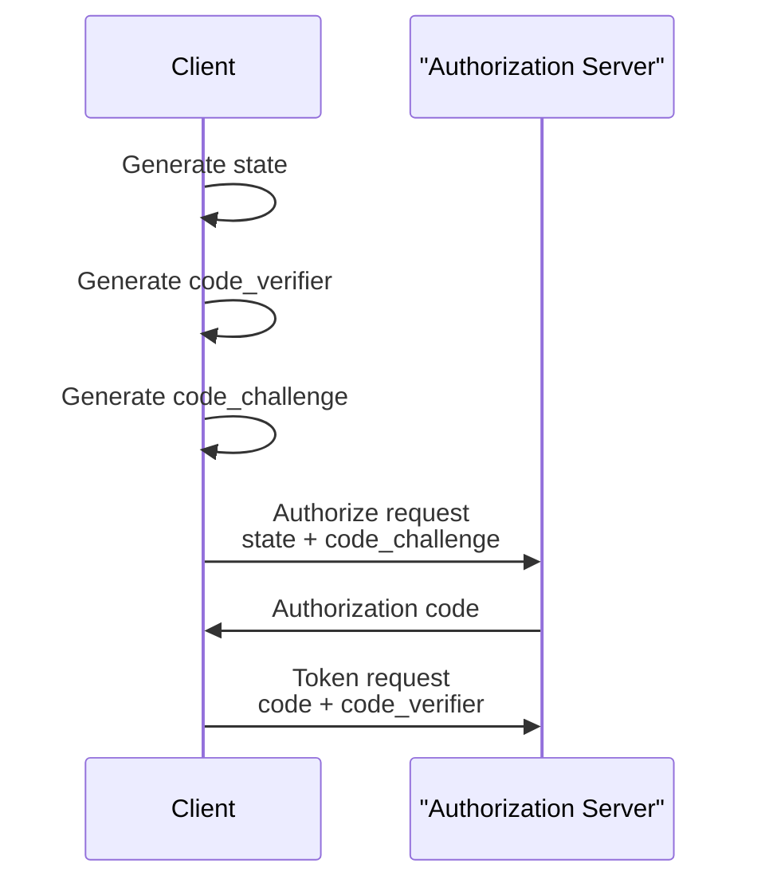

# Security Core and OAuth BFF

## Overview

The **security_core_and_oauth_bff** module provides the foundational security primitives used across the OpenFrame platform for **JWT-based authentication**, **OAuth2/OIDC flows**, and **PKCE (Proof Key for Code Exchange)** support. It is intentionally lightweight and reusable, acting as a shared security core that higher-level services (Gateway, API services, Authorization Server, and OAuth BFF controllers) build upon.

This module does **not** expose HTTP endpoints by itself. Instead, it supplies:

- JWT encoding and decoding infrastructure
- Centralized JWT configuration and key loading
- OAuth-related constants used consistently across services
- Secure PKCE utilities for OAuth2 authorization code flows

These components are consumed by:
- Gateway security filters and JWT validation
- API services requiring token verification
- OAuth BFF controllers and authorization flows
- Authorization server integrations

---

## Core Responsibilities

- Provide **RSA-based JWT signing and verification**
- Load and manage cryptographic keys from configuration
- Standardize OAuth token and header naming
- Support secure OAuth2 authorization code flows using PKCE

---

## High-Level Architecture

**Key idea:** this module is a shared security foundation, not a standalone service.

---

## Component Breakdown

### 1. JWT Security Configuration

**Component:**
- `deps.openframe-oss-lib.openframe-security-core.src.main.java.com.openframe.security.config.JwtSecurityConfig.JwtSecurityConfig`

**Purpose:**
Defines Spring beans for JWT encoding and decoding using RSA keys and the Nimbus JOSE JWT library.

**Responsibilities:**
- Create a `JwtEncoder` backed by an RSA key pair
- Create a `JwtDecoder` using the RSA public key
- Expose these beans for injection into Gateway, API services, and Authorization Server components

**Key Design Points:**
- Uses **asymmetric cryptography (RSA)**
- Encoder and decoder share a common key source
- Compatible with Spring Security OAuth2 Resource Server

---

### 2. JWT Configuration

**Component:**
- `deps.openframe-oss-lib.openframe-security-core.src.main.java.com.openframe.security.jwt.JwtConfig.JwtConfig`

**Purpose:**
Centralizes JWT-related configuration and cryptographic key loading.

**Responsibilities:**
- Load RSA public and private keys from configuration
- Expose issuer and audience values
- Convert PEM-encoded keys into Java `RSAPublicKey` and `RSAPrivateKey` instances

**Configuration Model:**
- Configured via Spring Boot `@ConfigurationProperties(prefix = "jwt")`
- Keys are expected to be Base64 / PEM encoded

**Security Considerations:**
- Private keys are never logged
- Key parsing strips headers, footers, and whitespace
- Designed for external secret management systems

---

### 3. OAuth Security Constants

**Component:**
- `deps.openframe-oss-lib.openframe-security-core.src.main.java.com.openframe.security.oauth.SecurityConstants.SecurityConstants`

**Purpose:**
Provides a shared set of constants to avoid token and header naming inconsistencies across services.

**Defined Constants:**
- Authorization query parameter name
- Access and refresh token field names
- Standard HTTP header names for tokens

**Why this matters:**
- Prevents subtle integration bugs between Gateway, API, and OAuth layers
- Enables consistent token forwarding and extraction

---

### 4. PKCE Utilities

**Component:**
- `deps.openframe-oss-lib.openframe-security-core.src.main.java.com.openframe.security.pkce.PKCEUtils.PKCEUtils`

**Purpose:**
Implements secure PKCE helpers for OAuth2 Authorization Code flows.

**Responsibilities:**
- Generate cryptographically secure `state` parameters
- Generate PKCE `code_verifier` values
- Derive `code_challenge` values using SHA-256
- Provide URL-safe Base64 encoding

**Security Guarantees:**
- Uses `SecureRandom`
- SHA-256 based challenge generation
- URL-safe Base64 encoding without padding

---

## How This Module Fits Into the Platform

| Layer | Usage |
|-----|-----|
| Gateway Service | JWT validation, token forwarding |
| API Services | JWT decoding and authorization |
| Authorization Server | JWT issuance, PKCE validation |
| OAuth BFF | OAuth flow orchestration using PKCE |

This module intentionally avoids business logic and persistence, ensuring it remains:
- Easy to audit
- Easy to reuse
- Safe to share across multiple services

---

## Design Principles

- **Security-first defaults** (RSA, SHA-256, SecureRandom)
- **Separation of concerns** (no controllers, no persistence)
- **Framework-native integration** with Spring Security
- **Consistency** across OAuth and JWT handling

---

## Summary

The **security_core_and_oauth_bff** module is the cryptographic and OAuth backbone of OpenFrame. It standardizes JWT handling, secures OAuth flows with PKCE, and provides shared constants that keep the platform’s security model consistent and robust.

Higher-level modules build on top of this foundation to deliver authentication, authorization, and multi-tenant security across the entire OpenFrame stack.
