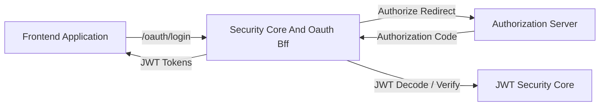
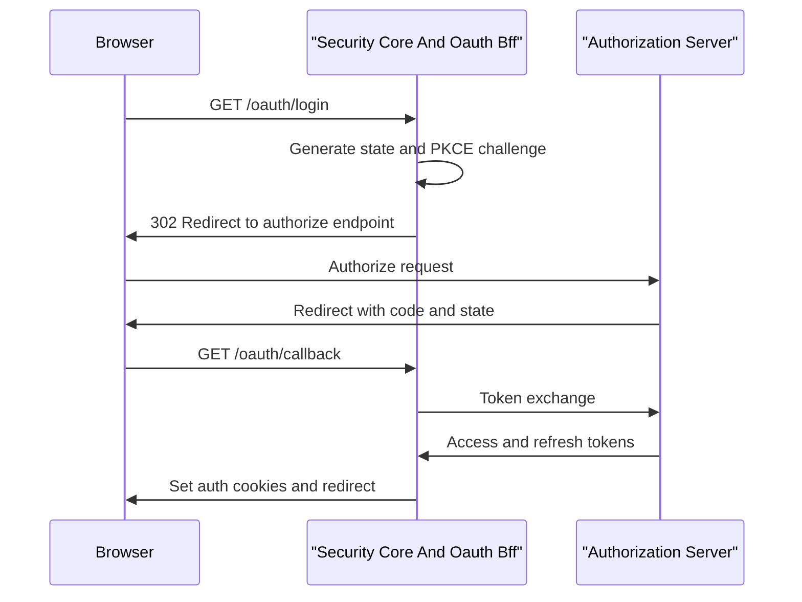

# Security Core And Oauth Bff

## Overview

The **Security Core And Oauth Bff** module provides the foundational security building blocks and the OAuth Backend-for-Frontend (BFF) flow used across the OpenFrame and Flamingo platform. It is responsible for:

- JWT key management, encoding, and decoding
- OAuth 2.0 and OpenID Connect–compatible browser-based login flows
- PKCE (Proof Key for Code Exchange) utilities for secure authorization code flows
- Secure cookie and redirect handling for frontend applications
- Development-friendly OAuth token exchange utilities

This module acts as the **security glue** between the frontend clients, the Gateway Service, and the Authorization Server, while remaining stateless and horizontally scalable.

---

## Responsibilities at a Glance

- Issue and validate JWTs using RSA key pairs
- Orchestrate OAuth login, callback, refresh, and logout flows
- Protect OAuth flows against CSRF and authorization code interception
- Provide a clean BFF surface for frontend applications
- Offer optional developer tooling for local and non-production environments

---

## High-Level Architecture

**Key idea:** the frontend never talks directly to the Authorization Server for token handling. All sensitive logic is centralized in the Security Core And Oauth Bff.

---

## Core Components

### JWT Security Configuration

**Component:** `JwtSecurityConfig`

This configuration wires Spring Security’s JWT infrastructure using RSA keys.

**Responsibilities:**
- Build a `JwtEncoder` using a private RSA key
- Build a `JwtDecoder` using the corresponding public RSA key
- Publish keys as a JWK set for compatibility with OAuth tooling

**Why it matters:**
- Enables stateless authentication across services
- Ensures tokens can be validated by downstream services (Gateway, APIs)

---

### JWT Configuration

**Component:** `JwtConfig`

This service loads and exposes JWT-related configuration.

**Responsibilities:**
- Load RSA public and private keys from configuration
- Expose issuer and audience values
- Convert PEM-encoded keys into Java RSA key objects

**Key properties managed:**
- Issuer
- Audience
- Public key
- Private key

---

### OAuth Security Constants

**Component:** `SecurityConstants`

A centralized definition of OAuth-related constants.

**Responsibilities:**
- Standardize token names and headers
- Avoid duplication and inconsistencies across modules

**Examples:**
- Access token and refresh token names
- HTTP header names used in dev and gateway flows

---

### PKCE Utilities

**Component:** `PKCEUtils`

Utility helpers for implementing PKCE-secured OAuth flows.

**Responsibilities:**
- Generate cryptographically secure state parameters
- Generate PKCE code verifiers
- Generate PKCE code challenges using SHA-256
- Perform URL-safe Base64 encoding

**Security benefits:**
- Prevents authorization code interception
- Protects against CSRF attacks
- Aligns with OAuth 2.1 best practices

---

## OAuth Backend-for-Frontend (BFF)

### OAuth BFF Controller

**Component:** `OAuthBffController`

The main HTTP entrypoint for browser-based OAuth flows.

**Exposed endpoints:**
- `GET /oauth/login` – Initialize login flow
- `GET /oauth/continue` – Resume OAuth flow without clearing session
- `GET /oauth/callback` – Handle authorization code callback
- `POST /oauth/refresh` – Refresh access tokens
- `GET /oauth/logout` – Logout and revoke tokens
- `GET /oauth/dev-exchange` – Development-only token exchange

---

### OAuth Login Flow

---

### Callback and Error Handling

During the callback phase, the controller:
- Validates the state parameter using signed cookies
- Exchanges the authorization code for tokens
- Sets secure authentication cookies
- Redirects the user back to the resolved target URL

On failure:
- Clears OAuth state cookies
- Redirects back with a standardized error payload

---

## Redirect Resolution

**Component:** `DefaultRedirectTargetResolver`

Determines the safest redirect destination after OAuth completion.

**Resolution order:**
1. Explicit `redirectTo` parameter
2. HTTP `Referer` header
3. Root path `/`

This ensures predictable navigation while avoiding open redirect vulnerabilities.

---

## Development Ticket Store

**Component:** `InMemoryOAuthDevTicketStore`

A lightweight, in-memory token exchange mechanism designed for development and testing.

**Responsibilities:**
- Create one-time-use tickets for OAuth tokens
- Allow secure token retrieval via headers instead of cookies
- Automatically invalidate tickets after consumption

**Important notes:**
- Disabled or replaced in production environments
- Not intended for horizontal scaling or persistence

---

## Security Considerations

- All state parameters are cryptographically random and time-limited
- JWTs are signed using asymmetric RSA keys
- Cookies are centrally managed and cleared on logout
- PKCE is enforced to prevent authorization code replay
- Redirect targets are validated and resolved defensively

---

## How This Module Fits Into the Platform

The **Security Core And Oauth Bff** module sits at the intersection of:
- Frontend applications
- Gateway Service Core
- Authorization Server Core

It allows frontend teams to integrate authentication without directly handling OAuth or JWT internals, while giving backend services a consistent and verifiable security model.

---

## Summary

The **Security Core And Oauth Bff** module provides a secure, extensible, and developer-friendly foundation for authentication across the OpenFrame ecosystem. By combining JWT infrastructure, PKCE utilities, and a robust OAuth BFF, it ensures modern security practices without pushing complexity to clients or downstream services.
