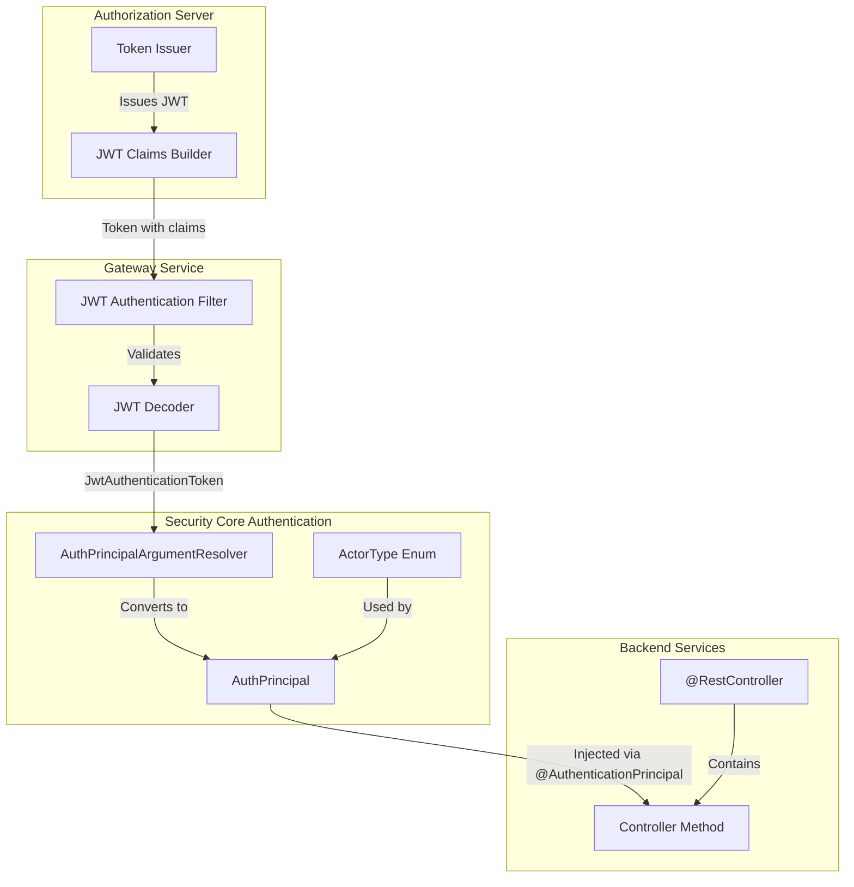
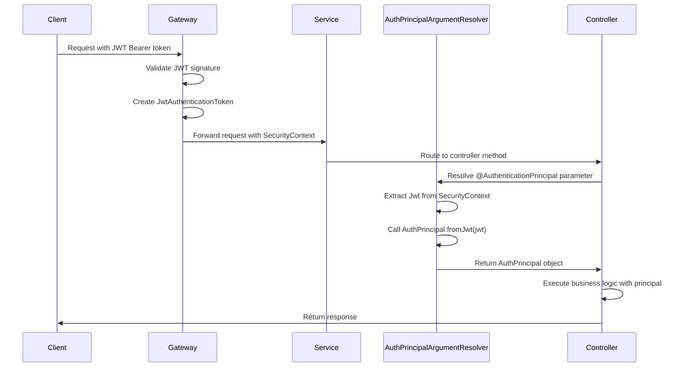
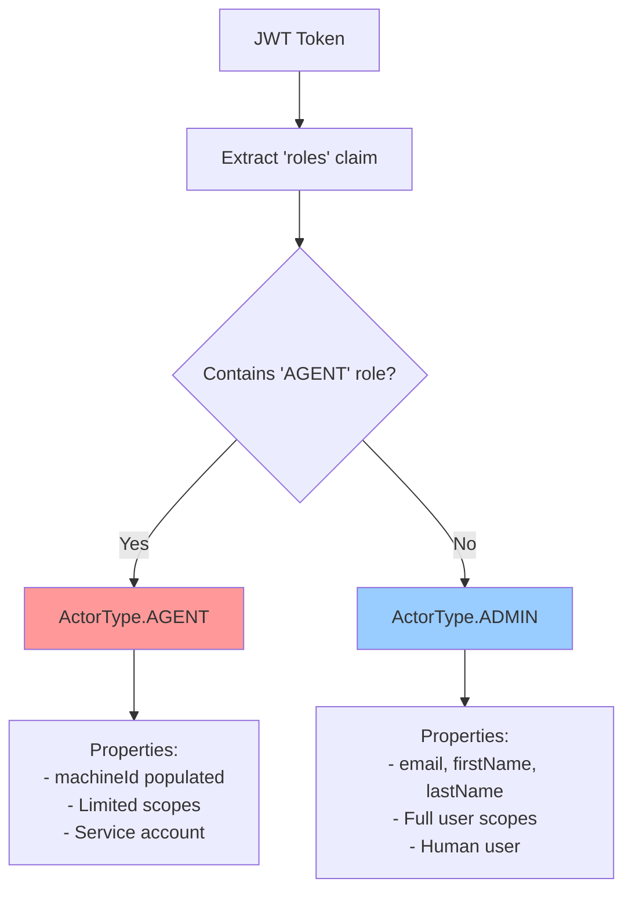
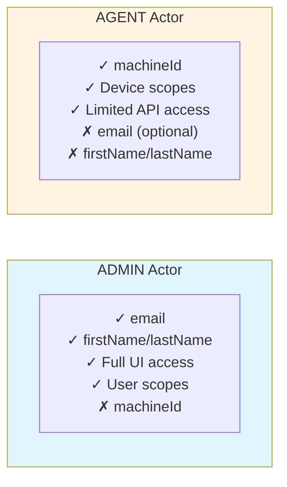
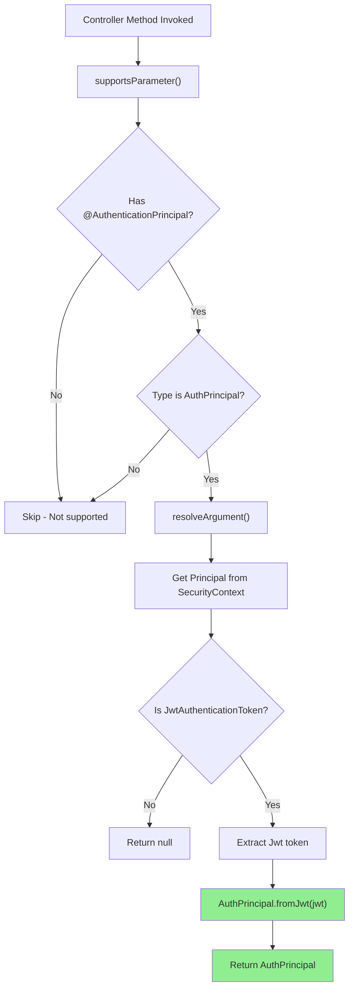
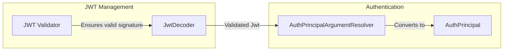
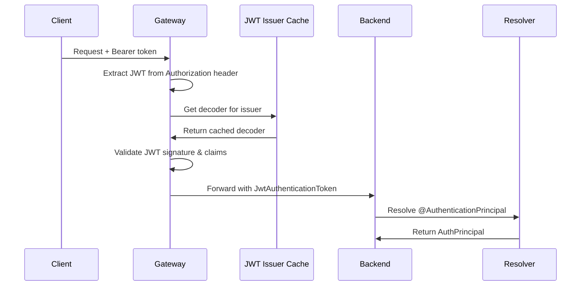
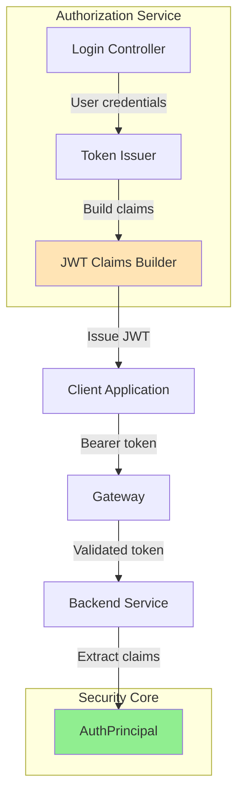
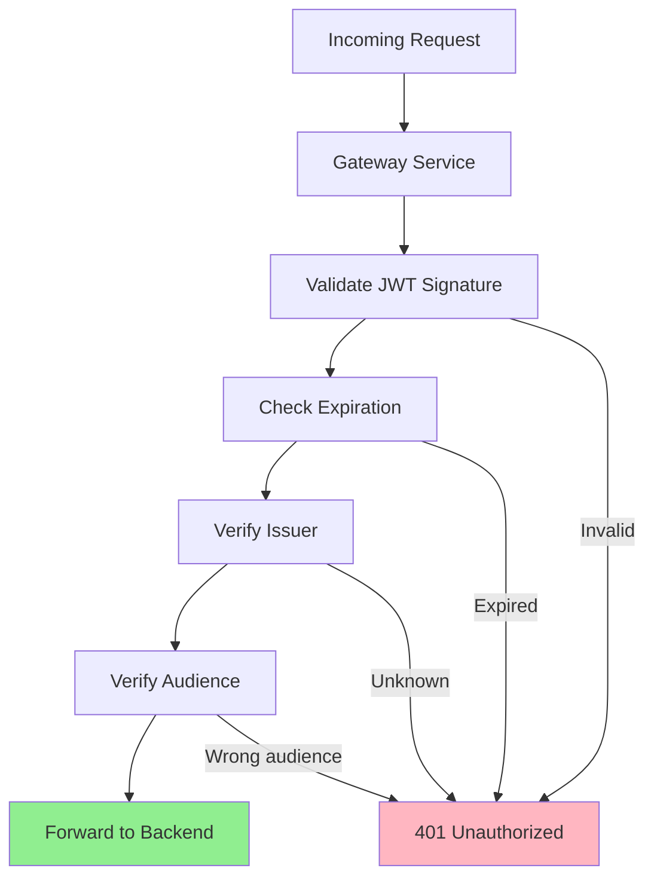

# Security Core Authentication Module

## Overview

The **security_core_authentication** module provides the foundational authentication primitives for the OpenFrame platform. It defines how authenticated principals (users and agents) are represented throughout the system and provides automatic conversion from JWT tokens to strongly-typed authentication objects.

This module is part of the broader [security_core](./security_core.md) system and works in conjunction with:
- [security_core_jwt_management](./security_core_jwt_management.md) - JWT token generation and validation
- [gateway_service_security](./gateway_service_security.md) - Gateway-level authentication enforcement
- [authorization_service](./authorization_service.md) - OAuth2/OIDC token issuance

**Key Capabilities:**
- **Unified Principal Model**: Single `AuthPrincipal` object representing both human users and machine agents
- **Actor Type Discrimination**: Automatic detection of ADMIN (human) vs AGENT (machine) actors
- **JWT Claims Extraction**: Clean abstraction over raw JWT token claims
- **Controller Integration**: Seamless injection into Spring MVC controllers via `@AuthenticationPrincipal`
- **Multi-Tenant Support**: Built-in tenant context extraction from tokens

---

## Architecture

### Component Overview



### Authentication Flow



### Actor Type Determination



---

## Core Components

### 1. AuthPrincipal

**Purpose**: Immutable value object representing an authenticated principal (user or agent) with all relevant claims extracted from the JWT token.

**Location**: `com.openframe.security.authentication.AuthPrincipal`

**Key Features:**
- **Claim Extraction**: Automatically extracts standard and custom claims from JWT
- **Fallback Logic**: Intelligent fallbacks for missing claims (e.g., email from subject)
- **Display Name Generation**: Constructs human-readable names from available data
- **Type Safety**: Strongly-typed access to all authentication attributes

**Properties:**

| Property | Type | Source Claim | Description |
|----------|------|--------------|-------------|
| `id` | String | `userId` or `sub` | Unique identifier for the principal |
| `email` | String | `email` or `sub` | Email address (if available) |
| `firstName` | String | `firstName` | User's first name (ADMIN only) |
| `lastName` | String | `lastName` | User's last name (ADMIN only) |
| `roles` | List\<String\> | `roles` | Assigned roles (e.g., ADMIN, AGENT, USER) |
| `scopes` | List\<String\> | `scope` | OAuth2 scopes (space-delimited or list) |
| `tenantId` | String | `tenant_id` | Tenant identifier for multi-tenancy |
| `tenantDomain` | String | `tenant_domain` | Tenant domain name |
| `machineId` | String | `machine_id` | Machine identifier (AGENT only) |
| `actorType` | ActorType | Derived from `roles` | ADMIN or AGENT |

**Example JWT Claims:**

```json
{
  "sub": "user-123",
  "userId": "user-123",
  "email": "john.doe@example.com",
  "firstName": "John",
  "lastName": "Doe",
  "roles": ["ADMIN", "USER"],
  "scope": "openid profile email devices:read devices:write",
  "tenant_id": "tenant-456",
  "tenant_domain": "example.com",
  "iss": "https://auth.openframe.ai",
  "exp": 1735689600,
  "iat": 1735686000
}
```

**Resulting AuthPrincipal:**

```java
AuthPrincipal principal = AuthPrincipal.builder()
    .id("user-123")
    .email("john.doe@example.com")
    .firstName("John")
    .lastName("Doe")
    .roles(List.of("ADMIN", "USER"))
    .scopes(List.of("openid", "profile", "email", "devices:read", "devices:write"))
    .tenantId("tenant-456")
    .tenantDomain("example.com")
    .machineId(null)
    .actorType(ActorType.ADMIN)
    .build();
```

**Usage in Controllers:**

```java
@RestController
@RequestMapping("/api/users")
public class UserController {
    
    @DeleteMapping("/{id}")
    public ResponseEntity<Void> deleteUser(
            @PathVariable String id,
            @AuthenticationPrincipal AuthPrincipal principal) {
        
        // Access principal properties
        String currentUserId = principal.getId();
        String tenantId = principal.getTenantId();
        ActorType actorType = principal.getActorType();
        
        // Business logic
        userService.deleteUser(id, currentUserId, tenantId);
        
        return ResponseEntity.noContent().build();
    }
}
```

---

### 2. ActorType

**Purpose**: Enumeration distinguishing between human users (ADMIN) and machine agents (AGENT).

**Location**: `com.openframe.security.authentication.ActorType`

**Values:**

| Value | Description | Use Case |
|-------|-------------|----------|
| `ADMIN` | Human user with administrative or standard user privileges | Web UI access, API management, user operations |
| `AGENT` | Machine/service account representing a managed device | Device registration, heartbeat reporting, log collection |

**Determination Logic:**

```java
private static ActorType determineActorType(List<String> roles) {
    if (roles.contains("AGENT")) {
        return ActorType.AGENT;
    }
    return ActorType.ADMIN;
}
```

**Characteristics by Type:**



**Example AGENT Token Claims:**

```json
{
  "sub": "agent-789",
  "userId": "agent-789",
  "roles": ["AGENT"],
  "scope": "device:register device:heartbeat logs:write",
  "tenant_id": "tenant-456",
  "machine_id": "machine-abc-123",
  "iss": "https://auth.openframe.ai",
  "exp": 1735689600
}
```

---

### 3. AuthPrincipalArgumentResolver

**Purpose**: Spring MVC `HandlerMethodArgumentResolver` that automatically converts JWT tokens to `AuthPrincipal` objects when injected into controller methods.

**Location**: `com.openframe.security.authentication.AuthPrincipalArgumentResolver`

**How It Works:**

1. **Detection**: Checks if method parameter is annotated with `@AuthenticationPrincipal` and is of type `AuthPrincipal`
2. **Extraction**: Retrieves `JwtAuthenticationToken` from Spring Security context
3. **Conversion**: Calls `AuthPrincipal.fromJwt(jwt)` to create principal object
4. **Injection**: Returns principal to be injected into controller method

**Registration:**

```java
@Configuration
public class AuthenticationConfig implements WebMvcConfigurer {

    @Override
    public void addArgumentResolvers(List<HandlerMethodArgumentResolver> resolvers) {
        resolvers.add(new AuthPrincipalArgumentResolver());
    }
}
```

**Supported Parameter Patterns:**

```java
// ✅ Supported - AuthPrincipal with @AuthenticationPrincipal
public void method(@AuthenticationPrincipal AuthPrincipal principal) { }

// ✅ Supported - Optional AuthPrincipal
public void method(@AuthenticationPrincipal(required = false) AuthPrincipal principal) { }

// ❌ Not supported - Raw Jwt (use Spring's default resolver)
public void method(@AuthenticationPrincipal Jwt jwt) { }

// ❌ Not supported - Missing annotation
public void method(AuthPrincipal principal) { }
```

**Resolution Process:**



---

## Integration Points

### With JWT Management

The authentication module depends on [security_core_jwt_management](./security_core_jwt_management.md) for token validation:



**Key Dependencies:**
- JWT signature validation (RSA public key)
- Issuer validation
- Expiration checking
- Claims structure validation

---

### With Gateway Security

The [gateway_service_security](./gateway_service_security.md) performs initial authentication before requests reach backend services:



**Gateway Responsibilities:**
- JWT signature validation
- Issuer whitelist enforcement
- Role-based access control (RBAC)
- Tenant isolation
- Token caching for performance

**Backend Service Responsibilities:**
- Extract principal from validated token
- Apply business logic based on principal attributes
- Enforce fine-grained authorization

---

### With Authorization Service

The [authorization_service](./authorization_service.md) issues tokens that are consumed by this module:



**Token Issuance Flow:**
1. User authenticates via login form or OAuth2 flow
2. Authorization server validates credentials
3. Claims builder constructs JWT with user/agent attributes
4. Token signed with tenant-specific or global RSA key
5. Client receives token and includes in subsequent requests
6. Backend services extract `AuthPrincipal` from validated token

---

## Usage Patterns

### Pattern 1: User Context Access

**Scenario**: Access current user information in controller methods.

```java
@RestController
@RequestMapping("/api/profile")
@RequiredArgsConstructor
public class ProfileController {
    
    private final UserService userService;
    
    @GetMapping
    public UserProfileResponse getCurrentUserProfile(
            @AuthenticationPrincipal AuthPrincipal principal) {
        
        // Access user ID and tenant context
        String userId = principal.getId();
        String tenantId = principal.getTenantId();
        
        return userService.getUserProfile(userId, tenantId);
    }
    
    @PutMapping
    public UserProfileResponse updateCurrentUserProfile(
            @AuthenticationPrincipal AuthPrincipal principal,
            @Valid @RequestBody UpdateProfileRequest request) {
        
        // Ensure user can only update their own profile
        String userId = principal.getId();
        
        return userService.updateUserProfile(userId, request);
    }
}
```

---

### Pattern 2: Actor Type Discrimination

**Scenario**: Different behavior for human users vs machine agents.

```java
@RestController
@RequestMapping("/api/devices")
@RequiredArgsConstructor
public class DeviceController {
    
    private final DeviceService deviceService;
    
    @PostMapping("/{deviceId}/heartbeat")
    public ResponseEntity<Void> recordHeartbeat(
            @PathVariable String deviceId,
            @AuthenticationPrincipal AuthPrincipal principal,
            @RequestBody HeartbeatRequest request) {
        
        // Only agents can send heartbeats
        if (principal.getActorType() != ActorType.AGENT) {
            return ResponseEntity.status(HttpStatus.FORBIDDEN).build();
        }
        
        // Verify agent is reporting for its own machine
        String machineId = principal.getMachineId();
        if (!deviceId.equals(machineId)) {
            return ResponseEntity.status(HttpStatus.FORBIDDEN).build();
        }
        
        deviceService.recordHeartbeat(deviceId, request);
        return ResponseEntity.ok().build();
    }
    
    @GetMapping
    public DeviceListResponse listDevices(
            @AuthenticationPrincipal AuthPrincipal principal,
            @RequestParam(defaultValue = "0") int page,
            @RequestParam(defaultValue = "20") int size) {
        
        // Admins can list all devices in their tenant
        if (principal.getActorType() == ActorType.ADMIN) {
            String tenantId = principal.getTenantId();
            return deviceService.listDevicesByTenant(tenantId, page, size);
        }
        
        // Agents can only see their own device
        String machineId = principal.getMachineId();
        return deviceService.getDeviceById(machineId);
    }
}
```

---

### Pattern 3: Tenant Isolation

**Scenario**: Ensure operations are scoped to the authenticated user's tenant.

```java
@RestController
@RequestMapping("/api/organizations")
@RequiredArgsConstructor
public class OrganizationController {
    
    private final OrganizationService organizationService;
    
    @GetMapping
    public OrganizationResponse getCurrentOrganization(
            @AuthenticationPrincipal AuthPrincipal principal) {
        
        // Automatically scope to user's tenant
        String tenantId = principal.getTenantId();
        
        return organizationService.getOrganizationByTenantId(tenantId);
    }
    
    @PutMapping
    public OrganizationResponse updateOrganization(
            @AuthenticationPrincipal AuthPrincipal principal,
            @Valid @RequestBody UpdateOrganizationRequest request) {
        
        // Ensure user can only update their own organization
        String tenantId = principal.getTenantId();
        
        // Additional role check
        if (!principal.getRoles().contains("ADMIN")) {
            throw new ResponseStatusException(
                HttpStatus.FORBIDDEN, 
                "Only admins can update organization settings"
            );
        }
        
        return organizationService.updateOrganization(tenantId, request);
    }
}
```

---

### Pattern 4: Audit Logging

**Scenario**: Record who performed an action for audit trails.

```java
@Service
@RequiredArgsConstructor
@Slf4j
public class DeviceService {
    
    private final DeviceRepository deviceRepository;
    private final AuditLogService auditLogService;
    
    public void deleteDevice(String deviceId, AuthPrincipal principal) {
        Device device = deviceRepository.findById(deviceId)
            .orElseThrow(() -> new IllegalArgumentException("Device not found"));
        
        // Verify tenant isolation
        if (!device.getTenantId().equals(principal.getTenantId())) {
            throw new SecurityException("Access denied");
        }
        
        // Perform deletion
        deviceRepository.delete(device);
        
        // Audit log with principal information
        auditLogService.logDeviceDeletion(
            deviceId,
            principal.getId(),
            principal.getEmail(),
            principal.getTenantId(),
            principal.getActorType()
        );
        
        log.info("Device {} deleted by {} ({})", 
            deviceId, 
            principal.getDisplayName(), 
            principal.getActorType()
        );
    }
}
```

---

### Pattern 5: Optional Authentication

**Scenario**: Endpoints that work with or without authentication.

```java
@RestController
@RequestMapping("/api/public")
public class PublicController {
    
    @GetMapping("/status")
    public StatusResponse getStatus(
            @AuthenticationPrincipal(required = false) AuthPrincipal principal) {
        
        StatusResponse response = new StatusResponse();
        response.setSystemStatus("operational");
        
        // Include user-specific info if authenticated
        if (principal != null) {
            response.setAuthenticatedUser(principal.getEmail());
            response.setTenantId(principal.getTenantId());
        } else {
            response.setAuthenticatedUser("anonymous");
        }
        
        return response;
    }
}
```

---

## JWT Claims Mapping

### Standard Claims

| JWT Claim | AuthPrincipal Property | Fallback Logic |
|-----------|------------------------|----------------|
| `sub` | `id` | Used if `userId` claim missing |
| `email` | `email` | Falls back to `sub` if it contains `@` |
| `firstName` | `firstName` | None |
| `lastName` | `lastName` | None |
| `roles` | `roles` | Empty list if missing |
| `scope` | `scopes` | Splits space-delimited string or uses list |
| `tenant_id` | `tenantId` | None |
| `tenant_domain` | `tenantDomain` | None |
| `machine_id` | `machineId` | None (AGENT tokens only) |

### Custom Claims

OpenFrame extends standard OIDC claims with custom attributes:

```json
{
  "sub": "user-123",
  "userId": "user-123",
  "email": "user@example.com",
  "firstName": "John",
  "lastName": "Doe",
  "roles": ["ADMIN", "USER"],
  "scope": "openid profile email devices:read devices:write",
  "tenant_id": "tenant-456",
  "tenant_domain": "example.com",
  "iss": "https://auth.openframe.ai",
  "aud": ["openframe-api", "openframe-gateway"],
  "exp": 1735689600,
  "iat": 1735686000,
  "jti": "token-unique-id"
}
```

**Claim Descriptions:**

- **`userId`**: Explicit user ID (preferred over `sub`)
- **`tenant_id`**: Multi-tenant isolation identifier
- **`tenant_domain`**: Human-readable tenant domain
- **`machine_id`**: Device identifier for AGENT tokens
- **`roles`**: Application-level roles (ADMIN, AGENT, USER, etc.)
- **`scope`**: OAuth2 scopes for fine-grained permissions

---

## Configuration

### Registering the Argument Resolver

**In API Service:**

```java
@Configuration
public class AuthenticationConfig implements WebMvcConfigurer {

    @Override
    public void addArgumentResolvers(List<HandlerMethodArgumentResolver> resolvers) {
        resolvers.add(new AuthPrincipalArgumentResolver());
    }
}
```

**In Client Service:**

```java
@Configuration
public class ClientWebConfig implements WebMvcConfigurer {

    @Override
    public void addArgumentResolvers(List<HandlerMethodArgumentResolver> resolvers) {
        resolvers.add(new AuthPrincipalArgumentResolver());
    }
}
```

**In External API Service:**

```java
@Configuration
public class ExternalApiConfig implements WebMvcConfigurer {

    @Override
    public void addArgumentResolvers(List<HandlerMethodArgumentResolver> resolvers) {
        resolvers.add(new AuthPrincipalArgumentResolver());
    }
}
```

### JWT Decoder Configuration

See [security_core_jwt_management](./security_core_jwt_management.md) for JWT decoder setup.

**Required Beans:**
- `JwtDecoder` - Validates JWT signatures
- `JwtEncoder` - Signs JWT tokens (authorization service only)
- `JwtConfig` - RSA key configuration

---

## Security Considerations

### 1. Token Validation

**Gateway validates tokens before they reach backend services:**



**Backend services trust validated tokens** - they do not re-validate signatures.

---

### 2. Tenant Isolation

**Always scope operations to the principal's tenant:**

```java
// ✅ Good - Tenant-scoped query
public List<Device> getUserDevices(AuthPrincipal principal) {
    String tenantId = principal.getTenantId();
    return deviceRepository.findByTenantId(tenantId);
}

// ❌ Bad - No tenant filtering (data leak risk)
public List<Device> getAllDevices() {
    return deviceRepository.findAll();
}
```

**Database queries should always include tenant ID:**

```java
@Repository
public interface DeviceRepository extends MongoRepository<Device, String> {
    
    // ✅ Tenant-scoped
    List<Device> findByTenantId(String tenantId);
    
    // ✅ Tenant-scoped with additional filters
    List<Device> findByTenantIdAndStatus(String tenantId, DeviceStatus status);
    
    // ❌ Avoid - No tenant isolation
    List<Device> findAll();
}
```

---

### 3. Role-Based Access Control

**Check roles for sensitive operations:**

```java
@DeleteMapping("/{id}")
public ResponseEntity<Void> deleteUser(
        @PathVariable String id,
        @AuthenticationPrincipal AuthPrincipal principal) {
    
    // Verify admin role
    if (!principal.getRoles().contains("ADMIN")) {
        return ResponseEntity.status(HttpStatus.FORBIDDEN).build();
    }
    
    // Verify tenant isolation
    User user = userService.getUserById(id);
    if (!user.getTenantId().equals(principal.getTenantId())) {
        return ResponseEntity.status(HttpStatus.FORBIDDEN).build();
    }
    
    userService.deleteUser(id);
    return ResponseEntity.noContent().build();
}
```

---

### 4. Agent Token Restrictions

**Agents should only access their own resources:**

```java
@PostMapping("/{machineId}/logs")
public ResponseEntity<Void> uploadLogs(
        @PathVariable String machineId,
        @AuthenticationPrincipal AuthPrincipal principal,
        @RequestBody LogBatch logs) {
    
    // Verify actor type
    if (principal.getActorType() != ActorType.AGENT) {
        return ResponseEntity.status(HttpStatus.FORBIDDEN).build();
    }
    
    // Verify agent is uploading logs for its own machine
    if (!machineId.equals(principal.getMachineId())) {
        return ResponseEntity.status(HttpStatus.FORBIDDEN).build();
    }
    
    logService.ingestLogs(machineId, logs);
    return ResponseEntity.accepted().build();
}
```

---

### 5. Sensitive Data Exposure

**Avoid logging sensitive principal data:**

```java
// ✅ Good - Log non-sensitive identifiers
log.info("User {} performed action", principal.getId());

// ⚠️ Caution - Email may be PII
log.info("User {} performed action", principal.getEmail());

// ❌ Bad - Logging entire principal object
log.info("Principal: {}", principal);
```

---

## Testing

### Unit Testing with Mock Principals

```java
@Test
void testDeleteUser_withAdminPrincipal() {
    // Arrange
    AuthPrincipal principal = AuthPrincipal.builder()
        .id("user-123")
        .email("admin@example.com")
        .roles(List.of("ADMIN"))
        .tenantId("tenant-456")
        .actorType(ActorType.ADMIN)
        .build();
    
    // Act
    ResponseEntity<Void> response = userController.deleteUser("user-789", principal);
    
    // Assert
    assertEquals(HttpStatus.NO_CONTENT, response.getStatusCode());
    verify(userService).deleteUser("user-789");
}

@Test
void testDeleteUser_withNonAdminPrincipal_shouldForbid() {
    // Arrange
    AuthPrincipal principal = AuthPrincipal.builder()
        .id("user-123")
        .email("user@example.com")
        .roles(List.of("USER"))
        .tenantId("tenant-456")
        .actorType(ActorType.ADMIN)
        .build();
    
    // Act
    ResponseEntity<Void> response = userController.deleteUser("user-789", principal);
    
    // Assert
    assertEquals(HttpStatus.FORBIDDEN, response.getStatusCode());
    verify(userService, never()).deleteUser(anyString());
}
```

---

### Integration Testing with JWT

```java
@SpringBootTest
@AutoConfigureMockMvc
class UserControllerIntegrationTest {
    
    @Autowired
    private MockMvc mockMvc;
    
    @Autowired
    private JwtService jwtService;
    
    @Test
    void testGetCurrentUser_withValidToken() throws Exception {
        // Create JWT with claims
        JwtClaimsSet claims = JwtClaimsSet.builder()
            .subject("user-123")
            .claim("userId", "user-123")
            .claim("email", "user@example.com")
            .claim("firstName", "John")
            .claim("lastName", "Doe")
            .claim("roles", List.of("ADMIN"))
            .claim("tenant_id", "tenant-456")
            .issuer("https://auth.openframe.ai")
            .expiresAt(Instant.now().plusSeconds(3600))
            .build();
        
        String token = jwtService.generateToken(claims);
        
        // Make request with token
        mockMvc.perform(get("/api/users/current")
                .header("Authorization", "Bearer " + token))
            .andExpect(status().isOk())
            .andExpect(jsonPath("$.id").value("user-123"))
            .andExpect(jsonPath("$.email").value("user@example.com"));
    }
}
```

---

### Testing Actor Type Logic

```java
@Test
void testActorType_withAgentRole_shouldBeAgent() {
    Jwt jwt = Jwt.withTokenValue("token")
        .header("alg", "RS256")
        .claim("sub", "agent-123")
        .claim("roles", List.of("AGENT"))
        .claim("machine_id", "machine-abc")
        .build();
    
    AuthPrincipal principal = AuthPrincipal.fromJwt(jwt);
    
    assertEquals(ActorType.AGENT, principal.getActorType());
    assertEquals("machine-abc", principal.getMachineId());
}

@Test
void testActorType_withoutAgentRole_shouldBeAdmin() {
    Jwt jwt = Jwt.withTokenValue("token")
        .header("alg", "RS256")
        .claim("sub", "user-123")
        .claim("roles", List.of("ADMIN", "USER"))
        .build();
    
    AuthPrincipal principal = AuthPrincipal.fromJwt(jwt);
    
    assertEquals(ActorType.ADMIN, principal.getActorType());
    assertNull(principal.getMachineId());
}
```

---

## Troubleshooting

### Issue: AuthPrincipal is null in controller

**Symptoms:**
- `@AuthenticationPrincipal AuthPrincipal principal` is null
- No authentication errors, but principal not injected

**Possible Causes:**
1. `AuthPrincipalArgumentResolver` not registered
2. Request not authenticated (no JWT token)
3. JWT token invalid or expired

**Solutions:**

```java
// 1. Verify resolver is registered
@Configuration
public class AuthenticationConfig implements WebMvcConfigurer {
    @Override
    public void addArgumentResolvers(List<HandlerMethodArgumentResolver> resolvers) {
        resolvers.add(new AuthPrincipalArgumentResolver());
    }
}

// 2. Check if authentication is required
@GetMapping("/public")
public String publicEndpoint(
        @AuthenticationPrincipal(required = false) AuthPrincipal principal) {
    if (principal == null) {
        return "Anonymous access";
    }
    return "Authenticated as " + principal.getEmail();
}

// 3. Verify JWT token in request
// Check Authorization header: Bearer <token>
```

---

### Issue: Wrong actor type detected

**Symptoms:**
- User with ADMIN role detected as AGENT
- Agent with AGENT role detected as ADMIN

**Possible Causes:**
1. Roles claim missing from JWT
2. Roles claim has wrong format (string instead of list)
3. Token issued with incorrect roles

**Solutions:**

```java
// Debug: Log roles from JWT
@GetMapping("/debug/principal")
public Map<String, Object> debugPrincipal(@AuthenticationPrincipal AuthPrincipal principal) {
    return Map.of(
        "id", principal.getId(),
        "roles", principal.getRoles(),
        "actorType", principal.getActorType(),
        "machineId", principal.getMachineId() != null ? principal.getMachineId() : "null"
    );
}
```

**Check token issuance in authorization service:**

```java
// Ensure roles are set correctly
JwtClaimsSet claims = JwtClaimsSet.builder()
    .subject(userId)
    .claim("roles", List.of("ADMIN")) // Must be a list
    .build();
```

---

### Issue: Tenant isolation not working

**Symptoms:**
- Users can access data from other tenants
- Tenant ID is null or incorrect

**Possible Causes:**
1. `tenant_id` claim missing from JWT
2. Queries not filtering by tenant ID
3. Token issued without tenant context

**Solutions:**

```java
// 1. Verify tenant_id in token
@GetMapping("/debug/tenant")
public Map<String, String> debugTenant(@AuthenticationPrincipal AuthPrincipal principal) {
    return Map.of(
        "tenantId", principal.getTenantId() != null ? principal.getTenantId() : "null",
        "tenantDomain", principal.getTenantDomain() != null ? principal.getTenantDomain() : "null"
    );
}

// 2. Always filter by tenant in queries
public List<Device> getDevices(AuthPrincipal principal) {
    String tenantId = principal.getTenantId();
    if (tenantId == null) {
        throw new IllegalStateException("Tenant ID missing from token");
    }
    return deviceRepository.findByTenantId(tenantId);
}

// 3. Ensure authorization service includes tenant_id claim
JwtClaimsSet claims = JwtClaimsSet.builder()
    .subject(userId)
    .claim("tenant_id", user.getTenantId())
    .claim("tenant_domain", user.getTenantDomain())
    .build();
```

---

### Issue: Display name is incorrect

**Symptoms:**
- `getDisplayName()` returns email or ID instead of name
- First/last name not populated

**Possible Causes:**
1. `firstName`/`lastName` claims missing from JWT
2. Token issued for agent (agents don't have names)
3. User profile incomplete

**Solutions:**

```java
// Check what's available in principal
String displayName = principal.getDisplayName();
// Falls back in order: firstName + lastName → firstName → lastName → email → id

// For agents, display name will be email or ID
if (principal.getActorType() == ActorType.AGENT) {
    // Agents typically don't have firstName/lastName
    // Display name will be machine ID or agent ID
}

// Ensure user profile has names populated
User user = userRepository.findById(userId);
if (user.getFirstName() == null || user.getLastName() == null) {
    // Update user profile
}
```

---

## Related Documentation

- **[security_core](./security_core.md)** - Parent security module overview
- **[security_core_jwt_management](./security_core_jwt_management.md)** - JWT token generation and validation
- **[gateway_service_security](./gateway_service_security.md)** - Gateway authentication and authorization
- **[authorization_service](./authorization_service.md)** - OAuth2/OIDC token issuance
- **[api_service_configuration](./api_service_configuration.md)** - API service authentication setup
- **[client_service_registration_auth](./client_service_registration_auth.md)** - Agent authentication

---

## Summary

The **security_core_authentication** module provides a clean, type-safe abstraction over JWT tokens for the OpenFrame platform. By automatically converting raw JWT claims into strongly-typed `AuthPrincipal` objects, it simplifies controller code and ensures consistent access to authentication context across all services.

**Key Takeaways:**
- ✅ Use `@AuthenticationPrincipal AuthPrincipal` in controllers for clean access to user context
- ✅ Check `actorType` to distinguish between human users and machine agents
- ✅ Always scope operations to `principal.getTenantId()` for multi-tenant isolation
- ✅ Verify roles for sensitive operations
- ✅ Trust gateway-validated tokens (no need to re-validate in backend)

**Next Steps:**
- Review [security_core_jwt_management](./security_core_jwt_management.md) for token validation details
- See [gateway_service_security](./gateway_service_security.md) for gateway authentication flow
- Check [authorization_service](./authorization_service.md) for token issuance patterns
