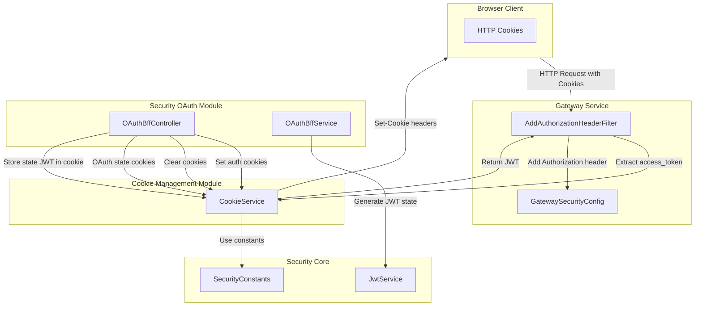
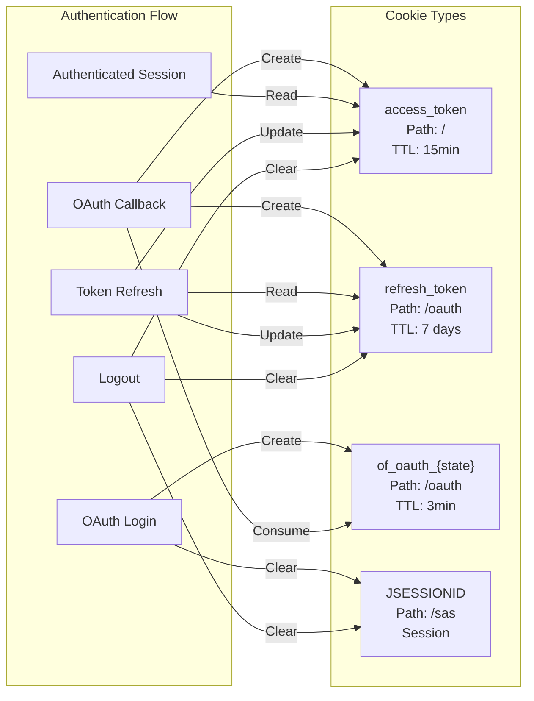
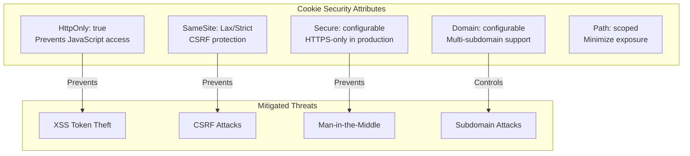
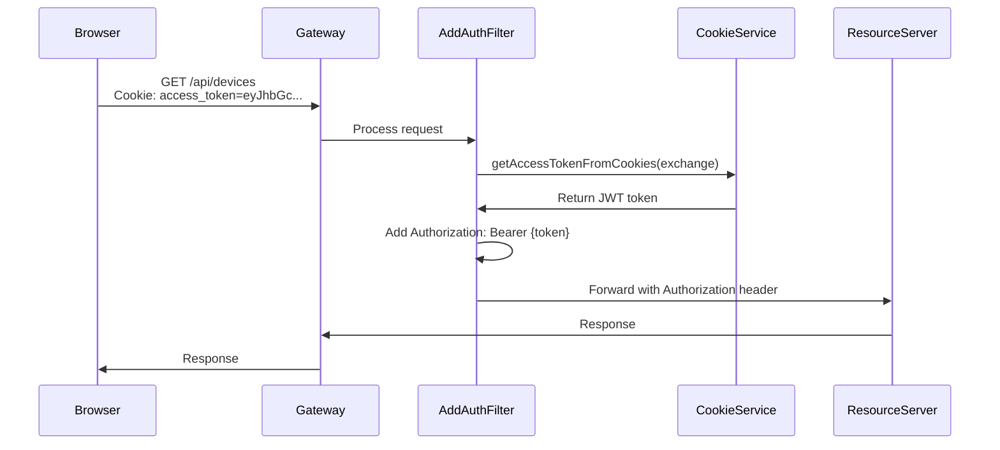
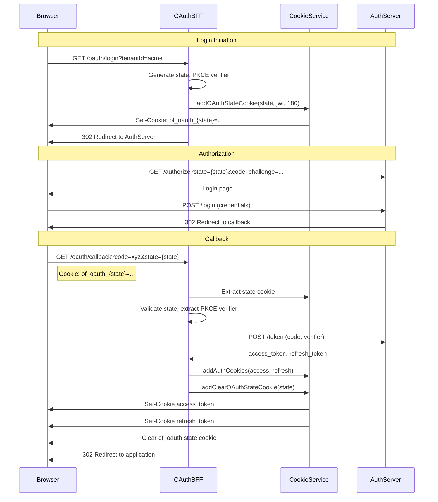
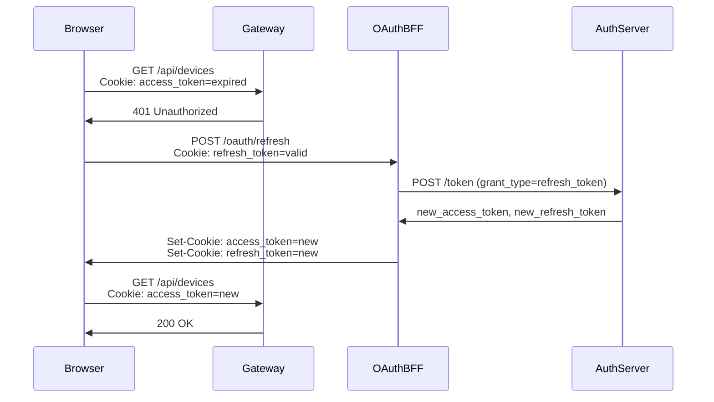

# Security Core Cookie Management

## Overview

The **security_core_cookie_management** module provides centralized HTTP cookie management for authentication tokens in the OpenFrame platform. It handles the secure creation, retrieval, and deletion of cookies used to store JWT access and refresh tokens, OAuth state parameters, and session identifiers across the distributed microservices architecture.

This module is a critical component of OpenFrame's authentication infrastructure, enabling secure, browser-based authentication flows while supporting both traditional web applications and modern single-page applications (SPAs). It implements security best practices including HttpOnly flags, SameSite policies, and configurable domain/secure settings.

**Key Responsibilities:**
- Create and manage authentication token cookies (access_token, refresh_token)
- Handle OAuth state cookies for PKCE flow security
- Clear authentication cookies during logout
- Extract tokens from cookies for authentication filters
- Support multi-domain and secure/insecure environments

**Related Modules:**
- [security_core_jwt_management](security_core_jwt_management.md) - JWT token generation and validation
- [security_core_authentication](security_core_authentication.md) - Authentication principal management
- [security_oauth](security_oauth.md) - OAuth 2.0 BFF (Backend-for-Frontend) implementation
- [gateway_service_security](gateway_service_security.md) - Gateway authentication filters

---

## Architecture

### Component Overview



### Cookie Types and Lifecycle



### Security Properties



---

## Core Components

### CookieService

**Location:** `com.openframe.security.cookie.CookieService`

The central service for all cookie operations in the OpenFrame platform.

#### Key Methods

##### Authentication Cookie Management

```java
public void addAuthCookies(HttpHeaders headers, String accessToken, String refreshToken)
```

Creates and adds authentication cookies to HTTP response headers.

**Cookies Created:**
- `access_token`: JWT access token, path `/`, TTL from config
- `refresh_token`: JWT refresh token, path `/oauth`, TTL from config

**Usage Example:**

```java
@RestController
public class AuthController {
    private final CookieService cookieService;
    
    @PostMapping("/login")
    public ResponseEntity<Void> login(TokenResponse tokens) {
        HttpHeaders headers = new HttpHeaders();
        cookieService.addAuthCookies(headers, 
            tokens.access_token(), 
            tokens.refresh_token());
        return ResponseEntity.ok().headers(headers).build();
    }
}
```

##### Cookie Clearing

```java
public void addClearAuthCookies(HttpHeaders headers)
```

Clears all authentication-related cookies by setting maxAge=0.

**Cookies Cleared:**
- `access_token` (path `/`)
- `refresh_token` (path `/oauth`)
- `JSESSIONID` (path `/sas`) - both domain and host-only variants

**Usage Example:**

```java
@GetMapping("/logout")
public Mono<ResponseEntity<Void>> logout() {
    HttpHeaders headers = new HttpHeaders();
    cookieService.addClearAuthCookies(headers);
    return Mono.just(ResponseEntity.noContent().headers(headers).build());
}
```

```java
public void addClearSasCookies(HttpHeaders headers)
```

Clears Spring Authorization Server session cookies and SSO-related cookies.

**Cookies Cleared:**
- `JSESSIONID` (path `/sas`)
- `of_sso_reg` (SSO registration cookie)
- `of_sso_invite` (SSO invitation cookie)
- Both domain-scoped and host-only variants

##### OAuth State Cookie Management

```java
public void addOAuthStateCookie(HttpHeaders headers, String state, String jwtValue, int ttlSeconds)
```

Creates a short-lived, signed OAuth state cookie for PKCE flow security.

**Cookie Format:**
- Name: `of_oauth_{state}` (e.g., `of_oauth_abc123xyz`)
- Value: JWT containing state, PKCE verifier, redirect URL
- Path: `/oauth`
- TTL: Typically 180 seconds (3 minutes)

**Security Features:**
- State-specific cookie name prevents state fixation attacks
- JWT signature prevents tampering
- Short TTL limits exposure window
- HttpOnly prevents JavaScript access

**Usage Example:**

```java
@GetMapping("/oauth/login")
public Mono<ResponseEntity<Void>> login(@RequestParam String tenantId) {
    return oauthService.buildAuthorizeRedirect(tenantId)
        .map(data -> {
            String stateJwt = oauthService.buildStateJwt(data, 180);
            HttpHeaders headers = new HttpHeaders();
            cookieService.addOAuthStateCookie(headers, 
                data.state(), 
                stateJwt, 
                180);
            return ResponseEntity.status(302)
                .header("Location", data.authorizeUrl())
                .headers(headers)
                .build();
        });
}
```

```java
public void addClearOAuthStateCookie(HttpHeaders headers, String state)
```

Clears the OAuth state cookie after successful callback or error.

##### Token Extraction

```java
public String getAccessTokenFromCookies(ServerWebExchange exchange)
```

Extracts the JWT access token from the `access_token` cookie in a reactive request.

**Returns:** JWT token string or `null` if not found

**Usage Example:**

```java
@Component
public class AddAuthorizationHeaderFilter implements WebFilter {
    private final CookieService cookieService;
    
    @Override
    public Mono<Void> filter(ServerWebExchange exchange, WebFilterChain chain) {
        String token = cookieService.getAccessTokenFromCookies(exchange);
        if (token != null) {
            ServerHttpRequest mutated = exchange.getRequest().mutate()
                .header("Authorization", "Bearer " + token)
                .build();
            return chain.filter(exchange.mutate().request(mutated).build());
        }
        return chain.filter(exchange);
    }
}
```

#### Configuration Properties

```yaml
# Access token expiration (seconds)
security.oauth2.token.access.expiration-seconds: 900  # 15 minutes

# Refresh token expiration (seconds)
security.oauth2.token.refresh.expiration-seconds: 604800  # 7 days

# Cookie domain (null = host-only)
openframe.security.cookie.domain: .openframe.run

# Secure flag (true for HTTPS-only)
openframe.security.cookie.secure: true

# SameSite policy (Lax, Strict, None)
openframe.security.cookie.same-site: Lax
```

#### Cookie Attributes

| Attribute | Value | Purpose |
|-----------|-------|---------|
| **HttpOnly** | `true` | Prevents JavaScript access, mitigates XSS attacks |
| **Secure** | Configurable | Enforces HTTPS-only transmission in production |
| **SameSite** | `Lax` (default) | Prevents CSRF attacks while allowing top-level navigation |
| **Domain** | Configurable | Enables cookie sharing across subdomains (e.g., `*.openframe.run`) |
| **Path** | Scoped | Limits cookie exposure to specific endpoints |
| **MaxAge** | Token TTL | Automatic expiration aligned with token lifetime |

---

## Integration Points

### Gateway Service Integration

The Gateway Service uses `CookieService` to extract authentication tokens from cookies and convert them to standard `Authorization` headers.



**Implementation:**

```java
@Component
@RequiredArgsConstructor
public class AddAuthorizationHeaderFilter implements WebFilter {
    private final CookieService cookieService;
    
    @Override
    public Mono<Void> filter(ServerWebExchange exchange, WebFilterChain chain) {
        String existingAuth = exchange.getRequest()
            .getHeaders()
            .getFirst(HttpHeaders.AUTHORIZATION);
        
        if (existingAuth != null) {
            return chain.filter(exchange);
        }
        
        String token = cookieService.getAccessTokenFromCookies(exchange);
        if (token != null) {
            ServerHttpRequest mutated = exchange.getRequest().mutate()
                .header(HttpHeaders.AUTHORIZATION, "Bearer " + token)
                .build();
            return chain.filter(exchange.mutate().request(mutated).build());
        }
        
        return chain.filter(exchange);
    }
}
```

### OAuth BFF Integration

The OAuth BFF Controller uses `CookieService` throughout the OAuth 2.0 authorization code flow with PKCE.



**Key Integration Points:**

1. **Login Endpoint** (`/oauth/login`):
   - Clears existing session cookies
   - Creates OAuth state cookie with PKCE parameters
   - Redirects to authorization server

2. **Callback Endpoint** (`/oauth/callback`):
   - Validates OAuth state cookie
   - Exchanges authorization code for tokens
   - Sets authentication cookies
   - Clears OAuth state cookie

3. **Refresh Endpoint** (`/oauth/refresh`):
   - Reads refresh token from cookie
   - Exchanges for new tokens
   - Updates authentication cookies

4. **Logout Endpoint** (`/oauth/logout`):
   - Clears all authentication cookies
   - Revokes refresh token

### Authorization Service Integration

The Authorization Service (Spring Authorization Server) uses `CookieService` to manage session cookies during the OAuth flow.

**Session Cookie Management:**
- `JSESSIONID` cookie for Spring Security session
- Path: `/sas` (Spring Authorization Server context)
- Cleared during logout and login initiation

---

## Security Considerations

### Cookie Security Best Practices

#### 1. HttpOnly Flag

**Purpose:** Prevents JavaScript access to cookies, mitigating XSS attacks.

**Implementation:**
```java
ResponseCookie.from(name, value)
    .httpOnly(true)  // Always true for auth cookies
    .build();
```

**Impact:**
- ✅ Tokens cannot be stolen via XSS
- ✅ Malicious scripts cannot read cookie values
- ❌ Frontend JavaScript cannot access tokens (by design)

#### 2. Secure Flag

**Purpose:** Ensures cookies are only transmitted over HTTPS.

**Configuration:**
```yaml
openframe.security.cookie.secure: true  # Production
openframe.security.cookie.secure: false # Local development
```

**Impact:**
- ✅ Prevents token interception over HTTP
- ✅ Enforces encrypted transmission
- ⚠️ Must be `false` for local development without HTTPS

#### 3. SameSite Policy

**Purpose:** Prevents CSRF attacks by controlling cross-site cookie transmission.

**Options:**
- `Strict`: Cookie never sent in cross-site requests
- `Lax`: Cookie sent on top-level navigation (default)
- `None`: Cookie sent in all contexts (requires `Secure=true`)

**Configuration:**
```yaml
openframe.security.cookie.same-site: Lax
```

**Recommendation:** Use `Lax` for most applications, `Strict` for high-security environments.

#### 4. Domain Scoping

**Purpose:** Controls which domains can access cookies.

**Configuration:**
```yaml
# Multi-subdomain support
openframe.security.cookie.domain: .openframe.run

# Host-only (no subdomain sharing)
openframe.security.cookie.domain: null
```

**Security Implications:**
- Domain-scoped (`.openframe.run`): Shared across `app.openframe.run`, `api.openframe.run`
- Host-only (`null`): Only accessible on exact domain
- ⚠️ Domain-scoped cookies increase attack surface if subdomains are compromised

**Best Practice:** Use host-only cookies unless subdomain sharing is required.

#### 5. Path Scoping

**Purpose:** Limits cookie exposure to specific URL paths.

**Implementation:**
```java
// Access token: available to all paths
createCookie("access_token", token, "/", ttl);

// Refresh token: only available to OAuth endpoints
createCookie("refresh_token", token, "/oauth", ttl);

// Session cookie: only available to auth server
createCookie("JSESSIONID", session, "/sas", ttl);
```

**Benefits:**
- Reduces attack surface
- Prevents accidental token leakage
- Follows principle of least privilege

### OAuth State Cookie Security

The OAuth state cookie implements multiple security layers:

#### 1. State-Specific Cookie Name

```java
String name = "of_oauth_" + state;  // e.g., of_oauth_abc123xyz
```

**Prevents:**
- State fixation attacks
- Cookie collision between concurrent OAuth flows
- Replay attacks using old state values

#### 2. JWT Signature

```java
public String buildStateJwt(OAuthStateData data, int ttlSeconds) {
    JwtClaimsSet claims = JwtClaimsSet.builder()
        .claim("state", data.state())
        .claim("code_verifier", data.codeVerifier())
        .claim("redirect_to", data.redirectTo())
        .expiresAt(Instant.now().plusSeconds(ttlSeconds))
        .build();
    return jwtService.generateToken(claims);
}
```

**Prevents:**
- Cookie tampering
- PKCE verifier manipulation
- Redirect URL hijacking

#### 3. Short TTL

```yaml
openframe.gateway.oauth.state-cookie-ttl-seconds: 180  # 3 minutes
```

**Prevents:**
- Long-term state cookie exposure
- Stale state reuse
- Extended attack windows

#### 4. Immediate Cleanup

```java
@GetMapping("/oauth/callback")
public Mono<ResponseEntity<Void>> callback(@RequestParam String state) {
    return oauthService.handleCallback(code, state)
        .map(result -> {
            HttpHeaders headers = new HttpHeaders();
            cookieService.addAuthCookies(headers, result.tokens());
            cookieService.addClearOAuthStateCookie(headers, state);  // Immediate cleanup
            return ResponseEntity.status(302).headers(headers).build();
        });
}
```

**Prevents:**
- State cookie reuse
- Replay attacks
- Cookie accumulation

### Token Rotation

The refresh token flow implements automatic token rotation:



**Security Benefits:**
- Limits token lifetime exposure
- Enables token revocation
- Detects token theft (refresh token reuse detection)

### Cookie Clearing Strategies

#### Full Authentication Cleanup

```java
public void addClearAuthCookies(HttpHeaders headers) {
    // Clear access token (all paths)
    ResponseCookie clearedAccess = createClearedCookie("access_token", "/");
    
    // Clear refresh token (OAuth paths)
    ResponseCookie clearedRefresh = createClearedCookie("refresh_token", "/oauth");
    
    // Clear session cookie (auth server paths) - domain-scoped
    ResponseCookie clearedAuthSession = createClearedCookie("JSESSIONID", "/sas");
    
    // Clear session cookie - host-only variant
    ResponseCookie clearedAuthSessionHostOnly = createClearedCookieHostOnly("JSESSIONID", "/sas");
    
    headers.add("Set-Cookie", clearedAccess.toString());
    headers.add("Set-Cookie", clearedRefresh.toString());
    headers.add("Set-Cookie", clearedAuthSession.toString());
    headers.add("Set-Cookie", clearedAuthSessionHostOnly.toString());
}
```

**Why Both Domain and Host-Only Variants?**

Browsers may have created cookies with different domain scopes:
- Domain-scoped: `.openframe.run`
- Host-only: `app.openframe.run`

Clearing both ensures complete cleanup regardless of how the cookie was set.

#### SSO Session Cleanup

```java
public void addClearSasCookies(HttpHeaders headers) {
    // Clear Spring Authorization Server session
    ResponseCookie clearedAuthSession = createClearedCookie("JSESSIONID", "/sas");
    ResponseCookie clearedAuthSessionHostOnly = createClearedCookieHostOnly("JSESSIONID", "/sas");
    
    // Clear SSO registration cookie (tenant registration flow)
    ResponseCookie clearedSsoRegistration = createClearedCookie("of_sso_reg", "/");
    ResponseCookie clearedSsoRegistrationHostOnly = createClearedCookieHostOnly("of_sso_reg", "/");
    
    // Clear SSO invitation cookie (invitation acceptance flow)
    ResponseCookie clearedSsoInvite = createClearedCookie("of_sso_invite", "/");
    ResponseCookie clearedSsoInviteHostOnly = createClearedCookieHostOnly("of_sso_invite", "/");
    
    // Add all to headers...
}
```

**Use Case:** Called during login initiation to ensure clean SSO state.

---

## Configuration

### Environment-Specific Configuration

#### Production Configuration

```yaml
# Production settings (HTTPS required)
openframe:
  security:
    cookie:
      domain: .openframe.run      # Multi-subdomain support
      secure: true                # HTTPS-only
      same-site: Lax              # CSRF protection

security:
  oauth2:
    token:
      access:
        expiration-seconds: 900   # 15 minutes
      refresh:
        expiration-seconds: 604800 # 7 days

openframe:
  gateway:
    oauth:
      state-cookie-ttl-seconds: 180 # 3 minutes
```

#### Development Configuration

```yaml
# Local development settings (HTTP allowed)
openframe:
  security:
    cookie:
      domain: null                # Host-only cookies
      secure: false               # Allow HTTP
      same-site: Lax

security:
  oauth2:
    token:
      access:
        expiration-seconds: 3600  # 1 hour (longer for dev)
      refresh:
        expiration-seconds: 86400 # 1 day

openframe:
  gateway:
    oauth:
      state-cookie-ttl-seconds: 300 # 5 minutes (longer for debugging)
```

#### Staging Configuration

```yaml
# Staging settings (HTTPS with relaxed policies)
openframe:
  security:
    cookie:
      domain: .staging.openframe.run
      secure: true
      same-site: Lax

security:
  oauth2:
    token:
      access:
        expiration-seconds: 1800  # 30 minutes
      refresh:
        expiration-seconds: 172800 # 2 days
```

### Configuration Properties Reference

| Property | Type | Default | Description |
|----------|------|---------|-------------|
| `security.oauth2.token.access.expiration-seconds` | `int` | `900` | Access token TTL in seconds |
| `security.oauth2.token.refresh.expiration-seconds` | `int` | `604800` | Refresh token TTL in seconds |
| `openframe.security.cookie.domain` | `String` | `null` | Cookie domain (null = host-only) |
| `openframe.security.cookie.secure` | `boolean` | `false` | Require HTTPS for cookies |
| `openframe.security.cookie.same-site` | `String` | `Lax` | SameSite policy (Lax, Strict, None) |
| `openframe.gateway.oauth.state-cookie-ttl-seconds` | `int` | `180` | OAuth state cookie TTL |

---

## Usage Examples

### Example 1: OAuth Login Flow

```java
@RestController
@RequestMapping("/oauth")
@RequiredArgsConstructor
public class OAuthBffController {
    private final OAuthBffService oauthBffService;
    private final CookieService cookieService;
    
    @Value("${openframe.gateway.oauth.state-cookie-ttl-seconds:180}")
    private int stateCookieTtlSeconds;
    
    @GetMapping("/login")
    public Mono<ResponseEntity<Void>> login(
            @RequestParam String tenantId,
            @RequestParam(required = false) String redirectTo,
            ServerHttpRequest request) {
        
        HttpHeaders headers = new HttpHeaders();
        
        // Clear any existing session cookies
        cookieService.addClearSasCookies(headers);
        
        return oauthBffService.buildAuthorizeRedirect(tenantId, redirectTo, null, request)
            .map(data -> {
                // Create signed JWT containing state, PKCE verifier, redirect URL
                String stateJwt = oauthBffService.buildStateJwt(data, stateCookieTtlSeconds);
                
                // Store state JWT in cookie
                cookieService.addOAuthStateCookie(
                    headers, 
                    data.state(), 
                    stateJwt, 
                    stateCookieTtlSeconds
                );
                
                // Redirect to authorization server
                return ResponseEntity.status(HttpStatus.FOUND)
                    .header(HttpHeaders.LOCATION, data.authorizeUrl())
                    .headers(headers)
                    .build();
            });
    }
}
```

### Example 2: OAuth Callback Flow

```java
@GetMapping("/callback")
public Mono<ResponseEntity<Void>> callback(
        @RequestParam String code,
        @RequestParam String state,
        ServerHttpRequest request) {
    
    return oauthBffService.handleCallback(code, state, request)
        .map(result -> {
            HttpHeaders headers = new HttpHeaders();
            
            // Set authentication cookies
            cookieService.addAuthCookies(
                headers,
                result.tokens().access_token(),
                result.tokens().refresh_token()
            );
            
            // Clear OAuth state cookie
            cookieService.addClearOAuthStateCookie(headers, state);
            
            // Redirect to application
            String redirectUrl = result.redirectTo() != null 
                ? result.redirectTo() 
                : "/";
            
            return ResponseEntity.status(HttpStatus.FOUND)
                .header(HttpHeaders.LOCATION, redirectUrl)
                .headers(headers)
                .build();
        })
        .onErrorResume(e -> {
            // Handle error: clear state cookie and redirect with error
            HttpHeaders headers = new HttpHeaders();
            cookieService.addClearOAuthStateCookie(headers, state);
            
            String errorUrl = "/?error=oauth_failed&message=" 
                + URLEncoder.encode(e.getMessage(), StandardCharsets.UTF_8);
            
            return Mono.just(ResponseEntity.status(HttpStatus.FOUND)
                .header(HttpHeaders.LOCATION, errorUrl)
                .headers(headers)
                .build());
        });
}
```

### Example 3: Token Refresh Flow

```java
@PostMapping("/refresh")
public Mono<ResponseEntity<Void>> refresh(
        @RequestParam(required = false) String tenantId,
        @CookieValue(name = "refresh_token", required = false) String refreshCookie,
        ServerHttpRequest request) {
    
    // Try cookie first, fall back to header
    String refreshToken = refreshCookie != null 
        ? refreshCookie 
        : request.getHeaders().getFirst("Refresh-Token");
    
    if (refreshToken == null) {
        return Mono.just(ResponseEntity.status(HttpStatus.UNAUTHORIZED).build());
    }
    
    // Exchange refresh token for new tokens
    Mono<TokenResponse> tokensMono = tenantId != null
        ? oauthBffService.refreshTokensPublic(tenantId, refreshToken, request)
        : oauthBffService.refreshTokensByLookup(refreshToken, request);
    
    return tokensMono
        .map(tokens -> {
            HttpHeaders headers = new HttpHeaders();
            
            // Update authentication cookies with new tokens
            cookieService.addAuthCookies(
                headers,
                tokens.access_token(),
                tokens.refresh_token()
            );
            
            return ResponseEntity.noContent()
                .headers(headers)
                .build();
        })
        .switchIfEmpty(Mono.just(
            ResponseEntity.status(HttpStatus.UNAUTHORIZED).build()
        ));
}
```

### Example 4: Logout Flow

```java
@GetMapping("/logout")
public Mono<ResponseEntity<Void>> logout(
        @RequestParam(required = false) String tenantId,
        @CookieValue(name = "refresh_token", required = false) String refreshCookie,
        ServerHttpRequest request) {
    
    HttpHeaders headers = new HttpHeaders();
    
    // Clear all authentication cookies
    cookieService.addClearAuthCookies(headers);
    
    // Revoke refresh token on authorization server
    String refreshToken = refreshCookie != null
        ? refreshCookie
        : request.getHeaders().getFirst("Refresh-Token");
    
    Mono<Void> revoke = tenantId != null
        ? oauthBffService.revokeRefreshToken(tenantId, refreshToken)
        : oauthBffService.revokeRefreshTokenByLookup(refreshToken);
    
    return revoke.then(Mono.just(
        ResponseEntity.noContent()
            .headers(headers)
            .build()
    ));
}
```

### Example 5: Gateway Authentication Filter

```java
@Component
@RequiredArgsConstructor
@Slf4j
public class AddAuthorizationHeaderFilter implements WebFilter {
    private final CookieService cookieService;
    
    @Override
    public Mono<Void> filter(ServerWebExchange exchange, WebFilterChain chain) {
        ServerHttpRequest request = exchange.getRequest();
        String path = request.getPath().value();
        
        // Skip public paths
        if (!isPrivatePath(path)) {
            return chain.filter(exchange);
        }
        
        // Skip if Authorization header already present
        String existingAuth = request.getHeaders().getFirst(HttpHeaders.AUTHORIZATION);
        if (existingAuth != null) {
            return chain.filter(exchange);
        }
        
        // Extract token from cookie
        String token = cookieService.getAccessTokenFromCookies(exchange);
        if (token != null) {
            log.debug("Adding Authorization header from access_token cookie");
            
            // Add Authorization header
            ServerHttpRequest mutated = request.mutate()
                .header(HttpHeaders.AUTHORIZATION, "Bearer " + token)
                .build();
            
            return chain.filter(exchange.mutate().request(mutated).build());
        }
        
        // No token found, continue without Authorization header
        return chain.filter(exchange);
    }
    
    private boolean isPrivatePath(String path) {
        return path.startsWith("/api/") 
            || path.startsWith("/dashboard/")
            || path.startsWith("/tools/");
    }
}
```

### Example 6: Custom Cookie Creation

```java
@Service
@RequiredArgsConstructor
public class CustomAuthService {
    private final CookieService cookieService;
    
    @Value("${openframe.security.cookie.domain}")
    private String domain;
    
    @Value("${openframe.security.cookie.secure}")
    private boolean secure;
    
    @Value("${openframe.security.cookie.same-site}")
    private String sameSite;
    
    public void setCustomCookie(HttpHeaders headers, String name, String value, int ttl) {
        ResponseCookie cookie = ResponseCookie.from(name, value)
            .httpOnly(true)
            .secure(secure)
            .sameSite(sameSite)
            .path("/")
            .maxAge(ttl)
            .domain(domain)
            .build();
        
        headers.add(HttpHeaders.SET_COOKIE, cookie.toString());
    }
}
```

---

## Testing

### Unit Testing Cookie Creation

```java
@SpringBootTest
class CookieServiceTest {
    
    @Autowired
    private CookieService cookieService;
    
    @Test
    void testAddAuthCookies() {
        HttpHeaders headers = new HttpHeaders();
        String accessToken = "eyJhbGciOiJSUzI1NiJ9...";
        String refreshToken = "eyJhbGciOiJSUzI1NiJ9...";
        
        cookieService.addAuthCookies(headers, accessToken, refreshToken);
        
        List<String> cookies = headers.get(HttpHeaders.SET_COOKIE);
        assertThat(cookies).hasSize(2);
        
        // Verify access token cookie
        String accessCookie = cookies.stream()
            .filter(c -> c.startsWith("access_token="))
            .findFirst()
            .orElseThrow();
        
        assertThat(accessCookie).contains("HttpOnly");
        assertThat(accessCookie).contains("Path=/");
        assertThat(accessCookie).contains("Max-Age=900");
        
        // Verify refresh token cookie
        String refreshCookie = cookies.stream()
            .filter(c -> c.startsWith("refresh_token="))
            .findFirst()
            .orElseThrow();
        
        assertThat(refreshCookie).contains("HttpOnly");
        assertThat(refreshCookie).contains("Path=/oauth");
        assertThat(refreshCookie).contains("Max-Age=604800");
    }
    
    @Test
    void testAddClearAuthCookies() {
        HttpHeaders headers = new HttpHeaders();
        
        cookieService.addClearAuthCookies(headers);
        
        List<String> cookies = headers.get(HttpHeaders.SET_COOKIE);
        assertThat(cookies).hasSize(4); // access, refresh, JSESSIONID x2
        
        // Verify all cookies have Max-Age=0
        cookies.forEach(cookie -> {
            assertThat(cookie).contains("Max-Age=0");
        });
    }
    
    @Test
    void testOAuthStateCookie() {
        HttpHeaders headers = new HttpHeaders();
        String state = "abc123xyz";
        String jwtValue = "eyJhbGciOiJSUzI1NiJ9...";
        int ttl = 180;
        
        cookieService.addOAuthStateCookie(headers, state, jwtValue, ttl);
        
        List<String> cookies = headers.get(HttpHeaders.SET_COOKIE);
        assertThat(cookies).hasSize(1);
        
        String cookie = cookies.get(0);
        assertThat(cookie).startsWith("of_oauth_" + state + "=");
        assertThat(cookie).contains("HttpOnly");
        assertThat(cookie).contains("Path=/oauth");
        assertThat(cookie).contains("Max-Age=180");
    }
}
```

### Integration Testing OAuth Flow

```java
@SpringBootTest(webEnvironment = SpringBootTest.WebEnvironment.RANDOM_PORT)
@AutoConfigureWebTestClient
class OAuthFlowIntegrationTest {
    
    @Autowired
    private WebTestClient webTestClient;
    
    @Test
    void testCompleteOAuthFlow() {
        // Step 1: Initiate login
        webTestClient.get()
            .uri("/oauth/login?tenantId=acme")
            .exchange()
            .expectStatus().isFound()
            .expectHeader().exists(HttpHeaders.LOCATION)
            .expectHeader().valueMatches(HttpHeaders.SET_COOKIE, "of_oauth_.*")
            .expectHeader().valueMatches(HttpHeaders.SET_COOKIE, ".*HttpOnly.*")
            .expectHeader().valueMatches(HttpHeaders.SET_COOKIE, ".*Path=/oauth.*");
        
        // Step 2: Simulate callback (requires mock authorization server)
        String code = "mock_authorization_code";
        String state = "abc123xyz";
        
        webTestClient.get()
            .uri("/oauth/callback?code=" + code + "&state=" + state)
            .cookie("of_oauth_" + state, "mock_jwt_value")
            .exchange()
            .expectStatus().isFound()
            .expectHeader().exists(HttpHeaders.LOCATION)
            .expectHeader().valueMatches(HttpHeaders.SET_COOKIE, "access_token=.*")
            .expectHeader().valueMatches(HttpHeaders.SET_COOKIE, "refresh_token=.*")
            .expectHeader().valueMatches(HttpHeaders.SET_COOKIE, "of_oauth_" + state + "=; Max-Age=0");
    }
    
    @Test
    void testTokenRefresh() {
        String refreshToken = "valid_refresh_token";
        
        webTestClient.post()
            .uri("/oauth/refresh?tenantId=acme")
            .cookie("refresh_token", refreshToken)
            .exchange()
            .expectStatus().isNoContent()
            .expectHeader().valueMatches(HttpHeaders.SET_COOKIE, "access_token=.*")
            .expectHeader().valueMatches(HttpHeaders.SET_COOKIE, "refresh_token=.*");
    }
    
    @Test
    void testLogout() {
        String refreshToken = "valid_refresh_token";
        
        webTestClient.get()
            .uri("/oauth/logout?tenantId=acme")
            .cookie("refresh_token", refreshToken)
            .exchange()
            .expectStatus().isNoContent()
            .expectHeader().valueMatches(HttpHeaders.SET_COOKIE, "access_token=; Max-Age=0")
            .expectHeader().valueMatches(HttpHeaders.SET_COOKIE, "refresh_token=; Max-Age=0")
            .expectHeader().valueMatches(HttpHeaders.SET_COOKIE, "JSESSIONID=; Max-Age=0");
    }
}
```

### Testing Cookie Extraction

```java
@SpringBootTest
class CookieExtractionTest {
    
    @Autowired
    private CookieService cookieService;
    
    @Test
    void testGetAccessTokenFromCookies() {
        String expectedToken = "eyJhbGciOiJSUzI1NiJ9...";
        
        MockServerHttpRequest request = MockServerHttpRequest.get("/api/devices")
            .cookie(new HttpCookie("access_token", expectedToken))
            .build();
        
        ServerWebExchange exchange = MockServerWebExchange.from(request);
        
        String actualToken = cookieService.getAccessTokenFromCookies(exchange);
        
        assertThat(actualToken).isEqualTo(expectedToken);
    }
    
    @Test
    void testGetAccessTokenFromCookies_NotFound() {
        MockServerHttpRequest request = MockServerHttpRequest.get("/api/devices")
            .build();
        
        ServerWebExchange exchange = MockServerWebExchange.from(request);
        
        String token = cookieService.getAccessTokenFromCookies(exchange);
        
        assertThat(token).isNull();
    }
}
```

---

## Troubleshooting

### Common Issues

#### Issue 1: Cookies Not Being Set

**Symptoms:**
- Authentication cookies not appearing in browser
- Login succeeds but subsequent requests are unauthorized

**Possible Causes:**

1. **Domain Mismatch**
   ```yaml
   # Wrong: Cookie domain doesn't match request domain
   openframe.security.cookie.domain: .openframe.run
   # Request to: localhost:8080
   ```
   
   **Solution:** Use `domain: null` for local development
   
2. **Secure Flag Mismatch**
   ```yaml
   # Wrong: Secure=true but using HTTP
   openframe.security.cookie.secure: true
   # Request to: http://localhost:8080
   ```
   
   **Solution:** Set `secure: false` for local HTTP development

3. **SameSite=None Without Secure**
   ```yaml
   # Wrong: SameSite=None requires Secure=true
   openframe.security.cookie.same-site: None
   openframe.security.cookie.secure: false
   ```
   
   **Solution:** Use `SameSite=Lax` or set `secure: true`

#### Issue 2: Cookies Not Being Sent

**Symptoms:**
- Cookies set successfully but not included in subsequent requests
- Gateway returns 401 Unauthorized

**Possible Causes:**

1. **Cross-Origin Requests Without Credentials**
   ```javascript
   // Wrong: Cookies not sent in cross-origin requests
   fetch('https://api.openframe.run/devices', {
       method: 'GET'
   });
   ```
   
   **Solution:** Include credentials
   ```javascript
   fetch('https://api.openframe.run/devices', {
       method: 'GET',
       credentials: 'include'  // Send cookies
   });
   ```

2. **SameSite=Strict Blocking Cross-Site Requests**
   ```yaml
   # Too restrictive for OAuth redirects
   openframe.security.cookie.same-site: Strict
   ```
   
   **Solution:** Use `SameSite=Lax` for OAuth flows

3. **Path Mismatch**
   ```text
   Cookie: refresh_token (Path=/oauth)
   Request: GET /api/devices
   Result: Cookie not sent (path doesn't match)
   ```
   
   **Solution:** This is expected behavior. Use `access_token` (Path=/) for API requests.

#### Issue 3: OAuth State Cookie Not Found

**Symptoms:**
- OAuth callback fails with "state cookie not found"
- Error: "Invalid state parameter"

**Possible Causes:**

1. **Cookie Expired**
   ```yaml
   # TTL too short for slow authorization
   openframe.gateway.oauth.state-cookie-ttl-seconds: 30
   ```
   
   **Solution:** Increase TTL to 180-300 seconds

2. **Cookie Cleared by Browser**
   - User cleared cookies during OAuth flow
   - Browser privacy settings blocking cookies
   
   **Solution:** Inform users not to clear cookies during login

3. **Domain Mismatch During Redirect**
   ```text
   Login: app.openframe.run (sets cookie)
   Callback: auth.openframe.run (different domain)
   Result: Cookie not accessible
   ```
   
   **Solution:** Use domain-scoped cookies (`.openframe.run`)

#### Issue 4: Token Refresh Fails

**Symptoms:**
- Refresh endpoint returns 401
- User logged out unexpectedly

**Possible Causes:**

1. **Refresh Token Cookie Not Sent**
   ```text
   Request: POST /oauth/refresh
   Cookie: access_token=... (no refresh_token)
   ```
   
   **Solution:** Ensure refresh token cookie exists and path matches

2. **Refresh Token Expired**
   ```yaml
   # Short refresh token TTL
   security.oauth2.token.refresh.expiration-seconds: 3600
   ```
   
   **Solution:** Increase refresh token TTL (e.g., 7 days)

3. **Refresh Token Revoked**
   - Token revoked on authorization server
   - Token reuse detected (security feature)
   
   **Solution:** User must re-authenticate

#### Issue 5: Cookies Not Cleared on Logout

**Symptoms:**
- User logged out but cookies still present
- Subsequent login attempts fail

**Possible Causes:**

1. **Domain Mismatch**
   ```java
   // Cookie set with domain: .openframe.run
   // Cleared without domain (host-only)
   ResponseCookie cleared = ResponseCookie.from("access_token", "")
       .maxAge(0)
       .path("/")
       // Missing: .domain(".openframe.run")
       .build();
   ```
   
   **Solution:** Clear both domain-scoped and host-only variants

2. **Path Mismatch**
   ```java
   // Cookie set with path: /oauth
   // Cleared with path: /
   ```
   
   **Solution:** Use same path when clearing

3. **Browser Cache**
   - Browser caching old cookies
   
   **Solution:** Hard refresh (Ctrl+Shift+R) or clear browser cache

### Debugging Tools

#### 1. Browser DevTools

**Chrome/Edge:**
1. Open DevTools (F12)
2. Go to Application tab
3. Select Cookies in left sidebar
4. Inspect cookie attributes

**Firefox:**
1. Open DevTools (F12)
2. Go to Storage tab
3. Select Cookies
4. Inspect cookie attributes

**Check:**
- Cookie name and value
- Domain and path
- Expires/Max-Age
- HttpOnly, Secure, SameSite flags

#### 2. Network Tab

**Inspect Set-Cookie Headers:**
1. Open DevTools Network tab
2. Trigger login/logout
3. Find response with Set-Cookie header
4. Verify cookie attributes

**Inspect Cookie Headers:**
1. Open DevTools Network tab
2. Make authenticated request
3. Check Request Headers for Cookie
4. Verify correct cookies sent

#### 3. Logging

**Enable Debug Logging:**

```yaml
logging:
  level:
    com.openframe.security.cookie: DEBUG
    com.openframe.gateway.security.filter: DEBUG
```

**Log Output:**
```text
DEBUG c.o.s.cookie.CookieService : Found access_token cookie in request
DEBUG c.o.g.s.f.AddAuthorizationHeaderFilter : Using bearer token from access_token cookie
DEBUG c.o.g.s.f.AddAuthorizationHeaderFilter : Adding Authorization header from cookie
```

#### 4. cURL Testing

**Test Cookie Setting:**
```bash
curl -v -X GET 'http://localhost:8080/oauth/login?tenantId=acme' \
  -H 'Accept: application/json'
```

**Expected Output:**
```text
< HTTP/1.1 302 Found
< Location: https://auth.openframe.run/authorize?...
< Set-Cookie: of_oauth_abc123=eyJhbGc...; Path=/oauth; HttpOnly; SameSite=Lax
```

**Test Cookie Sending:**
```bash
curl -v -X GET 'http://localhost:8080/api/devices' \
  -H 'Cookie: access_token=eyJhbGciOiJSUzI1NiJ9...'
```

**Expected Output:**
```text
> GET /api/devices HTTP/1.1
> Cookie: access_token=eyJhbGciOiJSUzI1NiJ9...
< HTTP/1.1 200 OK
```

---

## Best Practices

### 1. Use Environment-Specific Configuration

```yaml
# application-prod.yml
openframe:
  security:
    cookie:
      domain: .openframe.run
      secure: true
      same-site: Lax

# application-dev.yml
openframe:
  security:
    cookie:
      domain: null
      secure: false
      same-site: Lax
```

### 2. Implement Proper Error Handling

```java
@GetMapping("/oauth/callback")
public Mono<ResponseEntity<Void>> callback(@RequestParam String state) {
    return oauthService.handleCallback(code, state)
        .map(result -> buildSuccessResponse(result, state))
        .onErrorResume(InvalidStateException.class, e -> {
            log.error("Invalid OAuth state: {}", e.getMessage());
            return Mono.just(buildErrorResponse(state, "invalid_state"));
        })
        .onErrorResume(TokenExchangeException.class, e -> {
            log.error("Token exchange failed: {}", e.getMessage());
            return Mono.just(buildErrorResponse(state, "token_exchange_failed"));
        })
        .onErrorResume(e -> {
            log.error("Unexpected error during OAuth callback", e);
            return Mono.just(buildErrorResponse(state, "internal_error"));
        });
}

private ResponseEntity<Void> buildErrorResponse(String state, String error) {
    HttpHeaders headers = new HttpHeaders();
    cookieService.addClearOAuthStateCookie(headers, state);
    return ResponseEntity.status(HttpStatus.FOUND)
        .header(HttpHeaders.LOCATION, "/?error=" + error)
        .headers(headers)
        .build();
}
```

### 3. Always Clear Temporary Cookies

```java
// Good: Clear OAuth state cookie after use
@GetMapping("/oauth/callback")
public Mono<ResponseEntity<Void>> callback(@RequestParam String state) {
    return oauthService.handleCallback(code, state)
        .map(result -> {
            HttpHeaders headers = new HttpHeaders();
            cookieService.addAuthCookies(headers, result.tokens());
            cookieService.addClearOAuthStateCookie(headers, state);  // Always clear
            return ResponseEntity.status(302).headers(headers).build();
        })
        .onErrorResume(e -> {
            HttpHeaders headers = new HttpHeaders();
            cookieService.addClearOAuthStateCookie(headers, state);  // Clear on error too
            return Mono.just(ResponseEntity.status(302).headers(headers).build());
        });
}
```

### 4. Use Appropriate Cookie Paths

```java
// Good: Scope cookies to minimum required paths
cookieService.addAuthCookies(headers, accessToken, refreshToken);
// access_token: Path=/ (available everywhere)
// refresh_token: Path=/oauth (only OAuth endpoints)

// Bad: Using Path=/ for refresh token
ResponseCookie.from("refresh_token", token)
    .path("/")  // Unnecessarily exposed to all paths
    .build();
```

### 5. Implement Token Rotation

```java
@PostMapping("/refresh")
public Mono<ResponseEntity<Void>> refresh(@CookieValue("refresh_token") String oldToken) {
    return oauthService.refreshTokens(oldToken)
        .map(newTokens -> {
            HttpHeaders headers = new HttpHeaders();
            // Set new tokens (automatic rotation)
            cookieService.addAuthCookies(headers, 
                newTokens.access_token(), 
                newTokens.refresh_token());
            return ResponseEntity.noContent().headers(headers).build();
        });
}
```

### 6. Log Security Events

```java
@Service
@Slf4j
public class CookieService {
    public void addAuthCookies(HttpHeaders headers, String accessToken, String refreshToken) {
        log.info("Setting authentication cookies");
        // ... cookie creation
    }
    
    public void addClearAuthCookies(HttpHeaders headers) {
        log.info("Clearing authentication cookies");
        // ... cookie clearing
    }
    
    public String getAccessTokenFromCookies(ServerWebExchange exchange) {
        String token = extractCookie(exchange, "access_token");
        if (token != null) {
            log.debug("Access token found in cookies");
        } else {
            log.debug("Access token not found in cookies");
        }
        return token;
    }
}
```

### 7. Validate Cookie Configuration

```java
@Configuration
@Validated
public class CookieConfigValidator {
    
    @Value("${openframe.security.cookie.same-site}")
    private String sameSite;
    
    @Value("${openframe.security.cookie.secure}")
    private boolean secure;
    
    @PostConstruct
    public void validate() {
        if ("None".equals(sameSite) && !secure) {
            throw new IllegalStateException(
                "SameSite=None requires Secure=true"
            );
        }
        
        if (secure && !isHttpsEnvironment()) {
            log.warn("Secure cookies enabled but HTTPS not detected. " +
                    "Cookies will not be sent over HTTP.");
        }
    }
    
    private boolean isHttpsEnvironment() {
        // Check if running in HTTPS environment
        return true; // Implementation depends on deployment
    }
}
```

---

## Related Documentation

- [security_core_jwt_management](security_core_jwt_management.md) - JWT token generation and validation
- [security_core_authentication](security_core_authentication.md) - Authentication principal and actor types
- [security_core_oauth_primitives](security_core_oauth_primitives.md) - PKCE utilities and OAuth constants
- [security_oauth](security_oauth.md) - OAuth 2.0 BFF implementation
- [gateway_service_security](gateway_service_security.md) - Gateway authentication and authorization
- [authorization_service](authorization_service.md) - Spring Authorization Server configuration

---

## References

- [RFC 6265 - HTTP State Management Mechanism (Cookies)](https://datatracker.ietf.org/doc/html/rfc6265)
- [RFC 6749 - OAuth 2.0 Authorization Framework](https://datatracker.ietf.org/doc/html/rfc6749)
- [RFC 7636 - Proof Key for Code Exchange (PKCE)](https://datatracker.ietf.org/doc/html/rfc7636)
- [OWASP Session Management Cheat Sheet](https://cheatsheetseries.owasp.org/cheatsheets/Session_Management_Cheat_Sheet.html)
- [Spring Security OAuth 2.0 Resource Server](https://docs.spring.io/spring-security/reference/servlet/oauth2/resource-server/index.html)
- [Spring WebFlux Security](https://docs.spring.io/spring-security/reference/reactive/index.html)

---

**Last Updated:** 2024  
**Module Version:** 1.0  
**Maintained By:** OpenFrame Security Team
