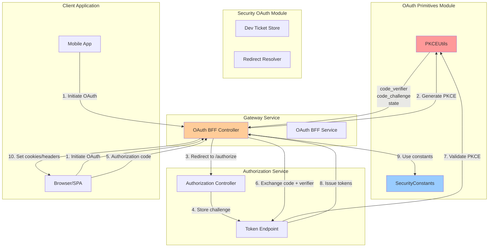
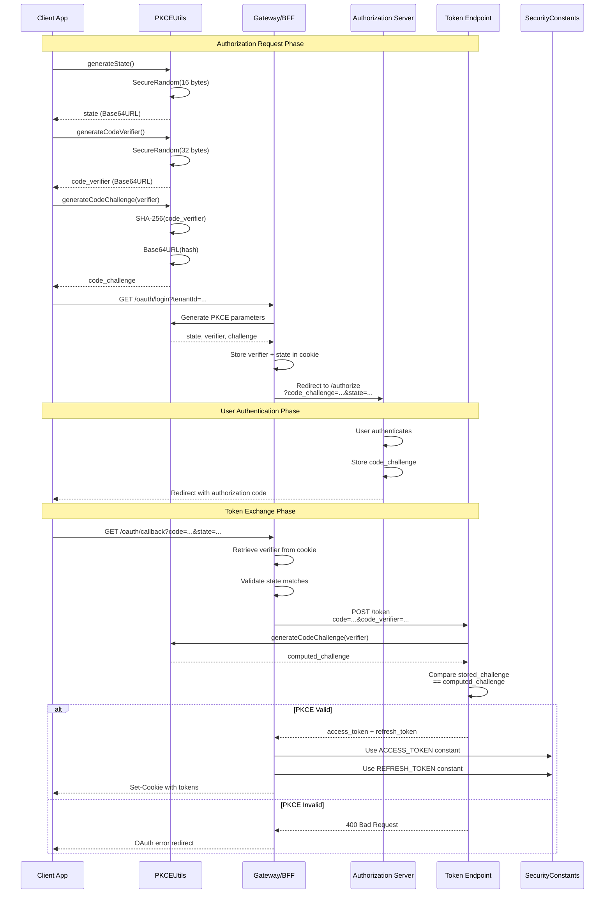
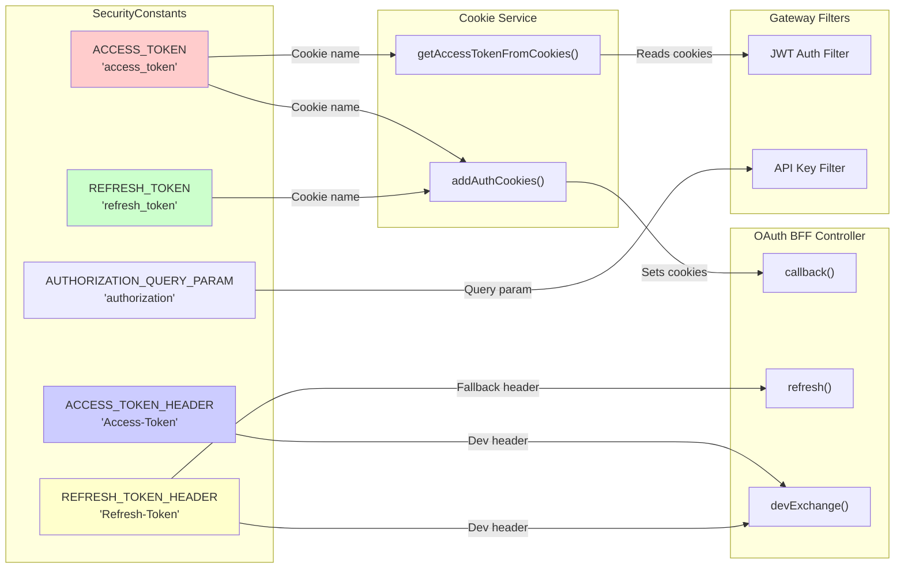

# Security Core OAuth Primitives Module

## Overview

The **security_core_oauth_primitives** module provides foundational OAuth 2.0 security utilities and constants for the OpenFrame platform. This module implements critical security primitives including PKCE (Proof Key for Code Exchange) utilities and standardized OAuth 2.0 constants used across all authentication flows.

This module is part of the broader [security_core](./security_core.md) system and provides low-level security building blocks used by:
- [authorization_service](./authorization_service.md) - OAuth 2.0/OIDC authorization server
- [gateway_service_security](./gateway_service_security.md) - Gateway-level OAuth flow handling
- [security_oauth](./security_oauth.md) - BFF (Backend-for-Frontend) OAuth controller

**Key Capabilities:**
- **PKCE Implementation**: Cryptographically secure code verifier and challenge generation for OAuth 2.0 flows
- **State Parameter Generation**: CSRF protection through secure random state generation
- **Security Constants**: Standardized OAuth 2.0 token parameter and header names
- **URL Encoding Utilities**: Safe URL parameter encoding for OAuth redirects

---

## Architecture

### Component Overview



### PKCE Flow Architecture



### Security Constants Usage



---

## Core Components

### 1. PKCEUtils

**Location**: `com.openframe.security.pkce.PKCEUtils`

**Purpose**: Provides cryptographically secure utilities for implementing PKCE (Proof Key for Code Exchange) in OAuth 2.0 authorization flows. PKCE prevents authorization code interception attacks, especially critical for public clients (SPAs, mobile apps) that cannot securely store client secrets.

#### Key Methods

##### generateState()

Generates a cryptographically secure random state parameter for CSRF protection in OAuth flows.

**Signature**:
```java
public static String generateState()
```

**Returns**: Base64URL-encoded string (16 bytes = 128 bits of entropy)

**Implementation Details**:
- Uses `SecureRandom` for cryptographic randomness
- Generates 16 random bytes (128 bits)
- Encodes using Base64URL (URL-safe, no padding)
- Suitable for OAuth state parameter and CSRF tokens

**Usage Example**:
```java
// In OAuth BFF Service
String state = PKCEUtils.generateState();
// Result: "a7f3k9m2p5q8r1t4w6x9z2b5c8e1g4j7"

// Store state in secure cookie
cookieService.addOAuthStateCookie(headers, state, stateJwt, ttlSeconds);

// Later, validate state matches on callback
if (!receivedState.equals(storedState)) {
    throw new SecurityException("State mismatch - possible CSRF attack");
}
```

**Security Properties**:
- **Entropy**: 128 bits (2^128 possible values)
- **Collision Resistance**: Astronomically low probability of duplicates
- **Unpredictability**: Cannot be guessed or predicted by attackers
- **URL-Safe**: Can be used in query parameters without encoding

---

##### generateCodeVerifier()

Generates a cryptographically secure random code verifier for PKCE flows.

**Signature**:
```java
public static String generateCodeVerifier()
```

**Returns**: Base64URL-encoded string (32 bytes = 256 bits of entropy)

**Implementation Details**:
- Uses `SecureRandom` for cryptographic randomness
- Generates 32 random bytes (256 bits)
- Encodes using Base64URL (URL-safe, no padding)
- Meets OAuth 2.0 PKCE specification requirements (43-128 characters)

**Usage Example**:
```java
// In OAuth authorization request
String codeVerifier = PKCEUtils.generateCodeVerifier();
// Result: "k3m5n7p9q2r4s6t8u1v3w5x7y9z2a4b6c8d1e3f5g7h9j2k4m6n8p1q3r5s7t9u2v4w6x8y1z3"

// Generate challenge from verifier
String codeChallenge = PKCEUtils.generateCodeChallenge(codeVerifier);

// Store verifier securely (server-side or encrypted cookie)
// Send challenge to authorization server
String authorizeUrl = authServerUrl + 
    "?code_challenge=" + codeChallenge +
    "&code_challenge_method=S256";

// Later, exchange code with verifier
String tokenUrl = authServerUrl + "/token";
// POST: code=...&code_verifier=<original_verifier>
```

**Security Properties**:
- **Entropy**: 256 bits (2^256 possible values)
- **Length**: 43 characters (meets minimum PKCE requirement)
- **Secrecy**: Must be kept secret, never transmitted to authorization server during authorize request
- **Single-Use**: Each authorization flow must use a unique verifier

---

##### generateCodeChallenge(String codeVerifier)

Generates a code challenge from a code verifier using SHA-256 hashing.

**Signature**:
```java
public static String generateCodeChallenge(String codeVerifier)
```

**Parameters**:
- `codeVerifier`: The code verifier to hash (typically from `generateCodeVerifier()`)

**Returns**: Base64URL-encoded SHA-256 hash of the verifier

**Throws**: `IllegalStateException` if SHA-256 algorithm is unavailable (should never happen in standard JVMs)

**Implementation Details**:
- Computes SHA-256 hash of verifier bytes (US-ASCII encoding)
- Encodes hash using Base64URL
- Uses `S256` challenge method (SHA-256)
- Deterministic: same verifier always produces same challenge

**Usage Example**:
```java
// Generate verifier and challenge pair
String verifier = PKCEUtils.generateCodeVerifier();
String challenge = PKCEUtils.generateCodeChallenge(verifier);

// Authorization request (send challenge)
String authorizeUrl = String.format(
    "%s/authorize?client_id=%s&redirect_uri=%s&code_challenge=%s&code_challenge_method=S256&state=%s",
    authServerUrl,
    clientId,
    redirectUri,
    challenge,  // Send challenge to server
    state
);

// Token exchange (send verifier)
String tokenRequest = String.format(
    "grant_type=authorization_code&code=%s&code_verifier=%s&redirect_uri=%s",
    authorizationCode,
    verifier,  // Send verifier to server
    redirectUri
);

// Server validates: SHA256(verifier) == stored_challenge
```

**Security Properties**:
- **One-Way Function**: Cannot derive verifier from challenge
- **Deterministic**: Same verifier always produces same challenge
- **Collision Resistant**: Extremely unlikely for two verifiers to produce same challenge
- **Standard Compliance**: Uses SHA-256 as specified in RFC 7636

**PKCE Validation Flow**:
```text
Client                          Authorization Server
------                          --------------------
1. Generate verifier (secret)
2. Compute challenge = SHA256(verifier)
3. Send challenge ----------->  4. Store challenge
5. User authenticates
6. Receive auth code <---------  7. Return auth code
8. Send code + verifier ------>  9. Compute SHA256(verifier)
                                10. Compare with stored challenge
                                11. If match: issue tokens
                                12. If mismatch: reject request
```

---

##### urlEncode(String value)

URL-encodes a string using UTF-8 encoding for safe inclusion in OAuth redirect URLs.

**Signature**:
```java
public static String urlEncode(String value)
```

**Parameters**:
- `value`: The string to URL-encode

**Returns**: URL-encoded string

**Usage Example**:
```java
String redirectUri = "https://app.openframe.ai/oauth/callback";
String encodedRedirect = PKCEUtils.urlEncode(redirectUri);
// Result: "https%3A%2F%2Fapp.openframe.ai%2Foauth%2Fcallback"

String authorizeUrl = authServerUrl + 
    "?redirect_uri=" + encodedRedirect +
    "&state=" + state;
```

**Common Use Cases**:
- Encoding redirect URIs in OAuth requests
- Encoding state parameters with special characters
- Encoding error messages in redirect URLs

---

#### Security Considerations

**Code Verifier Security**:
1. **Storage**: Store verifier securely (server-side session, encrypted cookie, or secure storage)
2. **Transmission**: Never send verifier to authorization server during authorize request
3. **Single-Use**: Generate new verifier for each authorization flow
4. **Entropy**: 256 bits provides sufficient security against brute-force attacks

**Code Challenge Security**:
1. **Method**: Always use `S256` (SHA-256), never `plain` method
2. **Transmission**: Safe to send challenge to authorization server
3. **Validation**: Server must validate challenge matches verifier on token exchange

**State Parameter Security**:
1. **CSRF Protection**: Validate state matches on callback to prevent CSRF attacks
2. **Storage**: Store state in secure, HTTP-only cookie with short TTL
3. **Uniqueness**: Generate new state for each authorization request
4. **Binding**: Optionally bind state to session or user context

**Attack Mitigation**:
- **Authorization Code Interception**: PKCE prevents attacker from using stolen authorization code
- **CSRF Attacks**: State parameter prevents cross-site request forgery
- **Replay Attacks**: Single-use codes and verifiers prevent replay
- **Man-in-the-Middle**: HTTPS required for all OAuth flows

---

### 2. SecurityConstants

**Location**: `com.openframe.security.oauth.SecurityConstants`

**Purpose**: Provides standardized constant definitions for OAuth 2.0 token parameter names, cookie names, and HTTP headers used throughout the OpenFrame platform. Ensures consistency across all services and prevents typos in security-critical string literals.

#### Constants Reference

##### Token Parameter Names

**ACCESS_TOKEN**
```java
public static final String ACCESS_TOKEN = "access_token";
```

**Usage**: 
- Cookie name for storing access tokens
- JSON response field name in token endpoint
- Form parameter name in token requests

**Example**:
```java
// Setting access token cookie
ResponseCookie cookie = ResponseCookie.from(SecurityConstants.ACCESS_TOKEN, accessToken)
    .httpOnly(true)
    .secure(true)
    .path("/")
    .build();

// Reading from token response
String accessToken = tokenResponse.get(SecurityConstants.ACCESS_TOKEN);
```

---

**REFRESH_TOKEN**
```java
public static final String REFRESH_TOKEN = "refresh_token";
```

**Usage**:
- Cookie name for storing refresh tokens
- JSON response field name in token endpoint
- Form parameter name in refresh token requests

**Example**:
```java
// Setting refresh token cookie (restricted path)
ResponseCookie cookie = ResponseCookie.from(SecurityConstants.REFRESH_TOKEN, refreshToken)
    .httpOnly(true)
    .secure(true)
    .path("/oauth")  // Restricted to OAuth endpoints
    .build();

// Refresh token request
String refreshRequest = String.format(
    "grant_type=refresh_token&%s=%s",
    SecurityConstants.REFRESH_TOKEN,
    refreshToken
);
```

---

##### HTTP Header Names

**ACCESS_TOKEN_HEADER**
```java
public static final String ACCESS_TOKEN_HEADER = "Access-Token";
```

**Usage**:
- Custom HTTP header for returning access tokens in development mode
- Alternative to cookies for mobile/native apps
- Used in dev ticket exchange endpoint

**Example**:
```java
// Development mode: return tokens in headers
if (devMode) {
    headers.add(SecurityConstants.ACCESS_TOKEN_HEADER, accessToken);
}

// Mobile app: read token from header
String accessToken = response.getHeaders().getFirst(SecurityConstants.ACCESS_TOKEN_HEADER);
```

---

**REFRESH_TOKEN_HEADER**
```java
public static final String REFRESH_TOKEN_HEADER = "Refresh-Token";
```

**Usage**:
- Custom HTTP header for returning refresh tokens in development mode
- Fallback for refresh endpoint when cookie is unavailable
- Used in dev ticket exchange endpoint

**Example**:
```java
// Refresh endpoint: check cookie first, then header
String refreshToken = request.getCookie(SecurityConstants.REFRESH_TOKEN);
if (refreshToken == null) {
    refreshToken = request.getHeader(SecurityConstants.REFRESH_TOKEN_HEADER);
}

// Development mode: return refresh token in header
if (devMode) {
    headers.add(SecurityConstants.REFRESH_TOKEN_HEADER, refreshToken);
}
```

---

##### Query Parameter Names

**AUTHORIZATION_QUERY_PARAM**
```java
public static final String AUTHORIZATION_QUERY_PARAM = "authorization";
```

**Usage**:
- Query parameter name for passing authorization tokens in URLs
- Used in API key authentication flows
- Alternative to Authorization header for specific use cases

**Example**:
```java
// API key in query parameter
String apiUrl = String.format(
    "%s/api/devices?%s=%s",
    baseUrl,
    SecurityConstants.AUTHORIZATION_QUERY_PARAM,
    apiKey
);

// Extract from request
String authToken = request.getParameter(SecurityConstants.AUTHORIZATION_QUERY_PARAM);
```

---

#### Usage Patterns

##### Cookie-Based Authentication

```java
@Service
public class CookieService {
    
    public void addAuthCookies(HttpHeaders headers, String accessToken, String refreshToken) {
        // Access token cookie (all paths)
        ResponseCookie accessCookie = ResponseCookie
            .from(SecurityConstants.ACCESS_TOKEN, accessToken)
            .httpOnly(true)
            .secure(true)
            .path("/")
            .maxAge(Duration.ofHours(1))
            .sameSite("Lax")
            .build();
        
        // Refresh token cookie (OAuth paths only)
        ResponseCookie refreshCookie = ResponseCookie
            .from(SecurityConstants.REFRESH_TOKEN, refreshToken)
            .httpOnly(true)
            .secure(true)
            .path("/oauth")
            .maxAge(Duration.ofDays(30))
            .sameSite("Lax")
            .build();
        
        headers.add(HttpHeaders.SET_COOKIE, accessCookie.toString());
        headers.add(HttpHeaders.SET_COOKIE, refreshCookie.toString());
    }
    
    public String getAccessTokenFromCookies(ServerHttpRequest request) {
        HttpCookie cookie = request.getCookies().getFirst(SecurityConstants.ACCESS_TOKEN);
        return cookie != null ? cookie.getValue() : null;
    }
}
```

##### Token Response Parsing

```java
@Service
public class TokenService {
    
    public TokenResponse parseTokenResponse(Map<String, Object> response) {
        String accessToken = (String) response.get(SecurityConstants.ACCESS_TOKEN);
        String refreshToken = (String) response.get(SecurityConstants.REFRESH_TOKEN);
        Integer expiresIn = (Integer) response.get("expires_in");
        
        return new TokenResponse(accessToken, refreshToken, expiresIn);
    }
}
```

##### Development Mode Headers

```java
@RestController
public class OAuthBffController {
    
    @Value("${openframe.gateway.oauth.dev-ticket-enabled:false}")
    private boolean devTicketEnabled;
    
    private void addDevHeaders(HttpHeaders headers, TokenResponse tokens) {
        if (devTicketEnabled) {
            if (tokens.access_token() != null) {
                headers.add(SecurityConstants.ACCESS_TOKEN_HEADER, tokens.access_token());
            }
            if (tokens.refresh_token() != null) {
                headers.add(SecurityConstants.REFRESH_TOKEN_HEADER, tokens.refresh_token());
            }
        }
    }
}
```

---

## Integration with Other Modules

### Authorization Service Integration

The [Authorization Service](./authorization_service.md) uses OAuth primitives for:

**PKCE Implementation**:
```java
@Service
public class AuthorizationService {
    
    public AuthorizationRequest createAuthorizationRequest(String clientId, String redirectUri) {
        // Generate PKCE parameters
        String state = PKCEUtils.generateState();
        String codeVerifier = PKCEUtils.generateCodeVerifier();
        String codeChallenge = PKCEUtils.generateCodeChallenge(codeVerifier);
        
        // Store verifier for later validation
        sessionStore.put(state, codeVerifier);
        
        // Build authorization URL
        String authorizeUrl = String.format(
            "%s/authorize?client_id=%s&redirect_uri=%s&code_challenge=%s&code_challenge_method=S256&state=%s",
            authServerUrl,
            clientId,
            PKCEUtils.urlEncode(redirectUri),
            codeChallenge,
            state
        );
        
        return new AuthorizationRequest(authorizeUrl, state, codeVerifier);
    }
    
    public TokenResponse exchangeCode(String code, String state) {
        // Retrieve stored verifier
        String codeVerifier = sessionStore.get(state);
        
        // Exchange code for tokens
        Map<String, String> params = Map.of(
            "grant_type", "authorization_code",
            "code", code,
            "code_verifier", codeVerifier,
            "redirect_uri", redirectUri
        );
        
        Map<String, Object> response = tokenEndpoint.exchange(params);
        
        // Parse using constants
        return new TokenResponse(
            (String) response.get(SecurityConstants.ACCESS_TOKEN),
            (String) response.get(SecurityConstants.REFRESH_TOKEN)
        );
    }
}
```

**Token Endpoint Validation**:
```java
@RestController
public class TokenEndpointController {
    
    @PostMapping("/oauth/token")
    public ResponseEntity<Map<String, Object>> token(@RequestParam Map<String, String> params) {
        String grantType = params.get("grant_type");
        
        if ("authorization_code".equals(grantType)) {
            String code = params.get("code");
            String codeVerifier = params.get("code_verifier");
            
            // Retrieve stored challenge
            String storedChallenge = authorizationStore.getChallenge(code);
            
            // Validate PKCE
            String computedChallenge = PKCEUtils.generateCodeChallenge(codeVerifier);
            if (!computedChallenge.equals(storedChallenge)) {
                return ResponseEntity.status(400).body(Map.of("error", "invalid_grant"));
            }
            
            // Issue tokens
            String accessToken = jwtService.generateAccessToken(user);
            String refreshToken = jwtService.generateRefreshToken(user);
            
            return ResponseEntity.ok(Map.of(
                SecurityConstants.ACCESS_TOKEN, accessToken,
                SecurityConstants.REFRESH_TOKEN, refreshToken,
                "token_type", "Bearer",
                "expires_in", 3600
            ));
        }
        
        return ResponseEntity.status(400).body(Map.of("error", "unsupported_grant_type"));
    }
}
```

---

### Gateway Service Integration

The [Gateway Service](./gateway_service.md) uses OAuth primitives for BFF (Backend-for-Frontend) OAuth flows:

**OAuth Login Initiation**:
```java
@RestController
@RequestMapping("/oauth")
public class OAuthBffController {
    
    private final CookieService cookieService;
    
    @GetMapping("/login")
    public Mono<ResponseEntity<Void>> login(
            @RequestParam String tenantId,
            @RequestParam(required = false) String redirectTo,
            ServerHttpRequest request) {
        
        // Generate PKCE parameters
        String state = PKCEUtils.generateState();
        String codeVerifier = PKCEUtils.generateCodeVerifier();
        String codeChallenge = PKCEUtils.generateCodeChallenge(codeVerifier);
        
        // Build authorization URL
        String authorizeUrl = String.format(
            "%s/authorize?tenant_id=%s&code_challenge=%s&code_challenge_method=S256&state=%s&redirect_uri=%s",
            authServerUrl,
            tenantId,
            codeChallenge,
            state,
            PKCEUtils.urlEncode(callbackUrl)
        );
        
        // Store state and verifier in secure cookie
        StateData stateData = new StateData(state, codeVerifier, redirectTo);
        String stateJwt = buildStateJwt(stateData);
        
        HttpHeaders headers = new HttpHeaders();
        cookieService.addOAuthStateCookie(headers, state, stateJwt, 180);
        headers.add(HttpHeaders.LOCATION, authorizeUrl);
        
        return Mono.just(ResponseEntity.status(302).headers(headers).build());
    }
    
    @GetMapping("/callback")
    public Mono<ResponseEntity<Void>> callback(
            @RequestParam String code,
            @RequestParam String state,
            ServerHttpRequest request) {
        
        // Retrieve state data from cookie
        StateData stateData = getStateFromCookie(state, request);
        
        // Validate state
        if (!state.equals(stateData.state())) {
            return Mono.just(ResponseEntity.status(400).build());
        }
        
        // Exchange code for tokens
        return exchangeCodeForTokens(code, stateData.codeVerifier())
            .map(tokens -> {
                HttpHeaders headers = new HttpHeaders();
                
                // Set auth cookies using constants
                cookieService.addAuthCookies(
                    headers,
                    tokens.get(SecurityConstants.ACCESS_TOKEN),
                    tokens.get(SecurityConstants.REFRESH_TOKEN)
                );
                
                // Clear state cookie
                cookieService.addClearOAuthStateCookie(headers, state);
                
                // Redirect to original destination
                String redirectTo = stateData.redirectTo() != null ? stateData.redirectTo() : "/";
                headers.add(HttpHeaders.LOCATION, redirectTo);
                
                return ResponseEntity.status(302).headers(headers).build();
            });
    }
    
    @PostMapping("/refresh")
    public Mono<ResponseEntity<Void>> refresh(
            @CookieValue(name = SecurityConstants.REFRESH_TOKEN, required = false) String refreshCookie,
            ServerHttpRequest request) {
        
        // Check cookie first, then header fallback
        String refreshToken = refreshCookie;
        if (refreshToken == null) {
            refreshToken = request.getHeaders().getFirst(SecurityConstants.REFRESH_TOKEN_HEADER);
        }
        
        if (refreshToken == null) {
            return Mono.just(ResponseEntity.status(401).build());
        }
        
        // Refresh tokens
        return refreshTokens(refreshToken)
            .map(tokens -> {
                HttpHeaders headers = new HttpHeaders();
                cookieService.addAuthCookies(
                    headers,
                    tokens.get(SecurityConstants.ACCESS_TOKEN),
                    tokens.get(SecurityConstants.REFRESH_TOKEN)
                );
                return ResponseEntity.noContent().headers(headers).build();
            });
    }
}
```

**Cookie Service Implementation**:
```java
@Service
public class CookieService {
    
    @Value("${openframe.security.cookie.domain:}")
    private String cookieDomain;
    
    @Value("${openframe.security.cookie.secure:true}")
    private boolean secure;
    
    public void addAuthCookies(HttpHeaders headers, String accessToken, String refreshToken) {
        // Access token cookie (all paths)
        ResponseCookie accessCookie = ResponseCookie
            .from(SecurityConstants.ACCESS_TOKEN, accessToken)
            .httpOnly(true)
            .secure(secure)
            .path("/")
            .maxAge(Duration.ofHours(1))
            .sameSite("Lax")
            .domain(cookieDomain)
            .build();
        
        // Refresh token cookie (OAuth paths only)
        ResponseCookie refreshCookie = ResponseCookie
            .from(SecurityConstants.REFRESH_TOKEN, refreshToken)
            .httpOnly(true)
            .secure(secure)
            .path("/oauth")
            .maxAge(Duration.ofDays(30))
            .sameSite("Lax")
            .domain(cookieDomain)
            .build();
        
        headers.add(HttpHeaders.SET_COOKIE, accessCookie.toString());
        headers.add(HttpHeaders.SET_COOKIE, refreshCookie.toString());
    }
    
    public void addClearAuthCookies(HttpHeaders headers) {
        // Clear access token
        ResponseCookie clearAccess = ResponseCookie
            .from(SecurityConstants.ACCESS_TOKEN, "")
            .httpOnly(true)
            .secure(secure)
            .path("/")
            .maxAge(Duration.ZERO)
            .build();
        
        // Clear refresh token
        ResponseCookie clearRefresh = ResponseCookie
            .from(SecurityConstants.REFRESH_TOKEN, "")
            .httpOnly(true)
            .secure(secure)
            .path("/oauth")
            .maxAge(Duration.ZERO)
            .build();
        
        headers.add(HttpHeaders.SET_COOKIE, clearAccess.toString());
        headers.add(HttpHeaders.SET_COOKIE, clearRefresh.toString());
    }
    
    public String getAccessTokenFromCookies(ServerHttpRequest request) {
        HttpCookie cookie = request.getCookies().getFirst(SecurityConstants.ACCESS_TOKEN);
        return cookie != null ? cookie.getValue() : null;
    }
}
```

---

### API Service Integration

The [API Service](./api_service.md) uses security constants for token extraction:

```java
@Component
public class JwtAuthenticationFilter extends OncePerRequestFilter {
    
    @Override
    protected void doFilterInternal(HttpServletRequest request, HttpServletResponse response, FilterChain chain) 
            throws ServletException, IOException {
        
        // Extract token from cookie
        String token = extractTokenFromCookie(request);
        
        if (token == null) {
            // Fallback to Authorization header
            token = extractTokenFromHeader(request);
        }
        
        if (token != null) {
            // Validate and set authentication
            Authentication auth = validateToken(token);
            SecurityContextHolder.getContext().setAuthentication(auth);
        }
        
        chain.doFilter(request, response);
    }
    
    private String extractTokenFromCookie(HttpServletRequest request) {
        Cookie[] cookies = request.getCookies();
        if (cookies != null) {
            for (Cookie cookie : cookies) {
                if (SecurityConstants.ACCESS_TOKEN.equals(cookie.getName())) {
                    return cookie.getValue();
                }
            }
        }
        return null;
    }
}
```

---

## Security Best Practices

### PKCE Implementation

**1. Code Verifier Generation**
```java
// ✅ CORRECT: Use PKCEUtils for cryptographic randomness
String verifier = PKCEUtils.generateCodeVerifier();

// ❌ WRONG: Don't use weak random generators
String verifier = UUID.randomUUID().toString(); // Insufficient entropy
```

**2. Code Verifier Storage**
```java
// ✅ CORRECT: Store verifier securely server-side or in encrypted cookie
String verifier = PKCEUtils.generateCodeVerifier();
String encryptedVerifier = encrypt(verifier);
cookieService.addSecureCookie(headers, "pkce_verifier", encryptedVerifier);

// ❌ WRONG: Don't store verifier in localStorage or unencrypted cookie
localStorage.setItem("verifier", verifier); // Vulnerable to XSS
```

**3. Challenge Method**
```java
// ✅ CORRECT: Always use S256 (SHA-256)
String challenge = PKCEUtils.generateCodeChallenge(verifier);
String url = authUrl + "&code_challenge_method=S256";

// ❌ WRONG: Don't use plain method
String url = authUrl + "&code_challenge_method=plain"; // Insecure
```

**4. State Validation**
```java
// ✅ CORRECT: Always validate state on callback
String storedState = getStateFromCookie(request);
if (!receivedState.equals(storedState)) {
    throw new SecurityException("State mismatch - possible CSRF");
}

// ❌ WRONG: Don't skip state validation
// Skipping state validation leaves you vulnerable to CSRF attacks
```

---

### Token Storage

**1. Cookie Configuration**
```java
// ✅ CORRECT: Use secure, HTTP-only cookies
ResponseCookie cookie = ResponseCookie
    .from(SecurityConstants.ACCESS_TOKEN, token)
    .httpOnly(true)      // Prevents XSS
    .secure(true)        // HTTPS only
    .sameSite("Lax")     // CSRF protection
    .path("/")
    .maxAge(Duration.ofHours(1))
    .build();

// ❌ WRONG: Don't use insecure cookies
ResponseCookie cookie = ResponseCookie
    .from(SecurityConstants.ACCESS_TOKEN, token)
    .httpOnly(false)     // Vulnerable to XSS
    .secure(false)       // Can be sent over HTTP
    .build();
```

**2. Token Scope**
```java
// ✅ CORRECT: Restrict refresh token to OAuth paths
ResponseCookie refreshCookie = ResponseCookie
    .from(SecurityConstants.REFRESH_TOKEN, refreshToken)
    .path("/oauth")      // Limited scope
    .maxAge(Duration.ofDays(30))
    .build();

// ❌ WRONG: Don't expose refresh token to all paths
ResponseCookie refreshCookie = ResponseCookie
    .from(SecurityConstants.REFRESH_TOKEN, refreshToken)
    .path("/")           // Too broad - increases attack surface
    .build();
```

**3. Token Cleanup**
```java
// ✅ CORRECT: Clear both domain and host-only cookies on logout
public void clearAuthCookies(HttpHeaders headers) {
    // Clear domain-scoped cookie
    headers.add(HttpHeaders.SET_COOKIE, 
        ResponseCookie.from(SecurityConstants.ACCESS_TOKEN, "")
            .domain(cookieDomain)
            .maxAge(Duration.ZERO)
            .build().toString());
    
    // Clear host-only cookie
    headers.add(HttpHeaders.SET_COOKIE,
        ResponseCookie.from(SecurityConstants.ACCESS_TOKEN, "")
            .maxAge(Duration.ZERO)
            .build().toString());
}

// ❌ WRONG: Don't forget to clear all cookie variants
// Leaving cookies behind can lead to session fixation
```

---

### Constant Usage

**1. Use Constants Instead of String Literals**
```java
// ✅ CORRECT: Use SecurityConstants
String token = request.getCookie(SecurityConstants.ACCESS_TOKEN);
headers.add(SecurityConstants.ACCESS_TOKEN_HEADER, token);

// ❌ WRONG: Don't use string literals
String token = request.getCookie("access_token");  // Typo-prone
headers.add("Access-Token", token);                // Inconsistent
```

**2. Consistent Naming Across Services**
```java
// ✅ CORRECT: All services use same constants
// Gateway Service
cookieService.addAuthCookies(headers, accessToken, refreshToken);

// API Service
String token = extractCookie(request, SecurityConstants.ACCESS_TOKEN);

// Authorization Service
response.put(SecurityConstants.ACCESS_TOKEN, accessToken);

// ❌ WRONG: Don't use different names in different services
// Gateway: "access_token"
// API: "accessToken"
// Auth: "token"
// This breaks interoperability
```

---

## Configuration

### Application Properties

```yaml
# OAuth PKCE Configuration
openframe:
  gateway:
    oauth:
      # Enable OAuth BFF endpoints
      enable: true
      
      # State cookie TTL (seconds)
      state-cookie-ttl-seconds: 180
      
      # Development mode: return tokens in headers
      dev-ticket-enabled: false
      
  security:
    cookie:
      # Cookie domain for cross-subdomain SSO
      domain: ".openframe.ai"
      
      # Require HTTPS (disable for local dev)
      secure: true
      
      # SameSite policy (Lax or Strict)
      same-site: "Lax"

# Authorization Server Configuration
authorization:
  server:
    url: "https://auth.openframe.ai"
    
  oauth:
    # PKCE enforcement
    require-pkce: true
    
    # Code challenge method (S256 or plain)
    code-challenge-method: "S256"
```

### Environment-Specific Configuration

**Development**:
```yaml
openframe:
  gateway:
    oauth:
      dev-ticket-enabled: true  # Enable dev headers
  security:
    cookie:
      secure: false             # Allow HTTP
      domain: null              # Host-only cookies
```

**Production**:
```yaml
openframe:
  gateway:
    oauth:
      dev-ticket-enabled: false # Disable dev headers
  security:
    cookie:
      secure: true              # Require HTTPS
      domain: ".openframe.ai"   # Cross-subdomain
      same-site: "Strict"       # Maximum CSRF protection
```

---

## Testing

### Unit Tests

**PKCE Utilities**:
```java
@Test
public void testGenerateState() {
    String state1 = PKCEUtils.generateState();
    String state2 = PKCEUtils.generateState();
    
    // Should be unique
    assertNotEquals(state1, state2);
    
    // Should be URL-safe
    assertTrue(state1.matches("[A-Za-z0-9_-]+"));
    
    // Should have sufficient length
    assertTrue(state1.length() >= 20);
}

@Test
public void testGenerateCodeVerifier() {
    String verifier = PKCEUtils.generateCodeVerifier();
    
    // Should meet PKCE requirements (43-128 characters)
    assertTrue(verifier.length() >= 43);
    assertTrue(verifier.length() <= 128);
    
    // Should be URL-safe
    assertTrue(verifier.matches("[A-Za-z0-9_-]+"));
}

@Test
public void testGenerateCodeChallenge() {
    String verifier = PKCEUtils.generateCodeVerifier();
    String challenge1 = PKCEUtils.generateCodeChallenge(verifier);
    String challenge2 = PKCEUtils.generateCodeChallenge(verifier);
    
    // Should be deterministic
    assertEquals(challenge1, challenge2);
    
    // Should be different from verifier
    assertNotEquals(verifier, challenge1);
    
    // Should be URL-safe
    assertTrue(challenge1.matches("[A-Za-z0-9_-]+"));
}

@Test
public void testPKCEValidation() {
    // Simulate full PKCE flow
    String verifier = PKCEUtils.generateCodeVerifier();
    String challenge = PKCEUtils.generateCodeChallenge(verifier);
    
    // Authorization server stores challenge
    String storedChallenge = challenge;
    
    // Client sends verifier during token exchange
    String receivedVerifier = verifier;
    
    // Server validates
    String computedChallenge = PKCEUtils.generateCodeChallenge(receivedVerifier);
    assertEquals(storedChallenge, computedChallenge);
}
```

**Security Constants**:
```java
@Test
public void testSecurityConstants() {
    // Verify constant values
    assertEquals("access_token", SecurityConstants.ACCESS_TOKEN);
    assertEquals("refresh_token", SecurityConstants.REFRESH_TOKEN);
    assertEquals("Access-Token", SecurityConstants.ACCESS_TOKEN_HEADER);
    assertEquals("Refresh-Token", SecurityConstants.REFRESH_TOKEN_HEADER);
    assertEquals("authorization", SecurityConstants.AUTHORIZATION_QUERY_PARAM);
}

@Test
public void testCookieNaming() {
    // Ensure cookie names match constants
    ResponseCookie cookie = ResponseCookie
        .from(SecurityConstants.ACCESS_TOKEN, "test-token")
        .build();
    
    assertTrue(cookie.toString().contains("access_token=test-token"));
}
```

### Integration Tests

**OAuth Flow Test**:
```java
@SpringBootTest(webEnvironment = WebEnvironment.RANDOM_PORT)
@AutoConfigureMockMvc
public class OAuthFlowIntegrationTest {
    
    @Autowired
    private MockMvc mockMvc;
    
    @Test
    public void testFullOAuthFlow() throws Exception {
        // 1. Initiate OAuth login
        MvcResult loginResult = mockMvc.perform(get("/oauth/login")
                .param("tenantId", "test-tenant"))
            .andExpect(status().isFound())
            .andReturn();
        
        // Extract state from cookie
        Cookie stateCookie = loginResult.getResponse().getCookie("oauth_state");
        assertNotNull(stateCookie);
        
        // Extract authorization URL
        String location = loginResult.getResponse().getHeader("Location");
        assertTrue(location.contains("code_challenge="));
        assertTrue(location.contains("code_challenge_method=S256"));
        assertTrue(location.contains("state="));
        
        // 2. Simulate authorization server callback
        String authCode = "test-auth-code";
        String state = extractStateFromUrl(location);
        
        MvcResult callbackResult = mockMvc.perform(get("/oauth/callback")
                .param("code", authCode)
                .param("state", state)
                .cookie(stateCookie))
            .andExpect(status().isFound())
            .andReturn();
        
        // Verify auth cookies are set
        Cookie accessCookie = callbackResult.getResponse().getCookie(SecurityConstants.ACCESS_TOKEN);
        Cookie refreshCookie = callbackResult.getResponse().getCookie(SecurityConstants.REFRESH_TOKEN);
        
        assertNotNull(accessCookie);
        assertNotNull(refreshCookie);
        assertTrue(accessCookie.isHttpOnly());
        assertTrue(refreshCookie.isHttpOnly());
    }
}
```

---

## Troubleshooting

### Common Issues

**1. PKCE Validation Failure**

**Symptom**: Token exchange fails with "invalid_grant" error

**Causes**:
- Code verifier doesn't match stored challenge
- Challenge method mismatch (S256 vs plain)
- Code verifier not sent in token request

**Solution**:
```java
// Verify challenge generation
String verifier = PKCEUtils.generateCodeVerifier();
String challenge = PKCEUtils.generateCodeChallenge(verifier);

// Log for debugging
log.debug("Code verifier: {}", verifier);
log.debug("Code challenge: {}", challenge);

// Ensure verifier is sent in token request
Map<String, String> params = Map.of(
    "grant_type", "authorization_code",
    "code", authCode,
    "code_verifier", verifier,  // Must match original verifier
    "redirect_uri", redirectUri
);
```

---

**2. State Mismatch Error**

**Symptom**: OAuth callback fails with "State mismatch" error

**Causes**:
- State cookie not sent with callback request
- State cookie expired
- State parameter tampered with

**Solution**:
```java
// Increase state cookie TTL if needed
@Value("${openframe.gateway.oauth.state-cookie-ttl-seconds:300}")
private int stateCookieTtlSeconds;

// Verify cookie is set correctly
ResponseCookie stateCookie = ResponseCookie
    .from("oauth_state", stateJwt)
    .httpOnly(true)
    .secure(true)
    .path("/oauth")
    .maxAge(Duration.ofSeconds(stateCookieTtlSeconds))
    .sameSite("Lax")  // Important for OAuth redirects
    .build();

// Log state for debugging
log.debug("Generated state: {}", state);
log.debug("Received state: {}", receivedState);
```

---

**3. Cookie Not Sent**

**Symptom**: Access token cookie not included in API requests

**Causes**:
- Cookie domain mismatch
- Cookie path too restrictive
- SameSite policy blocking cookie
- HTTPS required but using HTTP

**Solution**:
```java
// Check cookie configuration
ResponseCookie cookie = ResponseCookie
    .from(SecurityConstants.ACCESS_TOKEN, token)
    .httpOnly(true)
    .secure(isProduction)  // false for local dev
    .path("/")             // Broad path for API access
    .domain(cookieDomain)  // Match your domain
    .sameSite("Lax")       // Allow cross-site navigation
    .build();

// Verify in browser DevTools > Application > Cookies
// Check: Domain, Path, Secure, HttpOnly, SameSite
```

---

**4. Token Not Found in Request**

**Symptom**: API returns 401 Unauthorized despite valid token

**Causes**:
- Token in wrong location (cookie vs header)
- Cookie name mismatch
- Token expired

**Solution**:
```java
// Check multiple token sources
String token = null;

// 1. Check cookie
Cookie[] cookies = request.getCookies();
if (cookies != null) {
    for (Cookie cookie : cookies) {
        if (SecurityConstants.ACCESS_TOKEN.equals(cookie.getName())) {
            token = cookie.getValue();
            break;
        }
    }
}

// 2. Fallback to Authorization header
if (token == null) {
    String authHeader = request.getHeader("Authorization");
    if (authHeader != null && authHeader.startsWith("Bearer ")) {
        token = authHeader.substring(7);
    }
}

// 3. Check custom header (dev mode)
if (token == null) {
    token = request.getHeader(SecurityConstants.ACCESS_TOKEN_HEADER);
}

log.debug("Token found in: {}", token != null ? "cookie/header" : "none");
```

---

## Related Documentation

- **[security_core](./security_core.md)** - Parent security module overview
- **[security_core_jwt_management](./security_core_jwt_management.md)** - JWT token generation and validation
- **[security_core_authentication](./security_core_authentication.md)** - Authentication principal extraction
- **[authorization_service](./authorization_service.md)** - OAuth 2.0 authorization server
- **[gateway_service_security](./gateway_service_security.md)** - Gateway security configuration
- **[api_service_configuration](./api_service_configuration.md)** - API service security setup

---

## References

### OAuth 2.0 & PKCE Standards

- **RFC 6749**: OAuth 2.0 Authorization Framework - https://tools.ietf.org/html/rfc6749
- **RFC 7636**: Proof Key for Code Exchange (PKCE) - https://tools.ietf.org/html/rfc7636
- **RFC 6750**: OAuth 2.0 Bearer Token Usage - https://tools.ietf.org/html/rfc6750

### Security Best Practices

- **OWASP OAuth 2.0 Security Cheat Sheet** - https://cheatsheetseries.owasp.org/cheatsheets/OAuth2_Cheat_Sheet.html
- **OAuth 2.0 Security Best Current Practice** - https://tools.ietf.org/html/draft-ietf-oauth-security-topics

### OpenFrame Resources

- **OpenFrame Documentation** - https://www.flamingo.run/openframe
- **OpenMSP Community** - https://www.openmsp.ai/
- **Slack Community** - https://join.slack.com/t/openmsp/shared_invite/zt-36bl7mx0h-3~U2nFH6nqHqoTPXMaHEHA

---

**Questions or Issues?**

For questions about OAuth implementation or security concerns, please reach out on the OpenMSP Slack community. Do not create GitHub issues - all support is handled through Slack.
