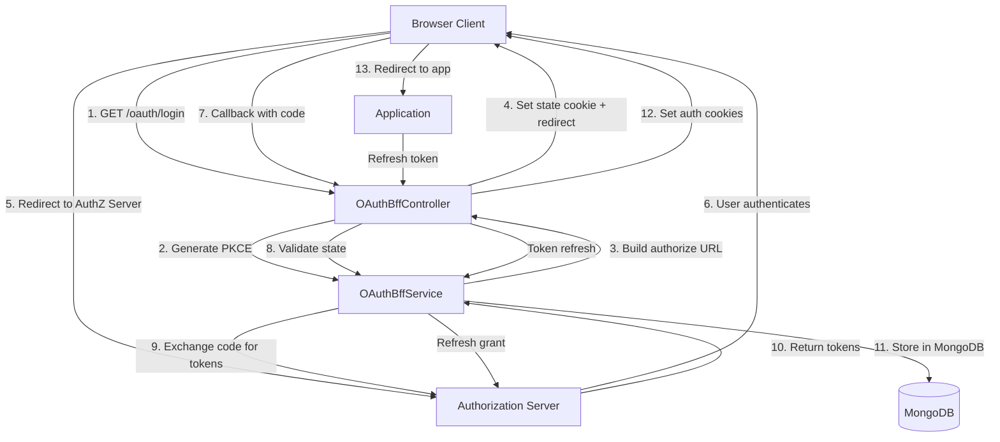
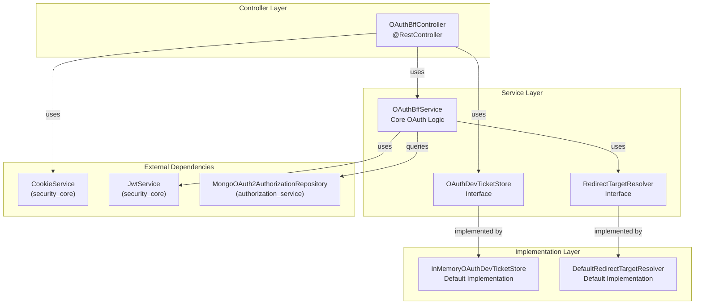
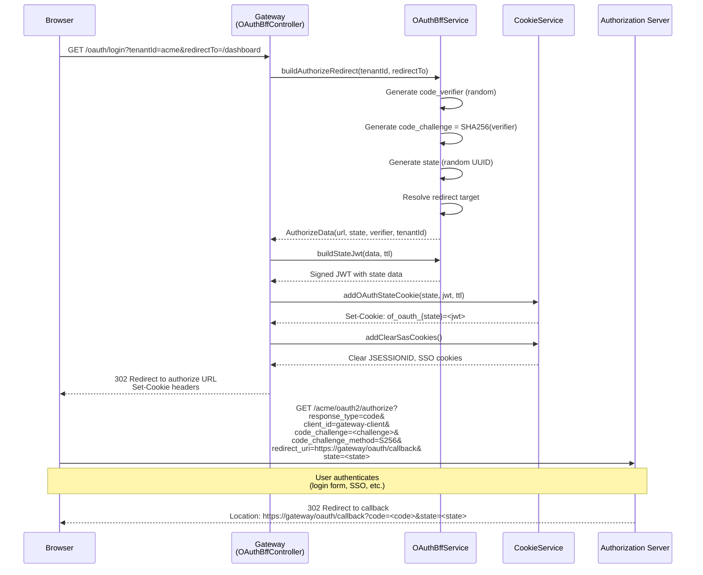
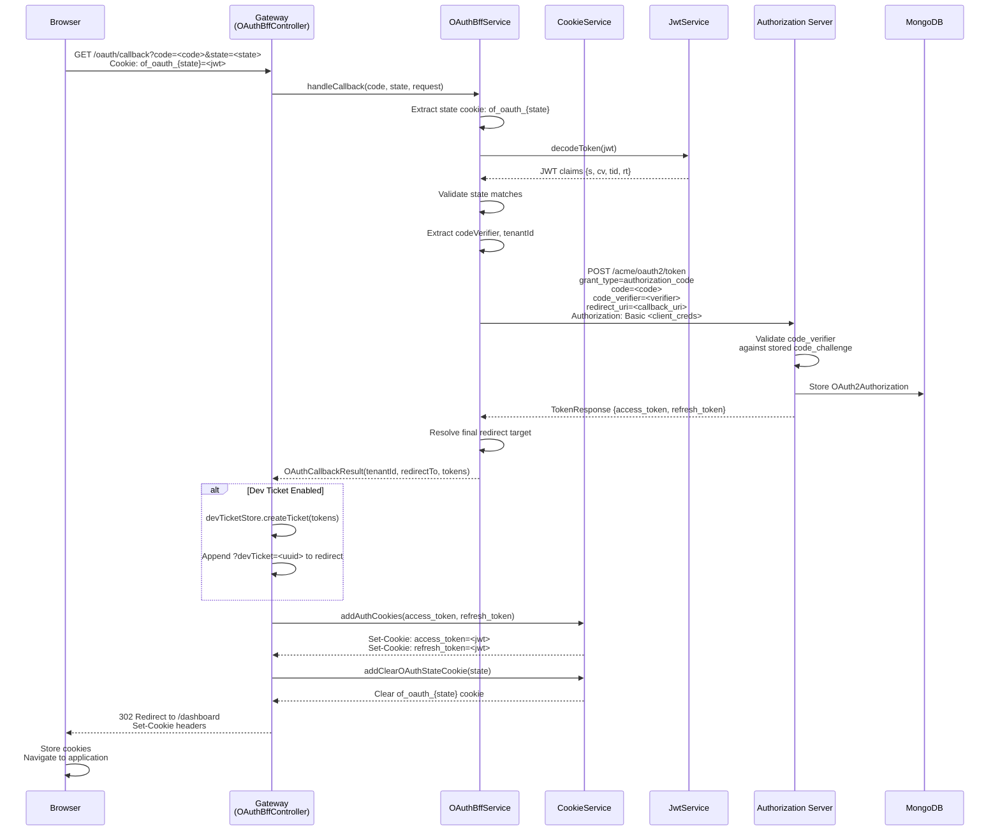
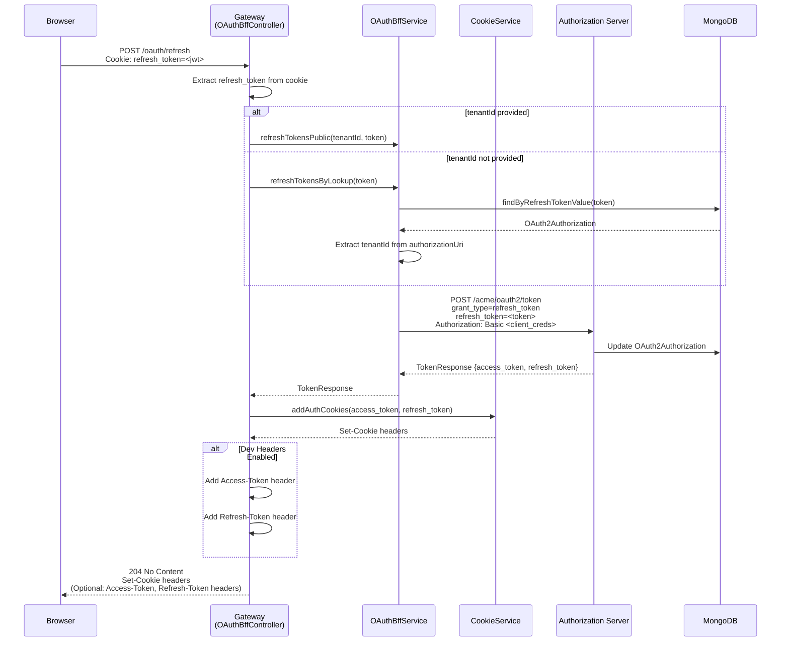
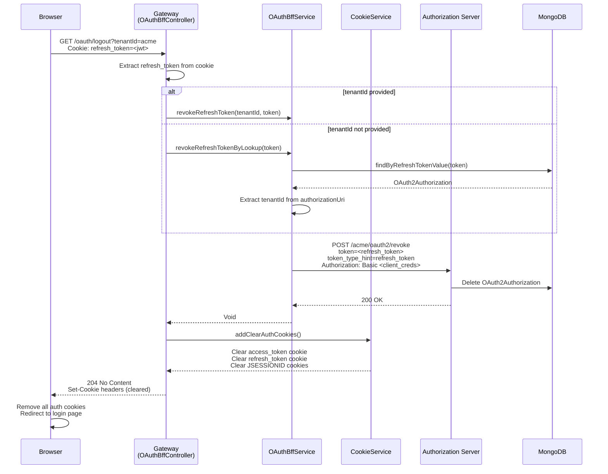

# Security OAuth Module

## Overview

The **security_oauth** module provides a Backend-for-Frontend (BFF) OAuth 2.0 implementation for the OpenFrame platform. It implements the OAuth 2.0 Authorization Code flow with PKCE (Proof Key for Code Exchange) to secure authentication between the gateway service and the authorization server. This module acts as an intermediary layer that handles OAuth flows, manages authentication cookies, and provides secure token exchange mechanisms.

**Key Responsibilities:**
- OAuth 2.0 Authorization Code flow with PKCE implementation
- Secure cookie-based session management for access and refresh tokens
- Multi-tenant OAuth flow support with dynamic tenant resolution
- Development ticket system for local development and testing
- Token refresh and revocation operations
- Redirect target resolution after successful authentication

**Related Modules:**
- [security_core](security_core.md) - Provides JWT services, cookie management, and security primitives
- [authorization_service](authorization_service.md) - OAuth 2.0 Authorization Server implementation
- [gateway_service](gateway_service.md) - API Gateway that integrates this OAuth BFF layer

---

## Architecture Overview

The security_oauth module implements a secure BFF pattern that protects OAuth tokens from client-side exposure while providing seamless authentication flows.

### High-Level Architecture



### Component Architecture



---

## Core Components

### 1. OAuthBffController

**Location:** `com.openframe.security.oauth.controller.OAuthBffController`

**Purpose:** REST controller that exposes OAuth 2.0 BFF endpoints for login, callback, refresh, and logout operations.

**Key Endpoints:**

| Endpoint | Method | Description |
|----------|--------|-------------|
| `/oauth/login` | GET | Initiates OAuth flow with PKCE, sets state cookie, redirects to authorization server |
| `/oauth/continue` | GET | Continues OAuth flow without clearing existing session (for SSO scenarios) |
| `/oauth/callback` | GET | Handles OAuth callback, exchanges code for tokens, sets auth cookies |
| `/oauth/refresh` | POST | Refreshes access token using refresh token from cookie or header |
| `/oauth/logout` | GET | Revokes refresh token and clears all authentication cookies |
| `/oauth/dev-exchange` | GET | Development-only endpoint to exchange ticket for tokens via headers |

**Configuration:**
```yaml
openframe:
  gateway:
    oauth:
      enable: true  # Must be true to activate controller
      state-cookie-ttl-seconds: 180  # State cookie lifetime
      dev-ticket-enabled: true  # Enable dev ticket system
      client-id: gateway-client
      client-secret: ${GATEWAY_CLIENT_SECRET}
      redirect-uri: https://gateway.example.com/oauth/callback
```

**Key Features:**
- **PKCE Flow:** Generates code verifier/challenge for secure authorization
- **State Management:** Creates signed JWT state cookies to prevent CSRF attacks
- **Cookie Security:** Sets HttpOnly, Secure, SameSite cookies for token storage
- **Error Handling:** Graceful error handling with redirect to original page with error parameters
- **Multi-Tenant:** Supports tenant-specific OAuth flows via `tenantId` parameter

### 2. OAuthBffService

**Location:** `com.openframe.security.oauth.service.OAuthBffService`

**Purpose:** Core service implementing OAuth 2.0 Authorization Code flow with PKCE, token exchange, refresh, and revocation logic.

**Key Operations:**

```mermaid
flowchart TD
    subgraph authorize["buildAuthorizeRedirect()"]
        A1["Generate PKCE<br/>code_verifier + code_challenge"] --> A2["Generate state"]
        A2 --> A3["Resolve redirect target"]
        A3 --> A4["Build authorize URL"]
        A4 --> A5["Return AuthorizeData"]
    end
    
    subgraph callback["handleCallback()"]
        C1["Validate state cookie"] --> C2["Extract session data"]
        C2 --> C3["Exchange code for tokens"]
        C3 --> C4["Resolve final redirect"]
        C4 --> C5["Return OAuthCallbackResult"]
    end
    
    subgraph refresh["refreshTokens()"]
        R1["Build refresh grant request"] --> R2["POST to /oauth2/token"]
        R2 --> R3["Return new TokenResponse"]
    end
    
    subgraph revoke["revokeRefreshToken()"]
        V1["Build revoke request"] --> V2["POST to /oauth2/revoke"]
        V2 --> V3["Return Void"]
    end
```



**Token Lookup Feature:**
The service provides "best-effort" operations that don't require explicit `tenantId`:
- `refreshTokensByLookup()` - Looks up tenant from MongoDB by refresh token value
- `revokeRefreshTokenByLookup()` - Looks up tenant from MongoDB by refresh token value

These methods query `MongoOAuth2AuthorizationRepository` to find the authorization record and extract the tenant ID from the stored `authorizationUri` field.

**State Cookie JWT Claims:**
```json
{
  "sub": "oauth_state",
  "s": "state_value",
  "cv": "code_verifier",
  "tid": "tenant_id",
  "rt": "redirect_to_url",
  "iat": 1234567890,
  "exp": 1234568070
}
```

### 3. OAuthDevTicketStore

**Location:** `com.openframe.security.oauth.service.OAuthDevTicketStore` (interface)

**Purpose:** Abstraction for storing single-use tickets that can be exchanged for OAuth tokens, primarily for development and testing scenarios.

**Interface:**
```java
public interface OAuthDevTicketStore {
    Mono<String> createTicket(TokenResponse tokens);
    Mono<TokenResponse> consumeTicket(String ticketId);
}
```

**Default Implementation:** `InMemoryOAuthDevTicketStore`
- Uses `ConcurrentHashMap` for in-memory storage
- Generates UUID-based ticket IDs
- Single-use: tickets are removed on consumption
- **Note:** Not suitable for production multi-instance deployments (use Redis-based implementation)

**Use Case:**
Development workflow where tokens need to be passed to local development tools:
1. User completes OAuth flow in browser
2. System creates dev ticket with tokens
3. Redirect includes `?devTicket=<uuid>` parameter
4. Local dev tool calls `/oauth/dev-exchange?ticket=<uuid>`
5. Tokens returned in `Access-Token` and `Refresh-Token` headers

### 4. RedirectTargetResolver

**Location:** `com.openframe.security.oauth.service.redirect.RedirectTargetResolver` (interface)

**Purpose:** Strategy interface for determining where to redirect users after successful OAuth authentication.

**Interface:**
```java
public interface RedirectTargetResolver {
    Mono<String> resolve(String tenantId, String requestedRedirectTo, ServerHttpRequest request);
}
```

**Default Implementation:** `DefaultRedirectTargetResolver`

**Resolution Logic:**
1. If `redirectTo` parameter provided → use it
2. Else if `Referer` header present → use referer
3. Else → default to `/`

**Custom Implementation Example:**
```java
@Component
public class CustomRedirectResolver implements RedirectTargetResolver {
    @Override
    public Mono<String> resolve(String tenantId, String requestedRedirectTo, ServerHttpRequest request) {
        // Custom logic: redirect to tenant-specific dashboard
        if (StringUtils.hasText(requestedRedirectTo)) {
            return Mono.just(requestedRedirectTo);
        }
        return Mono.just("/dashboard/" + tenantId);
    }
}
```

---

## OAuth Flow Sequences

### Login Flow (Authorization Code + PKCE)



### Callback Flow (Token Exchange)



### Token Refresh Flow



### Logout Flow



---

## Security Features

### 1. PKCE (Proof Key for Code Exchange)

**Purpose:** Prevents authorization code interception attacks, especially important for public clients.

**Implementation:**
```java
// Generate code verifier (random 128-byte string, base64url encoded)
String codeVerifier = generateCodeVerifier();

// Generate code challenge (SHA-256 hash of verifier, base64url encoded)
String codeChallenge = generateCodeChallenge(codeVerifier);

// Send challenge in authorize request
// Store verifier in signed state cookie
// Send verifier in token exchange request
```

**Flow:**
1. Client generates random `code_verifier`
2. Client computes `code_challenge = BASE64URL(SHA256(code_verifier))`
3. Client sends `code_challenge` to authorization server
4. Authorization server stores challenge with authorization code
5. Client sends `code_verifier` during token exchange
6. Authorization server validates: `SHA256(code_verifier) == stored_code_challenge`

### 2. State Parameter & CSRF Protection

**Purpose:** Prevents Cross-Site Request Forgery attacks on OAuth callback.

**Implementation:**
- Random UUID generated as state parameter
- State stored in signed JWT cookie: `of_oauth_{state}`
- Cookie is HttpOnly, Secure, SameSite=Lax
- JWT contains state, code_verifier, tenant_id, redirect_to
- JWT signed with application's private key
- Short TTL (default 180 seconds)

**Validation:**
```java
// Extract state from callback URL
String callbackState = request.getParameter("state");

// Extract state cookie
String cookieName = "of_oauth_" + callbackState;
HttpCookie cookie = request.getCookies().getFirst(cookieName);

// Decode and validate JWT
Jwt jwt = jwtService.decodeToken(cookie.getValue());
String jwtState = jwt.getClaims().get("s");

// Verify states match
if (!jwtState.equals(callbackState)) {
    throw new IllegalStateException("invalid_state");
}
```

### 3. Cookie Security

**Configuration:**
```yaml
openframe:
  security:
    cookie:
      domain: .example.com  # Cookie domain (null for host-only)
      secure: true  # Require HTTPS
      same-site: Lax  # CSRF protection
```

**Cookie Types:**

| Cookie Name | Path | HttpOnly | Secure | SameSite | Max-Age | Purpose |
|-------------|------|----------|--------|----------|---------|---------|
| `access_token` | `/` | ✅ | ✅ | Lax | Token expiry | JWT access token |
| `refresh_token` | `/oauth` | ✅ | ✅ | Lax | Token expiry | JWT refresh token |
| `of_oauth_{state}` | `/oauth` | ✅ | ✅ | Lax | 180s | OAuth state data |

**Security Properties:**
- **HttpOnly:** Prevents JavaScript access (XSS protection)
- **Secure:** Only sent over HTTPS
- **SameSite=Lax:** Prevents CSRF while allowing top-level navigation
- **Path restrictions:** Limits cookie scope to relevant endpoints

### 4. Token Storage

**Access Token:**
- Stored in HttpOnly cookie at path `/`
- Automatically sent with all requests to gateway
- Gateway validates and forwards to backend services
- Short-lived (typically 15-60 minutes)

**Refresh Token:**
- Stored in HttpOnly cookie at path `/oauth`
- Only sent to OAuth endpoints
- Used to obtain new access tokens
- Long-lived (typically 7-30 days)
- Can be revoked server-side

**Benefits:**
- Tokens never exposed to JavaScript (XSS protection)
- Automatic token inclusion in requests
- Secure storage in browser
- Server-side revocation capability

---

## Configuration

### Required Properties

```yaml
openframe:
  gateway:
    oauth:
      enable: true  # Enable OAuth BFF controller
      client-id: gateway-client  # OAuth client ID
      client-secret: ${GATEWAY_CLIENT_SECRET}  # OAuth client secret (from env)
      redirect-uri: https://gateway.example.com/oauth/callback  # Callback URL
      state-cookie-ttl-seconds: 180  # State cookie lifetime
      dev-ticket-enabled: true  # Enable dev ticket system

  auth:
    server:
      url: http://authorization-service:8080/sas  # Authorization server base URL
      authorize-url: http://authorization-service:8080/sas  # Authorize endpoint base

  security:
    cookie:
      domain: .example.com  # Cookie domain (null for host-only)
      secure: true  # Require HTTPS in production
      same-site: Lax  # CSRF protection

security:
  oauth2:
    token:
      access:
        expiration-seconds: 3600  # 1 hour
      refresh:
        expiration-seconds: 2592000  # 30 days
```

### Environment Variables

```bash
# OAuth Client Credentials
export GATEWAY_CLIENT_SECRET="your-secure-client-secret"

# Authorization Server URLs
export AUTH_SERVER_URL="http://authorization-service:8080/sas"
export AUTH_AUTHORIZE_URL="http://authorization-service:8080/sas"

# Cookie Configuration
export COOKIE_DOMAIN=".example.com"
export COOKIE_SECURE="true"
export COOKIE_SAME_SITE="Lax"
```

### Conditional Activation

The OAuth BFF controller is conditionally enabled:

```java
@ConditionalOnProperty(
    prefix = "openframe.gateway.oauth",
    name = "enable",
    havingValue = "true"
)
```

**To disable OAuth BFF:**
```yaml
openframe:
  gateway:
    oauth:
      enable: false
```

---

## Integration Guide

### Frontend Integration

#### 1. Initiating Login

```typescript
// Redirect to OAuth login endpoint
function login(tenantId: string, redirectTo?: string) {
  const params = new URLSearchParams({
    tenantId: tenantId,
  });
  
  if (redirectTo) {
    params.append('redirectTo', redirectTo);
  }
  
  window.location.href = `/oauth/login?${params.toString()}`;
}

// Example usage
login('acme', '/dashboard');
```

#### 2. Handling Callback

The OAuth callback is handled automatically by the backend. The user will be redirected to the specified `redirectTo` URL with authentication cookies set.

**Optional: Dev Ticket Handling**
```typescript
// Extract dev ticket from URL (development only)
const urlParams = new URLSearchParams(window.location.search);
const devTicket = urlParams.get('devTicket');

if (devTicket) {
  // Exchange ticket for tokens
  fetch(`/oauth/dev-exchange?ticket=${devTicket}`)
    .then(response => {
      const accessToken = response.headers.get('Access-Token');
      const refreshToken = response.headers.get('Refresh-Token');
      // Store tokens for API calls
      localStorage.setItem('access_token', accessToken);
      localStorage.setItem('refresh_token', refreshToken);
    });
}
```

#### 3. Token Refresh

```typescript
// Refresh access token
async function refreshToken(tenantId?: string): Promise<boolean> {
  const params = tenantId ? `?tenantId=${tenantId}` : '';
  
  const response = await fetch(`/oauth/refresh${params}`, {
    method: 'POST',
    credentials: 'include',  // Include cookies
  });
  
  if (response.status === 204) {
    // Tokens refreshed successfully (new cookies set)
    return true;
  } else if (response.status === 401) {
    // Refresh token expired, redirect to login
    window.location.href = '/oauth/login?tenantId=' + tenantId;
    return false;
  }
  
  return false;
}

// Automatic refresh before token expiry
setInterval(() => {
  refreshToken('acme');
}, 50 * 60 * 1000);  // Refresh every 50 minutes (if token expires in 60)
```

#### 4. Logout

```typescript
// Logout and clear session
async function logout(tenantId?: string) {
  const params = tenantId ? `?tenantId=${tenantId}` : '';
  
  await fetch(`/oauth/logout${params}`, {
    method: 'GET',
    credentials: 'include',
  });
  
  // Redirect to login page
  window.location.href = '/login';
}
```

### Backend Service Integration

Backend services receive the validated access token from the gateway and can extract user information:

```java
@RestController
@RequestMapping("/api/users")
public class UserController {
    
    @GetMapping("/me")
    public Mono<UserInfo> getCurrentUser(@AuthenticationPrincipal Jwt jwt) {
        String userId = jwt.getSubject();
        String tenantId = jwt.getClaimAsString("tenant_id");
        List<String> roles = jwt.getClaimAsStringList("roles");
        
        return userService.getUserInfo(userId, tenantId);
    }
}
```

### Custom Redirect Resolver

Implement custom redirect logic after authentication:

```java
@Component
public class TenantDashboardRedirectResolver implements RedirectTargetResolver {
    
    @Autowired
    private TenantService tenantService;
    
    @Override
    public Mono<String> resolve(String tenantId, String requestedRedirectTo, ServerHttpRequest request) {
        // If explicit redirect requested, use it
        if (StringUtils.hasText(requestedRedirectTo)) {
            return Mono.just(requestedRedirectTo);
        }
        
        // Otherwise, redirect to tenant-specific dashboard
        return tenantService.getTenantSettings(tenantId)
            .map(settings -> {
                if (settings.hasCustomDashboard()) {
                    return "/dashboard/" + tenantId + "/custom";
                }
                return "/dashboard/" + tenantId;
            })
            .defaultIfEmpty("/dashboard");
    }
}
```

### Custom Dev Ticket Store

Implement Redis-based ticket store for production multi-instance deployments:

```java
@Component
@ConditionalOnProperty(name = "openframe.oauth.ticket-store", havingValue = "redis")
public class RedisOAuthDevTicketStore implements OAuthDevTicketStore {
    
    @Autowired
    private ReactiveRedisTemplate<String, TokenResponse> redisTemplate;
    
    private static final String KEY_PREFIX = "oauth:ticket:";
    private static final Duration TTL = Duration.ofMinutes(5);
    
    @Override
    public Mono<String> createTicket(TokenResponse tokens) {
        String ticketId = UUID.randomUUID().toString();
        String key = KEY_PREFIX + ticketId;
        
        return redisTemplate.opsForValue()
            .set(key, tokens, TTL)
            .thenReturn(ticketId);
    }
    
    @Override
    public Mono<TokenResponse> consumeTicket(String ticketId) {
        String key = KEY_PREFIX + ticketId;
        
        return redisTemplate.opsForValue()
            .getAndDelete(key);
    }
}
```

---

## Error Handling

### Error Scenarios

| Error | Cause | Response |
|-------|-------|----------|
| `invalid_state` | State cookie missing or tampered | Redirect to error page with `?error=oauth_failed&message=invalid_state` |
| `token_exchange_failed` | Authorization code invalid or expired | Redirect to error page with error details |
| `token_refresh_failed` | Refresh token invalid or revoked | 401 Unauthorized |
| Missing refresh token | No refresh token in cookie or header | 401 Unauthorized |

### Error Redirect Format

When OAuth flow fails, the user is redirected to the original page (or referer) with error parameters:

```text
https://app.example.com/dashboard?error=oauth_failed&message=token_exchange_failed
```

**Frontend Error Handling:**
```typescript
// Check for OAuth errors on page load
const urlParams = new URLSearchParams(window.location.search);
const error = urlParams.get('error');
const message = urlParams.get('message');

if (error === 'oauth_failed') {
  console.error('OAuth authentication failed:', message);
  // Show error message to user
  showNotification('Authentication failed. Please try again.', 'error');
  
  // Optionally redirect to login after delay
  setTimeout(() => {
    window.location.href = '/login';
  }, 3000);
}
```

### Logging

The module uses SLF4J logging with the following log levels:

**DEBUG:**
- OAuth flow initiation
- State cookie creation
- Token exchange requests

**WARN:**
- Failed state cookie validation
- Token refresh failures
- Incorrect authorization URI format

**ERROR:**
- Token exchange errors
- Token revocation errors

**Example Log Configuration:**
```yaml
logging:
  level:
    com.openframe.security.oauth: DEBUG
    com.openframe.security.oauth.service.OAuthBffService: DEBUG
    com.openframe.security.oauth.controller.OAuthBffController: INFO
```

---

## Testing

### Unit Testing

**Testing OAuthBffController:**
```java
@WebFluxTest(OAuthBffController.class)
class OAuthBffControllerTest {
    
    @Autowired
    private WebTestClient webClient;
    
    @MockBean
    private OAuthBffService oauthBffService;
    
    @MockBean
    private OAuthDevTicketStore devTicketStore;
    
    @MockBean
    private CookieService cookieService;
    
    @Test
    void testLoginRedirect() {
        // Given
        String tenantId = "acme";
        String redirectTo = "/dashboard";
        AuthorizeData data = new AuthorizeData(
            "https://auth.example.com/acme/oauth2/authorize?...",
            "state123",
            "verifier456",
            tenantId,
            null
        );
        
        when(oauthBffService.buildAuthorizeRedirect(eq(tenantId), eq(redirectTo), isNull(), any()))
            .thenReturn(Mono.just(data));
        
        when(oauthBffService.buildStateJwt(any(), anyInt()))
            .thenReturn("signed.jwt.token");
        
        // When & Then
        webClient.get()
            .uri(uriBuilder -> uriBuilder
                .path("/oauth/login")
                .queryParam("tenantId", tenantId)
                .queryParam("redirectTo", redirectTo)
                .build())
            .exchange()
            .expectStatus().isFound()
            .expectHeader().valueEquals("Location", data.authorizeUrl())
            .expectHeader().exists("Set-Cookie");
    }
}
```

**Testing OAuthBffService:**
```java
@ExtendWith(MockitoExtension.class)
class OAuthBffServiceTest {
    
    @Mock
    private WebClient.Builder webClientBuilder;
    
    @Mock
    private RedirectTargetResolver redirectTargetResolver;
    
    @Mock
    private JwtService jwtService;
    
    @InjectMocks
    private OAuthBffService oauthBffService;
    
    @Test
    void testBuildAuthorizeRedirect() {
        // Given
        String tenantId = "acme";
        String redirectTo = "/dashboard";
        
        when(redirectTargetResolver.resolve(eq(tenantId), eq(redirectTo), any()))
            .thenReturn(Mono.just(redirectTo));
        
        // When
        StepVerifier.create(oauthBffService.buildAuthorizeRedirect(tenantId, redirectTo, null, mockRequest()))
            .assertNext(data -> {
                assertThat(data.authorizeUrl()).contains(tenantId);
                assertThat(data.authorizeUrl()).contains("code_challenge=");
                assertThat(data.authorizeUrl()).contains("state=");
                assertThat(data.state()).isNotBlank();
                assertThat(data.codeVerifier()).isNotBlank();
                assertThat(data.tenantId()).isEqualTo(tenantId);
            })
            .verifyComplete();
    }
}
```

### Integration Testing

**Testing Complete OAuth Flow:**
```java
@SpringBootTest(webEnvironment = SpringBootTest.WebEnvironment.RANDOM_PORT)
@AutoConfigureWebTestClient
class OAuthFlowIntegrationTest {
    
    @Autowired
    private WebTestClient webClient;
    
    @MockBean
    private WebClient.Builder webClientBuilder;
    
    @Test
    void testCompleteOAuthFlow() {
        // 1. Initiate login
        EntityExchangeResult<Void> loginResult = webClient.get()
            .uri("/oauth/login?tenantId=acme&redirectTo=/dashboard")
            .exchange()
            .expectStatus().isFound()
            .expectHeader().exists("Set-Cookie")
            .returnResult(Void.class);
        
        String location = loginResult.getResponseHeaders().getFirst("Location");
        assertThat(location).contains("/acme/oauth2/authorize");
        
        // Extract state from redirect URL
        String state = extractStateFromUrl(location);
        
        // Extract state cookie
        String stateCookie = extractStateCookie(loginResult, state);
        
        // 2. Mock authorization server response
        mockTokenExchange();
        
        // 3. Handle callback
        webClient.get()
            .uri("/oauth/callback?code=auth_code_123&state=" + state)
            .cookie("of_oauth_" + state, stateCookie)
            .exchange()
            .expectStatus().isFound()
            .expectHeader().valueEquals("Location", "/dashboard")
            .expectCookie().exists("access_token")
            .expectCookie().exists("refresh_token");
    }
}
```

### Manual Testing

**1. Test Login Flow:**
```bash
# Initiate login
curl -v -X GET "http://localhost:8080/oauth/login?tenantId=acme&redirectTo=/dashboard"

# Expected: 302 redirect to authorization server with Set-Cookie headers
```

**2. Test Token Refresh:**
```bash
# Refresh token (with cookie)
curl -v -X POST "http://localhost:8080/oauth/refresh?tenantId=acme" \
  -H "Cookie: refresh_token=<jwt_token>"

# Expected: 204 No Content with new Set-Cookie headers
```

**3. Test Logout:**
```bash
# Logout
curl -v -X GET "http://localhost:8080/oauth/logout?tenantId=acme" \
  -H "Cookie: refresh_token=<jwt_token>"

# Expected: 204 No Content with cleared cookies
```

**4. Test Dev Ticket Exchange:**
```bash
# Exchange dev ticket
curl -v -X GET "http://localhost:8080/oauth/dev-exchange?ticket=<uuid>"

# Expected: 204 No Content with Access-Token and Refresh-Token headers
```

---

## Deployment Considerations

### Production Checklist

- [ ] **Enable HTTPS:** Set `openframe.security.cookie.secure=true`
- [ ] **Configure Cookie Domain:** Set `openframe.security.cookie.domain` to your domain
- [ ] **Secure Client Secret:** Use environment variable or secrets manager for `GATEWAY_CLIENT_SECRET`
- [ ] **Disable Dev Tickets:** Set `openframe.gateway.oauth.dev-ticket-enabled=false` in production
- [ ] **Implement Redis Ticket Store:** Replace in-memory store for multi-instance deployments
- [ ] **Configure Token Expiry:** Set appropriate `expiration-seconds` for access and refresh tokens
- [ ] **Enable Request Logging:** Configure logging for audit trails
- [ ] **Set Up Monitoring:** Monitor OAuth endpoint metrics and error rates

### Multi-Instance Deployment

**Issue:** In-memory dev ticket store doesn't work across multiple gateway instances.

**Solution:** Implement Redis-based ticket store:

```yaml
openframe:
  oauth:
    ticket-store: redis

spring:
  redis:
    host: redis.example.com
    port: 6379
    password: ${REDIS_PASSWORD}
```

### High Availability

**Stateless Design:**
- OAuth state stored in signed JWT cookies (client-side)
- No server-side session storage required
- Horizontal scaling supported out-of-box

**Token Storage:**
- Refresh tokens stored in MongoDB via authorization service
- Access tokens are stateless JWTs
- Token revocation handled by authorization service

### Security Hardening

**1. Rate Limiting:**
```yaml
# Apply rate limiting to OAuth endpoints
spring:
  cloud:
    gateway:
      routes:
        - id: oauth-endpoints
          uri: lb://gateway-service
          predicates:
            - Path=/oauth/**
          filters:
            - name: RequestRateLimiter
              args:
                redis-rate-limiter.replenishRate: 10
                redis-rate-limiter.burstCapacity: 20
```

**2. IP Whitelisting (Optional):**
```yaml
# Restrict OAuth endpoints to specific IPs
openframe:
  security:
    oauth:
      allowed-ips:
        - 10.0.0.0/8
        - 192.168.0.0/16
```

**3. CORS Configuration:**
```yaml
# Restrict CORS for OAuth endpoints
openframe:
  security:
    cors:
      allowed-origins:
        - https://app.example.com
        - https://admin.example.com
      allowed-methods:
        - GET
        - POST
      allow-credentials: true
```

---

## Troubleshooting

### Common Issues

#### 1. "invalid_state" Error

**Symptoms:** Callback fails with invalid_state error

**Causes:**
- State cookie expired (TTL too short)
- State cookie not sent (cookie domain mismatch)
- State cookie tampered with (JWT signature invalid)
- Clock skew between servers

**Solutions:**
```yaml
# Increase state cookie TTL
openframe:
  gateway:
    oauth:
      state-cookie-ttl-seconds: 300  # 5 minutes

# Fix cookie domain
openframe:
  security:
    cookie:
      domain: .example.com  # Must match your domain
```

#### 2. Tokens Not Refreshing

**Symptoms:** Refresh endpoint returns 401

**Causes:**
- Refresh token expired
- Refresh token revoked
- Tenant ID mismatch
- Authorization server unreachable

**Solutions:**
```bash
# Check refresh token in MongoDB
db.oauth2_authorization.findOne({ "refresh_token.token_value": "<token>" })

# Check authorization server logs
kubectl logs -f authorization-service-pod

# Test token refresh manually
curl -X POST "http://auth-server/acme/oauth2/token" \
  -H "Authorization: Basic <base64(client_id:client_secret)>" \
  -d "grant_type=refresh_token&refresh_token=<token>"
```

#### 3. Cookies Not Set

**Symptoms:** Authentication succeeds but cookies not present

**Causes:**
- Cookie domain mismatch
- Secure flag set but using HTTP
- SameSite policy blocking cookies
- Browser blocking third-party cookies

**Solutions:**
```yaml
# For local development (HTTP)
openframe:
  security:
    cookie:
      secure: false
      domain: null  # Host-only cookies

# For production (HTTPS)
openframe:
  security:
    cookie:
      secure: true
      domain: .example.com
      same-site: Lax
```

#### 4. Dev Ticket Not Working

**Symptoms:** `/oauth/dev-exchange` returns 404

**Causes:**
- Dev tickets disabled in configuration
- Ticket expired or already consumed
- Multi-instance deployment with in-memory store

**Solutions:**
```yaml
# Enable dev tickets
openframe:
  gateway:
    oauth:
      dev-ticket-enabled: true

# For multi-instance, use Redis store
openframe:
  oauth:
    ticket-store: redis
```

### Debug Logging

Enable detailed logging for troubleshooting:

```yaml
logging:
  level:
    com.openframe.security.oauth: DEBUG
    org.springframework.security: DEBUG
    org.springframework.web.reactive: DEBUG
```

**Key Log Messages:**
- `Building authorize redirect for tenant: {tenantId}` - Login initiated
- `Handling OAuth callback with state: {state}` - Callback received
- `Failed to decode OAuth state cookie` - State validation failed
- `Token exchange failed` - Authorization server rejected code
- `Token refresh failed` - Refresh token invalid

---

## Related Documentation

- [security_core](security_core.md) - Core security components (JWT, cookies, authentication)
- [authorization_service](authorization_service.md) - OAuth 2.0 Authorization Server
- [gateway_service](gateway_service.md) - API Gateway integration
- [api_service](api_service.md) - Backend API service authentication

---

## Additional Resources

### OAuth 2.0 Specifications
- [RFC 6749 - OAuth 2.0 Authorization Framework](https://datatracker.ietf.org/doc/html/rfc6749)
- [RFC 7636 - PKCE](https://datatracker.ietf.org/doc/html/rfc7636)
- [RFC 6750 - Bearer Token Usage](https://datatracker.ietf.org/doc/html/rfc6750)
- [RFC 7009 - Token Revocation](https://datatracker.ietf.org/doc/html/rfc7009)

### Security Best Practices
- [OWASP OAuth 2.0 Security Cheat Sheet](https://cheatsheetseries.owasp.org/cheatsheets/OAuth2_Cheat_Sheet.html)
- [OAuth 2.0 Security Best Current Practice](https://datatracker.ietf.org/doc/html/draft-ietf-oauth-security-topics)

### OpenFrame Resources
- **Community:** [OpenMSP Slack](https://join.slack.com/t/openmsp/shared_invite/zt-36bl7mx0h-3~U2nFH6nqHqoTPXMaHEHA)
- **Website:** [OpenFrame Documentation](https://www.flamingo.run/openframe)

---

**Last Updated:** 2024  
**Module Version:** 1.0  
**Maintainers:** OpenFrame Security Team
